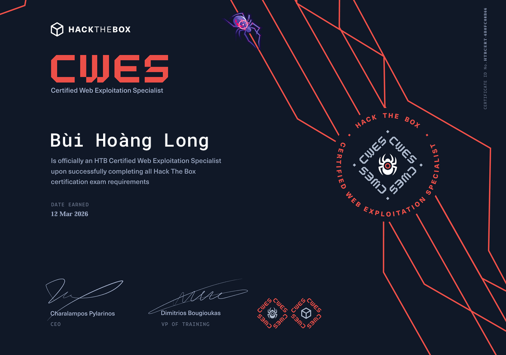
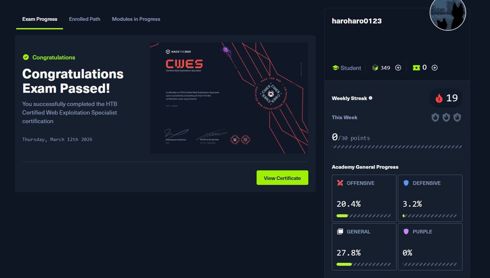
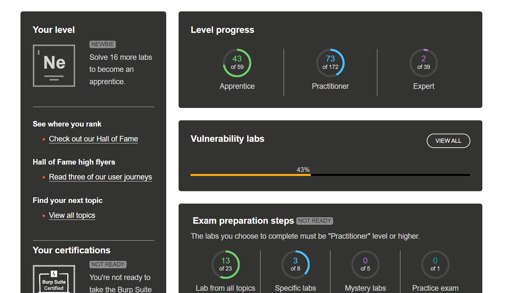

It has been a while since my last update. I also havent participated in any CTFs or solved module final labs recently.

Because I have put all my 100% power into THIS:

HEHEH. First target is PWNED !!! 

Alright, here is my short story to tell you about the journey

## My Hack The Box Journey

I spent a total of 19 weeks on Hack The Box until I get the cert. I mean, not all my time is just only to focus on learning the web pentest path. Still learning other modules out of this scope, like binary exploits, a little reversing… And back to 3 weeks before the exam.

I know that it is the time to beat this thing. So? What did I prepare for the exam?

Well, my first step was simple

i went Reddit and looked for other experiences on the exam, and well It really scared me at first glance.

I'm worried; I don't really believe in myself that I have never done something like this before.

Most advice I got was

- Taking good note: Signature of the vulnerability? How do you recognize it? Where can it occur?
- Practice everything related to the course, and nothing is outside of that (the vuln type)

Ok, so how do I practice for the exam?

My first recommendation for you is to go to `PortSwigger`and do some labs on it. It will help you with hands-on labs and learn some new techniques for specific vulnerabilities!

Caution here: you just need to do the labs that relate to vuln in the Hack The Box web pentest. Outside or too complicated will waste your time!

Solving around 30-40% is my recommendation!

### Taking note

During solving the labs, I also take note of how I triggered the bug, which payload I used… everything that helps you to solve the lab.

You should prepare some payloads that help you fuzz for subdomains, vhosts, parameters, dirs…

Trust me! You don't want to waste your time just to set up a fast and accurate fuzzing command!

### Mental

Finally, stay calm and relax whenever you feel tired or can't find the bugs. Most people, and also me, blow up a way to destroy that endpoint while relaxing or doing gym!!!.

When it comes to the certification, solving individual vulnerabilities is not enough. Candidates must be able to **chain multiple vulnerabilities together**. In many real-world scenarios, a single vulnerability may only provide limited access. However, when combined with other weaknesses, it can become a powerful attack path that allows an attacker to escalate privileges, gain deeper access, or even **fully compromise the target website**.
This exam is designed to test exactly that ability: not just finding bugs, but **thinking like an attacker and connecting the dots between them**.

## Wrapping Up

Aright this achievement is just a tiny grain of sand in the Sahara. There’s still a long journey ahead, and I know I need to keep improving myself in the future  !!! well see yaaa!