## **Encoding and Decoding**

Encoding is a method to transform data to ensure compatibility between different systems. It differs from encryption in purpose and process.

|  | **Encoding** | **Encryption** |
| --- | --- | --- |
| **Purpose** | CompatibilityUsability | SecurityConfidentiality |
| **Process** | Standardized | Algorithm + Key |
| **Security** | No | Yes |
| **Speed** | Fast | Slow |
| **Examples** | Base64 | TLS |

First i want to mention…. well In this lab, i will try with cyber chef which is the main purpose of this module so alright lets go

Destroy all the things to get victory….


## Some information from source code

### `/static/app.js`

```jsx
try {
      if (level === 1) {
        // CyberChef: From Base64
        passOk = btoa(pwd) === expectedConst;
      } else if (level === 2) {
        // CyberChef: Double From Base64
        passOk = btoa(btoa(pwd)) === expectedConst;
      } else if (level === 3) {
        // CyberChef: From Base64 => XOR(key=recipeKey)
        const bytes = xorWithKey(toBytes(pwd), toBytes(recipeKey));
        const b64 = bytesToBase64(bytes);
        passOk = b64 === expectedConst;
      } else if (level === 4) {
        // CrackStation: Hash lookup
        passOk = (md5(pwd) === expectedConst);
      } else if (level === 5) {
        const recipe =  recipeId || "R1";
        let tp = pwd;

        switch (recipe){
          case "R1":
            // CyberChef: From Base64 => Reverse => ROT13
            tp = btoa(reverse(rot13(tp)));
            break;
          case "R2":
            // CyberChef: From Base64 => FromHex => Reverse
            tp = btoa(strToHex(reverse(tp)));
            break;
          case "R3":
            // CyberChef: ROT13 => From Base64 => XOR(key=recipeKey)
            const exed = bytesToBase64(xorWithKey(toBytes(tp), toBytes(recipeKey || "hare")));
            tp = rot13(exed);
            break;
          case "R4":
            // CyberChef: ROT13 => From Base64 => ROT47
            tp = rot13(btoa(rot47(tp)));
            break;
          default:
            tp = btoa(reverse(rot13(tp)));
        }
        passOk = (tp === expectedConst);
      }
    } catch (_) {
      userOk = passOk = false;
    }
```

# Outer Gate (`From Base64`)

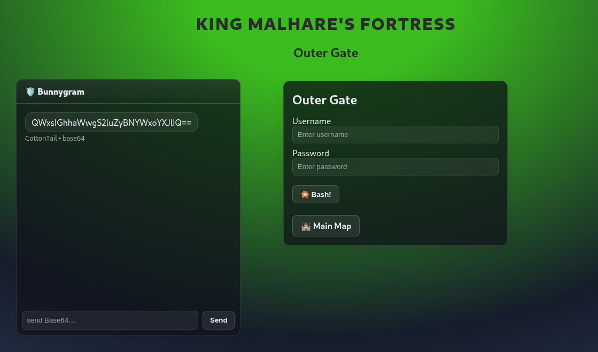

Click to the Bash! i got some hints: 

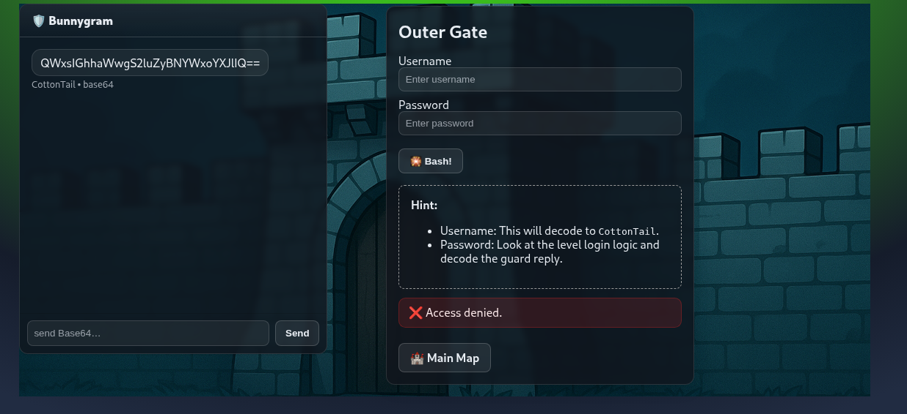

## Playing around

Nice now let decode base64 from BunnyGram

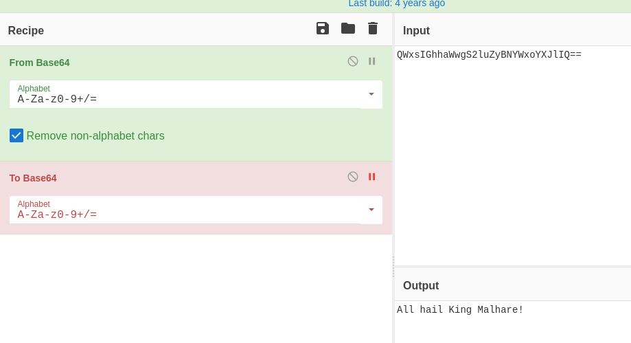

Oh nice How about sending something ???

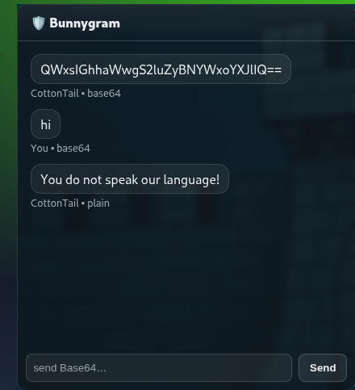

Damn so we have to chat in base64 encode :)))

Let say Hi in base64

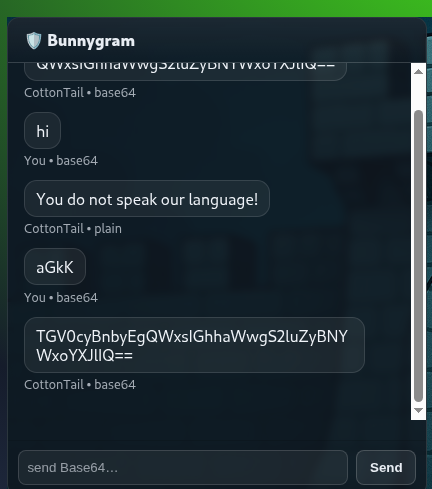

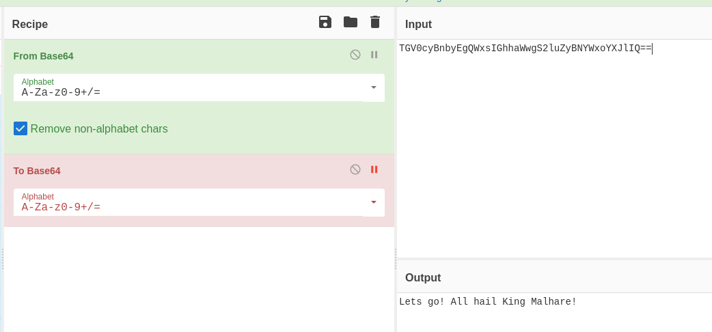

Alright that is all Lets look for somethings interesting…

## Using hints

### `username`

Now we have the information of username is the `Username: This will decode to CottonTail.` 

Which mean its username is CottonTail encode ⇒`Q290dG9uVGFpbA==`

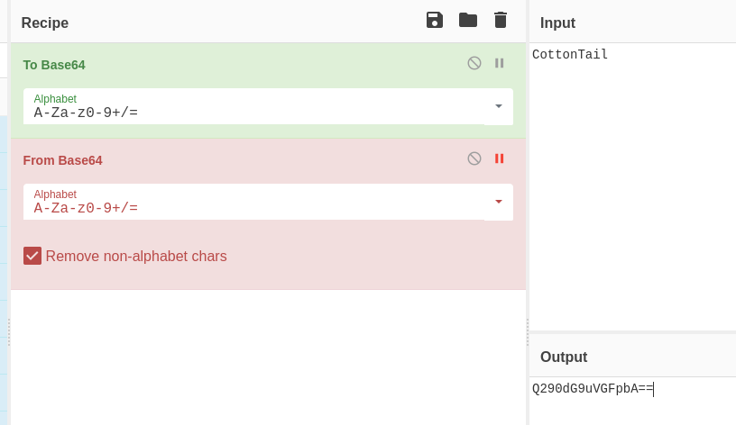

### `password`

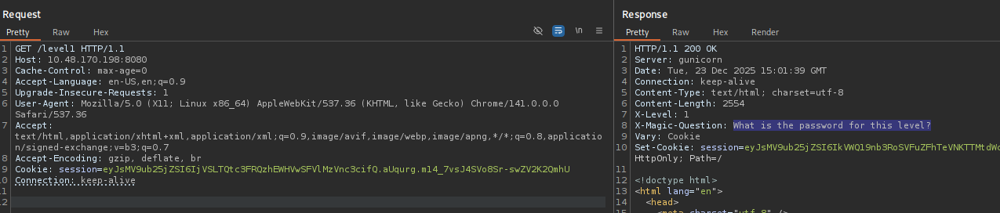

Look at /level1 request in burp we found that there is a response header provide us the question for asking password 

`X-Magic-Question: What is the password for this level?`

Alright let encode that and send to `CottonTail`

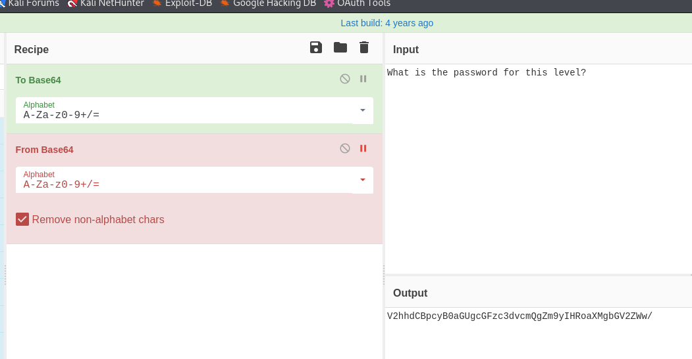

```jsx
V2hhdCBpcyB0aGUgcGFzc3dvcmQgZm9yIHRoaXMgbGV2ZWw/
```

Here is the reply


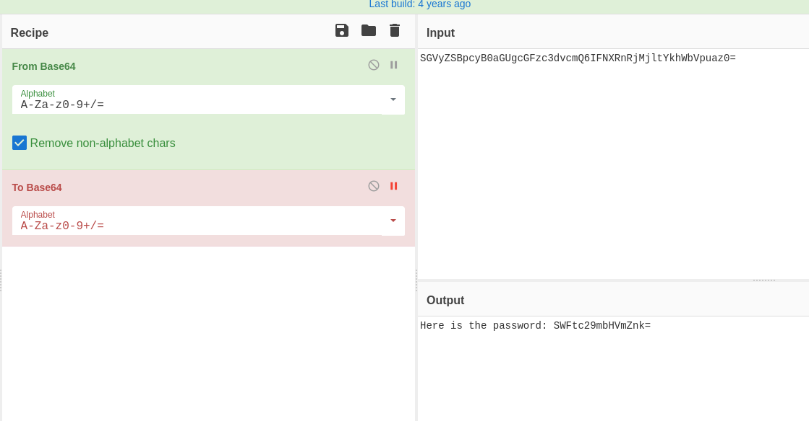

Decode the message we got the password but it is still in base64 encode. Let go decode it one more time

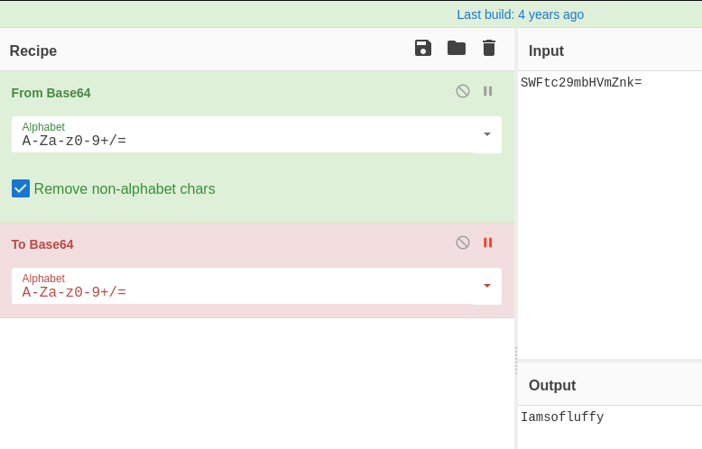

Now we have everything we need to pass the first gate 😀

```jsx
username :  Q290dG9uVGFpbA==
password :  Iamsofluffy
```

# Outer Wall (`Double From Base64` )

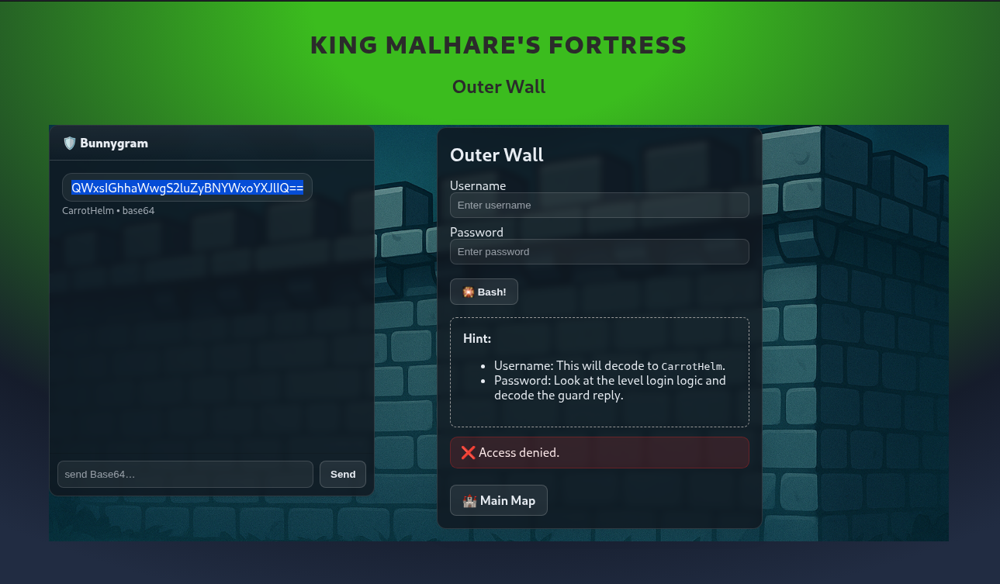

## `username`

In this one everything is same as the first one so just go ahead and check out all things….

Username: This will decode to `CarrotHelm` : `Q2Fycm90SGVsbQ==`

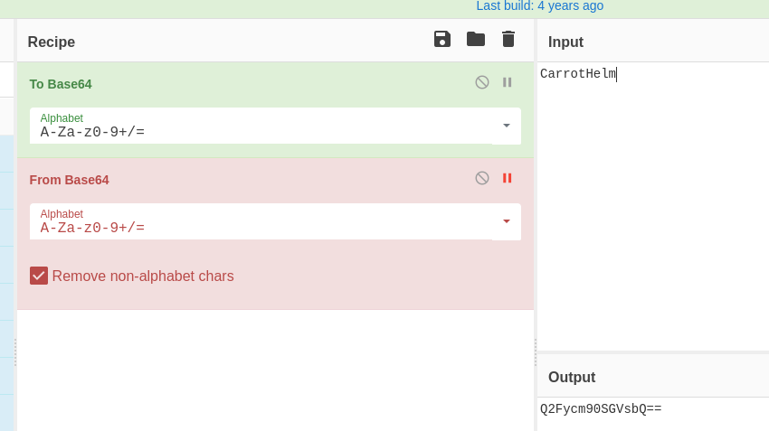

## `password`

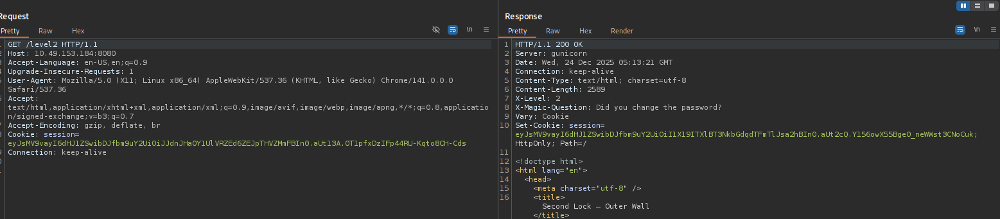

Alright here we have new question for chatting Lets go

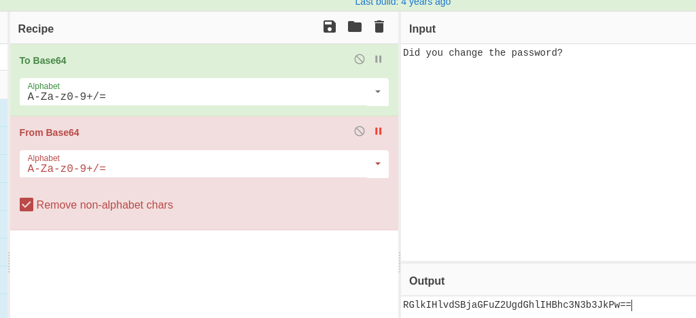

Here is what we g3t

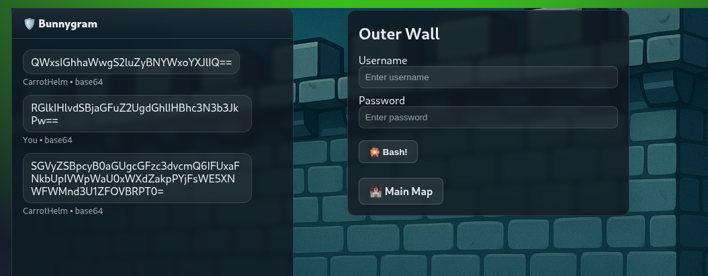

Nice keep going

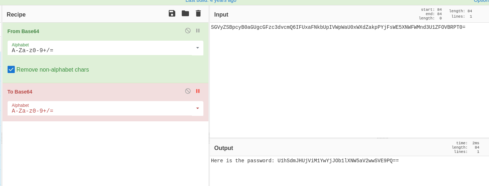

Here the password need to decode 3 times before we get riel password !!!

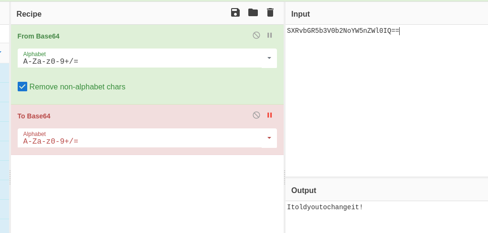

```jsx
SGVyZSBpcyB0aGUgcGFzc3dvcmQ6IFUxaFNkbUpIVWpWaU0xWXdZakpPYjFsWE5XNWFWMnd3U1ZFOVBRPT0=

Here is the password: U1hSdmJHUjViM1YwYjJOb1lXNW5aV2wwSVE9PQ==

                      SXRvbGR5b3V0b2NoYW5nZWl0IQ==

                      Itoldyoutochangeit!
```

### Bash!

```jsx
username : Q2Fycm90SGVsbQ==
password : Itoldyoutochangeit!
```

# Guard House (`From Base64 ⇒ XOR(key=recipeKey)` )

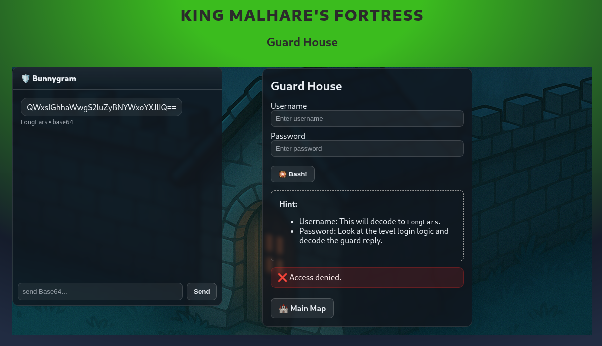

## `username`

Username: This will decode to `LongEars` ⇒  `TG9uZ0VhcnM=`

## `password`


This time we get RecipyKey ( cyberchef) instead of a question. Well as the information we gather from the first of this challenge Let try to ask for password

 


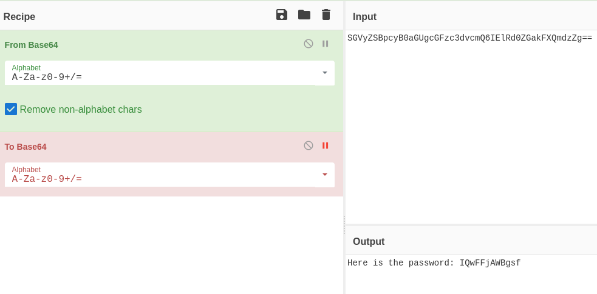

```jsx
SGVyZSBpcyB0aGUgcGFzc3dvcmQ6IElRd0ZGakFXQmdzZg==
-----------From base64-------------------
Here is the password: IQwFFjAWBgsf
-----------From base64 -> ROT13(key = cyberchef) --------------  
                      BugsBunny                    
```

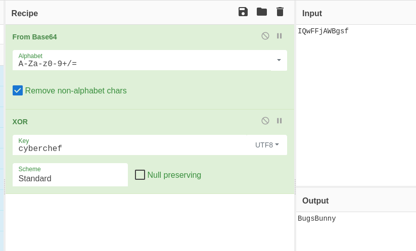

### `Bash!`

```jsx
username : TG9uZ0VhcnM=
password : BugsBunny
```

# Inner Castle ( `Hash lookup` )

## `username`

Username: This will decode to `Lenny` ⇒ `TGVubnk=`

## `password`

Now ask Lenny for the `password`

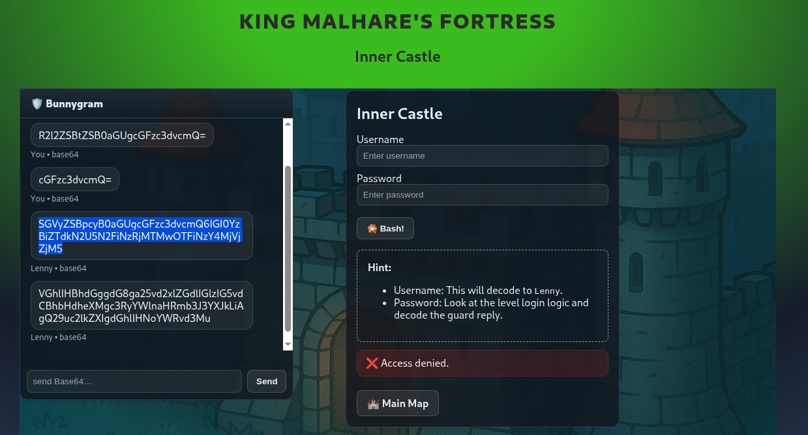

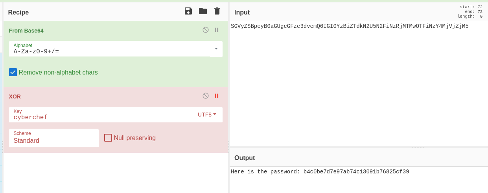

```jsx
SGVyZSBpcyB0aGUgcGFzc3dvcmQ6IGI0YzBiZTdkN2U5N2FiNzRjMTMwOTFiNzY4MjVjZjM5
---------------From base64 ----------------
Here is the password: b4c0be7d7e97ab74c13091b76825cf39
```

Now let search for md5 online 🙂


```jsx
passw0rd1
```

### `Bash!`

```jsx
username : TGVubnk=
password : passw0rd1
```

# Prison Tower

## `gathering infomation`

Look at source code again at level 5

```jsx
if (level === 5) {
        const recipe =  recipeId || "R1";
        let tp = pwd;

        switch (recipe){
          case "R1":
            // CyberChef: From Base64 => Reverse => ROT13
            tp = btoa(reverse(rot13(tp)));
            break;
          case "R2":
            // CyberChef: From Base64 => FromHex => Reverse
            tp = btoa(strToHex(reverse(tp)));
            break;
          case "R3":
            // CyberChef: ROT13 => From Base64 => XOR(key=recipeKey)
            const exed = bytesToBase64(xorWithKey(toBytes(tp), toBytes(recipeKey || "hare")));
            tp = rot13(exed);
            break;
          case "R4":
            // CyberChef: ROT13 => From Base64 => ROT47
            tp = rot13(btoa(rot47(tp)));
            break;
```

This table is for better looking provided from `tryhackme` 🙈

| **Recipe ID** | **Reverse Logic** |
| --- | --- |
| 1 | From Base64 ⇒ Reverse ⇒ ROT13 |
| 2 | From Base64 ⇒ From Hex ⇒ Reverse |
| 3 | ROT13 ⇒ From Base64 ⇒ XOR(extracted key) |
| 4 | ROT13 ⇒ From Base64 ⇒ ROT47 |

Here we can see it need a lot way to get decoding for each recipe 

First we have recipe key from the /level5 response

```jsx
X-Recipe-Key: cyberchef
```

## `username`

Username: This will decode to `Carl` ⇒ `Q2FybA==`

## `password`

Asking for the password first : 

```jsx
cGFzc3dvcmQ=
```

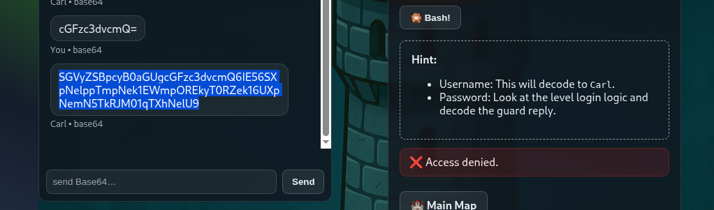

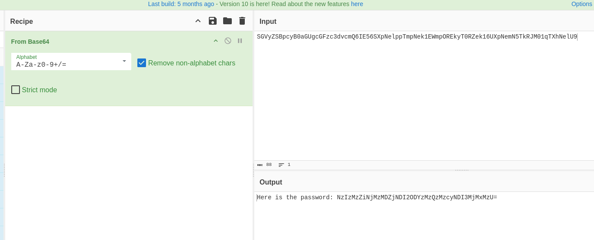

```jsx
SGVyZSBpcyB0aGUgcGFzc3dvcmQ6IE56SXpNelppTmpNek1EWmpOREkyT0RZek16UXpNemN5TkRJM01qTXhNelU9

Here is the password: NzIzMzZiNjMzMDZjNDI2ODYzMzQzMzcyNDI3MjMxMzU=
```

### `recipe 1`

```jsx
NzIzMzZiNjMzMDZjNDI2ODYzMzQzMzcyNDI3MjMxMzU=
```

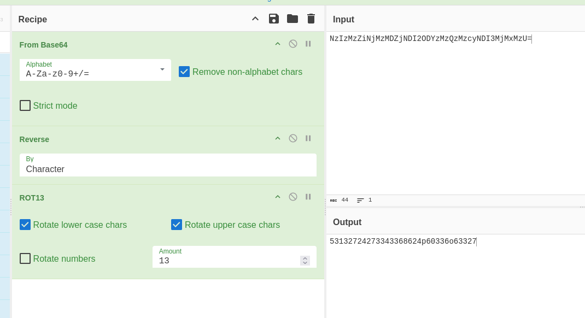

Wrong !

### Recipe 2

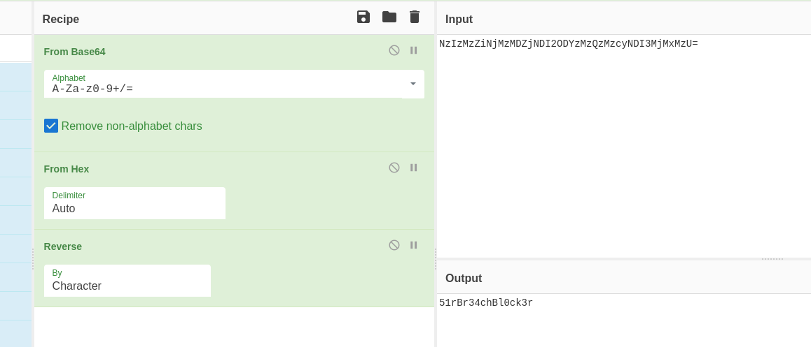

```jsx
51rBr34chBl0ck3r
```

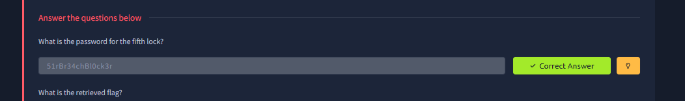

It’s right !!! coool!!!

```jsx
username : Q2FybA==
password : 51rBr34chBl0ck3r
```

### Final flag :

```jsx
THM{M3D13V4L_D3C0D3R_4D3P7}
```