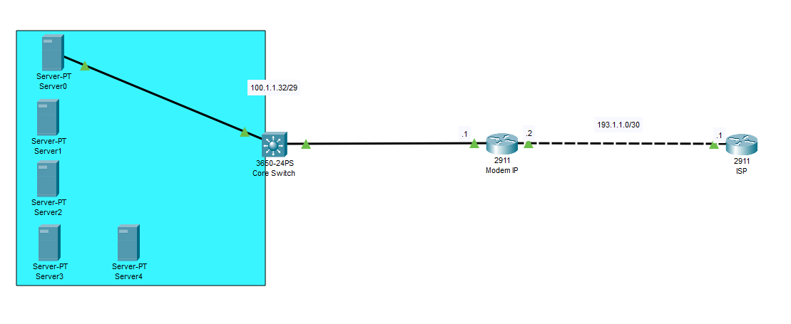
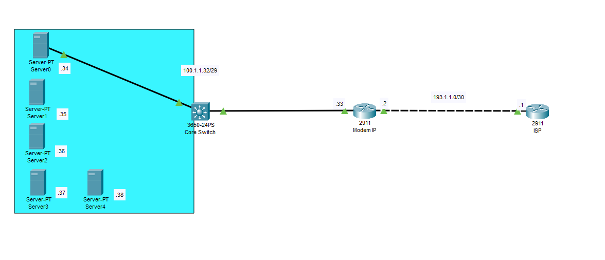
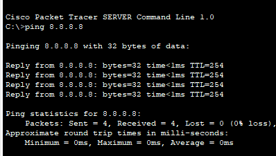
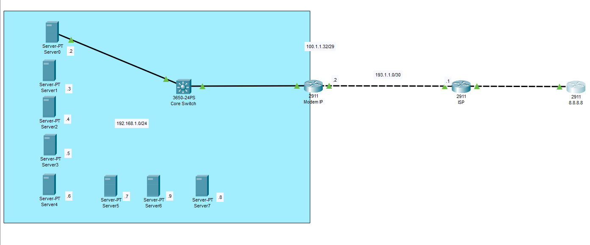
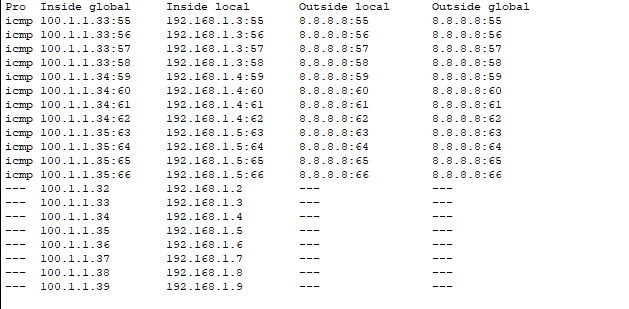

Hello, This is my first blog about networking!!! The topic we will cover today is already stated in the title. The situation is you are supporting an enterprise in deploying network topology.

`Topology`



And here we don't need to care about the connection between Modem and ISP that connection belong to ISP’s responsibility

# #First situation

Assign IP public to all of your server !!!

| IP address | Range |
| --- | --- |
| 100.1.1.32/29 | 100.1.1.32 - 100.1.1.39/29 |



Yeah in the topology above, you assign the public IP address for each servers and also one for default gateway too

As the knowledge of CCNA we have

| Network Address | Host for Server | Host for Default Gateway | Broadcast Address |
| --- | --- | --- | --- |
| 100.1.1.32/29 | 100.1.1.34 - 100.1.1.38 | 100.1.1.33 | 100.1.1.39 |



# #Second situation

Now this situation is to help you take advantage of all 8 public IP from ISP. 

What technology for this? Nothing new ! That is `static nat` !!!

In your network topology you can assign all of your server with private ip as a local `LAN`then link your server with each public IP in `modem` device. So now you save your public IP instead of assign it for the default gateway or waste it for other stuffs(broadcast, network)




## Config

### Modem

```jsx
interface GigabitEthernet0/0
ip address 193.1.1.2 255.255.255.252
ip nat outside
no shutdown
!
interface GigabitEthernet0/1
ip address 192.168.1.1 255.255.255.0
ip nat inside
no shutdown
!
ip nat inside source static 192.168.1.2 100.1.1.32
ip nat inside source static 192.168.1.3 100.1.1.33
ip nat inside source static 192.168.1.4 100.1.1.34
ip nat inside source static 192.168.1.5 100.1.1.35
ip nat inside source static 192.168.1.6 100.1.1.36
ip nat inside source static 192.168.1.7 100.1.1.37
ip nat inside source static 192.168.1.8 100.1.1.38
ip nat inside source static 192.168.1.9 100.1.1.39
ip classless
ip route 0.0.0.0 0.0.0.0 193.1.1.1 
```

### ISP

```jsx
interface GigabitEthernet0/0
no shutdown
ip address 193.1.1.1 255.255.255.252
!
interface GigabitEthernet0/1
ip address 194.1.1.1 255.255.255.252
no shutdown
!
ip route 0.0.0.0 0.0.0.0 194.1.1.2
ip route 100.1.1.32 255.255.255.248 193.1.1.2 
```

I don’t want to say that one option is better than the other; each is suited to a different situation.