Hi ! Today i have done with another module on  HTB. As the title show u this is the write up for the Command injection final lab.

Alright lets go.

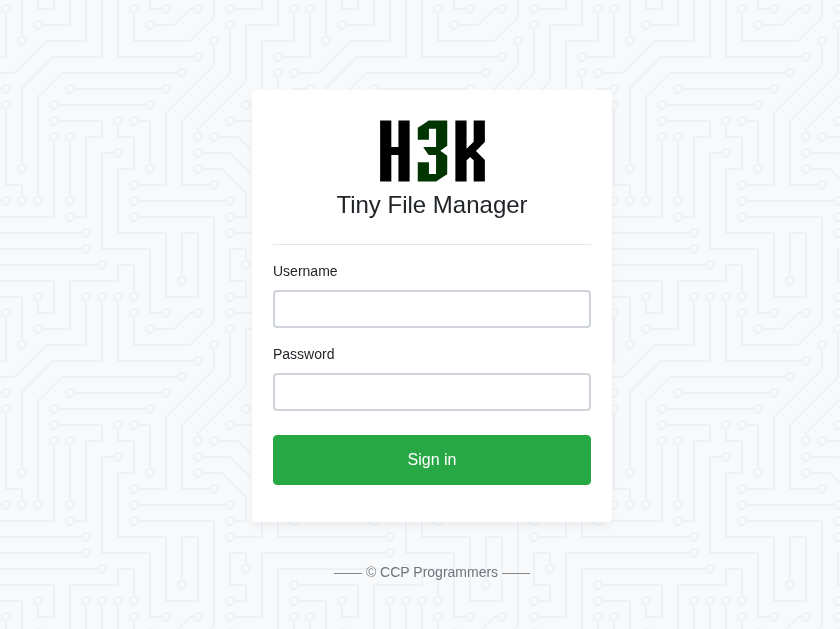

The lab provide us the credential of user "guest" and password "guest”

So the website is for file manager

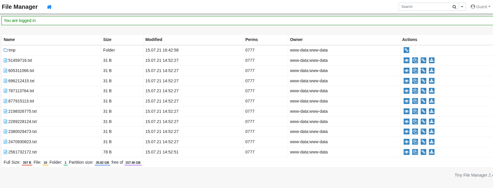

# pArt 1: Explore the website

Well the website allow us to download, move,copying, read file…. . I found an interesting thing with the copying feature.

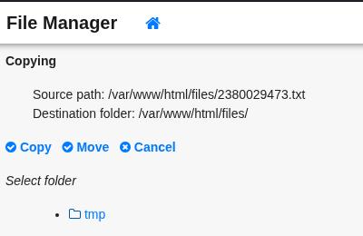

It is showing the root document of the web server. Dang really nice !!!

And then i clicked the move button and it returned an error message

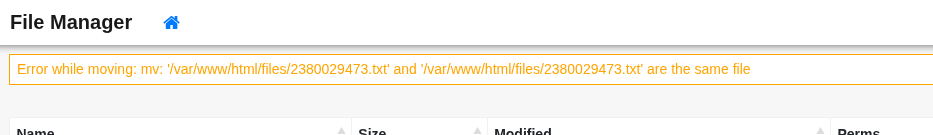

Here we go this is where we going to exploit !

# Part 2: What is the payload for this?

Okay every time i do lab, i always use Burpsuite to keep tracking with the request, so i can get and see all the request that i have made. 

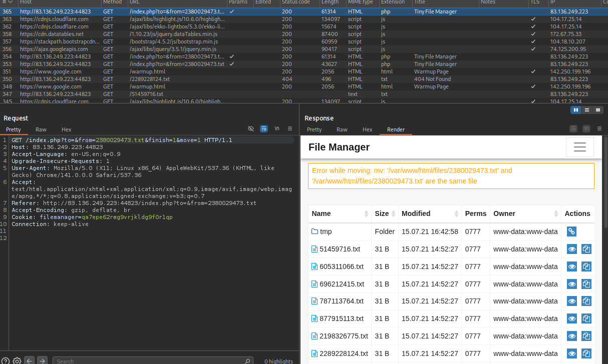

In the picture is the request that i cause the error.

Now i am questioning myself what is the os command that occur that error message?

In the Linux, we have `mv` for moving and coping file. here i create an os command to copying like this

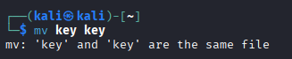

Now look at the URL. 

```markdown
http://83.136.249.223:44823/index.php?to=&from=2380029473.txt&finish=1&move=1
```

The parameter`to`  is the location or directory where file going to move

and `from` is the file name.

So now we have the information for where we can expand to inject os command !!!

# paRt 3: Bypass sanitizing and retrieve flag

Before going to the payload here is the feature of burpsuite really helpful to me when typing injection os command

It is `URL-encode as you type.` 

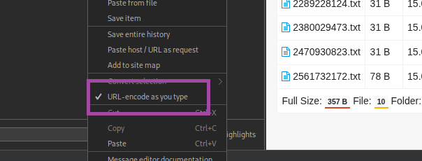

Trust me turn it on and everything you need is typing things you need to bypass without manually right click and choose encode or `Ctrl + U` anymore ~~~~

Now i try some operations to extend.

At first, i use `|` with `ls` like this

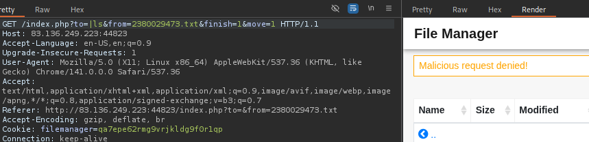

We get block with `ls` and other commands. Maybe blacklist here i try to bypass by add quote: 

```markdown
l's' = ls
```

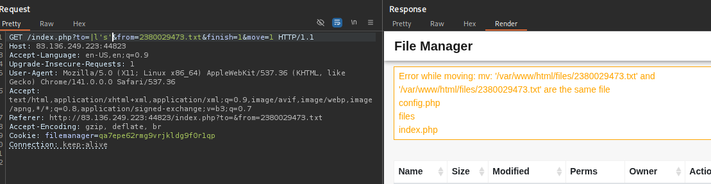

Ok smoothly. But i dont want to waste my time here so i choose my ultimate advanced technical to bypass this easier without imaging different ways to escape the blacklist for single things like `/` ,`space` ….

It is called **Encoded Commands.** This way, it is much less likely to be denied by a filter or a WAF !!!

I created base64 encode first:

```php
echo -n 'ls /' | base64       
bHMgLw==
```

Now i can create a command that will decode the encoded string in a sub-shell (`$()`), and then pass it to `bash` to be executed (i.e. `bash<<<`), as follows:

```bash
bash<<<$(base64 -d<<<bHMgLw==)
```

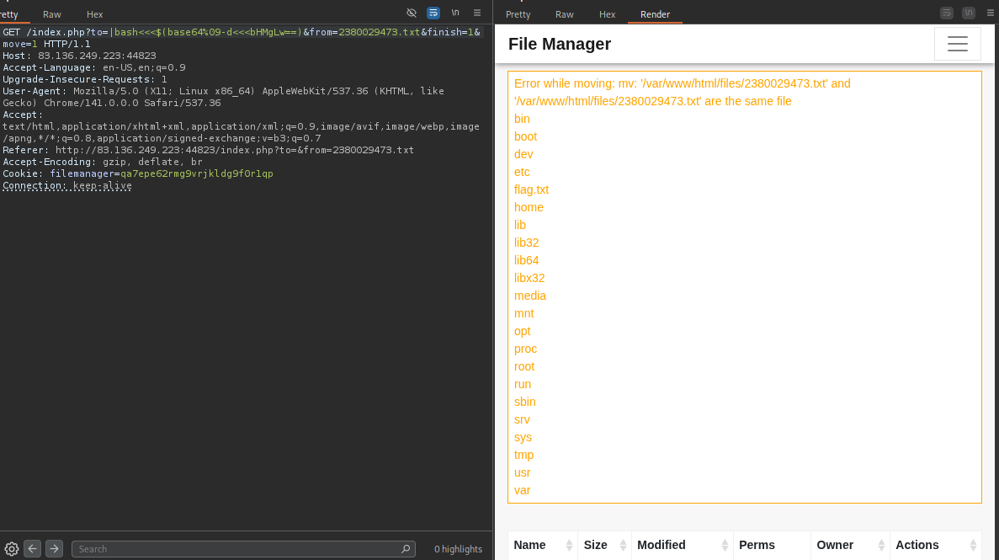

Note that you need to use `tab` instead of `space` of the decode command. I mean here:

- bash<<<$(base64`%09`-d<<<bHMgLw==)

Cuz the website block `space` 😤

```php
echo -n 'cat /flag.txt' | base64       
Y2F0IC9mbGFnLnR4dA==

bash<<<$(base64%09-d<<<Y2F0IC9mbGFnLnR4dA==)
```

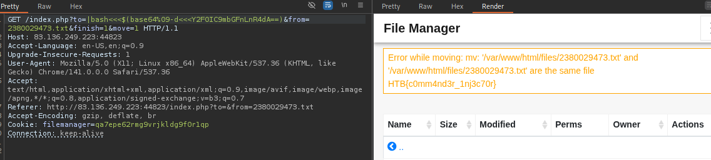

Our flag: `HTB{c0mm4nd3r_1nj3c70r}`

Your welcome ! 😊