Hi, it's been quite a long time no see, hihi 😀. Here are some of my words before the lab!

I will have an intern starting next month (maybe). My plan changed again :v. I planned to get CCNA next month, but my opportunity is coming. I know which one is more important. And well, I will update some more in next month’s status.

Well, in the interview, I got a lot more questions about maintaining access and keeping it alive! So here is one of those funny labs I have done, but this one is really different; I have gone further than what the lab requires! Alright, let's see how I did it.

# Some definitions from `HTB`

[Netsh](https://docs.microsoft.com/en-us/windows-server/networking/technologies/netsh/netsh-contexts) is a Windows command-line tool that can help with the network configuration of a particular Windows system. Here are just some of the networking related tasks we can use `Netsh` for:

- `Finding routes`
- `Viewing the firewall configuration`
- `Adding proxies`
- `Creating port forwarding rules`

# Lab

Look at the figure below : ( just for illustration)

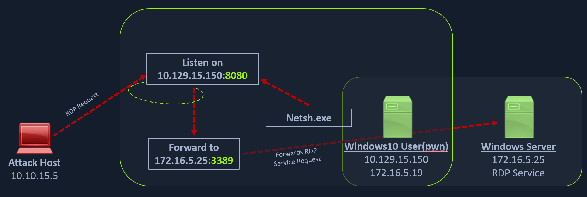

At my first look, i thought that my lab will finish at Windows Server 

## Netmap

Alright, i drew another figure which i actually did in this lab 

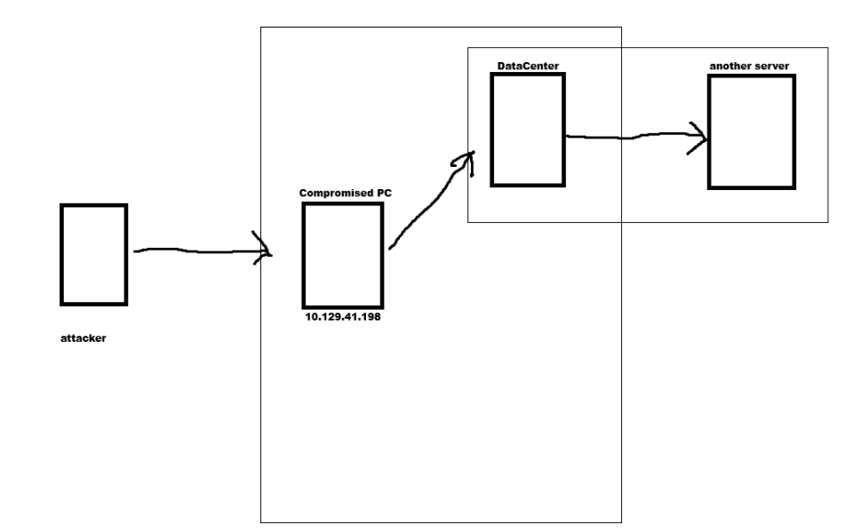

The lab provide us some information about RDP to **10.129.42.198 (ACADEMY-PIVOTING-WIN10PIV),** with user "**htb-student**" and password "**HTB_@cademy_stdnt!**". 

## Get access to the `compromised pc`

I always want to see what service is running on it so i perform quick `nmap`scan down here

Nmap output

```php
┌──(kali㉿kali)-[~/Downloads/tool/rpivot]
└─$ nmap 10.129.42.198  -T4 -Pn  -n --disable-arp-ping
Starting Nmap 7.98 ( https://nmap.org ) at 2026-05-24 03:39 -0400
Nmap scan report for 10.129.42.198
Host is up (0.52s latency).
Not shown: 996 closed tcp ports (reset)
PORT     STATE SERVICE
135/tcp  open  msrpc
139/tcp  open  netbios-ssn
445/tcp  open  microsoft-ds
3389/tcp open  ms-wbt-server
```

```php
┌──(kali㉿kali)-[~/Downloads/tool]
└─$ xfreerdp /v:10.129.42.198:8080 /u:victor /p:pass@123
```

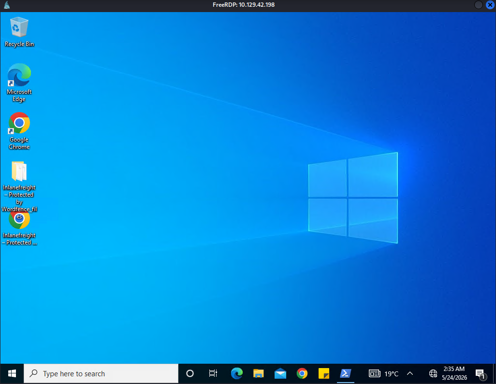

## Get access to the `DC`

#### Looking for server IP address

Im using ping sweep for loop with cmd. 

```php
for /L %i in (1 1 254) do ping 172.16.5.%i -n 1 -w 100 | find "Reply"
```

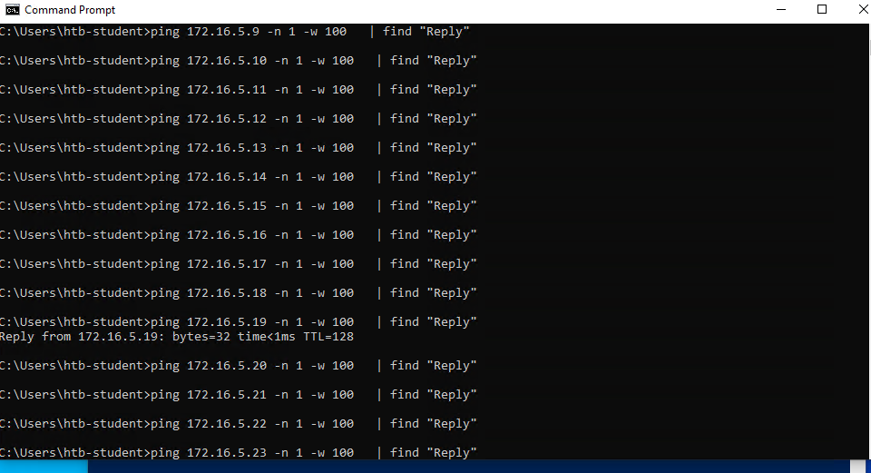

Nice !

### Displays NetBIOS over TCP/IP (NetBT) protocol statistics

[nbtstat | Microsoft Learn](https://learn.microsoft.com/en-us/windows-server/administration/windows-commands/nbtstat)

To investigate this pc’s ip address 172.16.5.19. You can use `nbtstat`  with (-A options for ip add) can help you gather some useful information

```php
PS C:\Windows\system32> nbtstat -A 172.16.5.19                                                                          
Ethernet1 2:
Node IpAddress: [172.16.5.150] Scope Id: []

           NetBIOS Remote Machine Name Table

       Name               Type         Status
    ---------------------------------------------
    DC01           <00>  UNIQUE      Registered
    INLANEFREIGHT  <00>  GROUP       Registered
    INLANEFREIGHT  <1C>  GROUP       Registered
    DC01           <20>  UNIQUE      Registered
    INLANEFREIGHT  <1B>  UNIQUE      Registered

    MAC Address = A2-DE-AD-92-7D-7F

Ethernet0 2:
Node IpAddress: [10.129.42.198] Scope Id: []

    Host not found.
PS C:\Windows\system32>  
```

### Is RDP running on this DC01 server ?

Also we would like to know if RDP service is running…

This powershell command can help you with this !

```php
Test-NetConnection -ComputerName 172.16.5.19 -Port 3389 
```

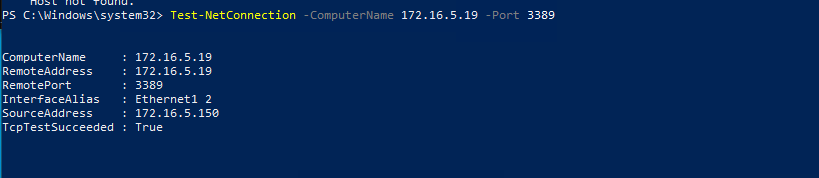

### Configure Port Forwarding to `172.16.5.19`

Here i can configure `netsh` on this pc to forwarding `rdp` port to DataCenter server with this configuration

Configure on PowerShell :

```php
netsh.exe interface portproxy add v4tov4 listenport=8080 listenaddress=10.129.42.198 connectport=3389 connectaddress=172.16.5.19
```

To understand what command do just see this picture again !


We configuration  the `compromised pc` to forward our traffic sent to  10.129.42.198 port 8080 to forward it to `DataCenter server's` IP (172.16.5.15) and its RDP service port 3389

Then use this command to check if your command valid

```php
netsh.exe interface portproxy show v4tov4
```

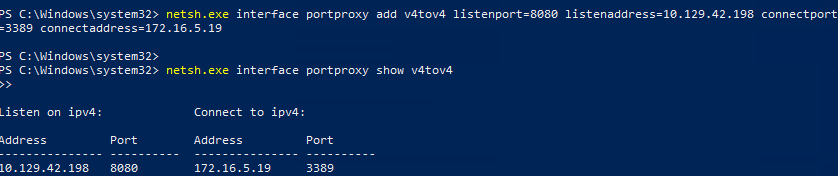

Ok… now you can use both `xfreerdp` on your attack machine or remote desktop connection app on window

### Access to `172.16.5.19`  with `xfreerdp`

```php
xfreerdp /v:10.129.42.198:8080 /u:victor /p:pass@123
```

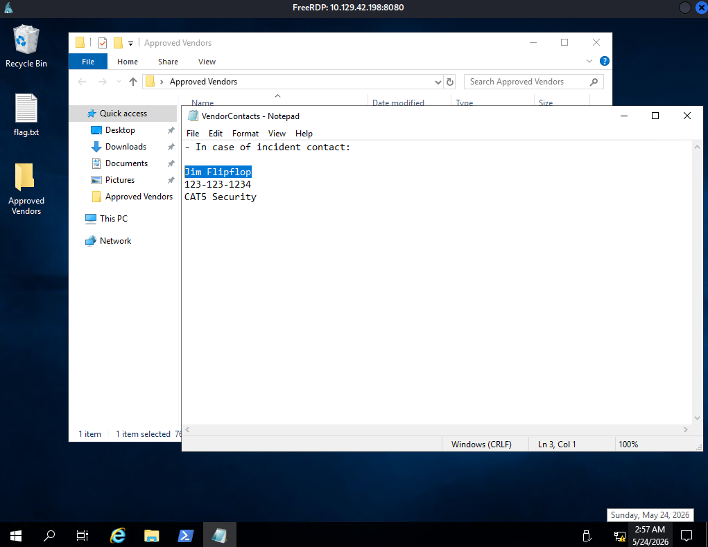

alright now we get the answer for the question of the lab but things not really done :))

> `Jim Flipflop`
> 

## Further investigation

```php
Ethernet adapter Ethernet1 2
Connection-specific DNS Suffix  . 
Link-local IPv6 Address . . . . . : fe80::ff:abc1:4321:a346%9
IPv4 Address. . . . . . . . . . . : 172.16.6.19
Subnet Mask . . . . . . . . . . . : 255.255.0.0
Default Gateway . . . . . . . . . :
PS C:\Windows\system32>   
```

In this subnet if you do things that i previously show you… You can find another host is running on it

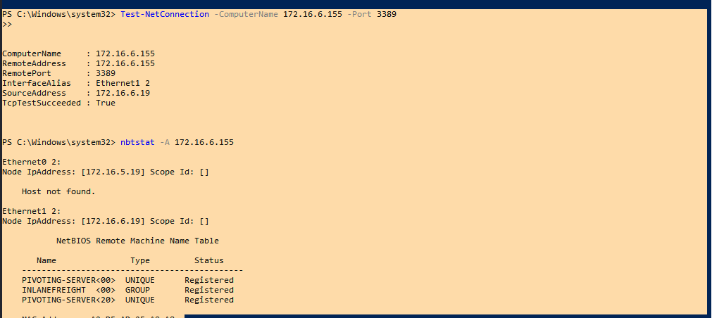

Also RDP service is running too !!!

i checked some information about AD in this server and found that 172.16.6.155 is a server too !

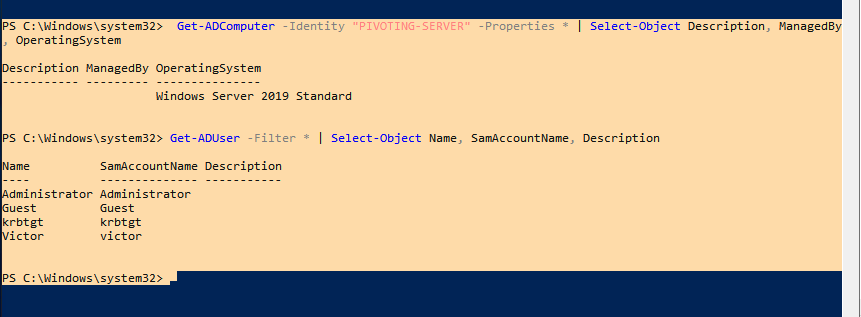

### Configure Port Forwarding to `172.16.5.19`

```php
#on compromised pc
netsh.exe interface portproxy add v4tov4 listenport=8081 listenaddress=10.129.42.198 connectport=8082 connectaddress=172.16.5.19
netsh.exe interface portproxy show v4tov4

#on DC01 server
netsh.exe interface portproxy add v4tov4 listenport=8082 listenaddress=172.16.5.19 connectport=3389 connectaddress=172.16.6.155

netsh.exe interface portproxy show v4tov4

```

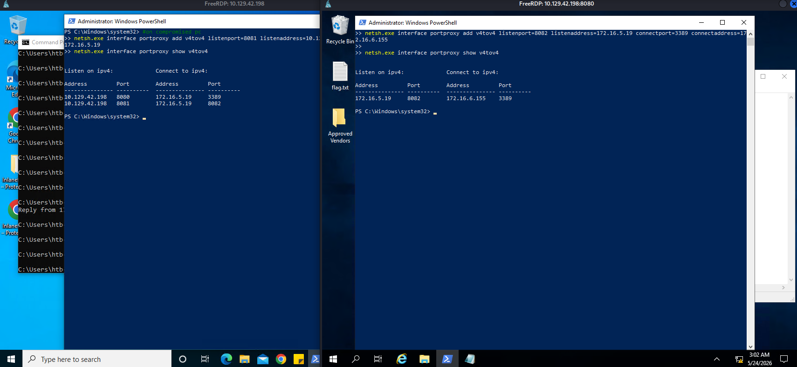

GOOD 

### Access to `172.16.6.155`  with `xfreerdp`

Notice that this server is needed. Multi-hop to connect to and one AD server is for authentication, so our `xfreerdp` command will look like this:

```php
xfreerdp /v:10.129.42.198:8081 /d:INLANEFREIGHT /u:victor /p:pass@123 /sec:nla /cert:ignore /dynamic-resolution +clipboard
```

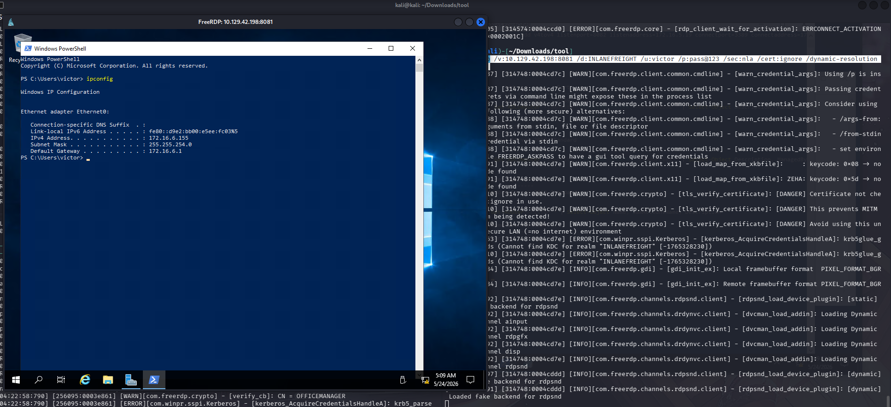

Lastly, my final figure for this lab is :

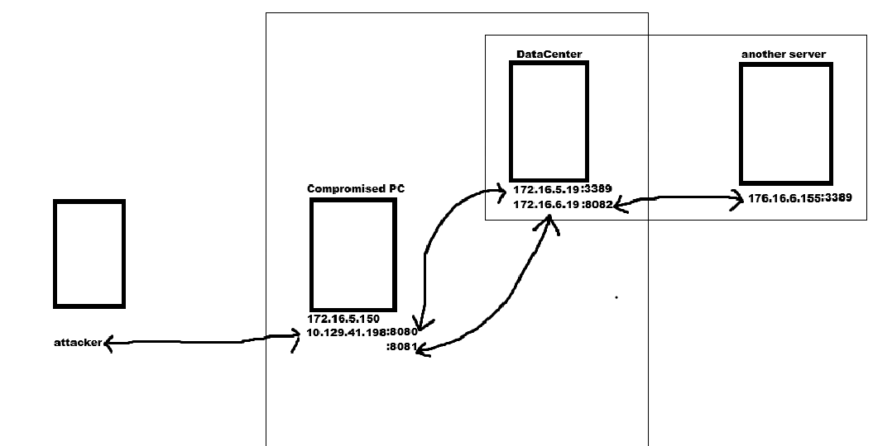

Now I'm done with `xfreerdp` to all PCs or servers that I discover in this lab!!!. I know this may be really basic for someone, but it is really a big step for me!!!! Yeah, see you in the next blog.

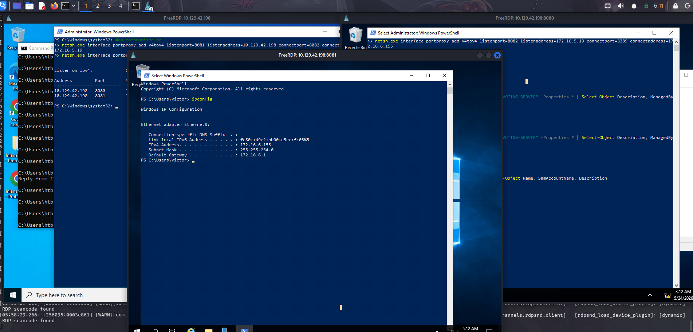