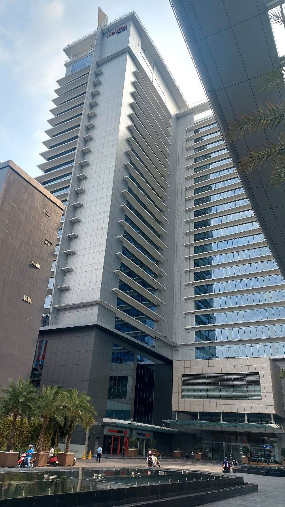
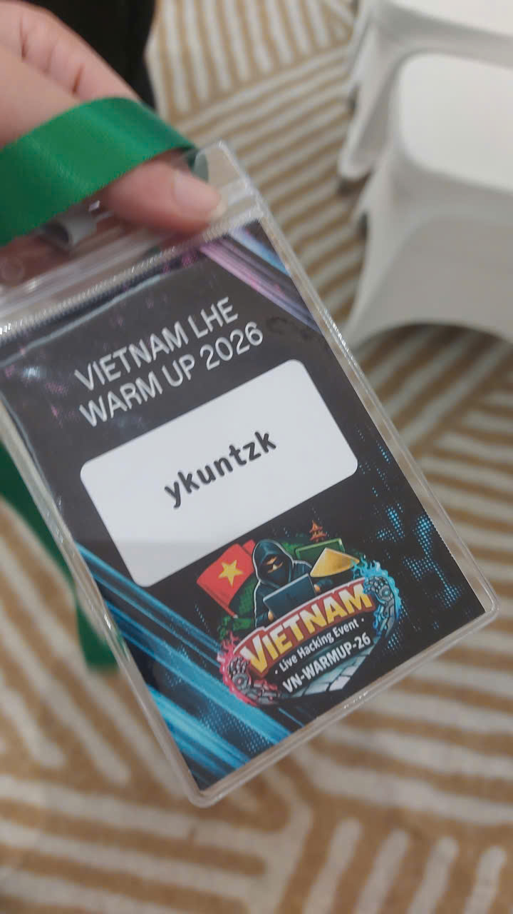
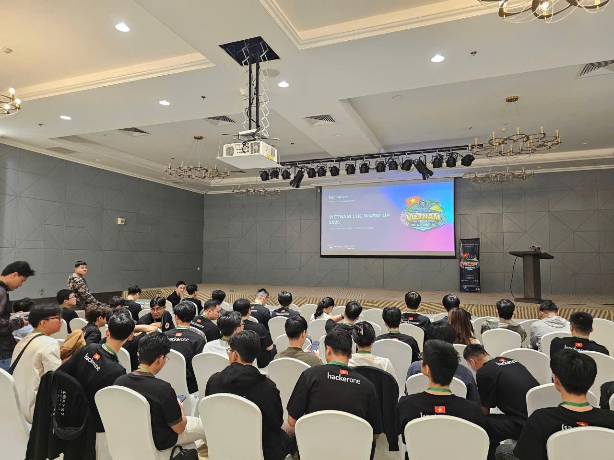
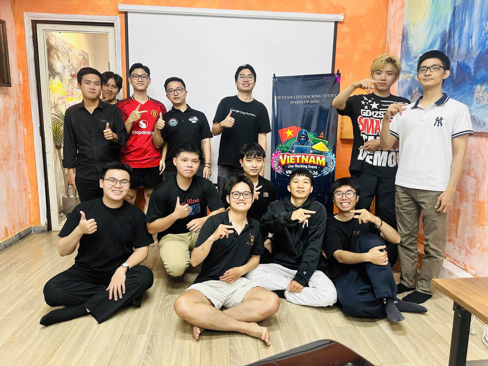
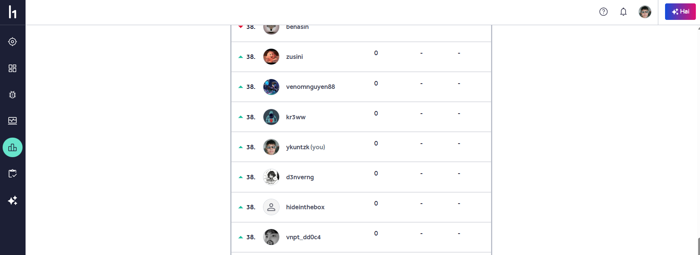

Recently, I participated in a live hacking event for bug bounty hunters. The event gave me a great opportunity to meet professionals in the field, and we shared and discussed many ideas and experiences.

To be honest, the community is amazing for anyone interested in bug bounty, especially newcomers like me. Everyone is friendly, highly skilled, and willing to share their tips and techniques for learning and hunting vulnerabilities.

There are also offline meetups. The most recent one was incredible—it took place at Viettel Tower in Ho Chi Minh City, which is known as one of the biggest companies in our country.

Thank you for everything. I hope to return one day as someone on the leaderboard.

---

## 📸 Event Gallery

---

Only informative bugs — but thanks for the rank!! 😆🔥  
Next time: **Leaderboard or nothing.**
