Hi !

This one is the final lab from HACKTHEBOX. It is Skills Assessment - Using Web Proxies. In this module, I help me to understand clearer about the tool like burpsuite and Proxy-zap. But at the end i prefer Burp more !! 😊

Here we go! Lets start !!!!

my target: 94.237.62.103:50454

Remember to change it into your cuz it is not always the same!!! And in this session, I mainly use Burp to solve.

# PArt1 : Exploit the /lucky.php and change the response value

From the first question, we all know that some thing in this file is disabled so let find out !

> http://94.237.62.103:50454/lucky.php
> 

Turn on inspect mode and look at the body , i found that at the end of the <form> tag is disabled

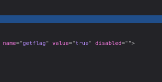

Change that to enable or whatever so that we can click to the box. But click that one time will not able to get flag we need to click it multiple times.

So lets go to Proxy setting and we can edit the response.

## 1.Scroll down to find HTTP match and replace rules

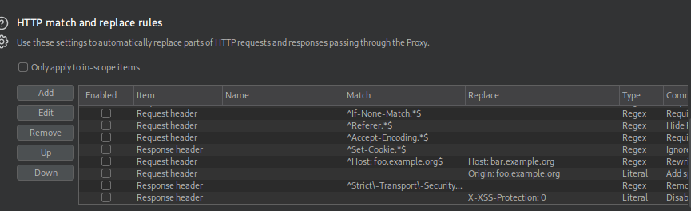

## 2. Go to the http match and replace rules

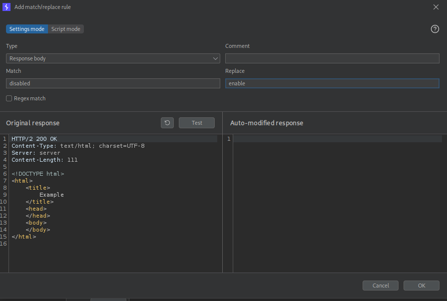

After those steps, we get back to the web and reload. From that time, we can click it without any change to the body anymore

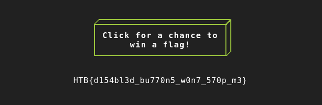

flag: `HTB{d154bl3d_bu770n5_w0n7_570p_m3}`

# ParT2: Go to /admin.php, decode and edit the cookie

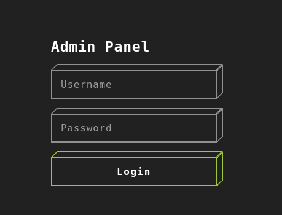

Go to application and we have cookie 

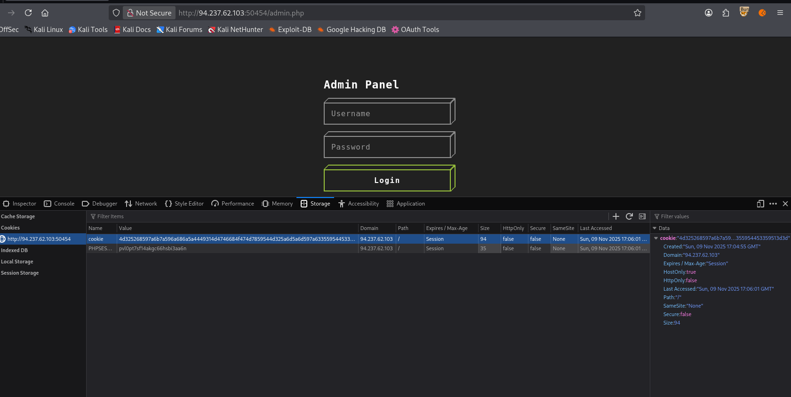

```txt
4d325268597a6b7a596a686a5a4449314d4746684f474d7859544d325a6d5a6d597a63355954453359513d3d
```

Here we have the cookie and take it to burp  Decoder.

Decode it from ACSII hex → BASE64. Then we have a 31 md5hash characters

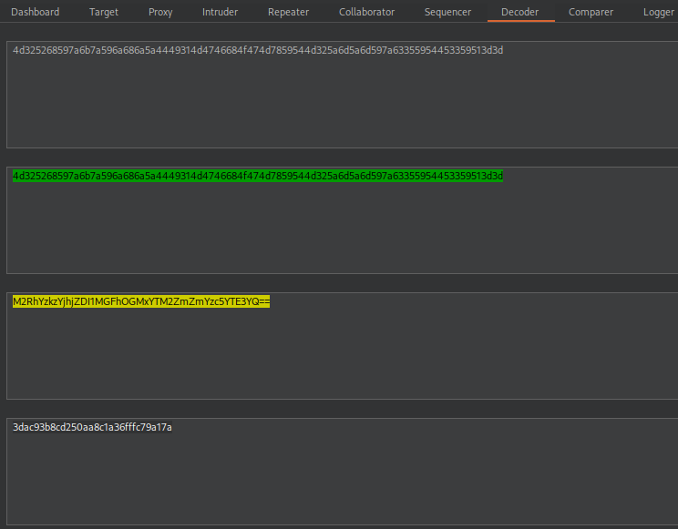

flag: `3dac93b8cd250aa8c1a36fffc79a17a`

# PaRt3: FUZZ for last character of md5 hash

Add alphanum-case.txt to the end of md5hash and sent the re

- List md5 with alphanum-case.txt at the end
    
    ```txt
    3dac93b8cd250aa8c1a36fffc79a17a
    3dac93b8cd250aa8c1a36fffc79a17a0
    3dac93b8cd250aa8c1a36fffc79a17a1
    3dac93b8cd250aa8c1a36fffc79a17a2
    3dac93b8cd250aa8c1a36fffc79a17a3
    3dac93b8cd250aa8c1a36fffc79a17a4
    3dac93b8cd250aa8c1a36fffc79a17a5
    3dac93b8cd250aa8c1a36fffc79a17a6
    3dac93b8cd250aa8c1a36fffc79a17a7
    3dac93b8cd250aa8c1a36fffc79a17a8
    3dac93b8cd250aa8c1a36fffc79a17a9
    3dac93b8cd250aa8c1a36fffc79a17aa
    3dac93b8cd250aa8c1a36fffc79a17ab
    3dac93b8cd250aa8c1a36fffc79a17ac
    3dac93b8cd250aa8c1a36fffc79a17ad
    3dac93b8cd250aa8c1a36fffc79a17ae
    3dac93b8cd250aa8c1a36fffc79a17af
    3dac93b8cd250aa8c1a36fffc79a17ag
    3dac93b8cd250aa8c1a36fffc79a17ah
    3dac93b8cd250aa8c1a36fffc79a17ai
    3dac93b8cd250aa8c1a36fffc79a17aj
    3dac93b8cd250aa8c1a36fffc79a17ak
    3dac93b8cd250aa8c1a36fffc79a17al
    3dac93b8cd250aa8c1a36fffc79a17am
    3dac93b8cd250aa8c1a36fffc79a17an
    3dac93b8cd250aa8c1a36fffc79a17ao
    3dac93b8cd250aa8c1a36fffc79a17ap
    3dac93b8cd250aa8c1a36fffc79a17aq
    3dac93b8cd250aa8c1a36fffc79a17ar
    3dac93b8cd250aa8c1a36fffc79a17as
    3dac93b8cd250aa8c1a36fffc79a17at
    3dac93b8cd250aa8c1a36fffc79a17au
    3dac93b8cd250aa8c1a36fffc79a17av
    3dac93b8cd250aa8c1a36fffc79a17aw
    3dac93b8cd250aa8c1a36fffc79a17ax
    3dac93b8cd250aa8c1a36fffc79a17ay
    3dac93b8cd250aa8c1a36fffc79a17az
    3dac93b8cd250aa8c1a36fffc79a17aA
    3dac93b8cd250aa8c1a36fffc79a17aB
    3dac93b8cd250aa8c1a36fffc79a17aC
    3dac93b8cd250aa8c1a36fffc79a17aD
    3dac93b8cd250aa8c1a36fffc79a17aE
    3dac93b8cd250aa8c1a36fffc79a17aF
    3dac93b8cd250aa8c1a36fffc79a17aG
    3dac93b8cd250aa8c1a36fffc79a17aH
    3dac93b8cd250aa8c1a36fffc79a17aI
    3dac93b8cd250aa8c1a36fffc79a17aJ
    3dac93b8cd250aa8c1a36fffc79a17aK
    3dac93b8cd250aa8c1a36fffc79a17aL
    3dac93b8cd250aa8c1a36fffc79a17aM
    3dac93b8cd250aa8c1a36fffc79a17aN
    3dac93b8cd250aa8c1a36fffc79a17aO
    3dac93b8cd250aa8c1a36fffc79a17aP
    3dac93b8cd250aa8c1a36fffc79a17aQ
    3dac93b8cd250aa8c1a36fffc79a17aR
    3dac93b8cd250aa8c1a36fffc79a17aS
    3dac93b8cd250aa8c1a36fffc79a17aT
    3dac93b8cd250aa8c1a36fffc79a17aU
    3dac93b8cd250aa8c1a36fffc79a17aV
    3dac93b8cd250aa8c1a36fffc79a17aW
    3dac93b8cd250aa8c1a36fffc79a17aX
    3dac93b8cd250aa8c1a36fffc79a17aY
    3dac93b8cd250aa8c1a36fffc79a17aZ
    
    ```
    
- Go to the intruder you add a payload

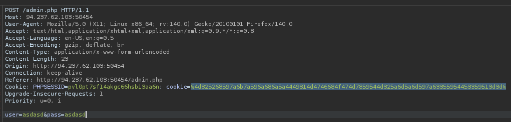

- Paste wordlist to the payload

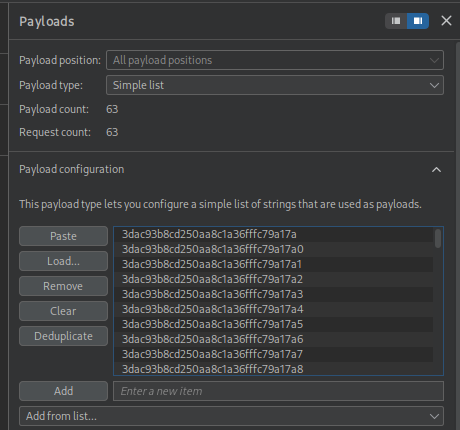

- Next is add payload processing to fix the cookie’s encoding rules

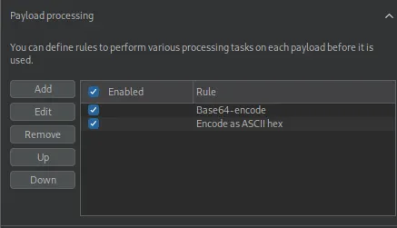

- Once you start attack and the payload with small length have the cookie that retrieve flag.

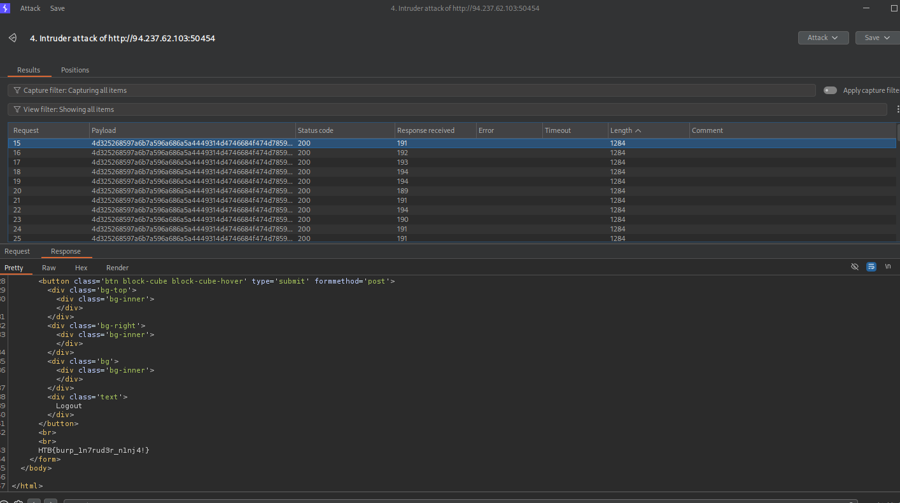

```txt
here is one of those valid cookie : 4d325268597a6b7a596a686a5a4449314d4746684f474d7859544d325a6d5a6d597a6335595445335957553d          
```

> flag: `HTB{burp_1n7rud3r_n1nj4!}`
> 

# part 4: Using metasploit-framework to proxy

> Caution : need to using foxyproxy to send the resquest to burp
> 

Do same like below steps:

> Turn on Burp intercept first
> 
> 
> 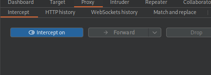
> 

```php
msf > auxiliary/scanner/http/coldfusion_locale_traversal
[-] Unknown command: auxiliary/scanner/http/coldfusion_locale_traversal. Run the help command for more details.
This is a module we can load. Do you want to use auxiliary/scanner/http/coldfusion_locale_traversal? [y/N]   y
msf auxiliary(scanner/http/coldfusion_locale_traversal) > set RHOST 94.237.52.164
RHOST => 94.237.52.164
msf auxiliary(scanner/http/coldfusion_locale_traversal) > set RPORT 58742
RPORT => 58742
msf auxiliary(scanner/http/coldfusion_locale_traversal) > set PROXIES HTTP:127.0.0.1:8080
PROXIES => HTTP:127.0.0.1:8080
msf auxiliary(scanner/http/coldfusion_locale_traversal) > run
[*] Scanned 1 of 1 hosts (100% complete)

```

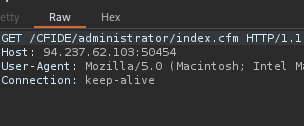

When you capture the request, what is the 'XXXXX' directory being called in '/XXXXX/administrator/ is the flag

```php
GET /CFIDE/administrator/index.cfm HTTP/1.1
```

our flag : `CFIDE`