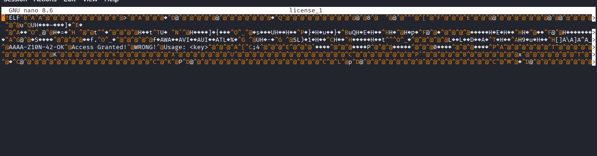
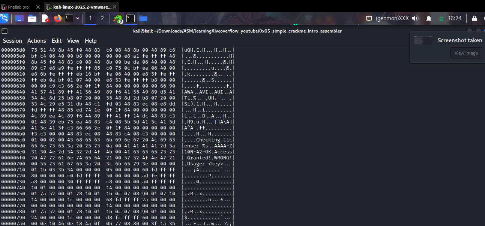

[liveoverflow_youtube/0x05_simple_crackme_intro_assembler at master · LiveOverflow/liveoverflow_youtube](https://github.com/LiveOverflow/liveoverflow_youtube/tree/master/0x05_simple_crackme_intro_assembler)

[Filter Out the Noise | HZ](https://www.youtube.com/watch?v=VroEiMOJPm8)

As we have the `license_1` file for using to learn in this episode

https://www.youtube.com/watch?v=3NTXFUxcKPc

## File

This one to help us checking ELF and other information about the file.

```python
└─$ file license_1
license_1: ELF 64-bit LSB executable, x86-64, version 1 (SYSV), dynamically linked, interpreter /lib64/ld-linux-x86-64.so.2, for GNU/Linux 2.6.24, BuildID[sha1]=72922f8327afa289f1680c03499675863479489c, not stripped
```

## Checking the file in raw

Here im using `nano` just for look at the file



You see here the key is already there !!!

flag : `AAAA-Z10N-42-OK`

> Some weird characters like this(`@^X^@^@^@^@^@^@^@^U^@^@^@^@^@^@^@^@^@^@^@^@`) is because the acsii table is from 0x00 → 0x7X And which character over that range doesnt have their own printable  character !
> 

## hexdump

-C, --canonical           canonical hex+ASCII display

```python
hexdump -C license_1
```



## Strings

```python
..........................
[]A\A]A^A_
Checking License: %s
AAAA-Z10N-42-OK
Access Granted!
WRONG!
Usage: <key>
.......................
```

show us all printable characters 😊 really nice 

## Objdump

```python
objdump -d license_1    

 -d, --disassemble        Display assembler contents of executable sections

```
<details>
  <summary>
     `Open to see the result`
  </summary>


        
        ```nasm
        license_1:     file format elf64-x86-64
        
        Disassembly of section .init:
        
        0000000000400450 <_init>:
        400450:       48 83 ec 08             sub    $0x8,%rsp
        400454:       48 8b 05 9d 0b 20 00    mov    0x200b9d(%rip),%rax        # 600ff8 <__gmon_start__>
        40045b:       48 85 c0                test   %rax,%rax
        40045e:       74 05                   je     400465 <_init+0x15>
        400460:       e8 5b 00 00 00          call   4004c0 <__gmon_start__@plt>
        400465:       48 83 c4 08             add    $0x8,%rsp
        400469:       c3                      ret
        
        Disassembly of section .plt:
        
        0000000000400470 <.plt>:
        400470:       ff 35 92 0b 20 00       push   0x200b92(%rip)        # 601008 <_GLOBAL_OFFSET_TABLE_+0x8>
        400476:       ff 25 94 0b 20 00       jmp    *0x200b94(%rip)        # 601010 <_GLOBAL_OFFSET_TABLE_+0x10>
        40047c:       0f 1f 40 00             nopl   0x0(%rax)
        
        0000000000400480 <puts@plt>:
        400480:       ff 25 92 0b 20 00       jmp    *0x200b92(%rip)        # 601018 <puts@GLIBC_2.2.5>
        400486:       68 00 00 00 00          push   $0x0
        40048b:       e9 e0 ff ff ff          jmp    400470 <.plt>
        
        0000000000400490 <printf@plt>:
        400490:       ff 25 8a 0b 20 00       jmp    *0x200b8a(%rip)        # 601020 <printf@GLIBC_2.2.5>
        400496:       68 01 00 00 00          push   $0x1
        40049b:       e9 d0 ff ff ff          jmp    400470 <.plt>
        
        00000000004004a0 <__libc_start_main@plt>:
        4004a0:       ff 25 82 0b 20 00       jmp    *0x200b82(%rip)        # 601028 <__libc_start_main@GLIBC_2.2.5>
        4004a6:       68 02 00 00 00          push   $0x2
        4004ab:       e9 c0 ff ff ff          jmp    400470 <.plt>
        
        00000000004004b0 <strcmp@plt>:
        4004b0:       ff 25 7a 0b 20 00       jmp    *0x200b7a(%rip)        # 601030 <strcmp@GLIBC_2.2.5>
        4004b6:       68 03 00 00 00          push   $0x3
        4004bb:       e9 b0 ff ff ff          jmp    400470 <.plt>
        
        00000000004004c0 <__gmon_start__@plt>:
        4004c0:       ff 25 72 0b 20 00       jmp    *0x200b72(%rip)        # 601038 <__gmon_start__>
        4004c6:       68 04 00 00 00          push   $0x4
        4004cb:       e9 a0 ff ff ff          jmp    400470 <.plt>
        
        Disassembly of section .text:
        
        00000000004004d0 <_start>:
        4004d0:       31 ed                   xor    %ebp,%ebp
        4004d2:       49 89 d1                mov    %rdx,%r9
        4004d5:       5e                      pop    %rsi
        4004d6:       48 89 e2                mov    %rsp,%rdx
        4004d9:       48 83 e4 f0             and    $0xfffffffffffffff0,%rsp
        4004dd:       50                      push   %rax
        4004de:       54                      push   %rsp
        4004df:       49 c7 c0 b0 06 40 00    mov    $0x4006b0,%r8
        4004e6:       48 c7 c1 40 06 40 00    mov    $0x400640,%rcx
        4004ed:       48 c7 c7 bd 05 40 00    mov    $0x4005bd,%rdi
        4004f4:       e8 a7 ff ff ff          call   4004a0 <__libc_start_main@plt>
        4004f9:       f4                      hlt
        4004fa:       66 0f 1f 44 00 00       nopw   0x0(%rax,%rax,1)
        
        0000000000400500 <deregister_tm_clones>:
        400500:       b8 57 10 60 00          mov    $0x601057,%eax
        400505:       55                      push   %rbp
        400506:       48 2d 50 10 60 00       sub    $0x601050,%rax
        40050c:       48 83 f8 0e             cmp    $0xe,%rax
        400510:       48 89 e5                mov    %rsp,%rbp
        400513:       77 02                   ja     400517 <deregister_tm_clones+0x17>
        400515:       5d                      pop    %rbp
        400516:       c3                      ret
        400517:       b8 00 00 00 00          mov    $0x0,%eax
        40051c:       48 85 c0                test   %rax,%rax
        40051f:       74 f4                   je     400515 <deregister_tm_clones+0x15>
        400521:       5d                      pop    %rbp
        400522:       bf 50 10 60 00          mov    $0x601050,%edi
        400527:       ff e0                   jmp    *%rax
        400529:       0f 1f 80 00 00 00 00    nopl   0x0(%rax)
        
        0000000000400530 <register_tm_clones>:
        400530:       b8 50 10 60 00          mov    $0x601050,%eax
        400535:       55                      push   %rbp
        400536:       48 2d 50 10 60 00       sub    $0x601050,%rax
        40053c:       48 c1 f8 03             sar    $0x3,%rax
        400540:       48 89 e5                mov    %rsp,%rbp
        400543:       48 89 c2                mov    %rax,%rdx
        400546:       48 c1 ea 3f             shr    $0x3f,%rdx
        40054a:       48 01 d0                add    %rdx,%rax
        40054d:       48 d1 f8                sar    $1,%rax
        400550:       75 02                   jne    400554 <register_tm_clones+0x24>
        400552:       5d                      pop    %rbp
        400553:       c3                      ret
        400554:       ba 00 00 00 00          mov    $0x0,%edx
        400559:       48 85 d2                test   %rdx,%rdx
        40055c:       74 f4                   je     400552 <register_tm_clones+0x22>
        40055e:       5d                      pop    %rbp
        40055f:       48 89 c6                mov    %rax,%rsi
        400562:       bf 50 10 60 00          mov    $0x601050,%edi
        400567:       ff e2                   jmp    *%rdx
        400569:       0f 1f 80 00 00 00 00    nopl   0x0(%rax)
        
        0000000000400570 <__do_global_dtors_aux>:
        400570:       80 3d d9 0a 20 00 00    cmpb   $0x0,0x200ad9(%rip)        # 601050 <__TMC_END__>
        400577:       75 11                   jne    40058a <__do_global_dtors_aux+0x1a>
        400579:       55                      push   %rbp
        40057a:       48 89 e5                mov    %rsp,%rbp
        40057d:       e8 7e ff ff ff          call   400500 <deregister_tm_clones>
        400582:       5d                      pop    %rbp
        400583:       c6 05 c6 0a 20 00 01    movb   $0x1,0x200ac6(%rip)        # 601050 <__TMC_END__>
        40058a:       f3 c3                   repz ret
        40058c:       0f 1f 40 00             nopl   0x0(%rax)
        
        0000000000400590 <frame_dummy>:
        400590:       48 83 3d 88 08 20 00    cmpq   $0x0,0x200888(%rip)        # 600e20 <__JCR_END__>
        400597:       00 
        400598:       74 1e                   je     4005b8 <frame_dummy+0x28>
        40059a:       b8 00 00 00 00          mov    $0x0,%eax
        40059f:       48 85 c0                test   %rax,%rax
        4005a2:       74 14                   je     4005b8 <frame_dummy+0x28>
        4005a4:       55                      push   %rbp
        4005a5:       bf 20 0e 60 00          mov    $0x600e20,%edi
        4005aa:       48 89 e5                mov    %rsp,%rbp
        4005ad:       ff d0                   call   *%rax
        4005af:       5d                      pop    %rbp
        4005b0:       e9 7b ff ff ff          jmp    400530 <register_tm_clones>
        4005b5:       0f 1f 00                nopl   (%rax)
        4005b8:       e9 73 ff ff ff          jmp    400530 <register_tm_clones>
        
        00000000004005bd <main>:
        4005bd:       55                      push   %rbp
        4005be:       48 89 e5                mov    %rsp,%rbp
        4005c1:       48 83 ec 10             sub    $0x10,%rsp
        4005c5:       89 7d fc                mov    %edi,-0x4(%rbp)
        4005c8:       48 89 75 f0             mov    %rsi,-0x10(%rbp)
        4005cc:       83 7d fc 02             cmpl   $0x2,-0x4(%rbp)
        4005d0:       75 51                   jne    400623 <main+0x66>
        4005d2:       48 8b 45 f0             mov    -0x10(%rbp),%rax
        4005d6:       48 83 c0 08             add    $0x8,%rax
        4005da:       48 8b 00                mov    (%rax),%rax
        4005dd:       48 89 c6                mov    %rax,%rsi
        4005e0:       bf c4 06 40 00          mov    $0x4006c4,%edi
        4005e5:       b8 00 00 00 00          mov    $0x0,%eax
        4005ea:       e8 a1 fe ff ff          call   400490 <printf@plt>
        4005ef:       48 8b 45 f0             mov    -0x10(%rbp),%rax
        4005f3:       48 83 c0 08             add    $0x8,%rax
        4005f7:       48 8b 00                mov    (%rax),%rax
        4005fa:       be da 06 40 00          mov    $0x4006da,%esi
        4005ff:       48 89 c7                mov    %rax,%rdi
        400602:       e8 a9 fe ff ff          call   4004b0 <strcmp@plt>
        400607:       85 c0                   test   %eax,%eax
        400609:       75 0c                   jne    400617 <main+0x5a>
        40060b:       bf ea 06 40 00          mov    $0x4006ea,%edi
        400610:       e8 6b fe ff ff          call   400480 <puts@plt>
        400615:       eb 16                   jmp    40062d <main+0x70>
        400617:       bf fa 06 40 00          mov    $0x4006fa,%edi
        40061c:       e8 5f fe ff ff          call   400480 <puts@plt>
        400621:       eb 0a                   jmp    40062d <main+0x70>
        400623:       bf 01 07 40 00          mov    $0x400701,%edi
        400628:       e8 53 fe ff ff          call   400480 <puts@plt>
        40062d:       b8 00 00 00 00          mov    $0x0,%eax
        400632:       c9                      leave
        400633:       c3                      ret
        400634:       66 2e 0f 1f 84 00 00    cs nopw 0x0(%rax,%rax,1)
        40063b:       00 00 00 
        40063e:       66 90                   xchg   %ax,%ax
        
        0000000000400640 <__libc_csu_init>:
        400640:       41 57                   push   %r15
        400642:       41 89 ff                mov    %edi,%r15d
        400645:       41 56                   push   %r14
        400647:       49 89 f6                mov    %rsi,%r14
        40064a:       41 55                   push   %r13
        40064c:       49 89 d5                mov    %rdx,%r13
        40064f:       41 54                   push   %r12
        400651:       4c 8d 25 b8 07 20 00    lea    0x2007b8(%rip),%r12        # 600e10 <__frame_dummy_init_array_entry>
        400658:       55                      push   %rbp
        400659:       48 8d 2d b8 07 20 00    lea    0x2007b8(%rip),%rbp        # 600e18 <__do_global_dtors_aux_fini_array_entry>
        400660:       53                      push   %rbx
        400661:       4c 29 e5                sub    %r12,%rbp
        400664:       31 db                   xor    %ebx,%ebx
        400666:       48 c1 fd 03             sar    $0x3,%rbp
        40066a:       48 83 ec 08             sub    $0x8,%rsp
        40066e:       e8 dd fd ff ff          call   400450 <_init>
        400673:       48 85 ed                test   %rbp,%rbp
        400676:       74 1e                   je     400696 <__libc_csu_init+0x56>
        400678:       0f 1f 84 00 00 00 00    nopl   0x0(%rax,%rax,1)
        40067f:       00 
        400680:       4c 89 ea                mov    %r13,%rdx
        400683:       4c 89 f6                mov    %r14,%rsi
        400686:       44 89 ff                mov    %r15d,%edi
        400689:       41 ff 14 dc             call   *(%r12,%rbx,8)
        40068d:       48 83 c3 01             add    $0x1,%rbx
        400691:       48 39 eb                cmp    %rbp,%rbx
        400694:       75 ea                   jne    400680 <__libc_csu_init+0x40>
        400696:       48 83 c4 08             add    $0x8,%rsp
        40069a:       5b                      pop    %rbx
        40069b:       5d                      pop    %rbp
        40069c:       41 5c                   pop    %r12
        40069e:       41 5d                   pop    %r13
        4006a0:       41 5e                   pop    %r14
        4006a2:       41 5f                   pop    %r15
        4006a4:       c3                      ret
        4006a5:       66 66 2e 0f 1f 84 00    data16 cs nopw 0x0(%rax,%rax,1)
        4006ac:       00 00 00 00 
        
        00000000004006b0 <__libc_csu_fini>:
        4006b0:       f3 c3                   repz ret
        
        Disassembly of section .fini:
        
        00000000004006b4 <_fini>:
        4006b4:       48 83 ec 08             sub    $0x8,%rsp
        4006b8:       48 83 c4 08             add    $0x8,%rsp
        4006bc:       c3                      ret
                                        
        ```
</details>

```nasm
objdump -x license_1 | less
```
<details>
  <summary>
     `Open to see the result`  : look at `.text` there is where our main located, and `.rodata` our strings can be store in there
  </summary>
- 
    
    ```nasm
    
    license_1:     file format elf64-x86-64
    license_1
    architecture: i386:x86-64, flags 0x00000112:
    EXEC_P, HAS_SYMS, D_PAGED
    start address 0x00000000004004d0
    
    Program Header:
        PHDR off    0x0000000000000040 vaddr 0x0000000000400040 paddr 0x0000000000400040 align 2**3
             filesz 0x00000000000001f8 memsz 0x00000000000001f8 flags r-x
      INTERP off    0x0000000000000238 vaddr 0x0000000000400238 paddr 0x0000000000400238 align 2**0
             filesz 0x000000000000001c memsz 0x000000000000001c flags r--
        LOAD off    0x0000000000000000 vaddr 0x0000000000400000 paddr 0x0000000000400000 align 2**21
             filesz 0x000000000000083c memsz 0x000000000000083c flags r-x
        LOAD off    0x0000000000000e10 vaddr 0x0000000000600e10 paddr 0x0000000000600e10 align 2**21
             filesz 0x0000000000000240 memsz 0x0000000000000248 flags rw-
     DYNAMIC off    0x0000000000000e28 vaddr 0x0000000000600e28 paddr 0x0000000000600e28 align 2**3
             filesz 0x00000000000001d0 memsz 0x00000000000001d0 flags rw-
        NOTE off    0x0000000000000254 vaddr 0x0000000000400254 paddr 0x0000000000400254 align 2**2
             filesz 0x0000000000000044 memsz 0x0000000000000044 flags r--
    EH_FRAME off    0x0000000000000710 vaddr 0x0000000000400710 paddr 0x0000000000400710 align 2**2
             filesz 0x0000000000000034 memsz 0x0000000000000034 flags r--
       STACK off    0x0000000000000000 vaddr 0x0000000000000000 paddr 0x0000000000000000 align 2**4
             filesz 0x0000000000000000 memsz 0x0000000000000000 flags rw-
       RELRO off    0x0000000000000e10 vaddr 0x0000000000600e10 paddr 0x0000000000600e10 align 2**0
             filesz 0x00000000000001f0 memsz 0x00000000000001f0 flags r--
    
    Dynamic Section:
      NEEDED               libc.so.6
      INIT                 0x0000000000400450
      FINI                 0x00000000004006b4
      INIT_ARRAY           0x0000000000600e10
      INIT_ARRAYSZ         0x0000000000000008
      FINI_ARRAY           0x0000000000600e18
      FINI_ARRAYSZ         0x0000000000000008
      GNU_HASH             0x0000000000400298
      STRTAB               0x0000000000400348
      SYMTAB               0x00000000004002b8
      STRSZ                0x000000000000004b
      SYMENT               0x0000000000000018
      DEBUG                0x0000000000000000
      PLTGOT               0x0000000000601000
      PLTRELSZ             0x0000000000000078
      PLTREL               0x0000000000000007
      JMPREL               0x00000000004003d8
      RELA                 0x00000000004003c0
      RELASZ               0x0000000000000018
      RELAENT              0x0000000000000018
      VERNEED              0x00000000004003a0
      VERNEEDNUM           0x0000000000000001
      VERSYM               0x0000000000400394
    Version References:
      required from libc.so.6:
        0x09691a75 0x00 02 GLIBC_2.2.5
    
    Sections:
    Idx Name          Size      VMA               LMA               File off  Algn
      0 .interp       0000001c  0000000000400238  0000000000400238  00000238  2**0
                      CONTENTS, ALLOC, LOAD, READONLY, DATA
      1 .note.ABI-tag 00000020  0000000000400254  0000000000400254  00000254  2**2
                      CONTENTS, ALLOC, LOAD, READONLY, DATA
      2 .note.gnu.build-id 00000024  0000000000400274  0000000000400274  00000274  2**2
                      CONTENTS, ALLOC, LOAD, READONLY, DATA
      3 .gnu.hash     0000001c  0000000000400298  0000000000400298  00000298  2**3
                      CONTENTS, ALLOC, LOAD, READONLY, DATA
      4 .dynsym       00000090  00000000004002b8  00000000004002b8  000002b8  2**3
                      CONTENTS, ALLOC, LOAD, READONLY, DATA
      5 .dynstr       0000004b  0000000000400348  0000000000400348  00000348  2**0
                      CONTENTS, ALLOC, LOAD, READONLY, DATA
      6 .gnu.version  0000000c  0000000000400394  0000000000400394  00000394  2**1
                      CONTENTS, ALLOC, LOAD, READONLY, DATA
      7 .gnu.version_r 00000020  00000000004003a0  00000000004003a0  000003a0  2**3
                      CONTENTS, ALLOC, LOAD, READONLY, DATA
      8 .rela.dyn     00000018  00000000004003c0  00000000004003c0  000003c0  2**3
                      CONTENTS, ALLOC, LOAD, READONLY, DATA
      9 .rela.plt     00000078  00000000004003d8  00000000004003d8  000003d8  2**3
                      CONTENTS, ALLOC, LOAD, READONLY, DATA
     10 .init         0000001a  0000000000400450  0000000000400450  00000450  2**2
                      CONTENTS, ALLOC, LOAD, READONLY, CODE
     11 .plt          00000060  0000000000400470  0000000000400470  00000470  2**4
                      CONTENTS, ALLOC, LOAD, READONLY, CODE
     12 .text         000001e2  00000000004004d0  00000000004004d0  000004d0  2**4
                      CONTENTS, ALLOC, LOAD, READONLY, CODE
     13 .fini         00000009  00000000004006b4  00000000004006b4  000006b4  2**2
                      CONTENTS, ALLOC, LOAD, READONLY, CODE
     14 .rodata       0000004e  00000000004006c0  00000000004006c0  000006c0  2**2
                      CONTENTS, ALLOC, LOAD, READONLY, DATA
     15 .eh_frame_hdr 00000034  0000000000400710  0000000000400710  00000710  2**2
                      CONTENTS, ALLOC, LOAD, READONLY, DATA
     16 .eh_frame     000000f4  0000000000400748  0000000000400748  00000748  2**3
                      CONTENTS, ALLOC, LOAD, READONLY, DATA
     17 .init_array   00000008  0000000000600e10  0000000000600e10  00000e10  2**3
                      CONTENTS, ALLOC, LOAD, DATA
     18 .fini_array   00000008  0000000000600e18  0000000000600e18  00000e18  2**3
    19 .jcr          00000008  0000000000600e20  0000000000600e20  00000e20  2**3
                      CONTENTS, ALLOC, LOAD, DATA
     20 .dynamic      000001d0  0000000000600e28  0000000000600e28  00000e28  2**3
                      CONTENTS, ALLOC, LOAD, DATA
     21 .got          00000008  0000000000600ff8  0000000000600ff8  00000ff8  2**3
                      CONTENTS, ALLOC, LOAD, DATA
     22 .got.plt      00000040  0000000000601000  0000000000601000  00001000  2**3
                      CONTENTS, ALLOC, LOAD, DATA
     23 .data         00000010  0000000000601040  0000000000601040  00001040  2**3
                      CONTENTS, ALLOC, LOAD, DATA
     24 .bss          00000008  0000000000601050  0000000000601050  00001050  2**0
                      ALLOC
     25 .comment      0000004d  0000000000000000  0000000000000000  00001050  2**0
                      CONTENTS, READONLY
    SYMBOL TABLE:
    0000000000400238 l    d  .interp        0000000000000000              .interp
    0000000000400254 l    d  .note.ABI-tag  0000000000000000              .note.ABI-tag
    0000000000400274 l    d  .note.gnu.build-id     0000000000000000              .note.gnu.build-id
    0000000000400298 l    d  .gnu.hash      0000000000000000              .gnu.hash
    00000000004002b8 l    d  .dynsym        0000000000000000              .dynsym
    0000000000400348 l    d  .dynstr        0000000000000000              .dynstr
    0000000000400394 l    d  .gnu.version   0000000000000000              .gnu.version
    00000000004003a0 l    d  .gnu.version_r 0000000000000000              .gnu.version_r
    00000000004003c0 l    d  .rela.dyn      0000000000000000              .rela.dyn
    00000000004003d8 l    d  .rela.plt      0000000000000000              .rela.plt
    0000000000400450 l    d  .init  0000000000000000              .init
    0000000000400470 l    d  .plt   0000000000000000              .plt
    00000000004004d0 l    d  .text  0000000000000000              .text
    00000000004006b4 l    d  .fini  0000000000000000              .fini
    00000000004006c0 l    d  .rodata        0000000000000000              .rodata
    0000000000400710 l    d  .eh_frame_hdr  0000000000000000              .eh_frame_hdr
    0000000000400748 l    d  .eh_frame      0000000000000000              .eh_frame
    0000000000600e10 l    d  .init_array    0000000000000000              .init_array
    0000000000600e18 l    d  .fini_array    0000000000000000              .fini_array
    0000000000600e20 l    d  .jcr   0000000000000000              .jcr
    0000000000600e28 l    d  .dynamic       0000000000000000              .dynamic
    0000000000600ff8 l    d  .got   0000000000000000              .got
    0000000000601000 l    d  .got.plt       0000000000000000              .got.plt
    0000000000601040 l    d  .data  0000000000000000              .data
    0000000000601050 l    d  .bss   0000000000000000              .bss
    0000000000000000 l    d  .comment       0000000000000000              .comment
    0000000000000000 l    df *ABS*  0000000000000000              crtstuff.c
    0000000000600e20 l     O .jcr   0000000000000000              __JCR_LIST__
    0000000000400500 l     F .text  0000000000000000              deregister_tm_clones
    0000000000400530 l     F .text  0000000000000000              register_tm_clones
    0000000000400570 l     F .text  0000000000000000              __do_global_dtors_aux
    0000000000601050 l     O .bss   0000000000000001              completed.6973
    0000000000600e18 l     O .fini_array    0000000000000000              __do_global_dtors_aux_fini_array_entry
    0000000000400590 l     F .text  0000000000000000              frame_dummy
    0000000000600e10 l     O .init_array    0000000000000000              __frame_dummy_init_array_entry
    0000000000000000 l    df *ABS*  0000000000000000              crack.c
    0000000000000000 l    df *ABS*  0000000000000000              crtstuff.c
    0000000000400838 l     O .eh_frame      0000000000000000              __FRAME_END__
    0000000000600e20 l     O .jcr   0000000000000000              __JCR_END__
    0000000000000000 l    df *ABS*  0000000000000000              
    0000000000600e18 l       .init_array    0000000000000000              __init_array_end
    0000000000600e28 l     O .dynamic       0000000000000000              _DYNAMIC
    0000000000600e10 l       .init_array    0000000000000000              __init_array_start
    0000000000601000 l     O .got.plt       0000000000000000              _GLOBAL_OFFSET_TABLE_
    00000000004006b0 g     F .text  0000000000000002              __libc_csu_fini
    0000000000000000  w      *UND*  0000000000000000              _ITM_deregisterTMCloneTable
    0000000000601040  w      .data  0000000000000000              data_start
    0000000000000000       F *UND*  0000000000000000              puts@@GLIBC_2.2.5
    0000000000601050 g       .data  0000000000000000              _edata
    00000000004006b4 g     F .fini  0000000000000000              _fini
    0000000000000000       F *UND*  0000000000000000              printf@@GLIBC_2.2.5
    0000000000000000       F *UND*  0000000000000000              __libc_start_main@@GLIBC_2.2.5
    0000000000601040 g       .data  0000000000000000              __data_start
    0000000000000000       F *UND*  0000000000000000              strcmp@@GLIBC_2.2.5
    0000000000000000  w      *UND*  0000000000000000              __gmon_start__
    0000000000601048 g     O .data  0000000000000000              .hidden __dso_handle
    00000000004006c0 g     O .rodata        0000000000000004              _IO_stdin_used
    0000000000400640 g     F .text  0000000000000065              __libc_csu_init
    0000000000601058 g       .bss   0000000000000000              _end
    00000000004004d0 g     F .text  0000000000000000              _start
    0000000000601050 g       .bss   0000000000000000              __bss_start
    00000000004005bd g     F .text  0000000000000077              main
    0000000000000000  w      *UND*  0000000000000000              _Jv_RegisterClasses
    0000000000601050 g     O .data  0000000000000000              .hidden __TMC_END__
    0000000000000000  w      *UND*  0000000000000000              _ITM_registerTMCloneTable
    0000000000400450 g     F .init  0000000000000000              _init
    
    ```
</details>

```nasm
 14 .rodata       0000004e  00000000004006c0  00000000004006c0  000006c0  2**2
```

Use `gdb` at the address of `.rodata` to see the strning

## Gdb

```nasm
(gdb) disassemble main ; see the below result
```

<details>
  <summary>
- `open to see the result`
- </summary>
    
    ```nasm
    (gdb) disassemble main
    Dump of assembler code for function main:
       0x00000000004005bd <+0>:     push   %rbp
       0x00000000004005be <+1>:     mov    %rsp,%rbp
       0x00000000004005c1 <+4>:     sub    $0x10,%rsp
       0x00000000004005c5 <+8>:     mov    %edi,-0x4(%rbp)
       0x00000000004005c8 <+11>:    mov    %rsi,-0x10(%rbp)
       0x00000000004005cc <+15>:    cmpl   $0x2,-0x4(%rbp)
       0x00000000004005d0 <+19>:    jne    0x400623 <main+102>
       0x00000000004005d2 <+21>:    mov    -0x10(%rbp),%rax
       0x00000000004005d6 <+25>:    add    $0x8,%rax
       0x00000000004005da <+29>:    mov    (%rax),%rax
       0x00000000004005dd <+32>:    mov    %rax,%rsi
       0x00000000004005e0 <+35>:    mov    $0x4006c4,%edi
       0x00000000004005e5 <+40>:    mov    $0x0,%eax
       0x00000000004005ea <+45>:    call   0x400490 <printf@plt>
       0x00000000004005ef <+50>:    mov    -0x10(%rbp),%rax
       0x00000000004005f3 <+54>:    add    $0x8,%rax
       0x00000000004005f7 <+58>:    mov    (%rax),%rax
       0x00000000004005fa <+61>:    mov    $0x4006da,%esi
       0x00000000004005ff <+66>:    mov    %rax,%rdi
       0x0000000000400602 <+69>:    call   0x4004b0 <strcmp@plt>
       0x0000000000400607 <+74>:    test   %eax,%eax
       0x0000000000400609 <+76>:    jne    0x400617 <main+90>
       0x000000000040060b <+78>:    mov    $0x4006ea,%edi
       0x0000000000400610 <+83>:    call   0x400480 <puts@plt>
       0x0000000000400615 <+88>:    jmp    0x40062d <main+112>
       0x0000000000400617 <+90>:    mov    $0x4006fa,%edi
       0x000000000040061c <+95>:    call   0x400480 <puts@plt>
       0x0000000000400621 <+100>:   jmp    0x40062d <main+112>
       0x0000000000400623 <+102>:   mov    $0x400701,%edi
       0x0000000000400628 <+107>:   call   0x400480 <puts@plt>
       0x000000000040062d <+112>:   mov    $0x0,%eax
       0x0000000000400632 <+117>:   leave
       0x0000000000400633 <+118>:   ret
    End of assembler dump.
    
    ```
</details>

```nasm
(gdb) break *0x0000000000400602 
;0x0000000000400602 <+69>:    call   0x4004b0 <strcmp@plt>
(gdb) run test ; test is value of key 
(gdb) info register
```

    ```nasm
    (gdb) info register
    rax            0x7fffffffe534      140737488348468
    rbx            0x7fffffffe248      140737488347720
    rcx            0x0                 0
    rdx            0x0                 0
    rsi            0x4006da            4196058
    rdi            0x7fffffffe534      140737488348468
    rbp            0x7fffffffe130      0x7fffffffe130
    rsp            0x7fffffffe120      0x7fffffffe120
    r8             0x0                 0
    r9             0x0                 0
    r10            0x0                 0
    r11            0x202               514
    r12            0x0                 0
    r13            0x7fffffffe260      140737488347744
    r14            0x7ffff7ffd000      140737354125312
    r15            0x0                 0
    rip            0x400602            0x400602 <main+69>
    eflags         0x216               [ PF AF IF ]
    cs             0x33                51
    ss             0x2b                43
    ds             0x0                 0
    es             0x0                 0
    fs             0x0                 0
    gs             0x0                 0
    fs_base        0x7ffff7dab740      140737351694144
    gs_base        0x0                 0
    
    ```


```nasm
; look at the address rsi 
rsi            0x4006da            4196058
```

| **Argument** | **Description** | **Example** |
| --- | --- | --- |
| `Count` | The number of times we want to repeat the examine | `2`, `3`, `10` |
| `Format` | The format we want the result to be represented in | `x(hex)`, `s(string)`, `i(instruction)` |
| `Size` | The size of memory we want to examine | `b(byte)`, `h(halfword)`, `w(word)`, `g(giant, 8 bytes)` |

we going to examine that 

```nasm
(gdb) x/s 0x4006da            ; x = eXamine -- s = String 

0x4006da:       "AAAA-Z10N-42-OK"

```

# Active tool

## `strace`

```nasm
strace ./license_1 
```
<details>
  <summary>
- `open to see the result`
  </summary>
    ```nasm
    execve("./license_1", ["./license_1"], 0x7ffffd08bd60 /* 57 vars */) = 0
    brk(NULL)                               = 0x2c28e000
    mmap(NULL, 8192, PROT_READ|PROT_WRITE, MAP_PRIVATE|MAP_ANONYMOUS, -1, 0) = 0x7fe5c9db8000
    access("/etc/ld.so.preload", R_OK)      = -1 ENOENT (No such file or directory)
    openat(AT_FDCWD, "/etc/ld.so.cache", O_RDONLY|O_CLOEXEC) = 3
    fstat(3, {st_mode=S_IFREG|0644, st_size=101735, ...}) = 0
    mmap(NULL, 101735, PROT_READ, MAP_PRIVATE, 3, 0) = 0x7fe5c9d9f000
    close(3)                                = 0
    openat(AT_FDCWD, "/lib/x86_64-linux-gnu/libc.so.6", O_RDONLY|O_CLOEXEC) = 3
    read(3, "\177ELF\2\1\1\3\0\0\0\0\0\0\0\0\3\0>\0\1\0\0\0p\236\2\0\0\0\0\0"..., 832) = 832
    pread64(3, "\6\0\0\0\4\0\0\0@\0\0\0\0\0\0\0@\0\0\0\0\0\0\0@\0\0\0\0\0\0\0"..., 840, 64) = 840
    fstat(3, {st_mode=S_IFREG|0755, st_size=2003408, ...}) = 0
    pread64(3, "\6\0\0\0\4\0\0\0@\0\0\0\0\0\0\0@\0\0\0\0\0\0\0@\0\0\0\0\0\0\0"..., 840, 64) = 840
    mmap(NULL, 2055800, PROT_READ, MAP_PRIVATE|MAP_DENYWRITE, 3, 0) = 0x7fe5c9ba9000
    mmap(0x7fe5c9bd1000, 1462272, PROT_READ|PROT_EXEC, MAP_PRIVATE|MAP_FIXED|MAP_DENYWRITE, 3, 0x28000) = 0x7fe5c9bd1000
    mmap(0x7fe5c9d36000, 352256, PROT_READ, MAP_PRIVATE|MAP_FIXED|MAP_DENYWRITE, 3, 0x18d000) = 0x7fe5c9d36000
    mmap(0x7fe5c9d8c000, 24576, PROT_READ|PROT_WRITE, MAP_PRIVATE|MAP_FIXED|MAP_DENYWRITE, 3, 0x1e2000) = 0x7fe5c9d8c000
    mmap(0x7fe5c9d92000, 52856, PROT_READ|PROT_WRITE, MAP_PRIVATE|MAP_FIXED|MAP_ANONYMOUS, -1, 0) = 0x7fe5c9d92000
    close(3)                                = 0
    mmap(NULL, 12288, PROT_READ|PROT_WRITE, MAP_PRIVATE|MAP_ANONYMOUS, -1, 0) = 0x7fe5c9ba6000
    arch_prctl(ARCH_SET_FS, 0x7fe5c9ba6740) = 0
    set_tid_address(0x7fe5c9ba6a10)         = 32958
    set_robust_list(0x7fe5c9ba6a20, 24)     = 0
    rseq(0x7fe5c9ba6680, 0x20, 0, 0x53053053) = 0
    mprotect(0x7fe5c9d8c000, 16384, PROT_READ) = 0
    mprotect(0x600000, 4096, PROT_READ)     = 0
    mprotect(0x7fe5c9df6000, 8192, PROT_READ) = 0
    prlimit64(0, RLIMIT_STACK, NULL, {rlim_cur=8192*1024, rlim_max=RLIM64_INFINITY}) = 0
    munmap(0x7fe5c9d9f000, 101735)          = 0
    fstat(1, {st_mode=S_IFCHR|0600, st_rdev=makedev(0x88, 0x4), ...}) = 0
    getrandom("\x5e\x37\xb8\x1c\x3a\x56\xe4\x76", 8, GRND_NONBLOCK) = 8
    brk(NULL)                               = 0x2c28e000
    brk(0x2c2af000)                         = 0x2c2af000
    write(1, "Usage: <key>\n", 13Usage: <key>
    )          = 13
    exit_group(0)                           = ?
    +++ exited with 0 +++
    
    ```
</details>

All of the things in the result is new to me and i just look at this part:

```nasm
write(1, "Usage: <key>\n", 13Usage: <key>
)          = 13
```

Well let try with a key

```nasm
strace ./license_1 key-test
```

```nasm
brk(0x38e4b000)                         = 0x38e4b000
write(1, "Checking License: key-test\n", 27Checking License: key-test
) = 27
write(1, "WRONG!\n", 7WRONG!
)         
```

Ok nice ! just that for now

## `ltrace`

Kinda like `strace` and it traces library functions.

```nasm
┌──(kali㉿kali)-[~/…/ASM/learning/liveoverflow_youtube/0x05_simple_crackme_intro_assembler]
└─$ ltrace ./license_1 
__libc_start_main(["./license_1"] <unfinished ...>
puts("Usage: <key>"Usage: <key>
)                                                  = 13
+++ exited (status 0) +++
                                                                                                                   
┌──(kali㉿kali)-[~/…/ASM/learning/liveoverflow_youtube/0x05_simple_crackme_intro_assembler]
└─$ ltrace ./license_1 test-key
__libc_start_main(["./license_1", "test-key"] <unfinished ...>
printf("Checking License: %s\n", "test-key"Checking License: test-key
)                          = 27
strcmp("test-key", "AAAA-Z10N-42-OK")                               = 51
puts("WRONG!"WRONG!
)                                                      = 7
+++ exited (status 0) +++

```

## `Hopper`

:V need money to use so i just watch the video

The app provides better illustration, graph, show value key of the address in `esi`  ,….

## [**`radare2`**](https://github.com/radareorg/radare2)

```nasm
r2 license_1   ; open the file

```

will update more… ✌️


