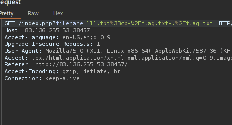
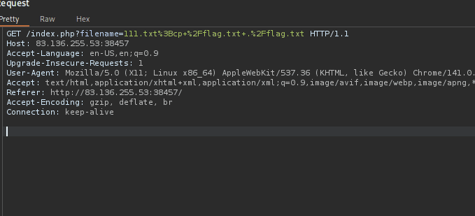
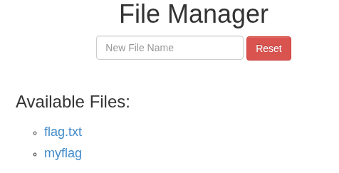

Hi recently i have been learning about **HTTP Verb Tampering (on HTB)** which is you changing the request method to another one and realized that… well take a look at the example below

Here i have a lab and the question is :

> To get the flag, try to bypass the command injection filter through HTTP Verb Tampering, while using the following filename: file; cp /flag.txt ./
> 

### In the first situation

When you are turning intercept on, and you want to change request method… you should not do like this  :

Why nothing appear ??? This is because the `POST` method has the different way to add the parameters when compared with `GET`, and moreover, it will not automatically add `content-type` so you have to do this manually.

Instead you can do like this : 

Boomm!! chall solved !

Flag: HTB{b3_v3rb_c0n51573n7}

😽  tks for reading this one. Hope it will be helpful to you !!!!! seee ya later