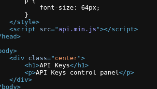
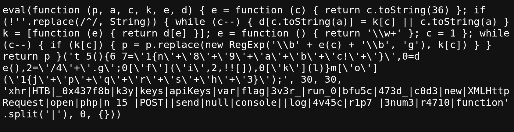

# JavaScript Deobfuscation

## Part 1 : Reading page source


First one, I open the view page source and take a look. Then, I easily see api.min.js in the bottom of the page

Which is the first flag of this skill assessment

flag :  `api.min.js` 



## Part 2 : Printing the flag

Next up is you click to the /api.min.js to see if It does any interesting functions ?

Here is the code: 



It kinda looks like it has been de-obfuscated by packing the code. Then i copy the whole code and go to [jsconsole](https://jsconsole.com/) to run the code 

Here is the part  2 flag :  `HTB{j4v45cr1p7_3num3r4710n_15_k3y}`

## Part 3 : Analyzing code

And the code is still de-obfuscated. The next step is i go [Unpack](https://matthewfl.com/unPacker.html)  and have the original code.

```jsx

function apiKeys()
	{
	var flag='HTB
		{
		n'+'3v3r_'+'run_0'+'bfu5c'+'473d_'+'c0d3!'+'
	}
	',xhr=new XMLHttpRequest(),_0x437f8b='/keys'+'.php';
	xhr['open']('POST',_0x437f8b,!![]),xhr['send'](null)
}
console['log']('HTB
	{
	j'+'4v45c'+'r1p7_'+'3num3'+'r4710'+'n_15_'+'k3y
}
');
```

The code now is much clearer and i split it into 2 parts 

```jsx
function apiKeys()
	{
	var flag='HTB
		{
		n'+'3v3r_'+'run_0'+'bfu5c'+'473d_'+'c0d3!'+'
	}
	',xhr=new XMLHttpRequest(),_0x437f8b='/keys'+'.php';
	xhr['open']('POST',_0x437f8b,!![]),xhr['send'](null)
}
```

```jsx
console['log']('HTB
	{
	j'+'4v45c'+'r1p7_'+'3num3'+'r4710'+'n_15_'+'k3y
}
');
```

Because the second part is part two’s flag so here I skip and analyze the first one.

Look at the code you have Part three’s flag. I copy and fix that a little bit, then run with jsconsole

```jsx
console.log('HTB{n'+'3v3r_'+'run_0'+'bfu5c'+'473d_'+'c0d3!'+'}')
```

Part 3 flag : `HTB{n3v3r_run_0bfu5c473d_c0d3!}`

## Part 4: Sending request

This time we see at the first part of the code is an api function so we will create a curl to interact with the endpoint `/keys.php`  

The code is show us it is `XMLhttpResquest`, `POST` request and endpoint is `/keys.php`

So here is our curl: (replace my IP: PORT with yours)

```markdown
curl http://94.237.56.25:48696/keys.php -X POST 
```

And it is return a hash string : `4150495f70336e5f37333537316e365f31355f66756e`

That is Part four’s flag

## Part 5: Decoding

Last part, the question is give us the information to get the flag by decode the string : `4150495f70336e5f37333537316e365f31355f66756e` and POST request it.

The string is hex encode so i decode it with `xxd`

```markdown
echo "4150495f70336e5f37333537316e365f31355f66756e" | xxd -p -r
--------------------------
API_p3n_73571n6_15_fun
--------------------------
```

Finally, we create a curl look like this : 

```markdown
curl http://94.237.56.25:48696/keys.php -d "key=API_p3n_73571n6_15_fun" -X POST 
```

Our final flag : `HTB{r34dy_70_h4ck_my_w4y_1n_2_HTB}`